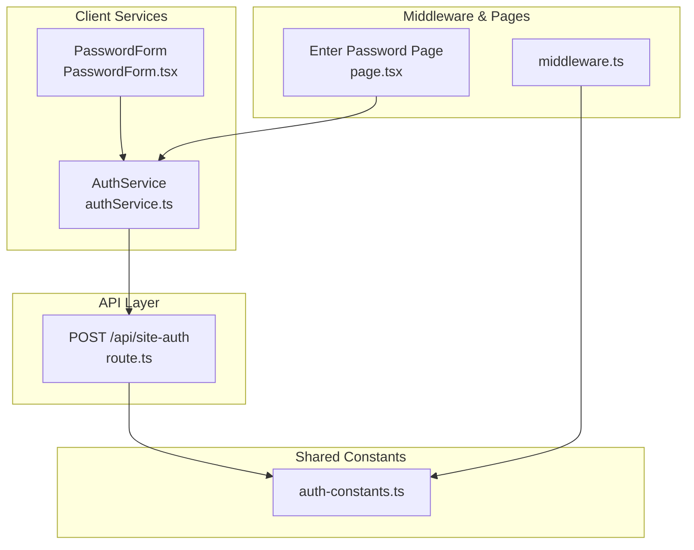
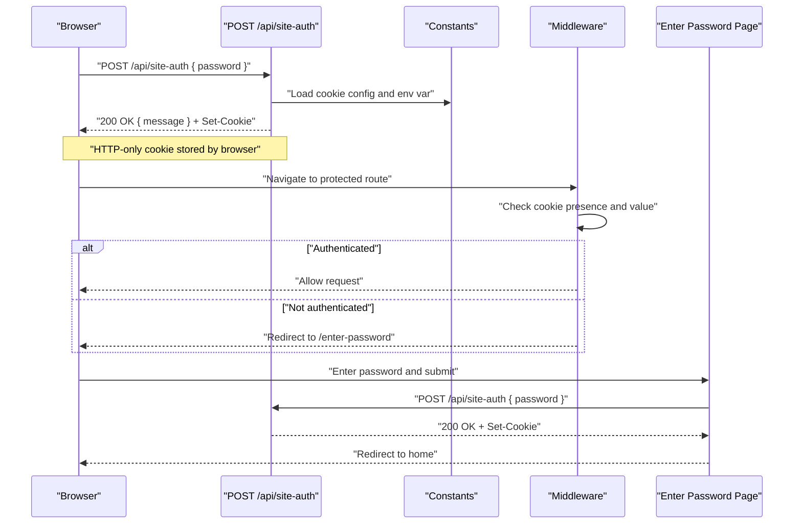
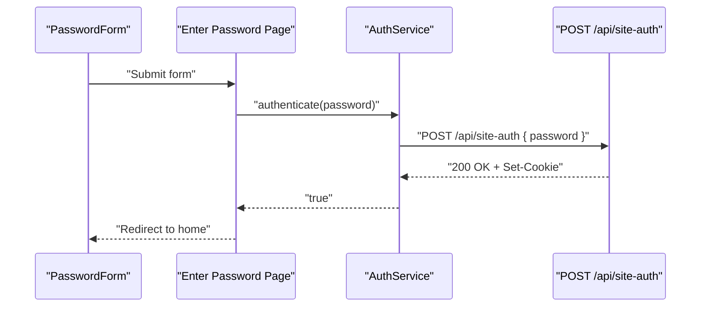
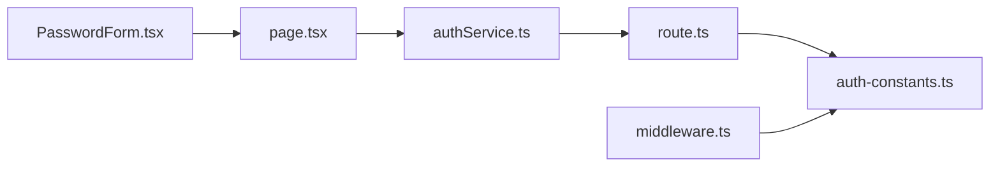

# API Endpoints

<cite>
**Referenced Files in This Document**
- [route.ts](file://src/app/api/site-auth/route.ts)
- [auth-constants.ts](file://src/lib/constants/auth-constants.ts)
- [authService.ts](file://src/lib/services/authService.ts)
- [middleware.ts](file://src/middleware.ts)
- [page.tsx](file://src/app/enter-password/page.tsx)
- [PasswordForm.tsx](file://src/components/auth/PasswordForm.tsx)
</cite>

## Table of Contents
1. [Introduction](#introduction)
2. [Project Structure](#project-structure)
3. [Core Components](#core-components)
4. [Architecture Overview](#architecture-overview)
5. [Detailed Component Analysis](#detailed-component-analysis)
6. [Dependency Analysis](#dependency-analysis)
7. [Performance Considerations](#performance-considerations)
8. [Troubleshooting Guide](#troubleshooting-guide)
9. [Conclusion](#conclusion)
10. [Appendices](#appendices)

## Introduction
This document provides API documentation for the application’s public API endpoint that manages site access via a shared secret password. It focuses on the POST method for the /api/site-auth endpoint, including request/response schemas, authentication mechanisms, error handling, and security considerations. It also outlines client-side integration patterns, rate limiting considerations, and migration guidance for adding additional endpoints.

## Project Structure
The authentication flow spans a small set of cohesive modules:
- API route handler for site authentication
- Shared constants for cookie configuration and public paths
- Client-side authentication service
- Middleware enforcing access control
- Frontend pages and forms for password entry

**Diagram sources**
- [route.ts](file://src/app/api/site-auth/route.ts#L1-L64)
- [auth-constants.ts](file://src/lib/constants/auth-constants.ts#L1-L11)
- [authService.ts](file://src/lib/services/authService.ts#L1-L47)
- [PasswordForm.tsx](file://src/components/auth/PasswordForm.tsx#L1-L48)
- [page.tsx](file://src/app/enter-password/page.tsx#L1-L75)
- [middleware.ts](file://src/middleware.ts#L1-L54)

**Section sources**
- [route.ts](file://src/app/api/site-auth/route.ts#L1-L64)
- [auth-constants.ts](file://src/lib/constants/auth-constants.ts#L1-L11)
- [authService.ts](file://src/lib/services/authService.ts#L1-L47)
- [middleware.ts](file://src/middleware.ts#L1-L54)
- [page.tsx](file://src/app/enter-password/page.tsx#L1-L75)
- [PasswordForm.tsx](file://src/components/auth/PasswordForm.tsx#L1-L48)

## Core Components
- API Route: Validates environment configuration, parses request body, checks password against process environment, and sets an HTTP-only cookie on success.
- Client Service: Encapsulates the client-side fetch call to the API and local state for authentication status.
- Middleware: Enforces site access by checking for a valid authentication cookie and redirecting unauthenticated users to the password entry page.
- Frontend Pages: Provide a form for entering the password and orchestrating authentication.

Key responsibilities:
- Request validation and error responses
- Secure cookie issuance
- Client-side state synchronization
- Global access control enforcement

**Section sources**
- [route.ts](file://src/app/api/site-auth/route.ts#L1-L64)
- [authService.ts](file://src/lib/services/authService.ts#L1-L47)
- [middleware.ts](file://src/middleware.ts#L1-L54)
- [page.tsx](file://src/app/enter-password/page.tsx#L1-L75)
- [PasswordForm.tsx](file://src/components/auth/PasswordForm.tsx#L1-L48)

## Architecture Overview
The authentication architecture follows a simple, stateless pattern:
- Client submits password to the API endpoint.
- API validates the password against a configured environment variable.
- On success, API responds with a success message and sets an HTTP-only cookie scoped to the site root.
- Middleware inspects incoming requests and enforces access control using the presence and value of the authentication cookie.

**Diagram sources**
- [route.ts](file://src/app/api/site-auth/route.ts#L1-L64)
- [auth-constants.ts](file://src/lib/constants/auth-constants.ts#L1-L11)
- [middleware.ts](file://src/middleware.ts#L1-L54)
- [page.tsx](file://src/app/enter-password/page.tsx#L1-L75)

## Detailed Component Analysis

### Endpoint Definition: POST /api/site-auth
- Method: POST
- Purpose: Authenticate with a shared secret password and receive an authentication cookie.
- Authentication: None required for this endpoint; it is intentionally public.
- Environment configuration: Requires SITE_PASSWORD to be set in the environment.

Request schema
- Content-Type: application/json
- Body:
  - password: string (required)

Response schema
- 200 OK on success:
  - message: string
- 400 Bad Request:
  - message: string (when password is missing)
- 401 Unauthorized:
  - message: string (when password is invalid)
- 500 Internal Server Error:
  - message: string (when SITE_PASSWORD is not configured)

Cookie behavior
- Name: site_access_token
- Value: authenticated
- Attributes:
  - httpOnly: true
  - secure: production-only
  - sameSite: lax
  - maxAge: 7 days
  - path: /
- Issued on successful authentication

Security considerations
- HTTP-only cookie prevents client-side script access.
- SameSite=lax mitigates CSRF risks for cross-site navigation.
- secure flag ensures transport-layer protection in production environments.
- The cookie value is a simple sentinel string; it does not carry sensitive claims.

Error handling
- Missing password yields 400.
- Incorrect password yields 401.
- Unconfigured SITE_PASSWORD yields 500.
- Unexpected exceptions yield 500.

Protocol-specific examples (frontend)
- Using fetch:
  - POST /api/site-auth with JSON body containing password
  - On success, rely on the Set-Cookie header to be handled by the browser
  - On failure, parse the JSON error message and surface to the user

Rate limiting considerations
- Current implementation does not include rate limiting.
- Recommended approaches:
  - Per-IP or per-session limits using a caching layer (e.g., Redis)
  - Captcha for repeated failures beyond thresholds
  - Throttling on the API route level

Common use cases
- First-time visitor enters password on the Enter Password page
- Returning visitor accesses protected routes after authentication cookie is present
- Re-authentication after cookie expiration

Client implementation guidelines
- Always send application/json with a password field
- Do not log or persist the raw password on the client
- Use HTTPS in production to protect cookie transmission
- Clear local storage flags on logout to prevent accidental reuse

Migration paths for additional endpoints
- Add new endpoints under src/app/api/<endpoint>/route.ts
- Apply the same validation and error response patterns
- For protected endpoints, add them to the middleware matcher and enforce cookie checks
- Centralize shared constants in auth-constants.ts for consistency

**Section sources**
- [route.ts](file://src/app/api/site-auth/route.ts#L1-L64)
- [auth-constants.ts](file://src/lib/constants/auth-constants.ts#L1-L11)
- [authService.ts](file://src/lib/services/authService.ts#L1-L47)
- [middleware.ts](file://src/middleware.ts#L1-L54)
- [page.tsx](file://src/app/enter-password/page.tsx#L1-L75)
- [PasswordForm.tsx](file://src/components/auth/PasswordForm.tsx#L1-L48)

### Client-Side Authentication Flow
The client-side flow integrates the API with the UI:
- The Enter Password page renders a form and captures user input.
- On submission, the client calls the API endpoint.
- On success, the client stores a local flag indicating authentication and navigates to the home page.
- Middleware enforces access control using the presence of the authentication cookie.

**Diagram sources**
- [PasswordForm.tsx](file://src/components/auth/PasswordForm.tsx#L1-L48)
- [page.tsx](file://src/app/enter-password/page.tsx#L1-L75)
- [authService.ts](file://src/lib/services/authService.ts#L1-L47)
- [route.ts](file://src/app/api/site-auth/route.ts#L1-L64)

**Section sources**
- [PasswordForm.tsx](file://src/components/auth/PasswordForm.tsx#L1-L48)
- [page.tsx](file://src/app/enter-password/page.tsx#L1-L75)
- [authService.ts](file://src/lib/services/authService.ts#L1-L47)

## Dependency Analysis
The authentication system exhibits low coupling and clear separation of concerns:
- route.ts depends on auth-constants.ts for cookie configuration and environment checks.
- middleware.ts depends on auth-constants.ts for cookie name/value and public paths.
- authService.ts depends on the API endpoint and local storage for client-side state.
- page.tsx and PasswordForm.tsx depend on authService.ts for user interaction.

**Diagram sources**
- [route.ts](file://src/app/api/site-auth/route.ts#L1-L64)
- [auth-constants.ts](file://src/lib/constants/auth-constants.ts#L1-L11)
- [middleware.ts](file://src/middleware.ts#L1-L54)
- [authService.ts](file://src/lib/services/authService.ts#L1-L47)
- [page.tsx](file://src/app/enter-password/page.tsx#L1-L75)
- [PasswordForm.tsx](file://src/components/auth/PasswordForm.tsx#L1-L48)

**Section sources**
- [route.ts](file://src/app/api/site-auth/route.ts#L1-L64)
- [auth-constants.ts](file://src/lib/constants/auth-constants.ts#L1-L11)
- [middleware.ts](file://src/middleware.ts#L1-L54)
- [authService.ts](file://src/lib/services/authService.ts#L1-L47)
- [page.tsx](file://src/app/enter-password/page.tsx#L1-L75)
- [PasswordForm.tsx](file://src/components/auth/PasswordForm.tsx#L1-L48)

## Performance Considerations
- Minimize payload size: The endpoint expects only a password field; keep payloads minimal.
- Avoid unnecessary redirects: Once authenticated, subsequent requests should not trigger redirects.
- Caching: Consider caching the authentication decision at the edge if using a CDN or proxy.
- Rate limiting: Implement throttling to reduce brute-force attempts without impacting legitimate users.

[No sources needed since this section provides general guidance]

## Troubleshooting Guide
Common issues and resolutions
- 400 Bad Request: Ensure the request body contains a password field.
- 401 Unauthorized: Verify the password matches the configured SITE_PASSWORD.
- 500 Internal Server Error: Confirm SITE_PASSWORD is set in the environment.
- Redirect loop to /enter-password: Check that the authentication cookie is being accepted by the browser and not blocked by security policies.

Client-side debugging tips
- Inspect browser cookies for site_access_token after successful authentication.
- Verify HTTPS in production to ensure secure cookies are accepted.
- Clear local storage flags on logout to reset state.

**Section sources**
- [route.ts](file://src/app/api/site-auth/route.ts#L1-L64)
- [authService.ts](file://src/lib/services/authService.ts#L1-L47)
- [middleware.ts](file://src/middleware.ts#L1-L54)

## Conclusion
The /api/site-auth endpoint provides a straightforward, secure mechanism for site access using a shared secret password and an HTTP-only cookie. The client and middleware integrate seamlessly to enforce access control. The design is simple, easy to extend, and suitable for small-scale deployments. As the application grows, consider adding rate limiting, stronger credentials, and centralized logging for auditability.

[No sources needed since this section summarizes without analyzing specific files]

## Appendices

### API Reference: POST /api/site-auth
- Method: POST
- Path: /api/site-auth
- Headers:
  - Content-Type: application/json
- Request body:
  - password: string (required)
- Responses:
  - 200 OK: message
  - 400 Bad Request: message
  - 401 Unauthorized: message
  - 500 Internal Server Error: message
- Cookies:
  - site_access_token=authenticated; HttpOnly; SameSite=Lax; Max-Age=604800; Path=/; Secure (production only)

**Section sources**
- [route.ts](file://src/app/api/site-auth/route.ts#L1-L64)
- [auth-constants.ts](file://src/lib/constants/auth-constants.ts#L1-L11)