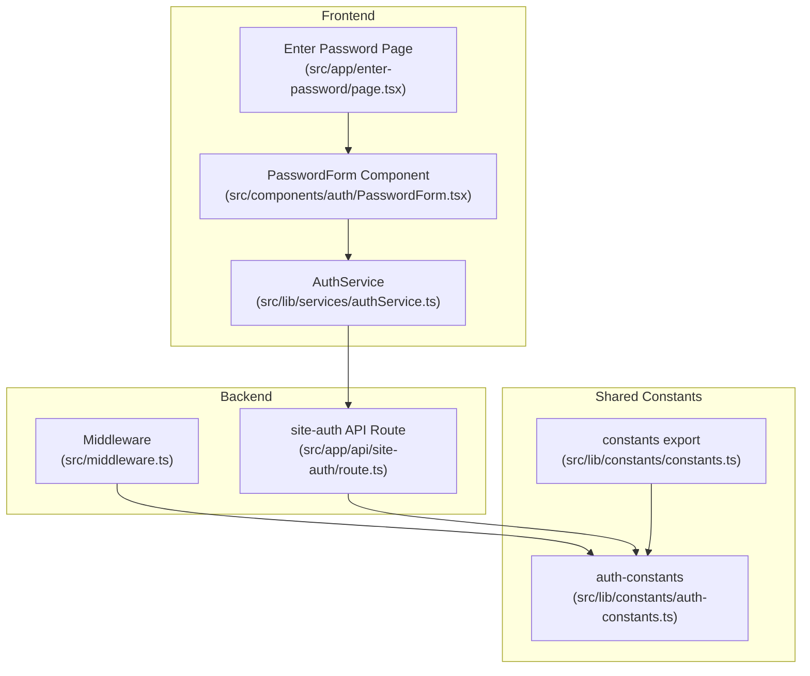
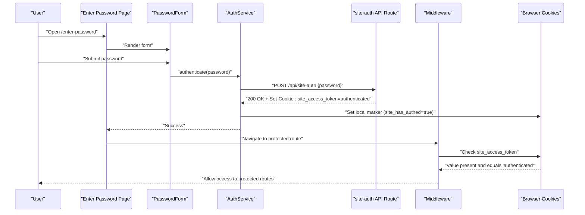
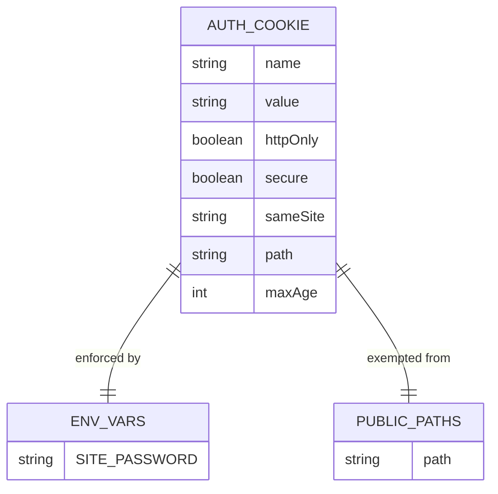
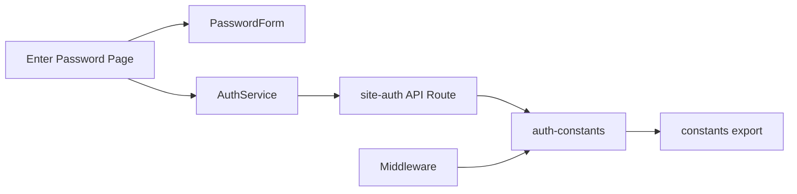

# Authentication System

<cite>
**Referenced Files in This Document**
- [src/app/enter-password/page.tsx](file://src/app/enter-password/page.tsx)
- [src/components/auth/PasswordForm.tsx](file://src/components/auth/PasswordForm.tsx)
- [src/lib/services/authService.ts](file://src/lib/services/authService.ts)
- [src/app/api/site-auth/route.ts](file://src/app/api/site-auth/route.ts)
- [src/middleware.ts](file://src/middleware.ts)
- [src/lib/constants/auth-constants.ts](file://src/lib/constants/auth-constants.ts)
- [src/lib/constants/constants.ts](file://src/lib/constants/constants.ts)
</cite>

## Table of Contents
1. [Introduction](#introduction)
2. [Project Structure](#project-structure)
3. [Core Components](#core-components)
4. [Architecture Overview](#architecture-overview)
5. [Detailed Component Analysis](#detailed-component-analysis)
6. [Dependency Analysis](#dependency-analysis)
7. [Performance Considerations](#performance-considerations)
8. [Troubleshooting Guide](#troubleshooting-guide)
9. [Conclusion](#conclusion)

## Introduction
This document explains the password-based authentication system for the application. It covers how users submit a password on the enter-password page, how the frontend service invokes the site-auth API endpoint, and how the middleware enforces access control using an authentication cookie. It also documents the domain model around authentication cookies and environment variables, configuration options such as the SITE_PASSWORD environment variable and cookie security settings, and practical examples from the codebase that show form submission, API request handling, and middleware verification. Finally, it addresses common authentication failures and their solutions.

## Project Structure
The authentication system spans three primary areas:
- Frontend pages and forms: the enter-password page and the reusable PasswordForm component
- Client-side service: the AuthService that performs the authentication request and local state
- Backend API: the site-auth route handler that validates the password and sets the authentication cookie
- Middleware: the Next.js middleware that enforces access control based on the presence and value of the authentication cookie

**Diagram sources**
- [src/app/enter-password/page.tsx](file://src/app/enter-password/page.tsx#L1-L75)
- [src/components/auth/PasswordForm.tsx](file://src/components/auth/PasswordForm.tsx#L1-L48)
- [src/lib/services/authService.ts](file://src/lib/services/authService.ts#L1-L47)
- [src/app/api/site-auth/route.ts](file://src/app/api/site-auth/route.ts#L1-L65)
- [src/middleware.ts](file://src/middleware.ts#L1-L54)
- [src/lib/constants/auth-constants.ts](file://src/lib/constants/auth-constants.ts#L1-L11)
- [src/lib/constants/constants.ts](file://src/lib/constants/constants.ts#L1-L2)

**Section sources**
- [src/app/enter-password/page.tsx](file://src/app/enter-password/page.tsx#L1-L75)
- [src/components/auth/PasswordForm.tsx](file://src/components/auth/PasswordForm.tsx#L1-L48)
- [src/lib/services/authService.ts](file://src/lib/services/authService.ts#L1-L47)
- [src/app/api/site-auth/route.ts](file://src/app/api/site-auth/route.ts#L1-L65)
- [src/middleware.ts](file://src/middleware.ts#L1-L54)
- [src/lib/constants/auth-constants.ts](file://src/lib/constants/auth-constants.ts#L1-L11)
- [src/lib/constants/constants.ts](file://src/lib/constants/constants.ts#L1-L2)

## Core Components
- Enter Password Page: Renders the authentication UI, manages form state, and triggers the AuthService to authenticate the user.
- PasswordForm: A reusable form component that captures the password and submits it.
- AuthService: A client-side service that posts the password to the site-auth API endpoint, handles errors, and records local authentication state.
- site-auth API Route: Validates the environment configuration, checks the incoming password, and on success sets an authentication cookie.
- Middleware: Enforces access control by checking for the authentication cookie and redirecting unauthenticated users to the enter-password page.
- Shared Constants: Defines cookie names, cookie value, cookie max age, public paths, and cookie security logic.

**Section sources**
- [src/app/enter-password/page.tsx](file://src/app/enter-password/page.tsx#L1-L75)
- [src/components/auth/PasswordForm.tsx](file://src/components/auth/PasswordForm.tsx#L1-L48)
- [src/lib/services/authService.ts](file://src/lib/services/authService.ts#L1-L47)
- [src/app/api/site-auth/route.ts](file://src/app/api/site-auth/route.ts#L1-L65)
- [src/middleware.ts](file://src/middleware.ts#L1-L54)
- [src/lib/constants/auth-constants.ts](file://src/lib/constants/auth-constants.ts#L1-L11)
- [src/lib/constants/constants.ts](file://src/lib/constants/constants.ts#L1-L2)

## Architecture Overview
The authentication flow is a client-server interaction mediated by a shared cookie. The frontend collects the password, sends it to the backend, and on success stores a local marker. The middleware enforces access by checking for the presence and value of the authentication cookie.

**Diagram sources**
- [src/app/enter-password/page.tsx](file://src/app/enter-password/page.tsx#L1-L75)
- [src/components/auth/PasswordForm.tsx](file://src/components/auth/PasswordForm.tsx#L1-L48)
- [src/lib/services/authService.ts](file://src/lib/services/authService.ts#L1-L47)
- [src/app/api/site-auth/route.ts](file://src/app/api/site-auth/route.ts#L1-L65)
- [src/middleware.ts](file://src/middleware.ts#L1-L54)

## Detailed Component Analysis

### Enter Password Page
- Purpose: Provides the user interface for entering the site password and handles form submission.
- Responsibilities:
  - Manage local state for password, loading, and error messages.
  - On submit, call AuthService.authenticate and handle success/failure.
  - Redirect to the home page on success and refresh to trigger middleware reevaluation.
- Example references:
  - Form rendering and event handling: [src/app/enter-password/page.tsx](file://src/app/enter-password/page.tsx#L1-L75)
  - PasswordForm props and submission callback: [src/components/auth/PasswordForm.tsx](file://src/components/auth/PasswordForm.tsx#L1-L48)

**Section sources**
- [src/app/enter-password/page.tsx](file://src/app/enter-password/page.tsx#L1-L75)
- [src/components/auth/PasswordForm.tsx](file://src/components/auth/PasswordForm.tsx#L1-L48)

### PasswordForm Component
- Purpose: Reusable form that captures the password and triggers submission.
- Responsibilities:
  - Render label, input field, and submit button.
  - Expose callbacks for password change, loading state, and submit handler.
- Example references:
  - Props contract and submit handler binding: [src/components/auth/PasswordForm.tsx](file://src/components/auth/PasswordForm.tsx#L1-L48)

**Section sources**
- [src/components/auth/PasswordForm.tsx](file://src/components/auth/PasswordForm.tsx#L1-L48)

### AuthService
- Purpose: Encapsulates client-side authentication logic.
- Responsibilities:
  - Send a POST request to /api/site-auth with the password.
  - On success, store a local marker indicating authentication.
  - On failure, propagate the error message.
  - Provide isAuthenticated and logout helpers.
- Example references:
  - Fetch to /api/site-auth and response handling: [src/lib/services/authService.ts](file://src/lib/services/authService.ts#L1-L47)
  - Local storage usage for authentication state: [src/lib/services/authService.ts](file://src/lib/services/authService.ts#L1-L47)

**Section sources**
- [src/lib/services/authService.ts](file://src/lib/services/authService.ts#L1-L47)

### site-auth API Route
- Purpose: Validates the incoming password against the configured SITE_PASSWORD and sets an authentication cookie on success.
- Responsibilities:
  - Validate environment configuration (SITE_PASSWORD).
  - Parse request body and validate presence of password.
  - Compare password with SITE_PASSWORD and respond accordingly.
  - On success, set a secure, HttpOnly cookie with a fixed value and max age.
- Example references:
  - Environment validation and response handling: [src/app/api/site-auth/route.ts](file://src/app/api/site-auth/route.ts#L1-L65)
  - Cookie configuration and attributes: [src/app/api/site-auth/route.ts](file://src/app/api/site-auth/route.ts#L1-L65)
  - Cookie constants: [src/lib/constants/auth-constants.ts](file://src/lib/constants/auth-constants.ts#L1-L11)

**Section sources**
- [src/app/api/site-auth/route.ts](file://src/app/api/site-auth/route.ts#L1-L65)
- [src/lib/constants/auth-constants.ts](file://src/lib/constants/auth-constants.ts#L1-L11)

### Middleware
- Purpose: Enforces access control for protected routes.
- Responsibilities:
  - Skip enforcement if SITE_PASSWORD is not configured.
  - Allow public paths and static assets.
  - Check for the authentication cookie and redirect to /enter-password if missing or invalid.
  - Allow access otherwise.
- Example references:
  - Middleware logic and redirect behavior: [src/middleware.ts](file://src/middleware.ts#L1-L54)
  - Public paths and cookie checks: [src/middleware.ts](file://src/middleware.ts#L1-L54)
  - Cookie constants: [src/lib/constants/auth-constants.ts](file://src/lib/constants/auth-constants.ts#L1-L11)

**Section sources**
- [src/middleware.ts](file://src/middleware.ts#L1-L54)
- [src/lib/constants/auth-constants.ts](file://src/lib/constants/auth-constants.ts#L1-L11)

### Domain Model: Authentication Cookies and Environment Variables
- Cookie model:
  - Name: site_access_token
  - Value: authenticated
  - Attributes: HttpOnly, SameSite=Lax, Path=/, Max-Age=7 days
  - Security: Secure flag is enabled in production environments
- Environment variables:
  - SITE_PASSWORD: Required for authentication to function; if unset, middleware bypasses enforcement and API returns a server misconfiguration error.
- Public paths:
  - /enter-password and /api/site-auth are exempt from middleware enforcement.

**Diagram sources**
- [src/lib/constants/auth-constants.ts](file://src/lib/constants/auth-constants.ts#L1-L11)
- [src/app/api/site-auth/route.ts](file://src/app/api/site-auth/route.ts#L1-L65)
- [src/middleware.ts](file://src/middleware.ts#L1-L54)

**Section sources**
- [src/lib/constants/auth-constants.ts](file://src/lib/constants/auth-constants.ts#L1-L11)
- [src/app/api/site-auth/route.ts](file://src/app/api/site-auth/route.ts#L1-L65)
- [src/middleware.ts](file://src/middleware.ts#L1-L54)

## Dependency Analysis
The authentication system exhibits clear separation of concerns:
- The Enter Password Page depends on PasswordForm and AuthService.
- AuthService depends on the site-auth API endpoint.
- The site-auth API endpoint depends on shared constants for cookie configuration and environment variables.
- Middleware depends on shared constants for cookie names, cookie values, and public paths.

**Diagram sources**
- [src/app/enter-password/page.tsx](file://src/app/enter-password/page.tsx#L1-L75)
- [src/components/auth/PasswordForm.tsx](file://src/components/auth/PasswordForm.tsx#L1-L48)
- [src/lib/services/authService.ts](file://src/lib/services/authService.ts#L1-L47)
- [src/app/api/site-auth/route.ts](file://src/app/api/site-auth/route.ts#L1-L65)
- [src/middleware.ts](file://src/middleware.ts#L1-L54)
- [src/lib/constants/auth-constants.ts](file://src/lib/constants/auth-constants.ts#L1-L11)
- [src/lib/constants/constants.ts](file://src/lib/constants/constants.ts#L1-L2)

**Section sources**
- [src/app/enter-password/page.tsx](file://src/app/enter-password/page.tsx#L1-L75)
- [src/components/auth/PasswordForm.tsx](file://src/components/auth/PasswordForm.tsx#L1-L48)
- [src/lib/services/authService.ts](file://src/lib/services/authService.ts#L1-L47)
- [src/app/api/site-auth/route.ts](file://src/app/api/site-auth/route.ts#L1-L65)
- [src/middleware.ts](file://src/middleware.ts#L1-L54)
- [src/lib/constants/auth-constants.ts](file://src/lib/constants/auth-constants.ts#L1-L11)
- [src/lib/constants/constants.ts](file://src/lib/constants/constants.ts#L1-L2)

## Performance Considerations
- Network requests: The authentication flow involves a single round trip to /api/site-auth. Keep the payload minimal (only the password) to reduce latency.
- Middleware evaluation: The middleware runs on every request to protected routes; keep the cookie check lightweight and avoid heavy computations.
- Cookie size: The cookie value is small, minimizing overhead.
- Local storage: The client-side marker is a simple string; negligible performance impact.
- Environment checks: The middleware and API both check for SITE_PASSWORD; ensure this environment variable is cached appropriately by the runtime.

[No sources needed since this section provides general guidance]

## Troubleshooting Guide
Common issues and resolutions:
- Authentication fails with a server misconfiguration error:
  - Cause: SITE_PASSWORD environment variable is not set.
  - Resolution: Configure SITE_PASSWORD in your environment. The API route returns a 500 error when missing.
  - References: [src/app/api/site-auth/route.ts](file://src/app/api/site-auth/route.ts#L1-L65)
- Invalid password response:
  - Cause: Submitted password does not match SITE_PASSWORD.
  - Resolution: Verify the password matches the configured value. The API route returns a 401 error for invalid passwords.
  - References: [src/app/api/site-auth/route.ts](file://src/app/api/site-auth/route.ts#L1-L65)
- Missing password in request:
  - Cause: Request body lacks the password field.
  - Resolution: Ensure the form submits a JSON payload containing the password. The API route returns a 400 error when missing.
  - References: [src/app/api/site-auth/route.ts](file://src/app/api/site-auth/route.ts#L1-L65)
- Redirect loop to /enter-password:
  - Cause: Authentication cookie is absent or has an incorrect value.
  - Resolution: Complete the authentication flow to set the cookie. Confirm the cookie name and value align with the constants. The middleware redirects unauthenticated users to /enter-password.
  - References: [src/middleware.ts](file://src/middleware.ts#L1-L54), [src/lib/constants/auth-constants.ts](file://src/lib/constants/auth-constants.ts#L1-L11)
- Cookie not set or not recognized:
  - Cause: Cookie attributes mismatch (HttpOnly, SameSite, Secure) or path differences.
  - Resolution: Ensure the cookie is set with HttpOnly, SameSite=Lax, and Secure in production. The API route sets these attributes; verify the browser accepts the cookie.
  - References: [src/app/api/site-auth/route.ts](file://src/app/api/site-auth/route.ts#L1-L65), [src/lib/constants/auth-constants.ts](file://src/lib/constants/auth-constants.ts#L1-L11)
- Client-side authentication state not cleared:
  - Cause: Local marker remains after logout.
  - Resolution: Call the logout helper to remove the local marker. The AuthService provides a logout method.
  - References: [src/lib/services/authService.ts](file://src/lib/services/authService.ts#L1-L47)

**Section sources**
- [src/app/api/site-auth/route.ts](file://src/app/api/site-auth/route.ts#L1-L65)
- [src/middleware.ts](file://src/middleware.ts#L1-L54)
- [src/lib/constants/auth-constants.ts](file://src/lib/constants/auth-constants.ts#L1-L11)
- [src/lib/services/authService.ts](file://src/lib/services/authService.ts#L1-L47)

## Conclusion
The authentication system uses a simple yet effective password-based mechanism. The enter-password page and PasswordForm collect the password, AuthService invokes the site-auth API endpoint, and the API sets a secure, HttpOnly authentication cookie. The middleware enforces access control by checking the cookie’s presence and value. Configuration relies on SITE_PASSWORD and cookie security settings controlled by NODE_ENV. By following the troubleshooting steps and best practices outlined above, you can reliably deploy and operate this authentication system.