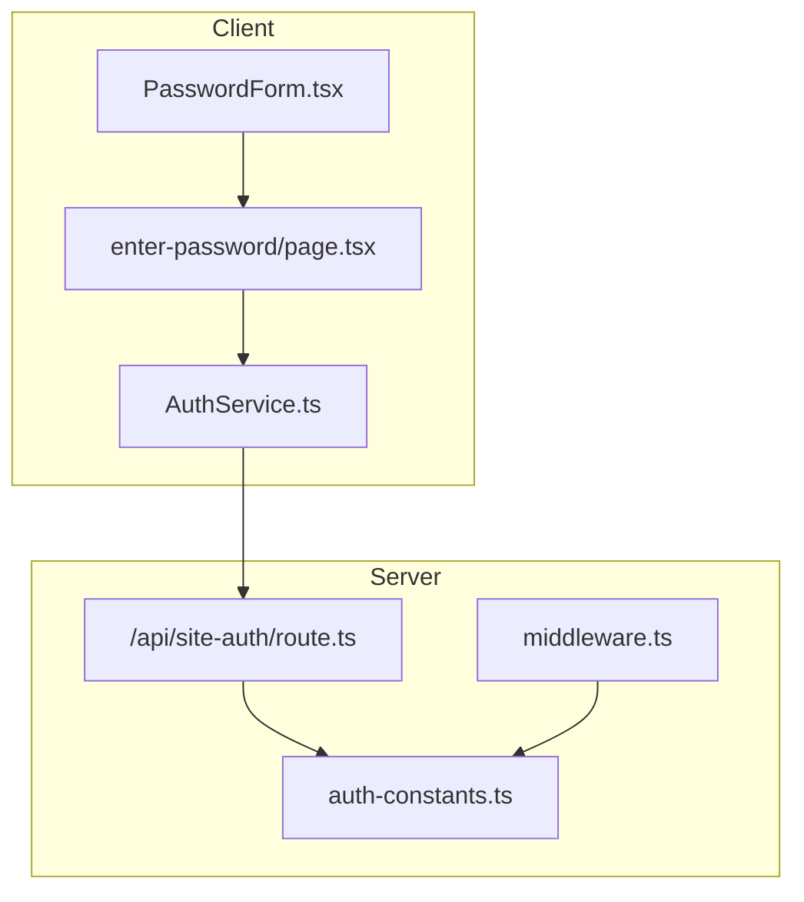
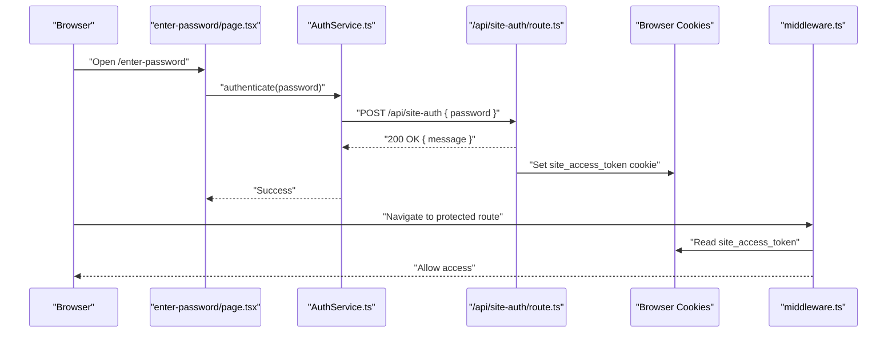
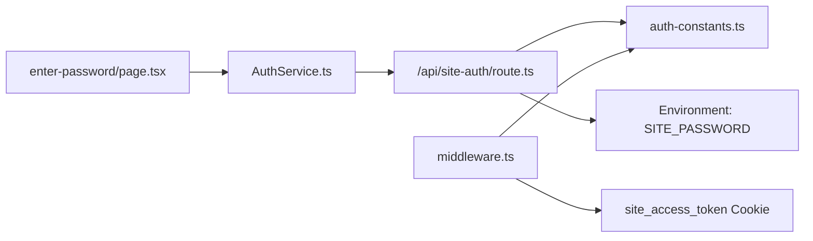

# API Endpoints

<cite>
**Referenced Files in This Document**
- [route.ts](file://src/app/api/site-auth/route.ts)
- [auth-constants.ts](file://src/lib/constants/auth-constants.ts)
- [constants.ts](file://src/lib/constants/constants.ts)
- [middleware.ts](file://src/middleware.ts)
- [authService.ts](file://src/lib/services/authService.ts)
- [page.tsx](file://src/app/enter-password/page.tsx)
- [PasswordForm.tsx](file://src/components/auth/PasswordForm.tsx)
</cite>

## Table of Contents
1. [Introduction](#introduction)
2. [Project Structure](#project-structure)
3. [Core Components](#core-components)
4. [Architecture Overview](#architecture-overview)
5. [Detailed Component Analysis](#detailed-component-analysis)
6. [Dependency Analysis](#dependency-analysis)
7. [Performance Considerations](#performance-considerations)
8. [Troubleshooting Guide](#troubleshooting-guide)
9. [Conclusion](#conclusion)

## Introduction
This document provides API documentation for the /api/site-auth endpoint in the credit-card-tracker application. It describes the endpoint’s behavior, request/response formats, error handling, and cookie security settings. It also explains how this endpoint integrates into the overall authentication flow, including client-side handling and middleware enforcement.

## Project Structure
The authentication flow spans several parts of the application:
- API route: Implements the POST /api/site-auth endpoint.
- Constants: Defines cookie names, values, max age, and security helpers.
- Middleware: Enforces authentication for protected routes.
- Client services: Provides a client-side AuthService to call the endpoint and manage local state.
- Password entry page: Renders a form and triggers authentication.

**Diagram sources**
- [route.ts](file://src/app/api/site-auth/route.ts#L1-L65)
- [auth-constants.ts](file://src/lib/constants/auth-constants.ts#L1-L11)
- [middleware.ts](file://src/middleware.ts#L1-L54)
- [authService.ts](file://src/lib/services/authService.ts#L1-L47)
- [page.tsx](file://src/app/enter-password/page.tsx#L1-L75)
- [PasswordForm.tsx](file://src/components/auth/PasswordForm.tsx#L1-L48)

**Section sources**
- [route.ts](file://src/app/api/site-auth/route.ts#L1-L65)
- [auth-constants.ts](file://src/lib/constants/auth-constants.ts#L1-L11)
- [middleware.ts](file://src/middleware.ts#L1-L54)
- [authService.ts](file://src/lib/services/authService.ts#L1-L47)
- [page.tsx](file://src/app/enter-password/page.tsx#L1-L75)
- [PasswordForm.tsx](file://src/components/auth/PasswordForm.tsx#L1-L48)

## Core Components
- Endpoint: POST /api/site-auth
  - Validates environment configuration and request payload.
  - Compares submitted password against the configured site password.
  - On success, returns a success message and sets a secure, httpOnly cookie named site_access_token with a 7-day expiration.
  - On failure, returns appropriate HTTP status codes with error messages.
- Cookie configuration:
  - Name: site_access_token
  - Value: authenticated
  - Max-Age: 604800 seconds (7 days)
  - Flags: httpOnly, secure (production), sameSite: lax, path: /
- Middleware enforcement:
  - Protects non-public paths by checking for the presence and value of the authentication cookie.
  - Public paths include /enter-password and /api/site-auth.
- Client-side service:
  - Calls the endpoint with a JSON body containing a password field.
  - Stores a local flag indicating successful authentication.
  - Exposes methods to check authentication state and log out.

**Section sources**
- [route.ts](file://src/app/api/site-auth/route.ts#L1-L65)
- [auth-constants.ts](file://src/lib/constants/auth-constants.ts#L1-L11)
- [middleware.ts](file://src/middleware.ts#L1-L54)
- [authService.ts](file://src/lib/services/authService.ts#L1-L47)

## Architecture Overview
The authentication flow consists of:
- Client submits a password via the password entry page.
- Client service sends a POST request to /api/site-auth with a JSON body containing the password.
- Server validates the environment configuration and compares the password.
- On success, server responds with a 200 OK and sets a secure, httpOnly cookie.
- Middleware checks for the cookie on subsequent requests and redirects unauthenticated users to the password entry page.

**Diagram sources**
- [page.tsx](file://src/app/enter-password/page.tsx#L1-L75)
- [authService.ts](file://src/lib/services/authService.ts#L1-L47)
- [route.ts](file://src/app/api/site-auth/route.ts#L1-L65)
- [middleware.ts](file://src/middleware.ts#L1-L54)

## Detailed Component Analysis

### Endpoint: POST /api/site-auth
- Purpose: Authenticate access to the application using a shared secret password.
- Request
  - Method: POST
  - Headers: Content-Type: application/json
  - Body: JSON object with a required password field
- Responses
  - 200 OK: { message: "Authentication successful" }
  - 400 Bad Request: { message: "Password is required" }
  - 401 Unauthorized: { message: "Invalid password" }
  - 500 Internal Server Error: { message: "Server misconfiguration: Site password not configured" } or generic internal error
- Cookie behavior
  - On success, sets a cookie with:
    - Name: site_access_token
    - Value: authenticated
    - Max-Age: 604800 seconds (7 days)
    - Flags: httpOnly, secure (production), sameSite: lax, path: /
- Environment configuration
  - Requires SITE_PASSWORD to be set in the environment.
  - If not set, returns 500 with a descriptive message.

Example request
- POST /api/site-auth
- Headers: Content-Type: application/json
- Body: { "password": "<your-site-password>" }

Example successful response
- Status: 200
- Body: { "message": "Authentication successful" }
- Cookie: site_access_token=authenticated; Max-Age=604800; HttpOnly; Secure; SameSite=Lax; Path=/

Example error responses
- Missing password:
  - Status: 400
  - Body: { "message": "Password is required" }
- Invalid password:
  - Status: 401
  - Body: { "message": "Invalid password" }
- Misconfiguration:
  - Status: 500
  - Body: { "message": "Server misconfiguration: Site password not configured" }

Security notes
- The cookie is httpOnly to mitigate XSS risks.
- The cookie is secure in production environments.
- The cookie uses SameSite=lax to balance CSRF protection and usability.

**Section sources**
- [route.ts](file://src/app/api/site-auth/route.ts#L1-L65)
- [auth-constants.ts](file://src/lib/constants/auth-constants.ts#L1-L11)
- [constants.ts](file://src/lib/constants/constants.ts#L1-L2)

### Client-Side Authentication Service
- Purpose: Encapsulate client-side authentication logic.
- Behavior
  - Sends a POST request to /api/site-auth with the provided password.
  - On success, stores a local flag indicating authentication.
  - On failure, throws an error with the message from the server.
  - Provides methods to check authentication state and log out.

Usage guidance
- Call authenticate(password) from the password entry page.
- On success, redirect to the home page and refresh to trigger middleware reevaluation.
- On failure, display the error message to the user.

**Section sources**
- [authService.ts](file://src/lib/services/authService.ts#L1-L47)
- [page.tsx](file://src/app/enter-password/page.tsx#L1-L75)
- [PasswordForm.tsx](file://src/components/auth/PasswordForm.tsx#L1-L48)

### Middleware Enforcement
- Purpose: Protect non-public routes by requiring a valid authentication cookie.
- Behavior
  - Skips enforcement if SITE_PASSWORD is not configured.
  - Allows public paths (/enter-password, /api/site-auth) and static assets.
  - Checks for the presence and value of site_access_token.
  - Redirects unauthenticated users to /enter-password.

**Section sources**
- [middleware.ts](file://src/middleware.ts#L1-L54)
- [auth-constants.ts](file://src/lib/constants/auth-constants.ts#L1-L11)

## Dependency Analysis
The authentication flow depends on the following relationships:
- The API route reads environment configuration and writes cookies.
- The client service calls the API route and manages local state.
- The middleware enforces access control based on the presence of the authentication cookie.
- Constants define cookie names, values, max age, and security flags.

**Diagram sources**
- [route.ts](file://src/app/api/site-auth/route.ts#L1-L65)
- [auth-constants.ts](file://src/lib/constants/auth-constants.ts#L1-L11)
- [authService.ts](file://src/lib/services/authService.ts#L1-L47)
- [page.tsx](file://src/app/enter-password/page.tsx#L1-L75)
- [middleware.ts](file://src/middleware.ts#L1-L54)

**Section sources**
- [route.ts](file://src/app/api/site-auth/route.ts#L1-L65)
- [auth-constants.ts](file://src/lib/constants/auth-constants.ts#L1-L11)
- [authService.ts](file://src/lib/services/authService.ts#L1-L47)
- [page.tsx](file://src/app/enter-password/page.tsx#L1-L75)
- [middleware.ts](file://src/middleware.ts#L1-L54)

## Performance Considerations
- The endpoint performs a simple string comparison against the configured password and sets a lightweight cookie. There are no heavy computations involved.
- Client-side storage uses a simple local flag, minimizing overhead.
- Middleware checks rely on cookie presence and value, which are efficient operations.

## Troubleshooting Guide
Common issues and resolutions
- 400 Bad Request: Ensure the request body contains a password field.
- 401 Unauthorized: Verify the password matches the configured SITE_PASSWORD.
- 500 Internal Server Error:
  - Confirm SITE_PASSWORD is set in the environment.
  - Check server logs for detailed error messages.
- Cookie not set or not recognized:
  - Ensure the request is made to the correct origin.
  - Confirm the cookie is being sent with subsequent requests.
  - In development, the cookie may not be secure; in production, it should be secure.

Client-side handling
- On success, the client stores a local flag and navigates to the home page.
- On failure, the client displays the error message returned by the server.

**Section sources**
- [route.ts](file://src/app/api/site-auth/route.ts#L1-L65)
- [authService.ts](file://src/lib/services/authService.ts#L1-L47)
- [page.tsx](file://src/app/enter-password/page.tsx#L1-L75)

## Conclusion
The /api/site-auth endpoint provides a simple, secure mechanism to authenticate access to the application. It validates the environment configuration, enforces password correctness, and sets a secure, httpOnly cookie with a 7-day expiration. The client service and middleware integrate seamlessly to enforce access control across the application. Clients should send a POST request with a JSON body containing a password field, handle error responses appropriately, and rely on the cookie to maintain authenticated state.