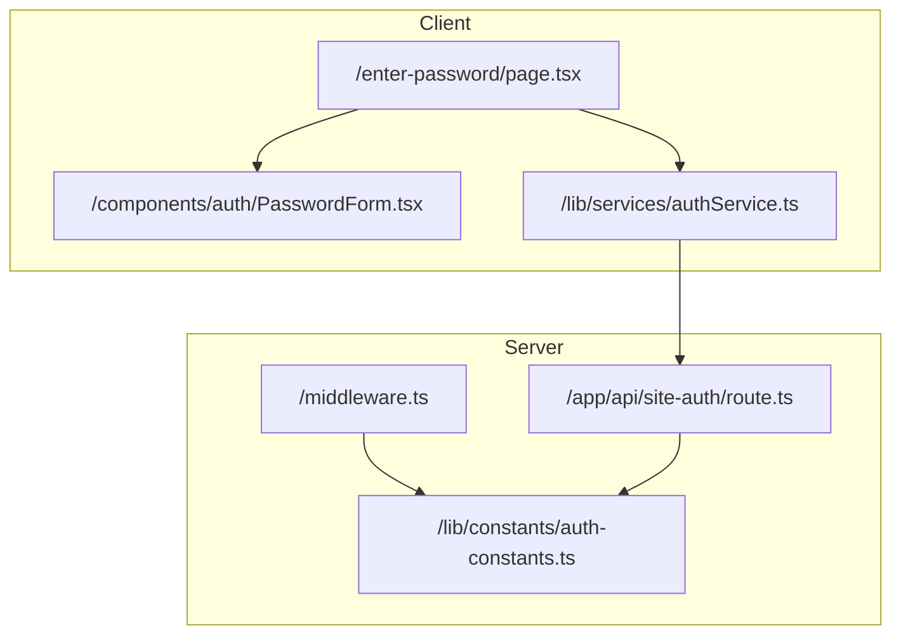
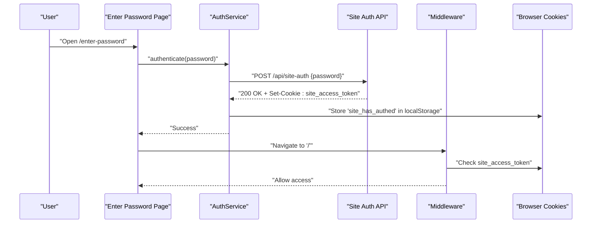
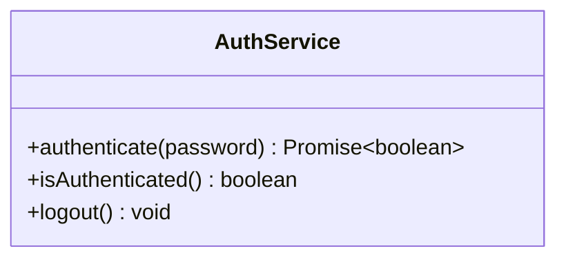
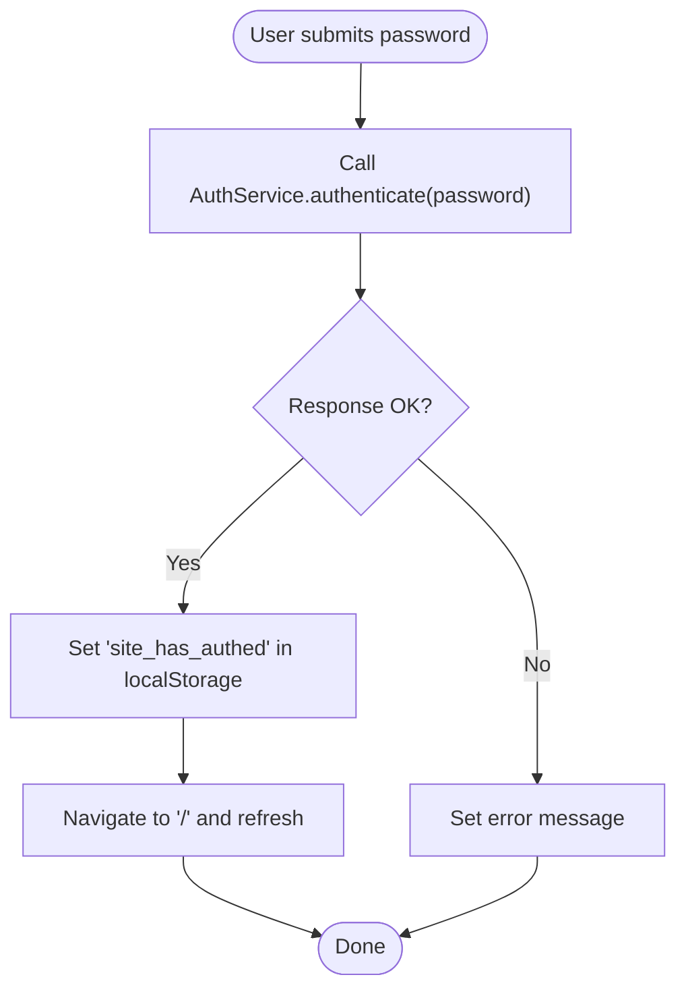
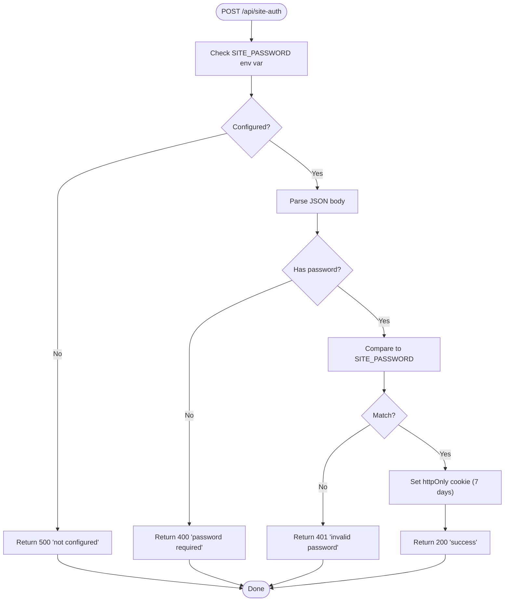
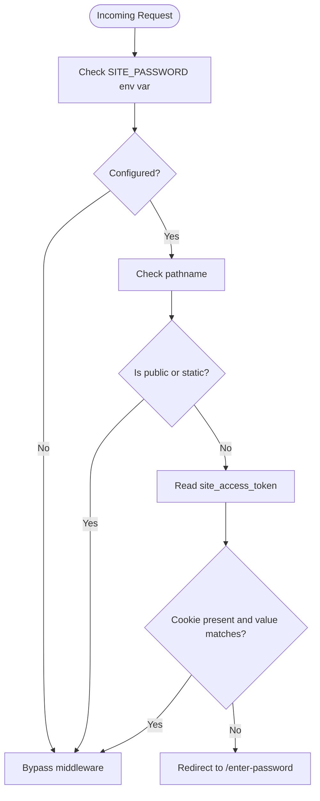
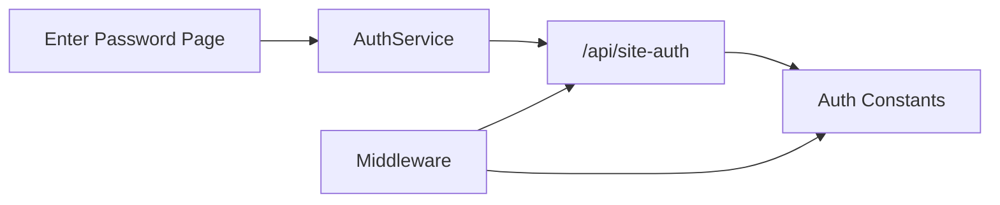

# Authentication Flow

<cite>
**Referenced Files in This Document**
- [src/lib/services/authService.ts](file://src/lib/services/authService.ts)
- [src/app/enter-password/page.tsx](file://src/app/enter-password/page.tsx)
- [src/components/auth/PasswordForm.tsx](file://src/components/auth/PasswordForm.tsx)
- [src/app/api/site-auth/route.ts](file://src/app/api/site-auth/route.ts)
- [src/middleware.ts](file://src/middleware.ts)
- [src/lib/constants/auth-constants.ts](file://src/lib/constants/auth-constants.ts)
- [src/lib/constants/constants.ts](file://src/lib/constants/constants.ts)
</cite>

## Table of Contents
1. [Introduction](#introduction)
2. [Project Structure](#project-structure)
3. [Core Components](#core-components)
4. [Architecture Overview](#architecture-overview)
5. [Detailed Component Analysis](#detailed-component-analysis)
6. [Dependency Analysis](#dependency-analysis)
7. [Performance Considerations](#performance-considerations)
8. [Troubleshooting Guide](#troubleshooting-guide)
9. [Security Considerations](#security-considerations)
10. [Conclusion](#conclusion)

## Introduction
This document explains the authentication flow for the credit-card-tracker application. It covers the end-to-end sequence from entering a password on the /enter-password page, to the client-side authentication service posting to the /api/site-auth endpoint, to server-side validation against the SITE_PASSWORD environment variable, and to setting an httpOnly authentication cookie. It also details middleware enforcement, the role of PUBLIC_PATHS, cookie expiration, client-side localStorage synchronization for UI state, error handling, and security considerations.

## Project Structure
The authentication system spans client-side UI and logic, a serverless API route, and Next.js middleware. Constants for cookie names, values, and public paths are centralized for reuse.

**Diagram sources**
- [src/app/enter-password/page.tsx](file://src/app/enter-password/page.tsx#L1-L75)
- [src/components/auth/PasswordForm.tsx](file://src/components/auth/PasswordForm.tsx#L1-L48)
- [src/lib/services/authService.ts](file://src/lib/services/authService.ts#L1-L47)
- [src/app/api/site-auth/route.ts](file://src/app/api/site-auth/route.ts#L1-L65)
- [src/middleware.ts](file://src/middleware.ts#L1-L54)
- [src/lib/constants/auth-constants.ts](file://src/lib/constants/auth-constants.ts#L1-L11)

**Section sources**
- [src/app/enter-password/page.tsx](file://src/app/enter-password/page.tsx#L1-L75)
- [src/lib/services/authService.ts](file://src/lib/services/authService.ts#L1-L47)
- [src/app/api/site-auth/route.ts](file://src/app/api/site-auth/route.ts#L1-L65)
- [src/middleware.ts](file://src/middleware.ts#L1-L54)
- [src/lib/constants/auth-constants.ts](file://src/lib/constants/auth-constants.ts#L1-L11)

## Core Components
- Client-side authentication service: Handles form submission, posts to the API, manages local UI state, and stores a flag in localStorage upon success.
- Enter-password page: Renders the password form, captures user input, triggers authentication, and displays errors.
- Password form component: Provides the input field and submit button UI.
- API route: Validates the incoming password against the SITE_PASSWORD environment variable and sets an httpOnly authentication cookie on success.
- Middleware: Enforces authentication for protected routes, allows public paths and static assets, and redirects unauthenticated users to the password entry page.
- Constants: Centralizes cookie names/values, public paths, and cookie security policy.

**Section sources**
- [src/lib/services/authService.ts](file://src/lib/services/authService.ts#L1-L47)
- [src/app/enter-password/page.tsx](file://src/app/enter-password/page.tsx#L1-L75)
- [src/components/auth/PasswordForm.tsx](file://src/components/auth/PasswordForm.tsx#L1-L48)
- [src/app/api/site-auth/route.ts](file://src/app/api/site-auth/route.ts#L1-L65)
- [src/middleware.ts](file://src/middleware.ts#L1-L54)
- [src/lib/constants/auth-constants.ts](file://src/lib/constants/auth-constants.ts#L1-L11)

## Architecture Overview
The authentication flow is a client-server interaction mediated by Next.js middleware. The client submits credentials to the server, which validates them and returns a cookie. Subsequent requests are intercepted by middleware to enforce access control.

**Diagram sources**
- [src/app/enter-password/page.tsx](file://src/app/enter-password/page.tsx#L1-L75)
- [src/lib/services/authService.ts](file://src/lib/services/authService.ts#L1-L47)
- [src/app/api/site-auth/route.ts](file://src/app/api/site-auth/route.ts#L1-L65)
- [src/middleware.ts](file://src/middleware.ts#L1-L54)

## Detailed Component Analysis

### Client-Side Authentication Service
- Purpose: Encapsulates the client-side authentication logic, including posting to the API, handling responses, and updating local UI state.
- Key behaviors:
  - Posts the password to /api/site-auth.
  - Throws on non-OK responses with a message extracted from the server.
  - On success, stores a flag in localStorage to reflect UI state.
  - Provides helpers to check and clear authentication state in localStorage.

**Diagram sources**
- [src/lib/services/authService.ts](file://src/lib/services/authService.ts#L1-L47)

**Section sources**
- [src/lib/services/authService.ts](file://src/lib/services/authService.ts#L1-L47)

### Enter-Password Page
- Purpose: Presents the password entry UI, captures input, triggers authentication, and displays errors.
- Key behaviors:
  - Manages local state for password, loading, and error messages.
  - Calls AuthService.authenticate on form submit.
  - On success, navigates to the home page and refreshes to trigger middleware reevaluation.

**Diagram sources**
- [src/app/enter-password/page.tsx](file://src/app/enter-password/page.tsx#L1-L75)
- [src/lib/services/authService.ts](file://src/lib/services/authService.ts#L1-L47)

**Section sources**
- [src/app/enter-password/page.tsx](file://src/app/enter-password/page.tsx#L1-L75)

### Password Form Component
- Purpose: Provides the input field and submit button for password entry.
- Key behaviors:
  - Controlled input binding to parent state.
  - Disabled during loading.
  - Auto-focus for usability.

**Section sources**
- [src/components/auth/PasswordForm.tsx](file://src/components/auth/PasswordForm.tsx#L1-L48)

### API Route: /api/site-auth
- Purpose: Validates the submitted password against the SITE_PASSWORD environment variable and sets an httpOnly authentication cookie on success.
- Key behaviors:
  - Requires SITE_PASSWORD to be configured; otherwise returns a 500 error.
  - Rejects empty passwords with a 400 error.
  - Compares submitted password to SITE_PASSWORD; rejects with 401 if mismatch.
  - On success, returns 200 and sets a cookie with:
    - Name and value from constants.
    - Max age of 7 days.
    - httpOnly: true.
    - secure: production-dependent.
    - sameSite: lax.
    - path: "/".
  - Catches unexpected errors and returns 500.

**Diagram sources**
- [src/app/api/site-auth/route.ts](file://src/app/api/site-auth/route.ts#L1-L65)
- [src/lib/constants/auth-constants.ts](file://src/lib/constants/auth-constants.ts#L1-L11)

**Section sources**
- [src/app/api/site-auth/route.ts](file://src/app/api/site-auth/route.ts#L1-L65)
- [src/lib/constants/auth-constants.ts](file://src/lib/constants/auth-constants.ts#L1-L11)

### Middleware: Authentication Enforcement
- Purpose: Enforce authentication for protected pages and allow public paths and static assets.
- Key behaviors:
  - Skips enforcement if SITE_PASSWORD is not configured.
  - Allows PUBLIC_PATHS and static assets.
  - Checks for a valid authentication cookie with the expected name/value.
  - Redirects to /enter-password if missing or invalid.

**Diagram sources**
- [src/middleware.ts](file://src/middleware.ts#L1-L54)
- [src/lib/constants/auth-constants.ts](file://src/lib/constants/auth-constants.ts#L1-L11)

**Section sources**
- [src/middleware.ts](file://src/middleware.ts#L1-L54)
- [src/lib/constants/auth-constants.ts](file://src/lib/constants/auth-constants.ts#L1-L11)

### Constants: Cookie Names, Values, Paths, and Security
- Cookie name and value: Used by both the API route and middleware to set and validate authentication state.
- Public paths: Defines exceptions to middleware enforcement.
- Cookie security: Determines whether the cookie is marked secure based on NODE_ENV.

**Section sources**
- [src/lib/constants/auth-constants.ts](file://src/lib/constants/auth-constants.ts#L1-L11)
- [src/lib/constants/constants.ts](file://src/lib/constants/constants.ts#L1-L2)

## Dependency Analysis
- Client depends on:
  - AuthService for authentication logic.
  - PasswordForm for UI rendering.
- AuthService depends on:
  - Fetch to call /api/site-auth.
  - localStorage for UI state synchronization.
- API route depends on:
  - Environment variable SITE_PASSWORD for validation.
  - Constants for cookie configuration and security.
- Middleware depends on:
  - Constants for cookie name/value and public paths.
  - Environment variable SITE_PASSWORD to decide whether to enforce.

**Diagram sources**
- [src/app/enter-password/page.tsx](file://src/app/enter-password/page.tsx#L1-L75)
- [src/lib/services/authService.ts](file://src/lib/services/authService.ts#L1-L47)
- [src/app/api/site-auth/route.ts](file://src/app/api/site-auth/route.ts#L1-L65)
- [src/middleware.ts](file://src/middleware.ts#L1-L54)
- [src/lib/constants/auth-constants.ts](file://src/lib/constants/auth-constants.ts#L1-L11)

**Section sources**
- [src/lib/services/authService.ts](file://src/lib/services/authService.ts#L1-L47)
- [src/app/api/site-auth/route.ts](file://src/app/api/site-auth/route.ts#L1-L65)
- [src/middleware.ts](file://src/middleware.ts#L1-L54)
- [src/lib/constants/auth-constants.ts](file://src/lib/constants/auth-constants.ts#L1-L11)

## Performance Considerations
- Network latency: The authentication flow involves a single round trip to /api/site-auth. Keep passwords short and avoid unnecessary retries.
- Middleware overhead: Middleware runs on every request; keep the cookie check lightweight and rely on browser caching behavior.
- Local storage: Using localStorage for UI state avoids frequent server calls but does not persist across browsers or tabs without explicit synchronization.

[No sources needed since this section provides general guidance]

## Troubleshooting Guide
Common issues and resolutions:
- Invalid password:
  - Symptom: Server returns 401 with a message indicating invalid password.
  - Resolution: Verify the entered password matches the configured SITE_PASSWORD.
- Missing or empty SITE_PASSWORD:
  - Symptom: Server returns 500 with a message indicating misconfiguration.
  - Resolution: Ensure the environment variable is set and deployed.
- Unexpected server errors:
  - Symptom: Server returns 500 with a generic message.
  - Resolution: Check server logs for the caught error and fix the underlying cause.
- Redirect loop to /enter-password:
  - Symptom: Requests are redirected despite valid credentials.
  - Resolution: Confirm the cookie is being set (httpOnly) and accepted by the browser; verify the cookie value matches the expected constant.
- Public paths not accessible:
  - Symptom: Requests to /enter-password or /api/site-auth are blocked.
  - Resolution: Ensure PUBLIC_PATHS includes these paths and that the middleware matcher excludes them.

**Section sources**
- [src/app/api/site-auth/route.ts](file://src/app/api/site-auth/route.ts#L1-L65)
- [src/middleware.ts](file://src/middleware.ts#L1-L54)
- [src/lib/constants/auth-constants.ts](file://src/lib/constants/auth-constants.ts#L1-L11)

## Security Considerations
- Cookie security:
  - httpOnly: Prevents client-side script access to the cookie, reducing XSS risks.
  - secure: Enabled in production environments to ensure cookies are transmitted only over HTTPS.
  - sameSite: Lax provides CSRF protection while allowing cross-site navigation.
  - path: Set to "/" to apply cookie across the entire domain.
- Cookie expiration:
  - Max age is 7 days, balancing convenience with risk reduction.
- Protection of SITE_PASSWORD:
  - The server compares the submitted password to the environment variable without storing it.
  - Ensure the environment variable is managed securely and not exposed in client-side code.
- Public paths:
  - PUBLIC_PATHS includes /enter-password and /api/site-auth to allow credential entry and authentication.
- Client-side state:
  - localStorage flag reflects UI state but does not replace server-side authentication. The middleware enforces access regardless of client state.

**Section sources**
- [src/app/api/site-auth/route.ts](file://src/app/api/site-auth/route.ts#L1-L65)
- [src/lib/constants/auth-constants.ts](file://src/lib/constants/auth-constants.ts#L1-L11)
- [src/middleware.ts](file://src/middleware.ts#L1-L54)

## Conclusion
The authentication flow in credit-card-tracker is intentionally minimal and robust: a password is validated server-side against an environment variable, and a secure, httpOnly cookie is set on success. Middleware enforces access control for protected routes, while PUBLIC_PATHS and static assets remain accessible. Client-side localStorage synchronizes UI state to reflect successful authentication. Proper configuration of SITE_PASSWORD and adherence to cookie security settings are essential for safe operation.