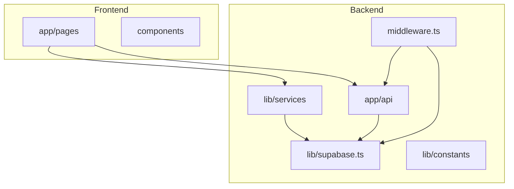
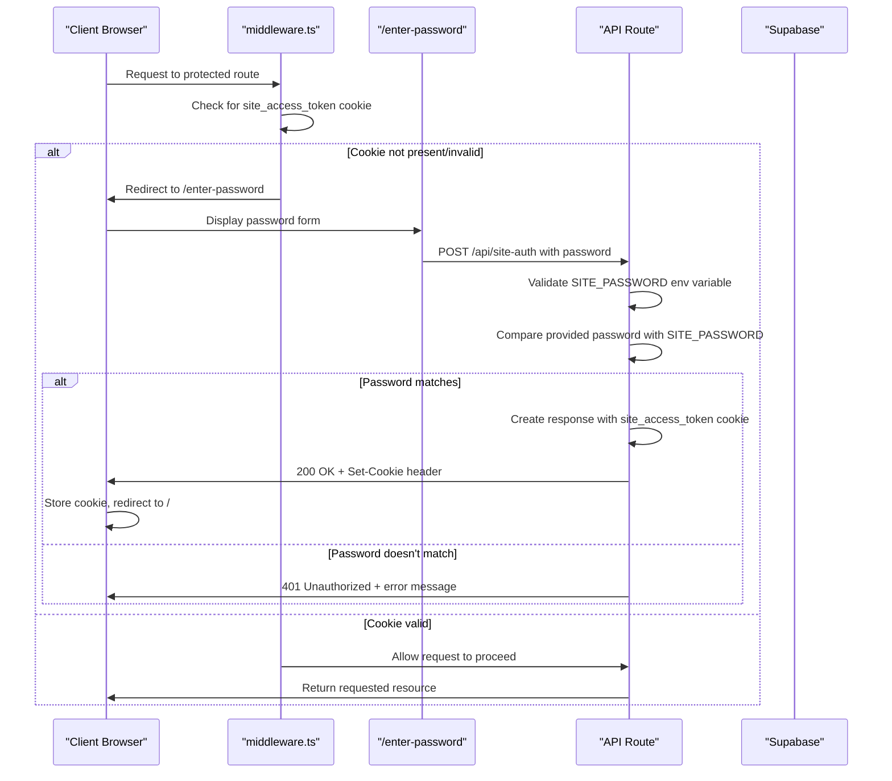
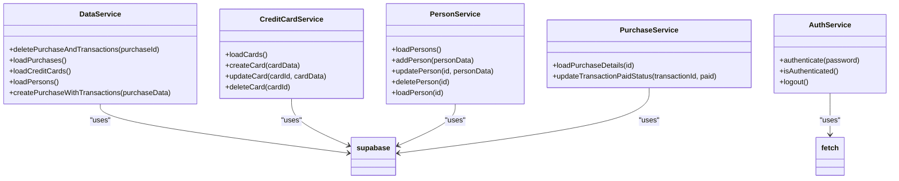
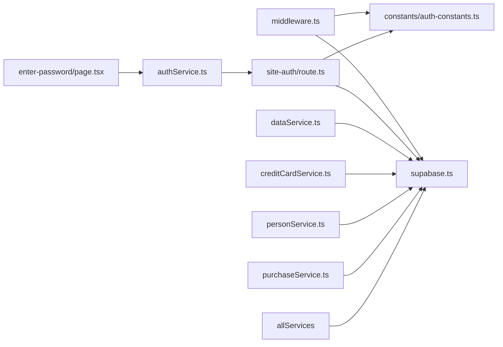

# Backend Architecture

<cite>
**Referenced Files in This Document**   
- [middleware.ts](file://src/middleware.ts)
- [supabase.ts](file://src/lib/supabase.ts)
- [site-auth/route.ts](file://src/app/api/site-auth/route.ts)
- [authService.ts](file://src/lib/services/authService.ts)
- [dataService.ts](file://src/lib/services/dataService.ts)
- [creditCardService.ts](file://src/lib/services/creditCardService.ts)
- [personService.ts](file://src/lib/services/personService.ts)
- [purchaseService.ts](file://src/lib/services/purchaseService.ts)
- [auth-constants.ts](file://src/lib/constants/auth-constants.ts)
- [enter-password/page.tsx](file://src/app/enter-password/page.tsx)
</cite>

## Table of Contents
1. [Introduction](#introduction)
2. [Project Structure](#project-structure)
3. [Core Components](#core-components)
4. [Architecture Overview](#architecture-overview)
5. [Detailed Component Analysis](#detailed-component-analysis)
6. [Dependency Analysis](#dependency-analysis)
7. [Performance Considerations](#performance-considerations)
8. [Troubleshooting Guide](#troubleshooting-guide)
9. [Conclusion](#conclusion)

## Introduction
The credit-card-tracker application implements a modern backend architecture leveraging Supabase as a backend-as-a-service for database storage and authentication, Next.js API routes for custom endpoints, and middleware for request interception and access control. The architecture follows a service pattern implementation in `src/lib/services` for data access abstraction, providing a clean separation between business logic and data operations. This documentation details the high-level design, authentication flow, service layer implementation, and security considerations for the application.

## Project Structure



**Diagram sources**
- [middleware.ts](file://src/middleware.ts#L1-L54)
- [supabase.ts](file://src/lib/supabase.ts#L1-L81)
- [site-auth/route.ts](file://src/app/api/site-auth/route.ts#L1-L65)

**Section sources**
- [middleware.ts](file://src/middleware.ts#L1-L54)
- [supabase.ts](file://src/lib/supabase.ts#L1-L81)

## Core Components

The backend architecture consists of several core components that work together to provide a secure and scalable solution for tracking credit card information. The system leverages Supabase for database operations and authentication, while implementing custom API routes and middleware for additional functionality. The service pattern in `src/lib/services` provides an abstraction layer for data access operations, promoting code reusability and maintainability.

**Section sources**
- [dataService.ts](file://src/lib/services/dataService.ts#L1-L165)
- [creditCardService.ts](file://src/lib/services/creditCardService.ts#L1-L69)
- [personService.ts](file://src/lib/services/personService.ts#L1-L76)
- [purchaseService.ts](file://src/lib/services/purchaseService.ts#L1-L88)

## Architecture Overview

```mermaid
graph TD
Client[Client Browser] --> |HTTP Request| Middleware[middleware.ts]
Middleware --> |Check Cookie| AuthCheck{Has Valid Cookie?}
AuthCheck --> |No| Redirect --> EnterPassword[/enter-password]
AuthCheck --> |Yes| AllowAccess --> API[API Routes]
EnterPassword --> |POST /api/site-auth| SiteAuth[/api/site-auth]
SiteAuth --> |Verify Password| SupabaseDB[Supabase Database]
SiteAuth --> |Set Cookie| Client
API --> |Data Operations| Services[Service Layer]
Services --> |Supabase Client| SupabaseJS[Supabase JavaScript SDK]
SupabaseJS --> SupabaseDB
SupabaseDB --> |Response| SupabaseJS
SupabaseJS --> |Data| Services
Services --> |Formatted Data| API
API --> |Response| Client
```

**Diagram sources**
- [middleware.ts](file://src/middleware.ts#L8-L39)
- [site-auth/route.ts](file://src/app/api/site-auth/route.ts#L9-L64)
- [supabase.ts](file://src/lib/supabase.ts#L7-L81)
- [dataService.ts](file://src/lib/services/dataService.ts#L3-L165)

## Detailed Component Analysis

### Authentication Flow Analysis

The authentication flow in the credit-card-tracker application follows a cookie-based approach with server-side validation. When a user attempts to access a protected route, the middleware intercepts the request and checks for a valid authentication cookie. If the cookie is not present or invalid, the user is redirected to the password entry page.



**Diagram sources**
- [middleware.ts](file://src/middleware.ts#L8-L39)
- [site-auth/route.ts](file://src/app/api/site-auth/route.ts#L9-L64)
- [auth-constants.ts](file://src/lib/constants/auth-constants.ts#L2-L7)
- [enter-password/page.tsx](file://src/app/enter-password/page.tsx#L8-L75)

**Section sources**
- [middleware.ts](file://src/middleware.ts#L8-L39)
- [site-auth/route.ts](file://src/app/api/site-auth/route.ts#L9-L64)
- [authService.ts](file://src/lib/services/authService.ts#L3-L46)

### Service Pattern Implementation

The application implements a service pattern in the `src/lib/services` directory to abstract data access operations and provide a clean interface for business logic. Each service class encapsulates operations related to a specific domain entity, such as credit cards, persons, and purchases.



**Diagram sources**
- [dataService.ts](file://src/lib/services/dataService.ts#L3-L165)
- [creditCardService.ts](file://src/lib/services/creditCardService.ts#L3-L69)
- [personService.ts](file://src/lib/services/personService.ts#L3-L76)
- [purchaseService.ts](file://src/lib/services/purchaseService.ts#L3-L88)
- [authService.ts](file://src/lib/services/authService.ts#L3-L46)
- [supabase.ts](file://src/lib/supabase.ts#L7-L81)

**Section sources**
- [dataService.ts](file://src/lib/services/dataService.ts#L3-L165)
- [creditCardService.ts](file://src/lib/services/creditCardService.ts#L3-L69)
- [personService.ts](file://src/lib/services/personService.ts#L3-L76)
- [purchaseService.ts](file://src/lib/services/purchaseService.ts#L3-L88)

### Data Access and Supabase Integration

The application integrates with Supabase for database operations, using the Supabase JavaScript client to perform CRUD operations on various entities. The `supabase.ts` file initializes the Supabase client with environment variables and defines TypeScript interfaces for the database schema.

```mermaid
flowchart TD
A[Service Method Call] --> B[Supabase Client Operation]
B --> C{Operation Type}
C --> |SELECT| D[Supabase.from().select()]
C --> |INSERT| E[Supabase.from().insert()]
C --> |UPDATE| F[Supabase.from().update()]
C --> |DELETE| G[Supabase.from().delete()]
D --> H[Transform Data with expand property]
E --> H
F --> H
G --> H
H --> I[Return Formatted Data]
I --> J[Service Consumer]
style A fill:#f9f,stroke:#333
style J fill:#f9f,stroke:#333
```

**Diagram sources**
- [supabase.ts](file://src/lib/supabase.ts#L7-L81)
- [dataService.ts](file://src/lib/services/dataService.ts#L39-L165)
- [creditCardService.ts](file://src/lib/services/creditCardService.ts#L4-L69)

**Section sources**
- [supabase.ts](file://src/lib/supabase.ts#L7-L81)
- [dataService.ts](file://src/lib/services/dataService.ts#L39-L165)

## Dependency Analysis



**Diagram sources**
- [middleware.ts](file://src/middleware.ts#L2-L6)
- [site-auth/route.ts](file://src/app/api/site-auth/route.ts#L2-L7)
- [authService.ts](file://src/lib/services/authService.ts#L6)
- [dataService.ts](file://src/lib/services/dataService.ts#L1)
- [creditCardService.ts](file://src/lib/services/creditCardService.ts#L1)
- [personService.ts](file://src/lib/services/personService.ts#L1)
- [purchaseService.ts](file://src/lib/services/purchaseService.ts#L1)
- [enter-password/page.tsx](file://src/app/enter-password/page.tsx#L5)

**Section sources**
- [middleware.ts](file://src/middleware.ts#L1-L54)
- [site-auth/route.ts](file://src/app/api/site-auth/route.ts#L1-L65)
- [supabase.ts](file://src/lib/supabase.ts#L1-L81)

## Performance Considerations

The backend architecture demonstrates several performance considerations:

1. **Caching Strategy**: The use of middleware for authentication reduces the need for repeated database queries to validate user sessions.
2. **Batch Operations**: The `DataService.deletePurchaseAndTransactions` method demonstrates proper transaction handling by deleting related transactions before removing the parent purchase.
3. **Efficient Data Loading**: Service methods use Supabase's select functionality with specific field selection to minimize data transfer.
4. **Connection Management**: The Supabase client is initialized once in `supabase.ts` and reused across the application, avoiding repeated connection initialization.

The architecture could be further optimized by implementing client-side caching for frequently accessed data and using Supabase's real-time capabilities for live updates when appropriate.

## Troubleshooting Guide

Common issues and their solutions:

1. **Authentication failures despite correct password**:
   - Verify that the `SITE_PASSWORD` environment variable is set
   - Check that the environment variable is available in the correct environment (development/production)
   - Ensure the cookie settings (secure, httpOnly) are appropriate for the deployment environment

2. **Supabase connection issues**:
   - Verify that `NEXT_PUBLIC_SUPABASE_URL` and `NEXT_PUBLIC_SUPABASE_ANON_KEY` environment variables are correctly set
   - Check network connectivity to the Supabase endpoint
   - Validate that the Supabase project is active and not suspended

3. **Service method failures**:
   - Check the console for error messages from Supabase operations
   - Verify that the database schema matches the TypeScript interfaces in `supabase.ts`
   - Ensure proper error handling in service methods

**Section sources**
- [middleware.ts](file://src/middleware.ts#L1-L54)
- [site-auth/route.ts](file://src/app/api/site-auth/route.ts#L1-L65)
- [supabase.ts](file://src/lib/supabase.ts#L1-L81)

## Conclusion

The credit-card-tracker application implements a robust backend architecture that effectively leverages Supabase as a backend-as-a-service while extending its capabilities with custom Next.js API routes and middleware. The service pattern implementation in `src/lib/services` provides a clean abstraction layer for data access operations, promoting code reusability and maintainability. The cookie-based authentication flow with middleware protection ensures secure access to application resources. The architecture balances simplicity with functionality, making it suitable for a credit card tracking application while providing a solid foundation for future enhancements.