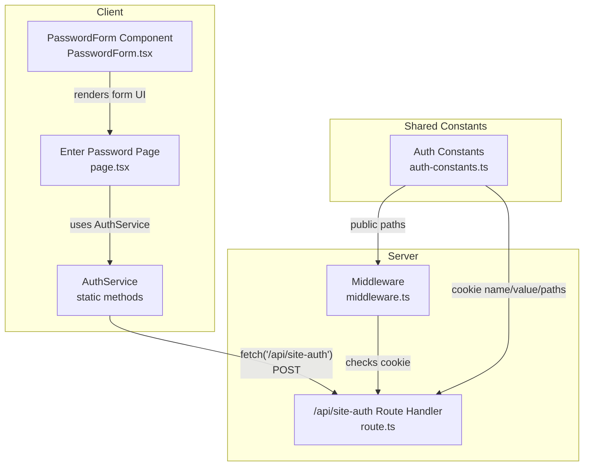
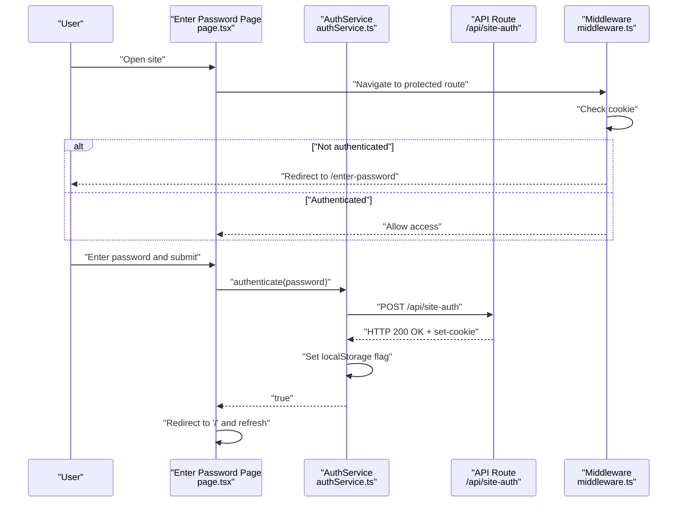
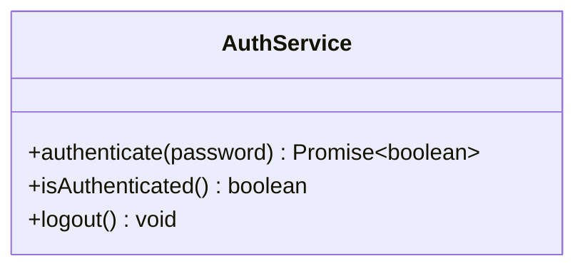
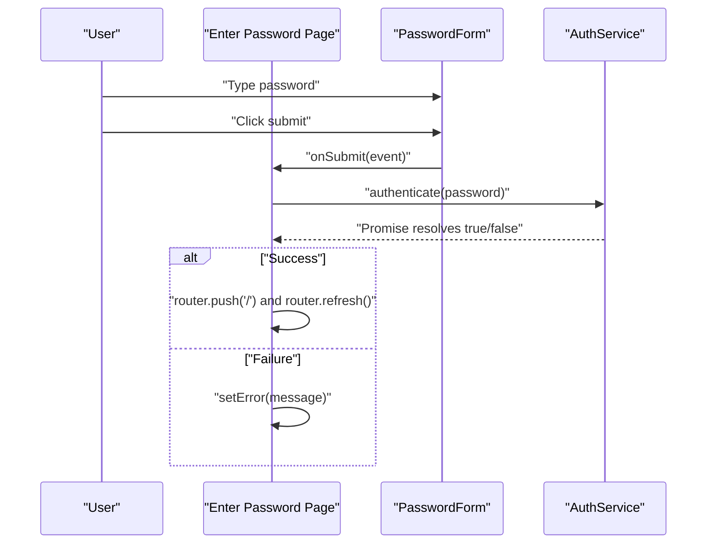
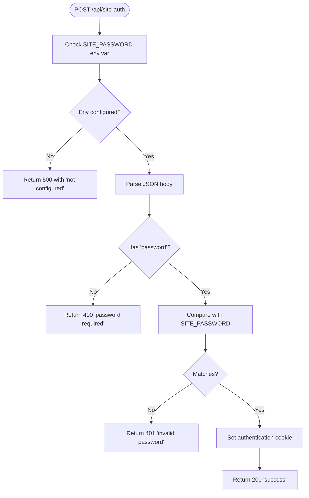
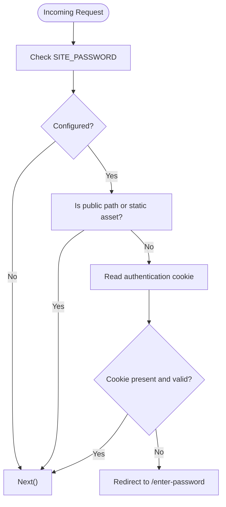
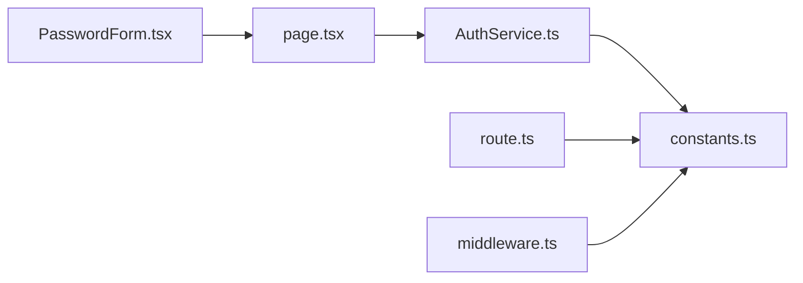

# Authentication Service

<cite>
**Referenced Files in This Document**
- [authService.ts](file://src/lib/services/authService.ts)
- [route.ts](file://src/app/api/site-auth/route.ts)
- [middleware.ts](file://src/middleware.ts)
- [page.tsx](file://src/app/enter-password/page.tsx)
- [PasswordForm.tsx](file://src/components/auth/PasswordForm.tsx)
- [auth-constants.ts](file://src/lib/constants/auth-constants.ts)
- [constants.ts](file://src/lib/constants/constants.ts)
</cite>

## Table of Contents
1. [Introduction](#introduction)
2. [Project Structure](#project-structure)
3. [Core Components](#core-components)
4. [Architecture Overview](#architecture-overview)
5. [Detailed Component Analysis](#detailed-component-analysis)
6. [Dependency Analysis](#dependency-analysis)
7. [Performance Considerations](#performance-considerations)
8. [Troubleshooting Guide](#troubleshooting-guide)
9. [Conclusion](#conclusion)
10. [Appendices](#appendices)

## Introduction
This document explains the AuthService class and the surrounding authentication flow in the credit-card-tracker application. It focuses on how the client-side service submits a password to the /api/site-auth endpoint, persists authentication state locally, and integrates with the Next.js middleware to protect routes. It also covers usage in the enter-password page, error handling, CORS considerations, and future extension points for token-based or biometric authentication.

## Project Structure
The authentication system spans three primary areas:
- Client-side service: a static AuthService class that performs network requests and manages local state.
- API route: a Next.js route handler that validates the submitted password and sets an authentication cookie.
- Middleware: a Next.js middleware that enforces route protection based on the presence of the authentication cookie.

**Diagram sources**
- [authService.ts](file://src/lib/services/authService.ts#L1-L47)
- [page.tsx](file://src/app/enter-password/page.tsx#L1-L75)
- [PasswordForm.tsx](file://src/components/auth/PasswordForm.tsx#L1-L48)
- [route.ts](file://src/app/api/site-auth/route.ts#L1-L65)
- [middleware.ts](file://src/middleware.ts#L1-L54)
- [auth-constants.ts](file://src/lib/constants/auth-constants.ts#L1-L11)

**Section sources**
- [authService.ts](file://src/lib/services/authService.ts#L1-L47)
- [route.ts](file://src/app/api/site-auth/route.ts#L1-L65)
- [middleware.ts](file://src/middleware.ts#L1-L54)
- [page.tsx](file://src/app/enter-password/page.tsx#L1-L75)
- [PasswordForm.tsx](file://src/components/auth/PasswordForm.tsx#L1-L48)
- [auth-constants.ts](file://src/lib/constants/auth-constants.ts#L1-L11)
- [constants.ts](file://src/lib/constants/constants.ts#L1-L2)

## Core Components
- AuthService: A client-side service with three static methods:
  - authenticate(password): Sends credentials to /api/site-auth and stores a local flag on success.
  - isAuthenticated(): Checks whether the local flag indicates authentication.
  - logout(): Clears the local authentication flag.
- Enter Password Page: A client component that renders a form and invokes AuthService.authenticate on submit.
- API Route (/api/site-auth): Validates the password, returns appropriate HTTP status codes, and sets an authentication cookie.
- Middleware: Enforces route protection by checking for the authentication cookie and redirecting unauthenticated users to the enter-password page.

Key behaviors:
- Client-side nature: The service is marked as a client component and uses localStorage to persist authentication state across browser sessions.
- Server-side enforcement: The API route validates the password and sets a cookie; the middleware checks for the cookie to protect routes.
- Public paths: The middleware explicitly allows access to the enter-password page and the authentication API route.

**Section sources**
- [authService.ts](file://src/lib/services/authService.ts#L1-L47)
- [page.tsx](file://src/app/enter-password/page.tsx#L1-L75)
- [route.ts](file://src/app/api/site-auth/route.ts#L1-L65)
- [middleware.ts](file://src/middleware.ts#L1-L54)
- [auth-constants.ts](file://src/lib/constants/auth-constants.ts#L1-L11)

## Architecture Overview
The authentication flow consists of a client-initiated request to the server, followed by cookie-based session validation by the middleware.

**Diagram sources**
- [page.tsx](file://src/app/enter-password/page.tsx#L1-L75)
- [authService.ts](file://src/lib/services/authService.ts#L1-L47)
- [route.ts](file://src/app/api/site-auth/route.ts#L1-L65)
- [middleware.ts](file://src/middleware.ts#L1-L54)

## Detailed Component Analysis

### AuthService Class
Purpose:
- Encapsulate client-side authentication logic for the password-based site access.
- Manage local authentication state using localStorage.
- Provide a simple interface for pages to trigger authentication and check state.

Methods:
- authenticate(password: string): 
  - Sends a POST request to /api/site-auth with the password.
  - Throws on non-OK responses with a message extracted from the JSON payload.
  - On success, sets a localStorage flag indicating authentication.
  - Returns true to signal success.
- isAuthenticated(): 
  - Reads the localStorage flag and returns a boolean.
  - Returns false when run outside the browser context.
- logout(): 
  - Removes the localStorage flag.

Client-side nature:
- The service is declared as a client component, enabling use of browser APIs like fetch and localStorage.

Integration points:
- Used by the enter-password page to submit credentials and handle errors.
- Used by other parts of the UI to determine whether to render protected content.

**Diagram sources**
- [authService.ts](file://src/lib/services/authService.ts#L1-L47)

**Section sources**
- [authService.ts](file://src/lib/services/authService.ts#L1-L47)

### Enter Password Page and Form
- The page is a client component that holds state for the password input, loading state, and error messages.
- It renders the PasswordForm component and calls AuthService.authenticate on form submit.
- On success, it navigates to the home route and triggers a refresh so the middleware reevaluates the request.

Usage example references:
- Submit handler invokes AuthService.authenticate and handles errors.
- The form component provides the UI for password input and submission.

**Diagram sources**
- [page.tsx](file://src/app/enter-password/page.tsx#L1-L75)
- [PasswordForm.tsx](file://src/components/auth/PasswordForm.tsx#L1-L48)
- [authService.ts](file://src/lib/services/authService.ts#L1-L47)

**Section sources**
- [page.tsx](file://src/app/enter-password/page.tsx#L1-L75)
- [PasswordForm.tsx](file://src/components/auth/PasswordForm.tsx#L1-L48)

### API Route: /api/site-auth
Responsibilities:
- Validate that the environment variable containing the site password is present.
- Parse the incoming JSON body and extract the password.
- Compare the submitted password with the configured site password.
- On success, return a success message and set an authentication cookie with secure defaults.
- On failure, return appropriate HTTP status codes (400, 401, 500) with error messages.

Cookie configuration:
- Name and value are defined in shared constants.
- Max age, secure flag, SameSite, and path are set according to constants.

**Diagram sources**
- [route.ts](file://src/app/api/site-auth/route.ts#L1-L65)
- [auth-constants.ts](file://src/lib/constants/auth-constants.ts#L1-L11)

**Section sources**
- [route.ts](file://src/app/api/site-auth/route.ts#L1-L65)
- [auth-constants.ts](file://src/lib/constants/auth-constants.ts#L1-L11)

### Middleware Protection
Behavior:
- If the site password is not configured, the middleware allows all requests.
- Skips protection for public paths and static assets.
- Checks for the authentication cookie; if missing or invalid, redirects to the enter-password page.
- Otherwise, allows the request to proceed.

Matcher:
- Configured to run on all paths except internal paths, the API route, the enter-password page, and static assets.

**Diagram sources**
- [middleware.ts](file://src/middleware.ts#L1-L54)
- [auth-constants.ts](file://src/lib/constants/auth-constants.ts#L1-L11)

**Section sources**
- [middleware.ts](file://src/middleware.ts#L1-L54)
- [auth-constants.ts](file://src/lib/constants/auth-constants.ts#L1-L11)

## Dependency Analysis
- AuthService depends on:
  - Browser fetch for network requests.
  - localStorage for client-side state persistence.
  - Shared constants for cookie configuration and public paths.
- API Route depends on:
  - Environment variables for site password.
  - Shared constants for cookie configuration.
- Middleware depends on:
  - Shared constants for cookie name/value and public paths.
  - Next.js request/response APIs for cookies and redirects.

**Diagram sources**
- [authService.ts](file://src/lib/services/authService.ts#L1-L47)
- [route.ts](file://src/app/api/site-auth/route.ts#L1-L65)
- [middleware.ts](file://src/middleware.ts#L1-L54)
- [page.tsx](file://src/app/enter-password/page.tsx#L1-L75)
- [PasswordForm.tsx](file://src/components/auth/PasswordForm.tsx#L1-L48)
- [constants.ts](file://src/lib/constants/constants.ts#L1-L2)

**Section sources**
- [authService.ts](file://src/lib/services/authService.ts#L1-L47)
- [route.ts](file://src/app/api/site-auth/route.ts#L1-L65)
- [middleware.ts](file://src/middleware.ts#L1-L54)
- [page.tsx](file://src/app/enter-password/page.tsx#L1-L75)
- [PasswordForm.tsx](file://src/components/auth/PasswordForm.tsx#L1-L48)
- [constants.ts](file://src/lib/constants/constants.ts#L1-L2)

## Performance Considerations
- Network latency: The authentication request is small and fast; keep the UI responsive by disabling the submit button during loading.
- Middleware overhead: The middleware runs on every request; ensure public paths and static assets are excluded to minimize overhead.
- Cookie size: The authentication cookie is minimal; avoid storing large payloads in cookies.
- Local storage: Using a simple flag avoids heavy serialization; ensure no sensitive data is stored in localStorage.

[No sources needed since this section provides general guidance]

## Troubleshooting Guide
Common issues and resolutions:
- Failed authentication responses:
  - 400 Bad Request: The request body did not include a password. Ensure the client sends a JSON payload with a password field.
  - 401 Unauthorized: The password does not match the configured site password. Verify the password value.
  - 500 Internal Server Error: The server environment variable for the site password is not configured. Confirm the environment variable is set.
- CORS considerations:
  - Since the API route is under /api/, and the client is a Next.js app, cross-origin requests are typically not applicable. If integrating from external origins, configure CORS headers on the API route and ensure credentials are handled appropriately.
- localStorage persistence across sessions:
  - The client sets a simple flag in localStorage upon successful authentication. If the flag is cleared or removed, the user will be prompted to re-enter the password. Clearing the browser’s storage or using incognito mode will remove the flag.
- Middleware redirect loop:
  - If the middleware keeps redirecting to the enter-password page, verify that the authentication cookie is being set by the API route and that the cookie name/value match the middleware’s expectations.

**Section sources**
- [route.ts](file://src/app/api/site-auth/route.ts#L1-L65)
- [middleware.ts](file://src/middleware.ts#L1-L54)
- [authService.ts](file://src/lib/services/authService.ts#L1-L47)

## Conclusion
The AuthService class provides a straightforward, client-side authentication mechanism that complements the server-side API route and Next.js middleware. Together, they enforce site access via a password, persist a lightweight authentication state locally, and protect routes by validating a server-set cookie. The design is simple, explicit, and easy to extend for more advanced authentication mechanisms in the future.

[No sources needed since this section summarizes without analyzing specific files]

## Appendices

### How to Use AuthService in the Enter Password Page
- Import AuthService in the client component.
- Capture the password input and call AuthService.authenticate on submit.
- Handle errors and navigate to the home route on success.

References:
- [page.tsx](file://src/app/enter-password/page.tsx#L1-L75)
- [authService.ts](file://src/lib/services/authService.ts#L1-L47)

### Protected by Middleware
- The middleware checks for the authentication cookie and redirects unauthenticated users to the enter-password page.
- Public paths and static assets are exempt from this check.

References:
- [middleware.ts](file://src/middleware.ts#L1-L54)
- [auth-constants.ts](file://src/lib/constants/auth-constants.ts#L1-L11)

### Extending the Service
- Token-based authentication:
  - Modify the API route to issue a JWT or session token and store it in a secure, HttpOnly cookie.
  - Update AuthService to accept and manage tokens, including refresh logic if needed.
- Biometric login:
  - Introduce a separate API endpoint for biometric verification and integrate it with the UI.
  - Store biometric consent or device trust signals in a dedicated cookie or token.
- Additional security:
  - Add rate limiting on the API route.
  - Implement CSRF protection if forms are used beyond the enter-password page.
  - Consider rotating the site password periodically and adding admin controls.

[No sources needed since this section provides general guidance]