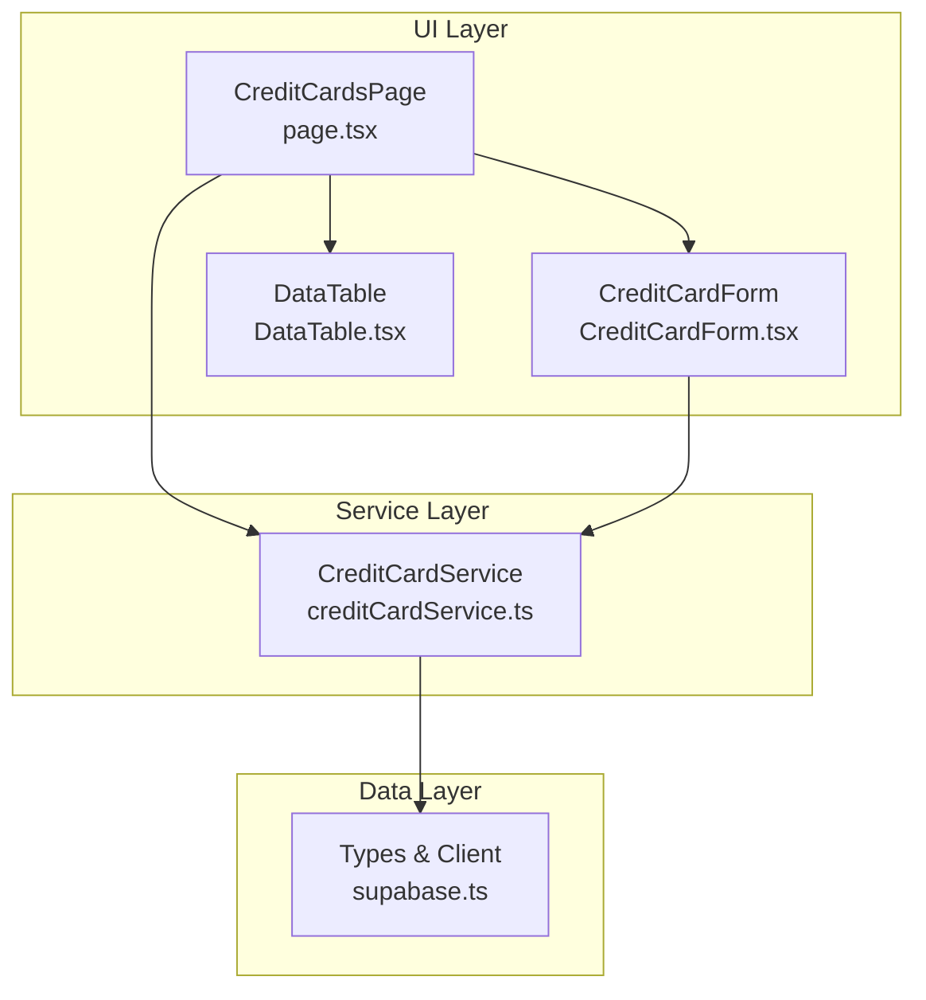
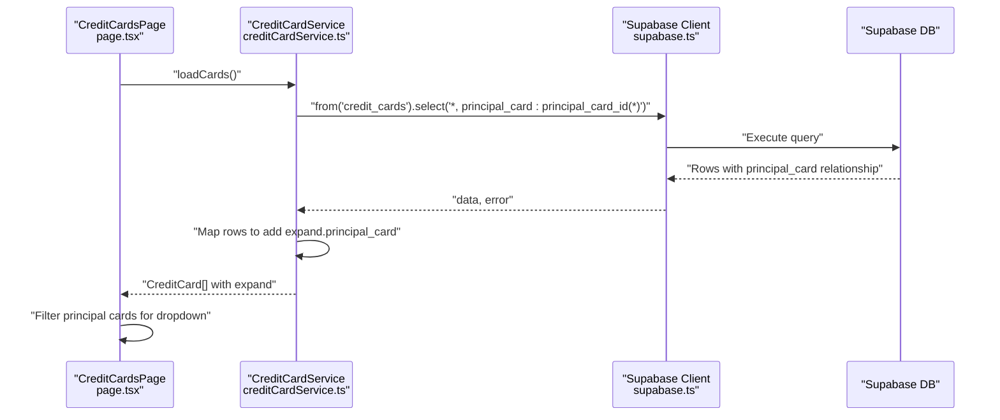
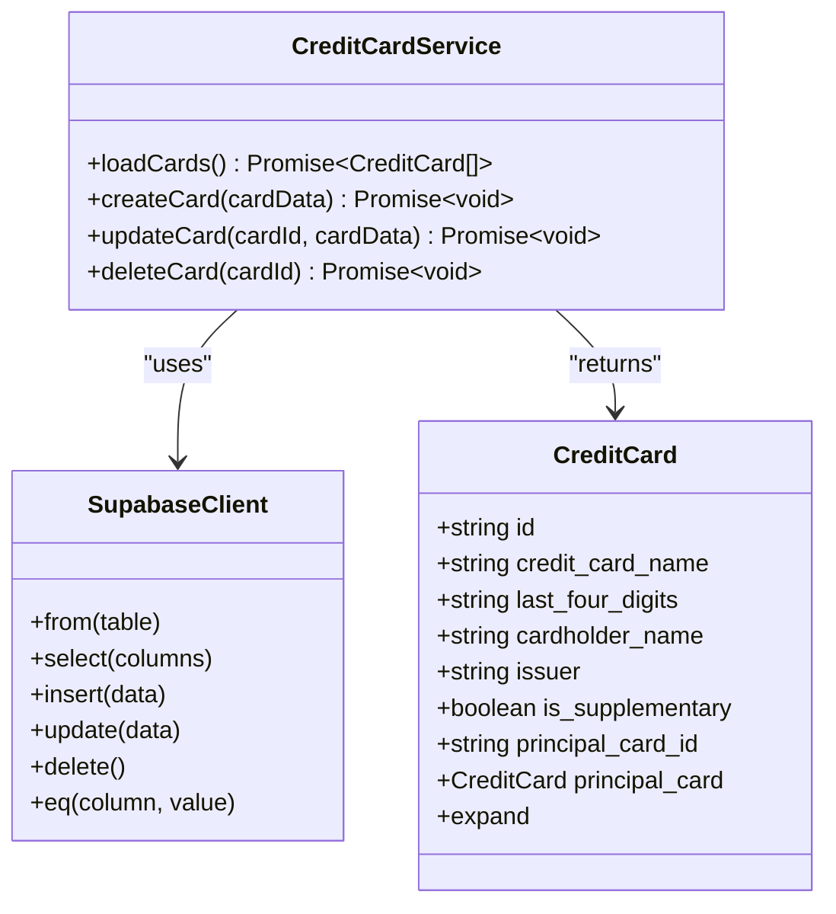
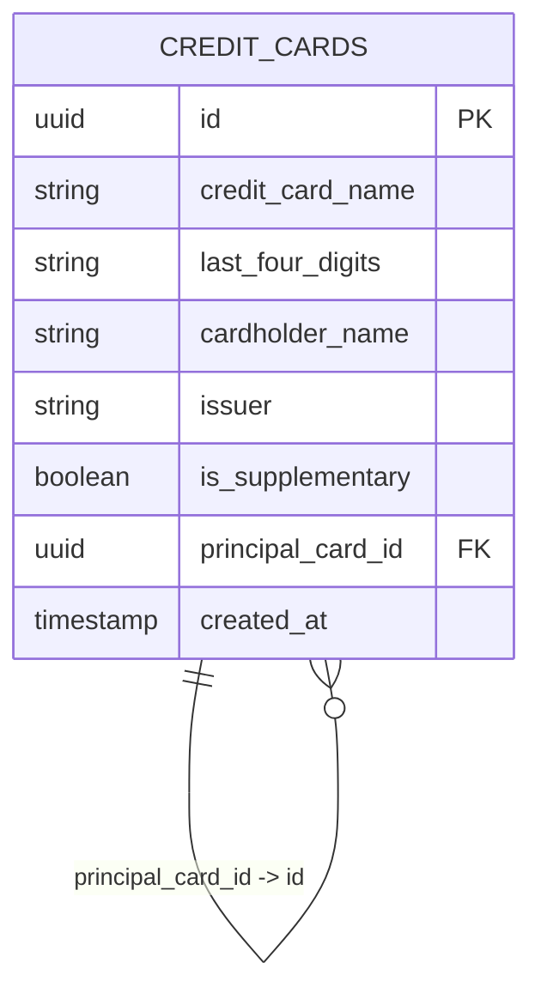
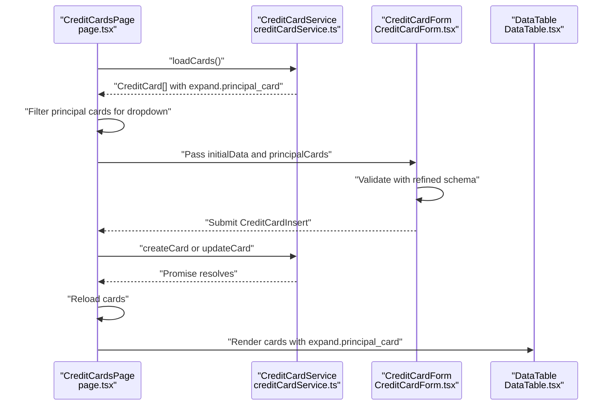
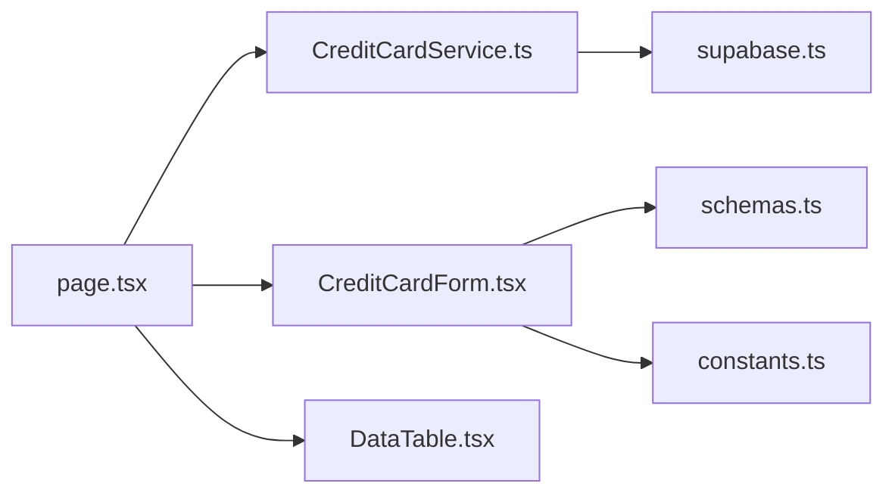

# Credit Card Service

<cite>
**Referenced Files in This Document**
- [creditCardService.ts](file://src/lib/services/creditCardService.ts)
- [supabase.ts](file://src/lib/supabase.ts)
- [page.tsx](file://src/app/credit-cards/page.tsx)
- [CreditCardForm.tsx](file://src/components/credit-cards/CreditCardForm.tsx)
- [schemas.ts](file://src/lib/schemas.ts)
- [constants.ts](file://src/lib/constants.ts)
- [DataTable.tsx](file://src/components/DataTable.tsx)
</cite>

## Table of Contents
1. [Introduction](#introduction)
2. [Project Structure](#project-structure)
3. [Core Components](#core-components)
4. [Architecture Overview](#architecture-overview)
5. [Detailed Component Analysis](#detailed-component-analysis)
6. [Dependency Analysis](#dependency-analysis)
7. [Performance Considerations](#performance-considerations)
8. [Troubleshooting Guide](#troubleshooting-guide)
9. [Conclusion](#conclusion)

## Introduction
This document explains the CreditCardService class responsible for managing credit cards in the Supabase database. It covers the four primary operations: loading cards with relationship expansion, creating cards, updating cards, and deleting cards. It also documents the transformation logic that adds an expand property for UI consumption, clarifies the relationship between supplementary and principal cards, outlines error handling patterns, describes promise-based returns, and explains integration with the CreditCardForm component. Finally, it provides troubleshooting guidance and performance considerations.

## Project Structure
The credit card feature spans a small set of cohesive modules:
- Service layer: CreditCardService encapsulates CRUD operations against the Supabase client.
- Data layer: Supabase client and type definitions for credit cards.
- UI layer: CreditCards page orchestrates loading, editing, and deletion; CreditCardForm handles creation/editing; DataTable renders the list.
- Validation and constants: Zod schemas define form validation; constants provide labels and issuer options.

**Diagram sources**
- [page.tsx](file://src/app/credit-cards/page.tsx#L1-L195)
- [CreditCardForm.tsx](file://src/components/credit-cards/CreditCardForm.tsx#L1-L180)
- [DataTable.tsx](file://src/components/DataTable.tsx#L1-L86)
- [creditCardService.ts](file://src/lib/services/creditCardService.ts#L1-L69)
- [supabase.ts](file://src/lib/supabase.ts#L1-L81)

**Section sources**
- [page.tsx](file://src/app/credit-cards/page.tsx#L1-L195)
- [creditCardService.ts](file://src/lib/services/creditCardService.ts#L1-L69)
- [supabase.ts](file://src/lib/supabase.ts#L1-L81)
- [CreditCardForm.tsx](file://src/components/credit-cards/CreditCardForm.tsx#L1-L180)
- [DataTable.tsx](file://src/components/DataTable.tsx#L1-L86)

## Core Components
- CreditCardService: Provides asynchronous CRUD methods backed by Supabase.
- Supabase types and client: Defines CreditCard and CreditCardInsert types and exposes the Supabase client.
- CreditCardsPage: Orchestrates loading, editing, and deletion flows; prepares principal card options for the form.
- CreditCardForm: Validates and submits card data; conditionally requires a principal card for supplementary cards.
- DataTable: Renders the list of cards and displays the principal card name when applicable.

**Section sources**
- [creditCardService.ts](file://src/lib/services/creditCardService.ts#L1-L69)
- [supabase.ts](file://src/lib/supabase.ts#L1-L81)
- [page.tsx](file://src/app/credit-cards/page.tsx#L1-L195)
- [CreditCardForm.tsx](file://src/components/credit-cards/CreditCardForm.tsx#L1-L180)
- [DataTable.tsx](file://src/components/DataTable.tsx#L1-L86)

## Architecture Overview
The service integrates with the Supabase client to perform relational queries and transformations for UI consumption. The UI layer invokes service methods and updates state accordingly.

**Diagram sources**
- [creditCardService.ts](file://src/lib/services/creditCardService.ts#L1-L26)
- [supabase.ts](file://src/lib/supabase.ts#L1-L81)
- [page.tsx](file://src/app/credit-cards/page.tsx#L32-L54)

## Detailed Component Analysis

### CreditCardService
The service exposes four static methods that wrap Supabase operations. Each method returns a Promise and throws a standardized error on failure.

- loadCards
  - Purpose: Fetches all credit cards with a relationship expansion for principal cards.
  - Implementation highlights:
    - Uses a Supabase select with a relationship alias to fetch related principal card data.
    - Transforms each row to include an expand property containing the principal card object for UI convenience.
  - Example snippet path: [loadCards](file://src/lib/services/creditCardService.ts#L4-L21)
  - Relationship expansion: The returned array includes an expand property with principal_card populated from the relationship alias.

- createCard
  - Purpose: Inserts a new credit card record.
  - Implementation highlights:
    - Calls Supabase insert with CreditCardInsert payload.
    - Throws if an error occurs.
  - Example snippet path: [createCard](file://src/lib/services/creditCardService.ts#L28-L38)

- updateCard
  - Purpose: Updates an existing credit card by id.
  - Implementation highlights:
    - Calls Supabase update with CreditCardInsert payload and filters by id.
    - Throws if an error occurs.
  - Example snippet path: [updateCard](file://src/lib/services/creditCardService.ts#L40-L54)

- deleteCard
  - Purpose: Deletes a credit card by id.
  - Implementation highlights:
    - Calls Supabase delete with an equality filter on id.
    - Throws if an error occurs.
  - Example snippet path: [deleteCard](file://src/lib/services/creditCardService.ts#L56-L67)

**Diagram sources**
- [creditCardService.ts](file://src/lib/services/creditCardService.ts#L1-L69)
- [supabase.ts](file://src/lib/supabase.ts#L16-L39)

**Section sources**
- [creditCardService.ts](file://src/lib/services/creditCardService.ts#L1-L69)
- [supabase.ts](file://src/lib/supabase.ts#L16-L39)

### Data Model and Relationships
- Principal and Supplementary Cards:
  - A principal card is a standalone card (is_supplementary is false).
  - A supplementary card links to a principal card via principal_card_id.
  - The UI displays the principal card name for supplementary cards using the expand property.
- Types and Expansion:
  - The CreditCard type includes an optional principal_card and an expand object with principal_card for UI convenience.
  - The service’s loadCards method populates expand.principal_card by leveraging Supabase’s relationship alias.

**Diagram sources**
- [supabase.ts](file://src/lib/supabase.ts#L16-L39)
- [creditCardService.ts](file://src/lib/services/creditCardService.ts#L4-L21)

**Section sources**
- [supabase.ts](file://src/lib/supabase.ts#L16-L39)
- [creditCardService.ts](file://src/lib/services/creditCardService.ts#L4-L21)

### UI Integration and Transformation Logic
- CreditCardsPage:
  - Calls loadCards and sets state for cards and principalCards.
  - Uses DataTable to render the list; the “Principal Card” column reads expand.principal_card when available.
  - Example snippet path: [render principal card column](file://src/app/credit-cards/page.tsx#L146-L152)
- CreditCardForm:
  - Validates form data using refinedCreditCardSchema.
  - Conditionally requires principal_card_id for supplementary cards.
  - Prepares submission data by setting principal_card_id appropriately.
  - Example snippet path: [conditional principal card requirement](file://src/components/credit-cards/CreditCardForm.tsx#L41-L53)
- Transformation:
  - The service adds expand.principal_card to each card for UI consumption.
  - Example snippet path: [add expand property](file://src/lib/services/creditCardService.ts#L12-L21)

**Diagram sources**
- [page.tsx](file://src/app/credit-cards/page.tsx#L32-L194)
- [CreditCardForm.tsx](file://src/components/credit-cards/CreditCardForm.tsx#L1-L180)
- [creditCardService.ts](file://src/lib/services/creditCardService.ts#L1-L69)
- [DataTable.tsx](file://src/components/DataTable.tsx#L1-L86)

**Section sources**
- [page.tsx](file://src/app/credit-cards/page.tsx#L1-L195)
- [CreditCardForm.tsx](file://src/components/credit-cards/CreditCardForm.tsx#L1-L180)
- [schemas.ts](file://src/lib/schemas.ts#L1-L26)
- [creditCardService.ts](file://src/lib/services/creditCardService.ts#L1-L69)
- [DataTable.tsx](file://src/components/DataTable.tsx#L1-L86)

### Method-by-Method Breakdown

#### loadCards
- Operation: select with relationship expansion.
- Behavior:
  - Fetches all credit cards.
  - Expands principal card data via a relationship alias.
  - Adds expand.principal_card to each card for UI rendering.
- Example snippet path: [loadCards](file://src/lib/services/creditCardService.ts#L4-L21)
- UI usage:
  - CreditCardsPage sets cards and filters principal cards for the form dropdown.
  - DataTable reads expand.principal_card to display the principal card name.
  - Example snippet path: [filter principal cards](file://src/app/credit-cards/page.tsx#L39-L43), [render principal card column](file://src/app/credit-cards/page.tsx#L146-L152)

**Section sources**
- [creditCardService.ts](file://src/lib/services/creditCardService.ts#L4-L21)
- [page.tsx](file://src/app/credit-cards/page.tsx#L32-L54)
- [DataTable.tsx](file://src/components/DataTable.tsx#L1-L86)

#### createCard
- Operation: insert into credit_cards.
- Behavior:
  - Receives CreditCardInsert payload.
  - Throws on error.
- Example snippet path: [createCard](file://src/lib/services/creditCardService.ts#L28-L38)
- UI usage:
  - CreditCardsPage calls createCard on form submit when adding a new card.
  - Example snippet path: [handleSubmit (create)](file://src/app/credit-cards/page.tsx#L70-L77)

**Section sources**
- [creditCardService.ts](file://src/lib/services/creditCardService.ts#L28-L38)
- [page.tsx](file://src/app/credit-cards/page.tsx#L70-L77)

#### updateCard
- Operation: update by id.
- Behavior:
  - Receives cardId and CreditCardInsert payload.
  - Throws on error.
- Example snippet path: [updateCard](file://src/lib/services/creditCardService.ts#L40-L54)
- UI usage:
  - CreditCardsPage calls updateCard on form submit when editing an existing card.
  - Example snippet path: [handleSubmit (update)](file://src/app/credit-cards/page.tsx#L70-L77)

**Section sources**
- [creditCardService.ts](file://src/lib/services/creditCardService.ts#L40-L54)
- [page.tsx](file://src/app/credit-cards/page.tsx#L70-L77)

#### deleteCard
- Operation: delete by id.
- Behavior:
  - Receives cardId.
  - Throws on error.
- Example snippet path: [deleteCard](file://src/lib/services/creditCardService.ts#L56-L67)
- UI usage:
  - CreditCardsPage calls deleteCard and reloads the list afterward.
  - Example snippet path: [handleDelete](file://src/app/credit-cards/page.tsx#L84-L93)

**Section sources**
- [creditCardService.ts](file://src/lib/services/creditCardService.ts#L56-L67)
- [page.tsx](file://src/app/credit-cards/page.tsx#L84-L93)

## Dependency Analysis
- CreditCardService depends on:
  - Supabase client for database operations.
  - CreditCard and CreditCardInsert types for typing.
- UI components depend on:
  - CreditCardService for data operations.
  - Zod schemas for validation.
  - Constants for labels and issuer options.

**Diagram sources**
- [creditCardService.ts](file://src/lib/services/creditCardService.ts#L1-L69)
- [supabase.ts](file://src/lib/supabase.ts#L1-L81)
- [page.tsx](file://src/app/credit-cards/page.tsx#L1-L195)
- [CreditCardForm.tsx](file://src/components/credit-cards/CreditCardForm.tsx#L1-L180)
- [schemas.ts](file://src/lib/schemas.ts#L1-L26)
- [constants.ts](file://src/lib/constants.ts#L88-L113)

**Section sources**
- [creditCardService.ts](file://src/lib/services/creditCardService.ts#L1-L69)
- [supabase.ts](file://src/lib/supabase.ts#L1-L81)
- [page.tsx](file://src/app/credit-cards/page.tsx#L1-L195)
- [CreditCardForm.tsx](file://src/components/credit-cards/CreditCardForm.tsx#L1-L180)
- [schemas.ts](file://src/lib/schemas.ts#L1-L26)
- [constants.ts](file://src/lib/constants.ts#L88-L113)

## Performance Considerations
- Data fetching optimization:
  - Use targeted selects and limit columns when possible to reduce payload size.
  - Consider pagination for large datasets.
- Caching strategies:
  - Cache the principal card list in memory to avoid repeated filtering on the client.
  - Debounce reloads after create/update/delete to minimize redundant network calls.
- Relationship expansion:
  - The current loadCards expands principal cards; consider lazy-loading or on-demand expansion for very large lists.
- UI responsiveness:
  - Keep the loading spinner visible during long-running operations.
  - Use optimistic updates with rollback on error for smoother UX.

[No sources needed since this section provides general guidance]

## Troubleshooting Guide
- Foreign key constraint violations:
  - Symptom: Insert/update fails when principal_card_id references a non-existent principal card.
  - Resolution: Ensure the selected principal card exists and belongs to the same account holder context if enforced by application logic.
  - Related validations: The form enforces that principal_card_id is required for supplementary cards.
  - Example snippet path: [schema refinement](file://src/lib/schemas.ts#L16-L26), [form conditional logic](file://src/components/credit-cards/CreditCardForm.tsx#L41-L53)
- Invalid card data:
  - Symptom: Validation errors on save.
  - Resolution: Fix required fields and ensure last_four_digits is exactly 4 digits.
  - Example snippet path: [schema constraints](file://src/lib/schemas.ts#L3-L15)
- Synchronization delays:
  - Symptom: Newly created/updated cards not immediately visible.
  - Resolution: Trigger a reload after successful operations; consider debouncing frequent reloads.
  - Example snippet path: [reload after submit](file://src/app/credit-cards/page.tsx#L70-L79)
- Error handling patterns:
  - The service logs and rethrows errors; the UI surfaces user-friendly messages and provides retry actions.
  - Example snippet path: [service error handling](file://src/lib/services/creditCardService.ts#L23-L25), [UI error handling](file://src/app/credit-cards/page.tsx#L44-L51)

**Section sources**
- [schemas.ts](file://src/lib/schemas.ts#L3-L26)
- [CreditCardForm.tsx](file://src/components/credit-cards/CreditCardForm.tsx#L41-L53)
- [creditCardService.ts](file://src/lib/services/creditCardService.ts#L23-L25)
- [page.tsx](file://src/app/credit-cards/page.tsx#L44-L51)

## Conclusion
The CreditCardService provides a clean abstraction over Supabase for managing credit cards, including relationship expansion for UI convenience. The UI integrates tightly with the service, enforcing validation and handling errors gracefully. By following the outlined troubleshooting steps and applying the suggested performance improvements, teams can maintain a robust and responsive credit card management experience.