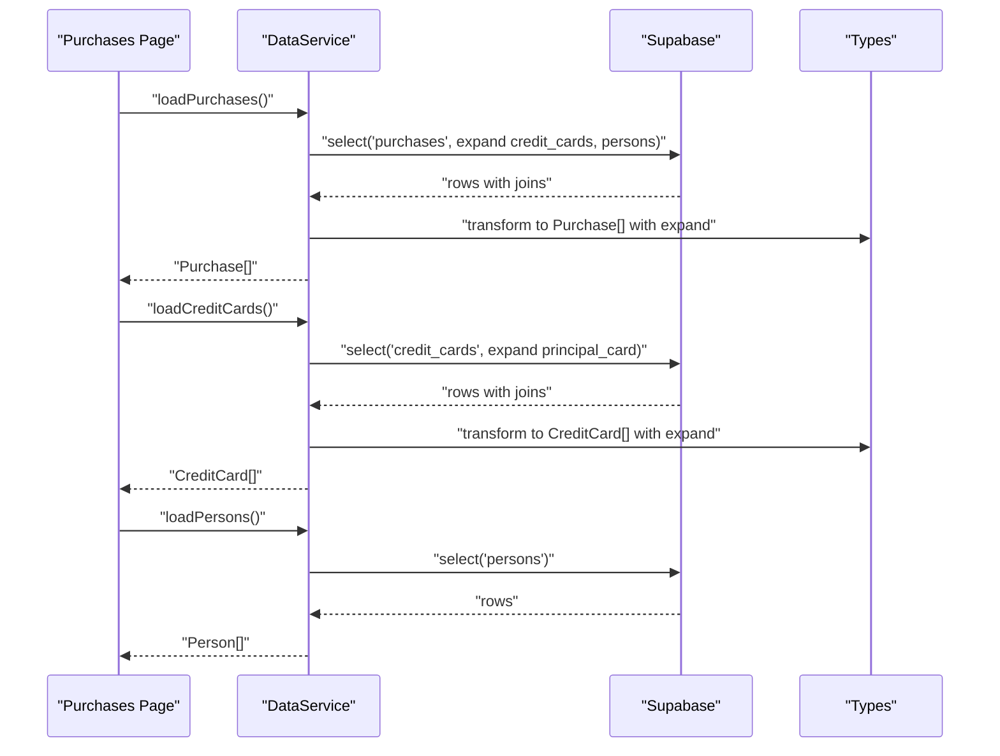
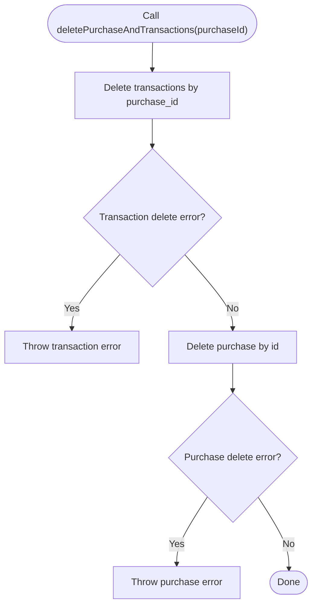
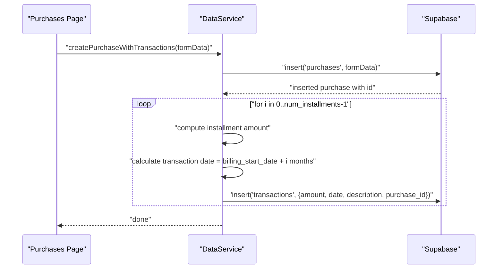
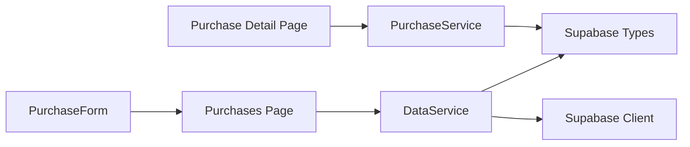

# Data Service

<cite>
**Referenced Files in This Document**
- [dataService.ts](file://src/lib/services/dataService.ts)
- [supabase.ts](file://src/lib/supabase.ts)
- [purchases/page.tsx](file://src/app/purchases/page.tsx)
- [purchases/[id]/page.tsx](file://src/app/purchases/[id]/page.tsx)
- [PurchaseForm.tsx](file://src/components/PurchaseForm.tsx)
- [PurchaseDetailsCard.tsx](file://src/components/purchases/PurchaseDetailsCard.tsx)
- [usePurchaseDetails.ts](file://src/lib/hooks/usePurchaseDetails.ts)
- [purchaseService.ts](file://src/lib/services/purchaseService.ts)
</cite>

## Table of Contents
1. [Introduction](#introduction)
2. [Project Structure](#project-structure)
3. [Core Components](#core-components)
4. [Architecture Overview](#architecture-overview)
5. [Detailed Component Analysis](#detailed-component-analysis)
6. [Dependency Analysis](#dependency-analysis)
7. [Performance Considerations](#performance-considerations)
8. [Troubleshooting Guide](#troubleshooting-guide)
9. [Conclusion](#conclusion)
10. [Appendices](#appendices)

## Introduction
This document provides comprehensive documentation for the DataService class, which centralizes data operations across multiple entities in the credit card tracker application. It focuses on:
- Ensuring referential integrity during deletion with deletePurchaseAndTransactions
- Loading and transforming data with expanded relationships for UI consumption via loadPurchases, loadCreditCards, and loadPersons
- Orchestrating purchase creation with automatic installment transaction generation via createPurchaseWithTransactions
- Explaining date calculations for installment scheduling and data transformation patterns using the expand property
- Maintaining data consistency and enforcing business rules
- Addressing common issues such as transaction rollback failures, date calculation edge cases, and performance implications
- Guidance on extending the service to support data export or reporting features

## Project Structure
DataService is part of the shared services layer and integrates with UI pages and components to provide a cohesive data access layer. The following diagram shows how DataService fits into the application’s architecture.

```mermaid
graph TB
subgraph "UI Pages"
PList["Purchases Page<br/>(purchases/page.tsx)"]
PDetail["Purchase Detail Page<br/>(purchases/[id]/page.tsx)"]
end
subgraph "Components"
PForm["PurchaseForm<br/>(components/PurchaseForm.tsx)"]
PDetailsCard["PurchaseDetailsCard<br/>(components/purchases/PurchaseDetailsCard.tsx)"]
end
subgraph "Services"
DS["DataService<br/>(lib/services/dataService.ts)"]
PSvc["PurchaseService<br/>(lib/services/purchaseService.ts)"]
Hook["usePurchaseDetails<br/>(lib/hooks/usePurchaseDetails.ts)"]
end
subgraph "Types"
Types["Supabase Types<br/>(lib/supabase.ts)"]
end
PList --> DS
PList --> PForm
PDetail --> Hook
Hook --> PSvc
PSvc --> Types
DS --> Types
PForm --> DS
PDetailsCard --> PSvc
```

**Diagram sources**
- [purchases/page.tsx](file://src/app/purchases/page.tsx#L1-L120)
- [purchases/[id]/page.tsx](file://src/app/purchases/[id]/page.tsx#L1-L120)
- [PurchaseForm.tsx](file://src/components/PurchaseForm.tsx#L1-L120)
- [PurchaseDetailsCard.tsx](file://src/components/purchases/PurchaseDetailsCard.tsx#L1-L77)
- [usePurchaseDetails.ts](file://src/lib/hooks/usePurchaseDetails.ts#L1-L62)
- [purchaseService.ts](file://src/lib/services/purchaseService.ts#L1-L88)
- [dataService.ts](file://src/lib/services/dataService.ts#L1-L165)
- [supabase.ts](file://src/lib/supabase.ts#L1-L81)

**Section sources**
- [dataService.ts](file://src/lib/services/dataService.ts#L1-L165)
- [supabase.ts](file://src/lib/supabase.ts#L1-L81)
- [purchases/page.tsx](file://src/app/purchases/page.tsx#L1-L120)
- [purchases/[id]/page.tsx](file://src/app/purchases/[id]/page.tsx#L1-L120)
- [PurchaseForm.tsx](file://src/components/PurchaseForm.tsx#L1-L120)
- [PurchaseDetailsCard.tsx](file://src/components/purchases/PurchaseDetailsCard.tsx#L1-L77)
- [usePurchaseDetails.ts](file://src/lib/hooks/usePurchaseDetails.ts#L1-L62)
- [purchaseService.ts](file://src/lib/services/purchaseService.ts#L1-L88)

## Core Components
- DataService: Provides CRUD-like orchestration for purchases and related transactions, including referential integrity enforcement and data expansion for UI.
- Supabase Types: Defines Purchase, CreditCard, Person, and Transaction interfaces with optional expand properties for joined data.
- PurchaseService: Loads purchase details with expanded relations and updates transaction paid status.
- UI Integration: Purchases page and purchase detail page consume DataService and PurchaseService to render and manage data.

**Section sources**
- [dataService.ts](file://src/lib/services/dataService.ts#L1-L165)
- [supabase.ts](file://src/lib/supabase.ts#L1-L81)
- [purchaseService.ts](file://src/lib/services/purchaseService.ts#L1-L88)

## Architecture Overview
DataService acts as a coordinator for multi-entity operations, leveraging Supabase client to perform database operations. It transforms raw database rows into a normalized shape with an expand property to simplify UI rendering. The Purchases page uses DataService to load purchases, credit cards, and persons concurrently, while the purchase detail page uses PurchaseService to load purchase and transaction details with expanded relations.



**Diagram sources**
- [purchases/page.tsx](file://src/app/purchases/page.tsx#L36-L60)
- [dataService.ts](file://src/lib/services/dataService.ts#L39-L105)
- [supabase.ts](file://src/lib/supabase.ts#L1-L81)

**Section sources**
- [purchases/page.tsx](file://src/app/purchases/page.tsx#L36-L60)
- [dataService.ts](file://src/lib/services/dataService.ts#L39-L105)
- [supabase.ts](file://src/lib/supabase.ts#L1-L81)

## Detailed Component Analysis

### DataService.deletePurchaseAndTransactions
Purpose:
- Safely remove a purchase and all its associated transactions while preserving referential integrity.

Processing logic:
- Delete all transactions linked to the given purchase_id
- Delete the purchase record itself
- Propagate errors encountered during either operation

Error handling:
- Logs and rethrows errors to allow upstream components to handle failure states



**Diagram sources**
- [dataService.ts](file://src/lib/services/dataService.ts#L8-L37)

**Section sources**
- [dataService.ts](file://src/lib/services/dataService.ts#L8-L37)

### DataService.loadPurchases
Purpose:
- Retrieve purchases with expanded relationships for credit card and person to enable UI rendering without additional lookups.

Processing logic:
- Perform a join-select to fetch purchases along with related credit card and person data
- Order by purchase_date descending for chronological display
- Transform each row into a Purchase object with an expand property containing related entities

Data transformation pattern:
- The expand property consolidates related entities into a single object for convenient UI access

**Section sources**
- [dataService.ts](file://src/lib/services/dataService.ts#L39-L69)
- [supabase.ts](file://src/lib/supabase.ts#L41-L59)

### DataService.loadCreditCards
Purpose:
- Retrieve credit cards with expanded principal card relationship.

Processing logic:
- Perform a join-select to fetch credit cards along with their principal card data
- Transform each row into a CreditCard object with an expand property for principal card

**Section sources**
- [dataService.ts](file://src/lib/services/dataService.ts#L71-L94)
- [supabase.ts](file://src/lib/supabase.ts#L16-L30)

### DataService.loadPersons
Purpose:
- Retrieve all persons for selection in forms and lists.

Processing logic:
- Fetch all persons from the database
- Return as Person[] without additional transformations

**Section sources**
- [dataService.ts](file://src/lib/services/dataService.ts#L96-L105)
- [supabase.ts](file://src/lib/supabase.ts#L9-L15)

### DataService.createPurchaseWithTransactions
Purpose:
- Create a purchase and automatically generate installment transactions based on billing rules.

Processing logic:
- Insert a new purchase record and retrieve the generated purchase id
- Compute the installment amount by dividing total_amount by num_installments
- For each installment:
  - Calculate the transaction date by adding i months to billing_start_date
  - Insert a transaction with the computed date, amount, and description
- Enforce business rules:
  - Minimum of 1 installment
  - Total amount distributed across installments

Date calculation:
- Uses JavaScript Date arithmetic to increment month by month from billing_start_date
- The date is normalized to YYYY-MM-DD string before insertion



**Diagram sources**
- [dataService.ts](file://src/lib/services/dataService.ts#L107-L163)
- [purchases/page.tsx](file://src/app/purchases/page.tsx#L68-L86)

**Section sources**
- [dataService.ts](file://src/lib/services/dataService.ts#L107-L163)
- [purchases/page.tsx](file://src/app/purchases/page.tsx#L68-L86)

### UI Integration and Data Expansion
- Purchases page loads purchases, credit cards, and persons concurrently and passes them to components that rely on the expand property for rendering.
- Purchase detail page uses PurchaseService to load purchase and transactions with expanded relations, enabling components like PurchaseDetailsCard to access related data seamlessly.

**Section sources**
- [purchases/page.tsx](file://src/app/purchases/page.tsx#L36-L120)
- [PurchaseDetailsCard.tsx](file://src/components/purchases/PurchaseDetailsCard.tsx#L1-L77)
- [usePurchaseDetails.ts](file://src/lib/hooks/usePurchaseDetails.ts#L1-L62)
- [purchaseService.ts](file://src/lib/services/purchaseService.ts#L1-L88)

## Dependency Analysis
DataService depends on:
- Supabase client for database operations
- Supabase types for typed data structures and expand properties

UI pages depend on:
- Purchases page for listing purchases and triggering creation/deletion
- Purchase detail page for viewing purchase and transaction details
- PurchaseForm for capturing purchase and installment data



**Diagram sources**
- [dataService.ts](file://src/lib/services/dataService.ts#L1-L165)
- [supabase.ts](file://src/lib/supabase.ts#L1-L81)
- [purchases/page.tsx](file://src/app/purchases/page.tsx#L1-L120)
- [purchases/[id]/page.tsx](file://src/app/purchases/[id]/page.tsx#L1-L120)
- [PurchaseForm.tsx](file://src/components/PurchaseForm.tsx#L1-L120)
- [purchaseService.ts](file://src/lib/services/purchaseService.ts#L1-L88)

**Section sources**
- [dataService.ts](file://src/lib/services/dataService.ts#L1-L165)
- [supabase.ts](file://src/lib/supabase.ts#L1-L81)
- [purchases/page.tsx](file://src/app/purchases/page.tsx#L1-L120)
- [purchases/[id]/page.tsx](file://src/app/purchases/[id]/page.tsx#L1-L120)
- [PurchaseForm.tsx](file://src/components/PurchaseForm.tsx#L1-L120)
- [purchaseService.ts](file://src/lib/services/purchaseService.ts#L1-L88)

## Performance Considerations
- Concurrency: The Purchases page uses Promise.all to load purchases, credit cards, and persons concurrently, reducing total load time.
- Batch operations: createPurchaseWithTransactions performs multiple inserts in a loop; for large num_installments, consider batching or server-side orchestration to reduce round trips.
- Data shaping: Expanding relations in a single query reduces subsequent lookups and improves UI responsiveness.
- Pagination: For large datasets, consider adding pagination to loadPurchases and loadPersons to limit payload sizes.

[No sources needed since this section provides general guidance]

## Troubleshooting Guide
Common issues and resolutions:
- Transaction rollback failures:
  - Symptom: Partial deletions occur when a later operation fails.
  - Resolution: Wrap delete operations in a transactional block if supported by your backend; otherwise, implement compensating actions or revert earlier deletions manually.
  - Reference: deletePurchaseAndTransactions does not wrap operations in a transaction; upstream callers should coordinate retries or compensations.
  - Section sources
    - [dataService.ts](file://src/lib/services/dataService.ts#L8-L37)

- Date calculation edge cases (month boundaries):
  - Symptom: Transactions created on Jan 31 may shift to Feb 28/29 unexpectedly.
  - Resolution: Normalize dates to the last day of the month or use a library that handles month overflow consistently; ensure billing_start_date is validated before use.
  - Section sources
    - [dataService.ts](file://src/lib/services/dataService.ts#L134-L158)

- Performance implications of batch operations:
  - Symptom: Slow creation of many installments due to multiple insert calls.
  - Resolution: Consider batching inserts or using a stored procedure/server-side loop to minimize network overhead.
  - Section sources
    - [dataService.ts](file://src/lib/services/dataService.ts#L130-L158)

- Data consistency and business rules:
  - Symptom: Negative amounts or zero installments cause unexpected behavior.
  - Resolution: Validate inputs before calling createPurchaseWithTransactions; enforce minimum num_installments and positive total_amount.
  - Section sources
    - [PurchaseForm.tsx](file://src/components/PurchaseForm.tsx#L104-L130)
    - [dataService.ts](file://src/lib/services/dataService.ts#L130-L158)

- UI rendering issues with expand property:
  - Symptom: Missing related data in components.
  - Resolution: Ensure loadPurchases/loadCreditCards include join selects and transform steps; verify that components access expand safely.
  - Section sources
    - [dataService.ts](file://src/lib/services/dataService.ts#L39-L105)
    - [PurchaseDetailsCard.tsx](file://src/components/purchases/PurchaseDetailsCard.tsx#L1-L77)

## Conclusion
DataService centralizes multi-entity data operations, ensuring referential integrity and consistent data shapes for UI consumption. It enforces business rules for installment creation and provides a foundation for future enhancements such as export/reporting capabilities. By understanding its patterns—join selects, expand transformations, and date calculations—developers can extend the service responsibly while maintaining performance and reliability.

[No sources needed since this section summarizes without analyzing specific files]

## Appendices

### Extending the Service for Export or Reporting
Recommended approaches:
- Add export methods:
  - Implement exportPurchasesReport that aggregates purchases, transactions, and related entities into a normalized structure suitable for CSV/Excel generation.
  - Use join selects similar to loadPurchases to minimize client-side joins.
- Add reporting methods:
  - Implement computeInstallmentSchedule to pre-validate billing_start_date and num_installments, returning a schedule of dates and amounts.
  - Implement aggregateByCardOrPerson to summarize totals and counts by entity for dashboards.
- Maintain backward compatibility:
  - Keep existing methods intact and introduce new methods alongside them.
  - Ensure all new methods leverage the expand property for consistent UI integration.

[No sources needed since this section provides general guidance]