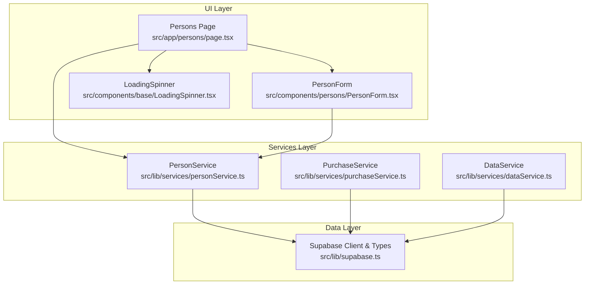
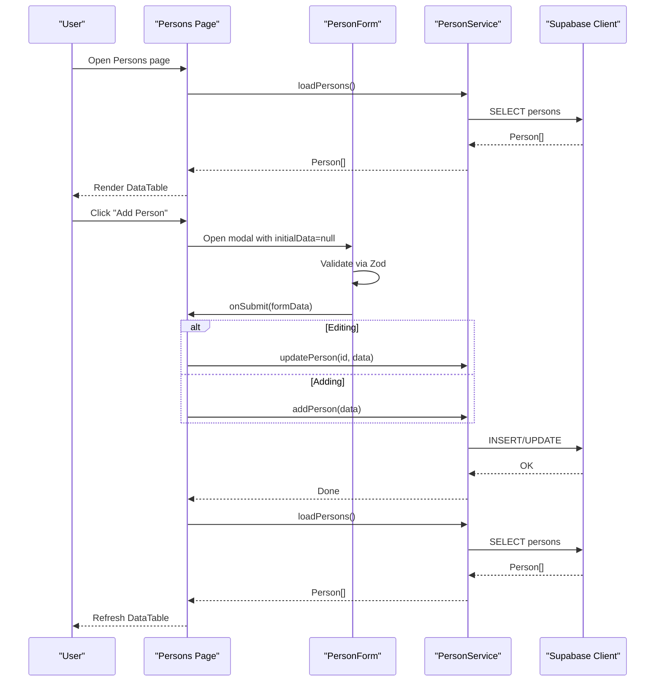
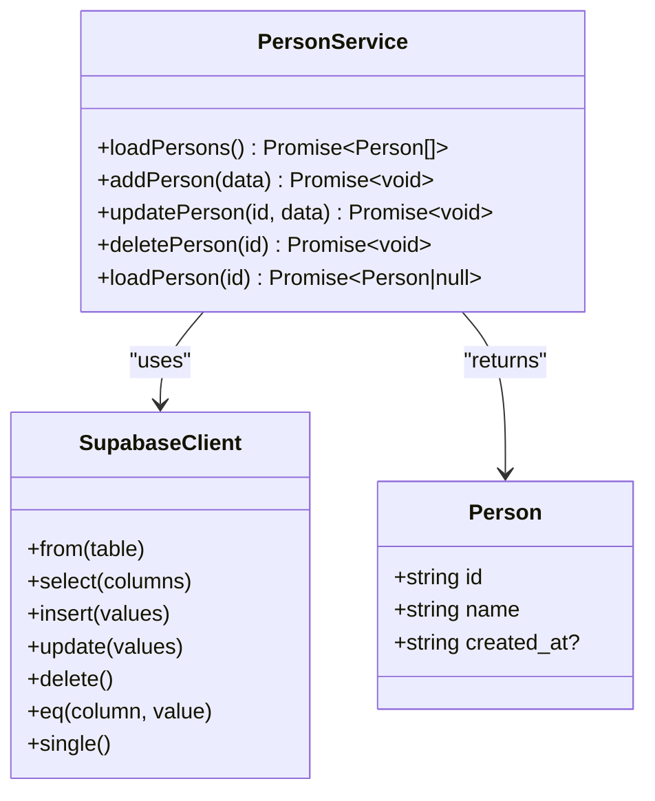
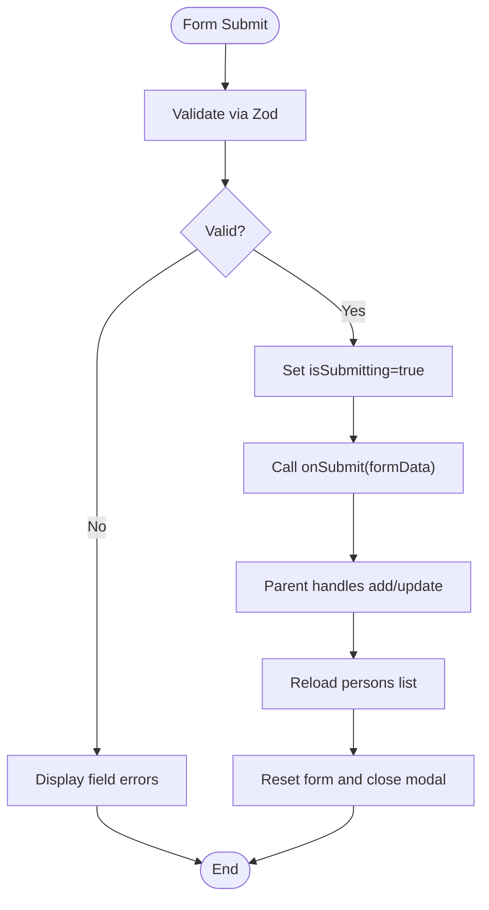
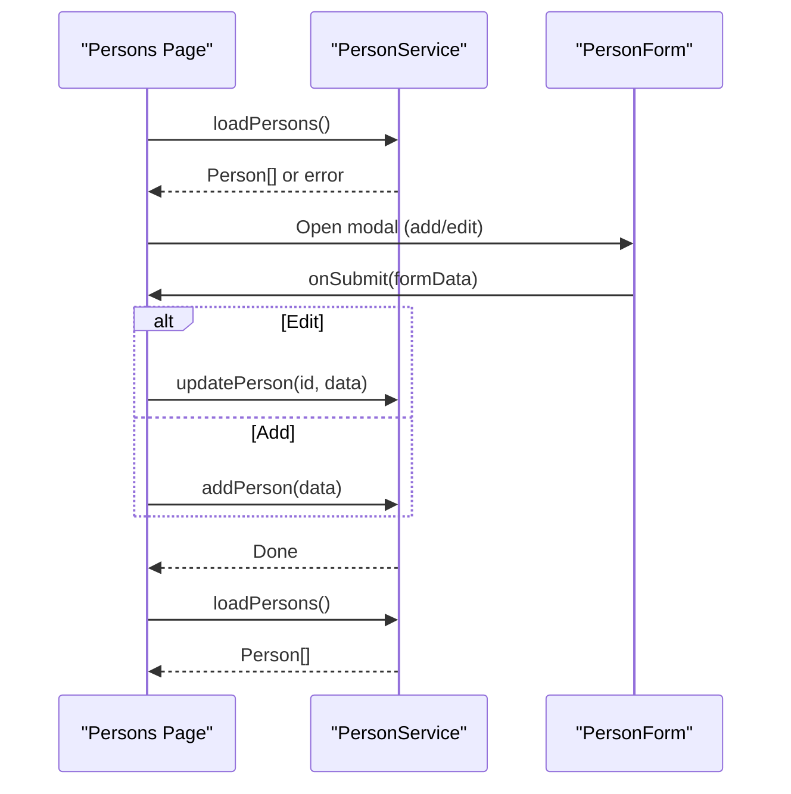
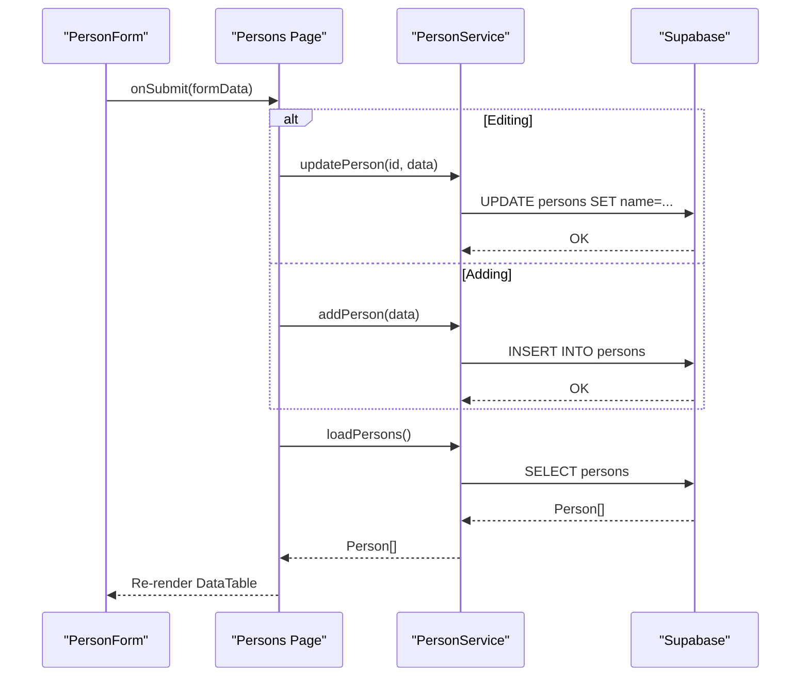
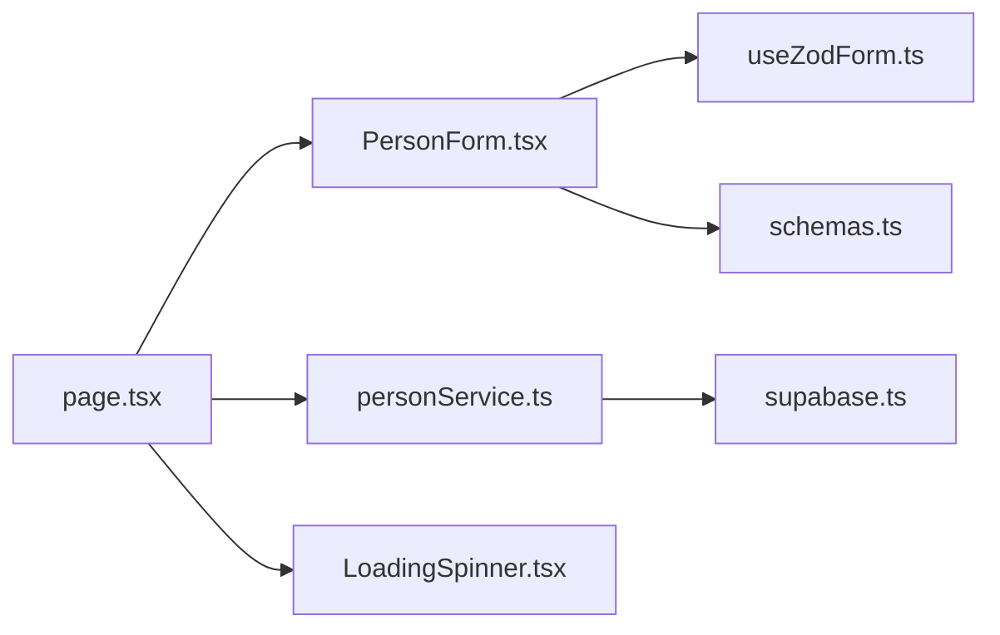

# Person Service

<cite>
**Referenced Files in This Document**
- [personService.ts](file://src/lib/services/personService.ts)
- [supabase.ts](file://src/lib/supabase.ts)
- [PersonForm.tsx](file://src/components/persons/PersonForm.tsx)
- [page.tsx](file://src/app/persons/page.tsx)
- [schemas.ts](file://src/lib/schemas.ts)
- [useZodForm.ts](file://src/lib/hooks/useZodForm.ts)
- [LoadingSpinner.tsx](file://src/components/base/LoadingSpinner.tsx)
- [purchaseService.ts](file://src/lib/services/purchaseService.ts)
- [dataService.ts](file://src/lib/services/dataService.ts)
</cite>

## Table of Contents
1. [Introduction](#introduction)
2. [Project Structure](#project-structure)
3. [Core Components](#core-components)
4. [Architecture Overview](#architecture-overview)
5. [Detailed Component Analysis](#detailed-component-analysis)
6. [Dependency Analysis](#dependency-analysis)
7. [Performance Considerations](#performance-considerations)
8. [Troubleshooting Guide](#troubleshooting-guide)
9. [Conclusion](#conclusion)
10. [Appendices](#appendices)

## Introduction
This document explains the PersonService class and its integration with the PersonForm component and the Persons page. It covers how the service interacts with the Supabase client to manage person records, including loading, adding, updating, and deleting persons. It also documents the end-to-end data flow from form submission to database persistence and UI updates, along with error handling, loading states, and constraints around referenced purchases. Guidance is included for extending the service to support additional attributes and search functionality, as well as performance considerations for large datasets.

## Project Structure
The PersonService resides in the services layer and is consumed by the Persons page, which orchestrates UI state and integrates the PersonForm component. The Supabase client and shared types are centralized in the lib layer.

**Diagram sources**
- [page.tsx](file://src/app/persons/page.tsx#L1-L156)
- [PersonForm.tsx](file://src/components/persons/PersonForm.tsx#L1-L109)
- [personService.ts](file://src/lib/services/personService.ts#L1-L76)
- [supabase.ts](file://src/lib/supabase.ts#L1-L81)
- [purchaseService.ts](file://src/lib/services/purchaseService.ts#L1-L88)
- [dataService.ts](file://src/lib/services/dataService.ts#L1-L80)
- [LoadingSpinner.tsx](file://src/components/base/LoadingSpinner.tsx#L1-L34)

**Section sources**
- [page.tsx](file://src/app/persons/page.tsx#L1-L156)
- [PersonForm.tsx](file://src/components/persons/PersonForm.tsx#L1-L109)
- [personService.ts](file://src/lib/services/personService.ts#L1-L76)
- [supabase.ts](file://src/lib/supabase.ts#L1-L81)

## Core Components
- PersonService: Provides CRUD operations for persons using the Supabase client. Methods include loadPersons, addPerson, updatePerson, deletePerson, and loadPerson (by ID).
- PersonForm: A controlled form component that validates input using Zod, manages submission state, and delegates submit actions to the parent page.
- Persons Page: Orchestrates loading persons, displaying them in a data table, opening modals for add/edit, handling deletions, and refreshing data after changes.
- Supabase Client and Types: Centralized client initialization and shared type definitions for Person and related entities.

Key implementation highlights:
- All service methods wrap Supabase calls in try/catch blocks and propagate errors for UI handling.
- The Persons page sets loading and error states while fetching data and retries on failure.
- PersonForm uses Zod validation and disables controls during submission to prevent concurrent edits.

**Section sources**
- [personService.ts](file://src/lib/services/personService.ts#L1-L76)
- [PersonForm.tsx](file://src/components/persons/PersonForm.tsx#L1-L109)
- [page.tsx](file://src/app/persons/page.tsx#L1-L156)
- [supabase.ts](file://src/lib/supabase.ts#L1-L81)

## Architecture Overview
The Persons feature follows a layered architecture:
- UI: Persons page and PersonForm manage user interactions and state.
- Services: PersonService encapsulates data operations against Supabase.
- Data: Supabase client and typed models define the data contract.

**Diagram sources**
- [page.tsx](file://src/app/persons/page.tsx#L1-L156)
- [PersonForm.tsx](file://src/components/persons/PersonForm.tsx#L1-L109)
- [personService.ts](file://src/lib/services/personService.ts#L1-L76)
- [supabase.ts](file://src/lib/supabase.ts#L1-L81)

## Detailed Component Analysis

### PersonService Implementation
PersonService exposes five methods backed by Supabase:
- loadPersons: Fetches all persons.
- addPerson: Inserts a new person with validated name.
- updatePerson: Updates an existing person by ID.
- deletePerson: Removes a person by ID.
- loadPerson: Loads a single person by ID.

Implementation patterns:
- Each method performs a Supabase operation and throws any returned error for upstream handling.
- loadPerson uses a single-row selector to return either a Person or null.
- All methods log errors to the console and rethrow them to the caller.

**Diagram sources**
- [personService.ts](file://src/lib/services/personService.ts#L1-L76)
- [supabase.ts](file://src/lib/supabase.ts#L1-L81)

**Section sources**
- [personService.ts](file://src/lib/services/personService.ts#L1-L76)
- [supabase.ts](file://src/lib/supabase.ts#L1-L81)

### PersonForm Component Integration
PersonForm is a controlled form that:
- Uses Zod validation via useZodForm to enforce non-empty names.
- Manages local submission state to disable controls while saving.
- Calls the parent’s onSubmit handler with validated data.
- Resets and closes the modal on success.

**Diagram sources**
- [PersonForm.tsx](file://src/components/persons/PersonForm.tsx#L1-L109)
- [useZodForm.ts](file://src/lib/hooks/useZodForm.ts#L1-L83)
- [schemas.ts](file://src/lib/schemas.ts#L27-L31)
- [page.tsx](file://src/app/persons/page.tsx#L53-L65)

**Section sources**
- [PersonForm.tsx](file://src/components/persons/PersonForm.tsx#L1-L109)
- [useZodForm.ts](file://src/lib/hooks/useZodForm.ts#L1-L83)
- [schemas.ts](file://src/lib/schemas.ts#L27-L31)
- [page.tsx](file://src/app/persons/page.tsx#L53-L65)

### Persons Page Orchestration
The Persons page manages:
- Loading persons on mount and handling loading/error states.
- Opening modals for add/edit and passing initialData to PersonForm.
- Delegating save operations to PersonService and refreshing the list.
- Deleting persons with confirmation and refresh.

**Diagram sources**
- [page.tsx](file://src/app/persons/page.tsx#L1-L156)
- [PersonForm.tsx](file://src/components/persons/PersonForm.tsx#L1-L109)
- [personService.ts](file://src/lib/services/personService.ts#L1-L76)

**Section sources**
- [page.tsx](file://src/app/persons/page.tsx#L1-L156)

### Data Flow: From Form Submission to Database Persistence and UI Update
1. User submits the form in PersonForm.
2. PersonForm validates and calls the parent’s onSubmit handler with formData.
3. The parent invokes PersonService.addPerson or PersonService.updatePerson depending on editingPerson presence.
4. PersonService executes the Supabase insert/update and throws any error.
5. The parent reloads the persons list by calling PersonService.loadPersons.
6. PersonService fetches the updated list and returns it to the parent.
7. The parent updates state and re-renders the DataTable.

**Diagram sources**
- [PersonForm.tsx](file://src/components/persons/PersonForm.tsx#L1-L109)
- [page.tsx](file://src/app/persons/page.tsx#L53-L65)
- [personService.ts](file://src/lib/services/personService.ts#L1-L76)
- [supabase.ts](file://src/lib/supabase.ts#L1-L81)

**Section sources**
- [PersonForm.tsx](file://src/components/persons/PersonForm.tsx#L1-L109)
- [page.tsx](file://src/app/persons/page.tsx#L53-L65)
- [personService.ts](file://src/lib/services/personService.ts#L1-L76)

## Dependency Analysis
- PersonService depends on the Supabase client and the Person type.
- Persons page depends on PersonService and PersonForm.
- PersonForm depends on Zod validation and useZodForm hook.
- The Persons page also uses LoadingSpinner for loading states.

**Diagram sources**
- [PersonForm.tsx](file://src/components/persons/PersonForm.tsx#L1-L109)
- [useZodForm.ts](file://src/lib/hooks/useZodForm.ts#L1-L83)
- [schemas.ts](file://src/lib/schemas.ts#L27-L31)
- [page.tsx](file://src/app/persons/page.tsx#L1-L156)
- [personService.ts](file://src/lib/services/personService.ts#L1-L76)
- [supabase.ts](file://src/lib/supabase.ts#L1-L81)
- [LoadingSpinner.tsx](file://src/components/base/LoadingSpinner.tsx#L1-L34)

**Section sources**
- [page.tsx](file://src/app/persons/page.tsx#L1-L156)
- [PersonForm.tsx](file://src/components/persons/PersonForm.tsx#L1-L109)
- [personService.ts](file://src/lib/services/personService.ts#L1-L76)
- [supabase.ts](file://src/lib/supabase.ts#L1-L81)

## Performance Considerations
- Current implementation loads all persons on page mount. For large datasets:
  - Introduce server-side filtering and sorting in PersonService.loadPersons by adding Supabase filters and ordering.
  - Implement pagination by adding limit and offset parameters to Supabase queries and exposing them in PersonService.
  - Debounce search inputs in the UI to reduce frequent network requests.
  - Cache frequently accessed persons in memory or use a lightweight caching library to avoid redundant fetches.
- Consider lazy-loading the modal content to defer heavy computations until the modal opens.
- Batch updates: If many edits occur, consider debouncing reloads to minimize repeated fetches.

[No sources needed since this section provides general guidance]

## Troubleshooting Guide
Common issues and resolutions:
- Duplicate person names:
  - The current schema enforces non-empty names but does not enforce uniqueness. To prevent duplicates, add a unique constraint at the database level for the name column and handle the resulting error in PersonService. On error, surface a user-friendly message in the UI.
- Deletion constraints when persons are referenced by purchases:
  - Attempting to delete a person referenced by purchases will fail at the database level. The Persons page currently logs the error and does not display a user-facing message. Enhance error handling to detect foreign key violation errors and show a targeted message instructing the user to remove or reassign purchases before deleting the person.
- Loading states during asynchronous operations:
  - The Persons page sets isLoading and displays an error message with a retry button. Ensure that all async operations set isLoading to false in the finally block to avoid hanging UI.
- Validation failures:
  - PersonForm disables controls during submission and resets on success. If validation fails, errors are shown inline. Confirm that the Zod schema remains aligned with backend constraints.

**Section sources**
- [schemas.ts](file://src/lib/schemas.ts#L27-L31)
- [page.tsx](file://src/app/persons/page.tsx#L22-L36)
- [personService.ts](file://src/lib/services/personService.ts#L1-L76)

## Conclusion
PersonService provides a clean, minimal abstraction over Supabase for person management. Together with PersonForm and the Persons page, it delivers a responsive UI with robust error handling and loading states. Extending the service to support additional attributes and search functionality is straightforward, and performance can be improved with pagination and caching strategies.

[No sources needed since this section summarizes without analyzing specific files]

## Appendices

### Method Reference and Usage Examples
- loadPersons: Called by the Persons page on mount to populate the table.
- addPerson: Invoked by the parent when submitting a new person via PersonForm.
- updatePerson: Invoked by the parent when editing an existing person via PersonForm.
- deletePerson: Called by the parent when confirming deletion; refreshes the list afterward.
- loadPerson: Can be used to prefill forms or validate existence before updates/deletes.

These methods consistently:
- Wrap Supabase operations in try/catch.
- Throw errors for upstream handling.
- Log errors to the console.

**Section sources**
- [personService.ts](file://src/lib/services/personService.ts#L1-L76)
- [page.tsx](file://src/app/persons/page.tsx#L22-L36)
- [PersonForm.tsx](file://src/components/persons/PersonForm.tsx#L42-L58)

### Integration Notes
- PersonForm relies on Zod validation and useZodForm to keep the UI consistent and responsive.
- The Persons page centralizes loading, error, and retry logic, ensuring a good UX during async operations.
- Supabase types define the Person model, ensuring type safety across the app.

**Section sources**
- [PersonForm.tsx](file://src/components/persons/PersonForm.tsx#L1-L109)
- [useZodForm.ts](file://src/lib/hooks/useZodForm.ts#L1-L83)
- [supabase.ts](file://src/lib/supabase.ts#L1-L81)