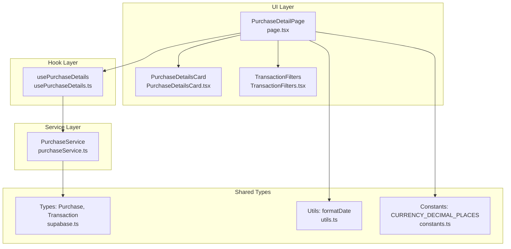
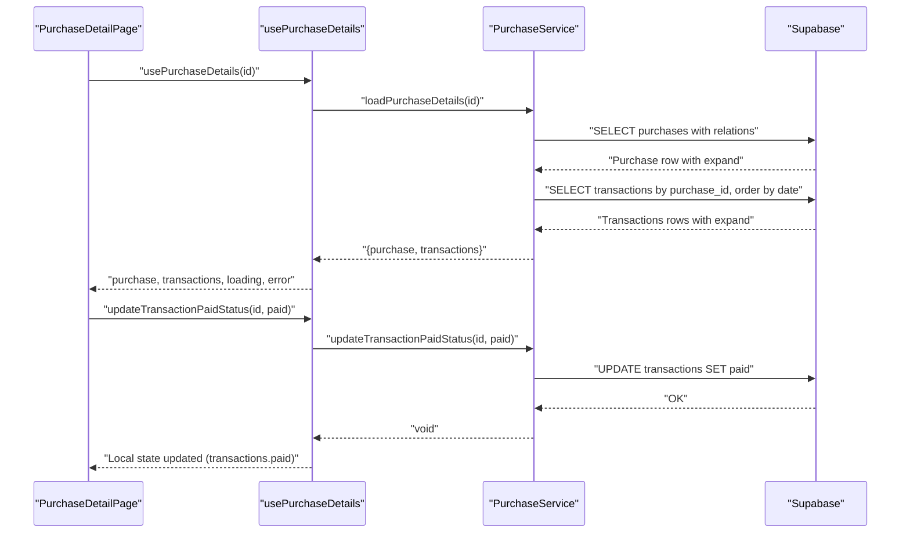
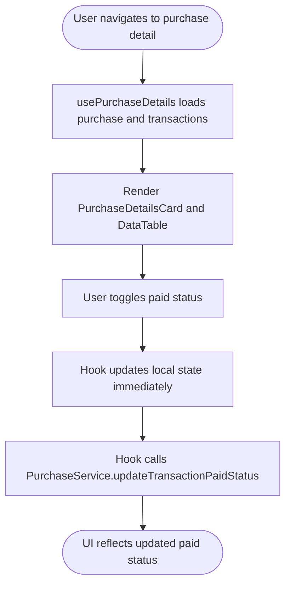
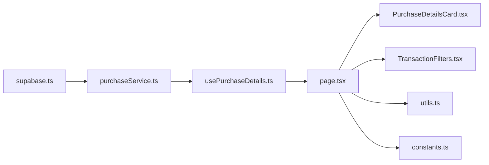
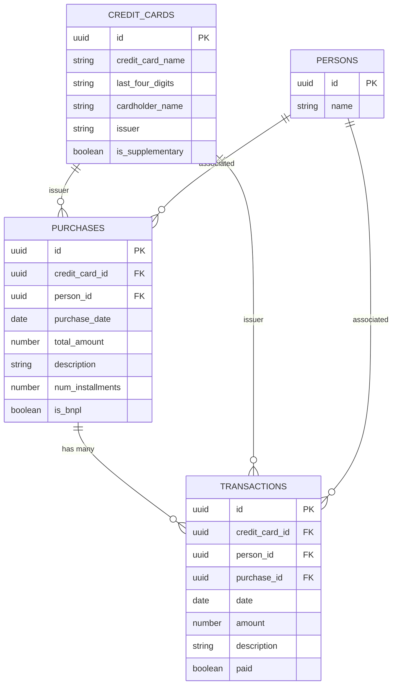

# Purchase Service

<cite>
**Referenced Files in This Document**
- [purchaseService.ts](file://src/lib/services/purchaseService.ts)
- [usePurchaseDetails.ts](file://src/lib/hooks/usePurchaseDetails.ts)
- [page.tsx](file://src/app/purchases/[id]/page.tsx)
- [PurchaseDetailsCard.tsx](file://src/components/purchases/PurchaseDetailsCard.tsx)
- [supabase.ts](file://src/lib/supabase.ts)
- [utils.ts](file://src/lib/utils.ts)
- [constants.ts](file://src/lib/constants.ts)
- [TransactionFilters.tsx](file://src/components/transactions/TransactionFilters.tsx)
- [dataService.ts](file://src/lib/services/dataService.ts)
</cite>

## Table of Contents
1. [Introduction](#introduction)
2. [Project Structure](#project-structure)
3. [Core Components](#core-components)
4. [Architecture Overview](#architecture-overview)
5. [Detailed Component Analysis](#detailed-component-analysis)
6. [Dependency Analysis](#dependency-analysis)
7. [Performance Considerations](#performance-considerations)
8. [Troubleshooting Guide](#troubleshooting-guide)
9. [Conclusion](#conclusion)
10. [Appendices](#appendices)

## Introduction
This document provides a comprehensive analysis of the PurchaseService class and its integration with the purchase detail page. It explains how purchase details are loaded with expanded relationships (credit card and person) and how associated transactions are fetched and presented. It also covers the transaction paid status update mechanism, UI integration patterns, state management, and common pitfalls such as race conditions and error propagation. Guidance is included for extending the service to support purchase editing and bulk transaction updates, along with performance considerations for large transaction histories.

## Project Structure
The purchase detail feature spans several layers:
- Service layer: PurchaseService encapsulates data operations for purchases and transactions.
- Hook layer: usePurchaseDetails orchestrates loading and local state updates for the purchase detail page.
- UI layer: The purchase detail page renders purchase metadata and a transaction table with live paid status toggles.
- Shared types: supabase.ts defines the Purchase, Transaction, and related entity interfaces used across the app.
- Utilities: utils.ts and constants.ts provide formatting and constants used by the UI.

**Diagram sources**
- [page.tsx](file://src/app/purchases/[id]/page.tsx#L1-L188)
- [usePurchaseDetails.ts](file://src/lib/hooks/usePurchaseDetails.ts#L1-L63)
- [purchaseService.ts](file://src/lib/services/purchaseService.ts#L1-L88)
- [supabase.ts](file://src/lib/supabase.ts#L1-L81)
- [utils.ts](file://src/lib/utils.ts#L1-L47)
- [constants.ts](file://src/lib/constants.ts#L110-L116)
- [PurchaseDetailsCard.tsx](file://src/components/purchases/PurchaseDetailsCard.tsx#L1-L78)
- [TransactionFilters.tsx](file://src/components/transactions/TransactionFilters.tsx#L1-L196)

**Section sources**
- [purchaseService.ts](file://src/lib/services/purchaseService.ts#L1-L88)
- [usePurchaseDetails.ts](file://src/lib/hooks/usePurchaseDetails.ts#L1-L63)
- [page.tsx](file://src/app/purchases/[id]/page.tsx#L1-L188)
- [supabase.ts](file://src/lib/supabase.ts#L1-L81)
- [utils.ts](file://src/lib/utils.ts#L1-L47)
- [constants.ts](file://src/lib/constants.ts#L110-L116)
- [PurchaseDetailsCard.tsx](file://src/components/purchases/PurchaseDetailsCard.tsx#L1-L78)
- [TransactionFilters.tsx](file://src/components/transactions/TransactionFilters.tsx#L1-L196)

## Core Components
- PurchaseService: Provides methods to load purchase details with expanded relationships and to update transaction paid status.
- usePurchaseDetails: React hook that loads purchase and transactions, manages loading/error states, and exposes a function to update transaction paid status locally.
- PurchaseDetailPage: Next.js page component that renders purchase details and a transaction table with filters and paid status toggles.
- Supabase types: Define Purchase, Transaction, and related entities with optional expand properties for UI-friendly relationship data.

Key responsibilities:
- loadPurchaseDetails: Fetches a single purchase with related credit card and person data, and all related transactions ordered by date ascending. Transforms raw rows into a normalized shape with an expand property for UI consumption.
- updateTransactionPaidStatus: Updates a transaction’s paid flag in the database and propagates the change to the UI state.

**Section sources**
- [purchaseService.ts](file://src/lib/services/purchaseService.ts#L1-L88)
- [usePurchaseDetails.ts](file://src/lib/hooks/usePurchaseDetails.ts#L1-L63)
- [page.tsx](file://src/app/purchases/[id]/page.tsx#L1-L188)
- [supabase.ts](file://src/lib/supabase.ts#L1-L81)

## Architecture Overview
The purchase detail flow integrates UI, hooks, and service layers:

**Diagram sources**
- [page.tsx](file://src/app/purchases/[id]/page.tsx#L1-L188)
- [usePurchaseDetails.ts](file://src/lib/hooks/usePurchaseDetails.ts#L1-L63)
- [purchaseService.ts](file://src/lib/services/purchaseService.ts#L1-L88)

## Detailed Component Analysis

### PurchaseService.loadPurchaseDetails
Purpose:
- Load a single purchase by ID with expanded relationships for credit card and person.
- Load all related transactions for the purchase, ordered by date ascending.
- Normalize data by adding an expand property for UI-friendly consumption.

Implementation highlights:
- Uses Supabase select with foreign table aliases to fetch related data in a single query.
- Transforms purchase and transactions into a normalized shape with expand properties.
- Orders transactions ascending by date to present chronological history.

Data transformation for UI:
- Purchase: Adds expand.credit_card and expand.person populated from the joined relations.
- Transactions: Adds expand.credit_card, expand.person, and expand.purchase for each transaction.

Error handling:
- Propagates errors from Supabase operations to the caller.

Return contract:
- Returns an object containing purchase (nullable) and transactions array.

**Section sources**
- [purchaseService.ts](file://src/lib/services/purchaseService.ts#L1-L88)
- [supabase.ts](file://src/lib/supabase.ts#L1-L81)

### PurchaseService.updateTransactionPaidStatus
Purpose:
- Update the paid flag of a transaction in the database.

Implementation highlights:
- Executes a single-row update against the transactions table.
- Throws on error to surface failures to the caller.

Integration with UI:
- The hook updates local state immediately after a successful update, enabling optimistic UI behavior.

Race condition considerations:
- The hook sets a per-item updatingId during the update to disable UI controls while the operation is in progress.
- If multiple rapid toggles occur, the last update wins; the UI reflects the latest server state upon completion.

**Section sources**
- [purchaseService.ts](file://src/lib/services/purchaseService.ts#L71-L88)
- [usePurchaseDetails.ts](file://src/lib/hooks/usePurchaseDetails.ts#L37-L61)
- [page.tsx](file://src/app/purchases/[id]/page.tsx#L54-L63)

### usePurchaseDetails
Responsibilities:
- Loads purchase and transactions via PurchaseService.
- Manages loading and error states.
- Exposes updateTransactionPaidStatus that performs optimistic updates.

Optimistic update strategy:
- On success, the hook updates the local transactions array by replacing the updated transaction with a copy that has the new paid value.
- This avoids a round trip and improves perceived responsiveness.

Error propagation:
- Errors from loading or updating are logged and surfaced to the UI.

**Section sources**
- [usePurchaseDetails.ts](file://src/lib/hooks/usePurchaseDetails.ts#L1-L63)

### PurchaseDetailPage
Responsibilities:
- Renders purchase metadata via PurchaseDetailsCard.
- Displays transactions in a table with paid status toggles.
- Applies client-side filters for description and paid status.
- Handles loading, error, and missing purchase states.

UI patterns:
- Uses useMemo to compute filtered transactions efficiently.
- Disables the checkbox for the transaction currently being updated.
- Uses formatDate and CURRENCY_DECIMAL_PLACES for consistent presentation.

**Section sources**
- [page.tsx](file://src/app/purchases/[id]/page.tsx#L1-L188)
- [PurchaseDetailsCard.tsx](file://src/components/purchases/PurchaseDetailsCard.tsx#L1-L78)
- [utils.ts](file://src/lib/utils.ts#L1-L47)
- [constants.ts](file://src/lib/constants.ts#L110-L116)
- [TransactionFilters.tsx](file://src/components/transactions/TransactionFilters.tsx#L1-L196)

### Relationship Expansion for UI Consumption
The service transforms raw rows into a normalized shape with an expand property to simplify UI rendering. For example:
- Purchase expand: credit_card and person are populated from joined relations.
- Transaction expand: credit_card, person, and purchase are populated for each transaction.

This pattern is used consistently across the app, as seen in the purchases list service.

**Section sources**
- [purchaseService.ts](file://src/lib/services/purchaseService.ts#L24-L60)
- [dataService.ts](file://src/lib/services/dataService.ts#L39-L65)
- [supabase.ts](file://src/lib/supabase.ts#L41-L80)

### Integration with Purchase Detail Page
- Data loading: usePurchaseDetails calls PurchaseService.loadPurchaseDetails and sets state.
- State management: loading, error, purchase, and transactions are managed in the hook.
- Paid status updates: The page passes updateTransactionPaidStatus to the hook; the hook optimistically updates state and surfaces errors.

**Diagram sources**
- [page.tsx](file://src/app/purchases/[id]/page.tsx#L1-L188)
- [usePurchaseDetails.ts](file://src/lib/hooks/usePurchaseDetails.ts#L1-L63)
- [purchaseService.ts](file://src/lib/services/purchaseService.ts#L71-L88)

## Dependency Analysis
- PurchaseService depends on Supabase client and shared types (Purchase, Transaction).
- usePurchaseDetails depends on PurchaseService and React state.
- PurchaseDetailPage depends on usePurchaseDetails, DataTable, PurchaseDetailsCard, TransactionFilters, utils, and constants.
- Supabase types define the data contracts used across the UI.

**Diagram sources**
- [supabase.ts](file://src/lib/supabase.ts#L1-L81)
- [purchaseService.ts](file://src/lib/services/purchaseService.ts#L1-L88)
- [usePurchaseDetails.ts](file://src/lib/hooks/usePurchaseDetails.ts#L1-L63)
- [page.tsx](file://src/app/purchases/[id]/page.tsx#L1-L188)
- [PurchaseDetailsCard.tsx](file://src/components/purchases/PurchaseDetailsCard.tsx#L1-L78)
- [TransactionFilters.tsx](file://src/components/transactions/TransactionFilters.tsx#L1-L196)
- [utils.ts](file://src/lib/utils.ts#L1-L47)
- [constants.ts](file://src/lib/constants.ts#L110-L116)

**Section sources**
- [purchaseService.ts](file://src/lib/services/purchaseService.ts#L1-L88)
- [usePurchaseDetails.ts](file://src/lib/hooks/usePurchaseDetails.ts#L1-L63)
- [page.tsx](file://src/app/purchases/[id]/page.tsx#L1-L188)
- [supabase.ts](file://src/lib/supabase.ts#L1-L81)

## Performance Considerations
- Transaction ordering: Transactions are fetched ordered by date ascending, which is efficient for display and pagination.
- Client-side filtering: Filtering is performed in memory on the client. For very large histories, consider:
  - Server-side filtering: Extend the service to accept filter parameters and push filters to Supabase.
  - Pagination: Add limit/offset or cursor-based pagination to reduce payload sizes.
  - Virtualization: Use a virtualized table component to render only visible rows.
- Optimistic updates: Local state updates avoid extra network requests and improve responsiveness.
- Relationship expansion: The expand property simplifies rendering but increases payload size. Consider lazy-loading or on-demand expansion for large datasets.

[No sources needed since this section provides general guidance]

## Troubleshooting Guide
Common issues and resolutions:
- Missing purchase:
  - The page checks for a null purchase and displays a friendly message with a link back to the purchases list.
- Error propagation:
  - Loading errors are captured and displayed on the page.
  - Update errors are logged and re-thrown; the page catches and logs them.
- Race conditions:
  - The hook disables the checkbox for the transaction being updated via updatingId to prevent concurrent toggles.
  - If multiple rapid toggles occur, the last update takes effect; the UI reflects the latest server state.
- Handling missing purchases:
  - The page explicitly checks for purchase existence and renders a fallback message.

**Section sources**
- [page.tsx](file://src/app/purchases/[id]/page.tsx#L65-L91)
- [usePurchaseDetails.ts](file://src/lib/hooks/usePurchaseDetails.ts#L12-L31)
- [page.tsx](file://src/app/purchases/[id]/page.tsx#L54-L63)

## Conclusion
The PurchaseService provides a clean abstraction for loading purchase details with expanded relationships and updating transaction paid status. Together with usePurchaseDetails and the purchase detail page, it delivers a responsive UI with optimistic updates and robust error handling. Extending the service to support purchase editing or bulk transaction updates is straightforward, and performance can be improved with server-side filtering, pagination, and virtualization.

[No sources needed since this section summarizes without analyzing specific files]

## Appendices

### Extending the Service
- Purchase editing:
  - Add methods to update purchase fields and related transactions.
  - Consider returning updated entities to keep the UI in sync.
- Bulk transaction updates:
  - Add a method to batch update transaction paid status.
  - Implement server-side batching to minimize round trips.
  - Provide a progress indicator and error reporting for partial failures.

[No sources needed since this section provides general guidance]

### Data Model Overview
The following diagram shows the relationships used by the service and UI.

**Diagram sources**
- [supabase.ts](file://src/lib/supabase.ts#L1-L81)