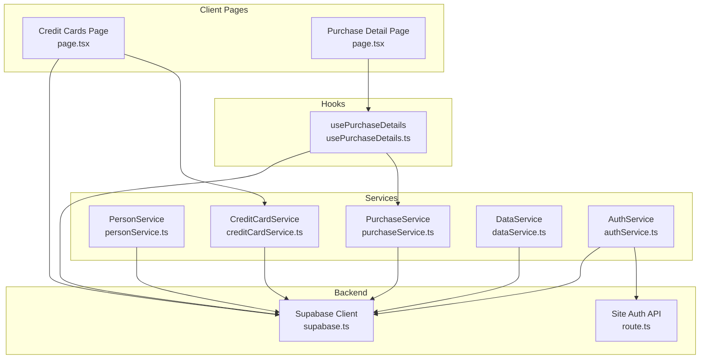
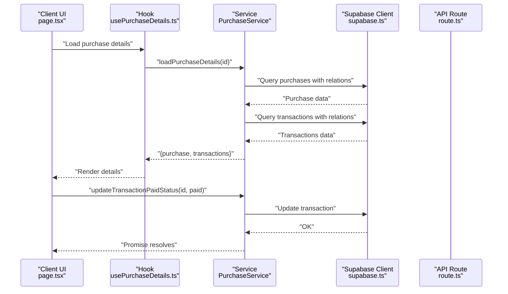
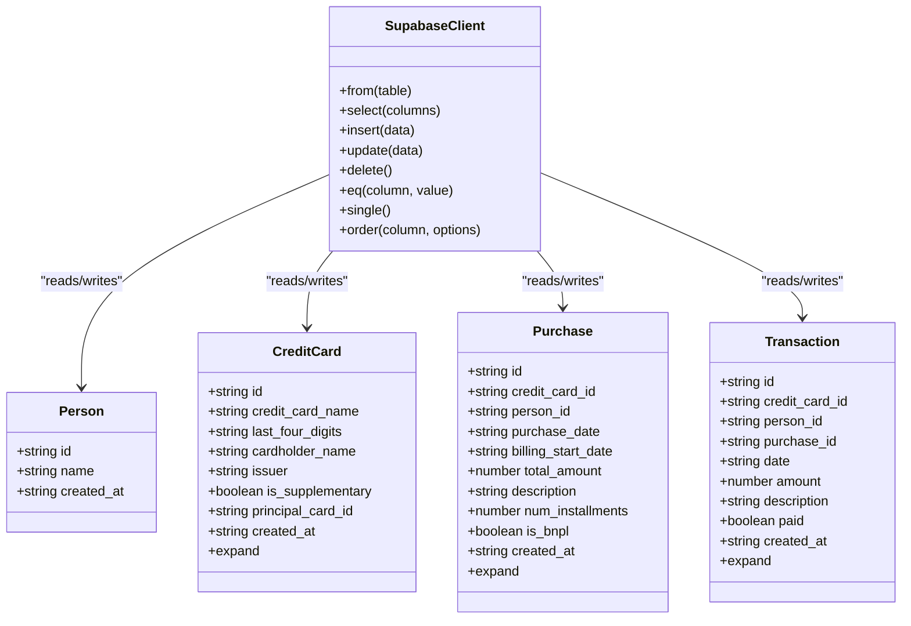
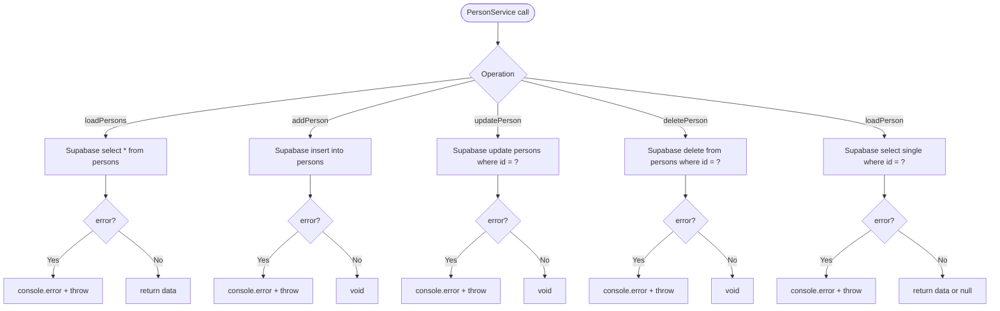
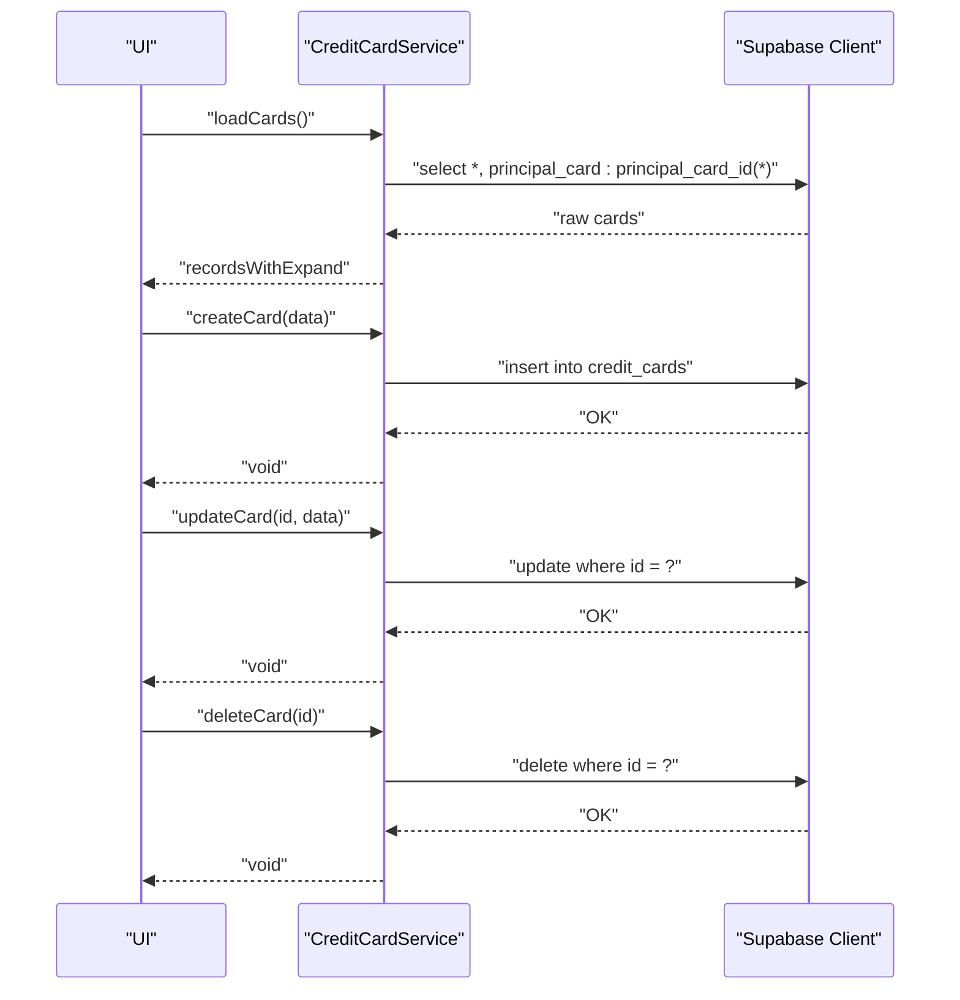
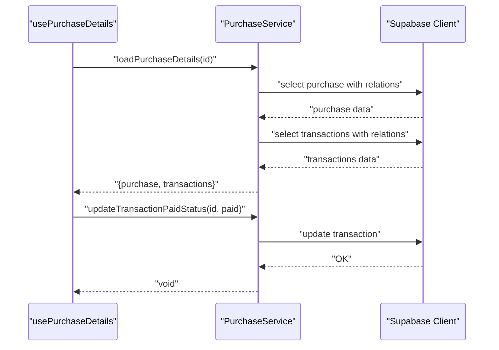
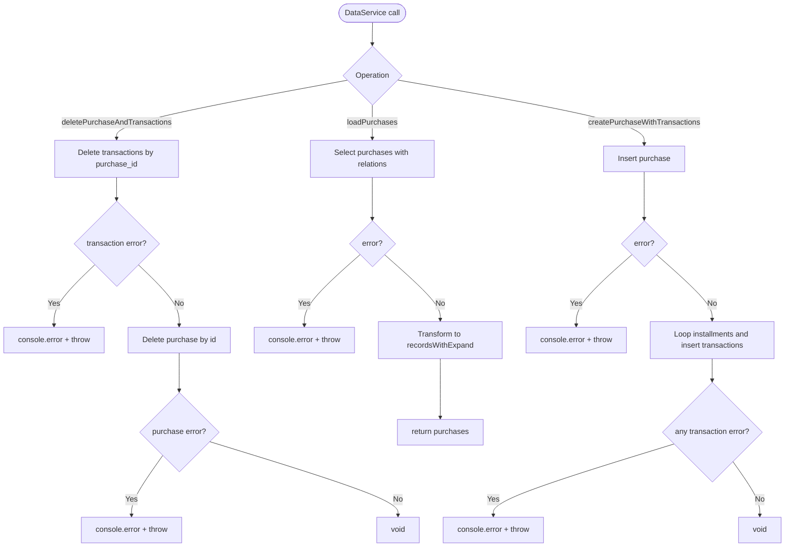
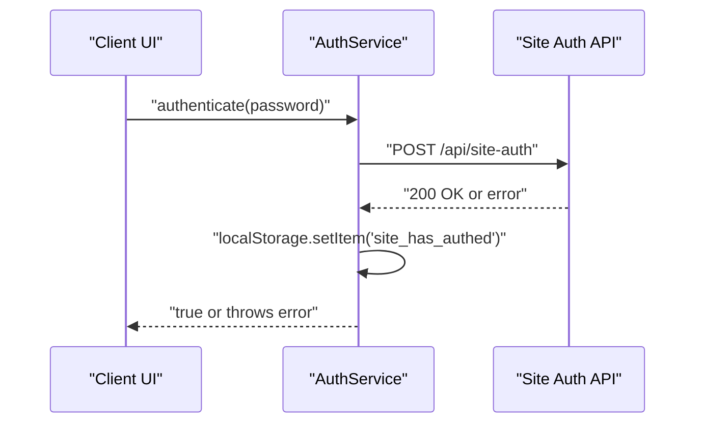
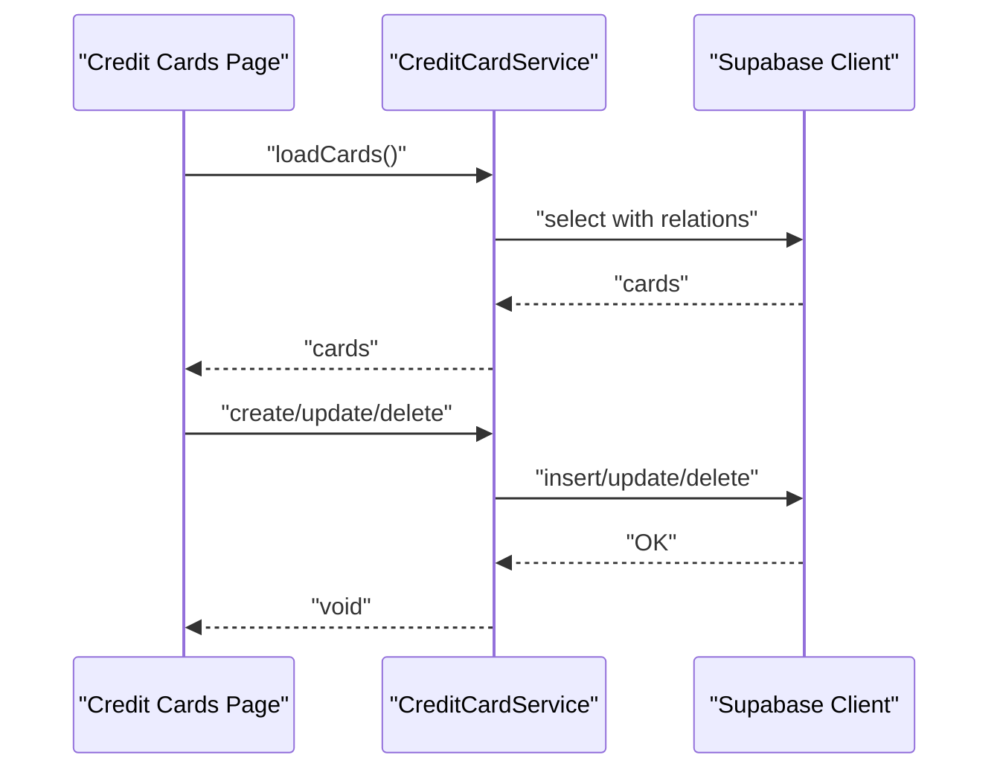
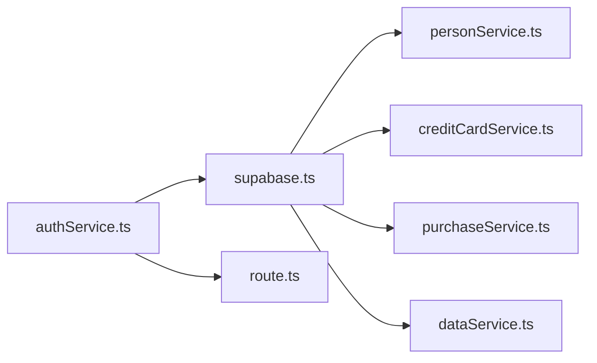

# Service Layer Architecture

<cite>
**Referenced Files in This Document**
- [supabase.ts](file://src/lib/supabase.ts)
- [personService.ts](file://src/lib/services/personService.ts)
- [creditCardService.ts](file://src/lib/services/creditCardService.ts)
- [purchaseService.ts](file://src/lib/services/purchaseService.ts)
- [dataService.ts](file://src/lib/services/dataService.ts)
- [authService.ts](file://src/lib/services/authService.ts)
- [route.ts](file://src/app/api/site-auth/route.ts)
- [page.tsx (Credit Cards)](file://src/app/credit-cards/page.tsx)
- [page.tsx (Purchase Detail)](file://src/app/purchases/[id]/page.tsx)
- [usePurchaseDetails.ts](file://src/lib/hooks/usePurchaseDetails.ts)
</cite>

## Table of Contents
1. [Introduction](#introduction)
2. [Project Structure](#project-structure)
3. [Core Components](#core-components)
4. [Architecture Overview](#architecture-overview)
5. [Detailed Component Analysis](#detailed-component-analysis)
6. [Dependency Analysis](#dependency-analysis)
7. [Performance Considerations](#performance-considerations)
8. [Troubleshooting Guide](#troubleshooting-guide)
9. [Conclusion](#conclusion)
10. [Appendices](#appendices)

## Introduction
This document describes the service layer architecture used in the credit-card-tracker application. The service pattern centralizes data access logic behind typed service classes that encapsulate CRUD operations against the Supabase backend. Services are organized by domain (PersonService, CreditCardService, PurchaseService, DataService) and share a common dependency on a centralized Supabase client instance and shared type definitions. Client-side services (e.g., AuthService) leverage browser APIs and Next.js API routes for authentication flows, while server-side data operations remain in dedicated services.

## Project Structure
The service layer resides under src/lib/services and integrates with:
- Shared Supabase client and type definitions in src/lib/supabase.ts
- Client pages and hooks that orchestrate UI state and call services
- Next.js API routes for server-side authentication

**Diagram sources**
- [page.tsx (Credit Cards)](file://src/app/credit-cards/page.tsx#L1-L195)
- [page.tsx (Purchase Detail)](file://src/app/purchases/[id]/page.tsx#L1-L188)
- [usePurchaseDetails.ts](file://src/lib/hooks/usePurchaseDetails.ts#L1-L63)
- [personService.ts](file://src/lib/services/personService.ts#L1-L76)
- [creditCardService.ts](file://src/lib/services/creditCardService.ts#L1-L69)
- [purchaseService.ts](file://src/lib/services/purchaseService.ts#L1-L88)
- [dataService.ts](file://src/lib/services/dataService.ts#L1-L165)
- [authService.ts](file://src/lib/services/authService.ts#L1-L47)
- [route.ts](file://src/app/api/site-auth/route.ts#L1-L65)
- [supabase.ts](file://src/lib/supabase.ts#L1-L81)

**Section sources**
- [supabase.ts](file://src/lib/supabase.ts#L1-L81)
- [personService.ts](file://src/lib/services/personService.ts#L1-L76)
- [creditCardService.ts](file://src/lib/services/creditCardService.ts#L1-L69)
- [purchaseService.ts](file://src/lib/services/purchaseService.ts#L1-L88)
- [dataService.ts](file://src/lib/services/dataService.ts#L1-L165)
- [authService.ts](file://src/lib/services/authService.ts#L1-L47)
- [route.ts](file://src/app/api/site-auth/route.ts#L1-L65)
- [page.tsx (Credit Cards)](file://src/app/credit-cards/page.tsx#L1-L195)
- [page.tsx (Purchase Detail)](file://src/app/purchases/[id]/page.tsx#L1-L188)
- [usePurchaseDetails.ts](file://src/lib/hooks/usePurchaseDetails.ts#L1-L63)

## Core Components
- Centralized Supabase client and types: Provides a single source of truth for database connectivity and strongly-typed models used across services.
- Domain services:
  - PersonService: CRUD for persons
  - CreditCardService: CRUD for credit cards with relational expansion
  - PurchaseService: Complex reads combining purchase and transaction data, plus transaction paid-status updates
  - DataService: Orchestration of multi-table writes (e.g., purchase creation with generated installments)
- Client-side service:
  - AuthService: Browser-based authentication using a Next.js API route and local storage

Each service exposes static async methods returning promises, with consistent error handling and logging.

**Section sources**
- [supabase.ts](file://src/lib/supabase.ts#L1-L81)
- [personService.ts](file://src/lib/services/personService.ts#L1-L76)
- [creditCardService.ts](file://src/lib/services/creditCardService.ts#L1-L69)
- [purchaseService.ts](file://src/lib/services/purchaseService.ts#L1-L88)
- [dataService.ts](file://src/lib/services/dataService.ts#L1-L165)
- [authService.ts](file://src/lib/services/authService.ts#L1-L47)

## Architecture Overview
The service layer follows a clean separation:
- Client pages and hooks call service methods to perform data operations
- Services encapsulate Supabase queries and transformations
- Authentication uses a client-side service that communicates with a server-side API route
- Type safety is enforced via shared interfaces and types from supabase.ts

**Diagram sources**
- [page.tsx (Purchase Detail)](file://src/app/purchases/[id]/page.tsx#L1-L188)
- [usePurchaseDetails.ts](file://src/lib/hooks/usePurchaseDetails.ts#L1-L63)
- [purchaseService.ts](file://src/lib/services/purchaseService.ts#L1-L88)
- [supabase.ts](file://src/lib/supabase.ts#L1-L81)
- [route.ts](file://src/app/api/site-auth/route.ts#L1-L65)

## Detailed Component Analysis

### Supabase Client and Types
- Initializes the Supabase client using environment variables
- Defines shared interfaces and types for Person, CreditCard, Purchase, and Transaction, including an expand property for relational data

**Diagram sources**
- [supabase.ts](file://src/lib/supabase.ts#L1-L81)

**Section sources**
- [supabase.ts](file://src/lib/supabase.ts#L1-L81)

### PersonService
- Encapsulates CRUD operations for persons
- Uses the centralized Supabase client
- Returns promises and logs errors before rethrowing

**Diagram sources**
- [personService.ts](file://src/lib/services/personService.ts#L1-L76)

**Section sources**
- [personService.ts](file://src/lib/services/personService.ts#L1-L76)

### CreditCardService
- Loads cards with relational expansion for principal card
- Supports create, update, and delete operations
- Transforms raw Supabase results to include an expand property for UI consumption

**Diagram sources**
- [creditCardService.ts](file://src/lib/services/creditCardService.ts#L1-L69)
- [supabase.ts](file://src/lib/supabase.ts#L1-L81)

**Section sources**
- [creditCardService.ts](file://src/lib/services/creditCardService.ts#L1-L69)

### PurchaseService
- Complex read combining purchase and transaction data with relational expansions
- Updates transaction paid status
- Returns structured results for UI consumption

**Diagram sources**
- [usePurchaseDetails.ts](file://src/lib/hooks/usePurchaseDetails.ts#L1-L63)
- [purchaseService.ts](file://src/lib/services/purchaseService.ts#L1-L88)
- [supabase.ts](file://src/lib/supabase.ts#L1-L81)

**Section sources**
- [purchaseService.ts](file://src/lib/services/purchaseService.ts#L1-L88)
- [usePurchaseDetails.ts](file://src/lib/hooks/usePurchaseDetails.ts#L1-L63)

### DataService
- Orchestrates multi-table writes for purchases and transactions
- Handles cascading deletes for purchases and associated transactions
- Transforms relational data for UI consumption

**Diagram sources**
- [dataService.ts](file://src/lib/services/dataService.ts#L1-L165)
- [supabase.ts](file://src/lib/supabase.ts#L1-L81)

**Section sources**
- [dataService.ts](file://src/lib/services/dataService.ts#L1-L165)

### AuthService (Client-Side)
- Implements browser-based authentication using fetch to a Next.js API route
- Stores a simple flag in local storage upon success
- Throws meaningful errors on failure

**Diagram sources**
- [authService.ts](file://src/lib/services/authService.ts#L1-L47)
- [route.ts](file://src/app/api/site-auth/route.ts#L1-L65)

**Section sources**
- [authService.ts](file://src/lib/services/authService.ts#L1-L47)
- [route.ts](file://src/app/api/site-auth/route.ts#L1-L65)

### Client-Side Usage Patterns
- Credit Cards page demonstrates CRUD flows using CreditCardService, with error handling and retry logic
- Purchase Detail page uses a custom hook that calls PurchaseService for complex reads and updates transaction paid status

**Diagram sources**
- [page.tsx (Credit Cards)](file://src/app/credit-cards/page.tsx#L1-L195)
- [creditCardService.ts](file://src/lib/services/creditCardService.ts#L1-L69)
- [supabase.ts](file://src/lib/supabase.ts#L1-L81)

**Section sources**
- [page.tsx (Credit Cards)](file://src/app/credit-cards/page.tsx#L1-L195)
- [page.tsx (Purchase Detail)](file://src/app/purchases/[id]/page.tsx#L1-L188)
- [usePurchaseDetails.ts](file://src/lib/hooks/usePurchaseDetails.ts#L1-L63)

## Dependency Analysis
- Coupling: Services depend on the centralized Supabase client and shared types
- Cohesion: Each service encapsulates a single domain concern
- External integrations:
  - Client-side services depend on browser APIs and Next.js API routes
  - Server-side authentication is handled by a dedicated API route

**Diagram sources**
- [supabase.ts](file://src/lib/supabase.ts#L1-L81)
- [personService.ts](file://src/lib/services/personService.ts#L1-L76)
- [creditCardService.ts](file://src/lib/services/creditCardService.ts#L1-L69)
- [purchaseService.ts](file://src/lib/services/purchaseService.ts#L1-L88)
- [dataService.ts](file://src/lib/services/dataService.ts#L1-L165)
- [authService.ts](file://src/lib/services/authService.ts#L1-L47)
- [route.ts](file://src/app/api/site-auth/route.ts#L1-L65)

**Section sources**
- [supabase.ts](file://src/lib/supabase.ts#L1-L81)
- [personService.ts](file://src/lib/services/personService.ts#L1-L76)
- [creditCardService.ts](file://src/lib/services/creditCardService.ts#L1-L69)
- [purchaseService.ts](file://src/lib/services/purchaseService.ts#L1-L88)
- [dataService.ts](file://src/lib/services/dataService.ts#L1-L165)
- [authService.ts](file://src/lib/services/authService.ts#L1-L47)
- [route.ts](file://src/app/api/site-auth/route.ts#L1-L65)

## Performance Considerations
- Prefer relational selects with joins/expansions to minimize round trips
- Batch operations where appropriate (e.g., creating installments in a loop)
- Cache frequently accessed lists in UI state to reduce redundant service calls
- Use pagination for large datasets when extending the service layer

## Troubleshooting Guide
Common issues and resolutions:
- Authentication failures: Verify environment variables and API route configuration; check console logs from the client-side service
- Supabase errors: Inspect thrown errors and console logs in services; ensure database permissions and row-level policies are configured
- Data transformation mismatches: Confirm that expand properties align with UI expectations; verify column names and relations in service queries

**Section sources**
- [authService.ts](file://src/lib/services/authService.ts#L1-L47)
- [route.ts](file://src/app/api/site-auth/route.ts#L1-L65)
- [personService.ts](file://src/lib/services/personService.ts#L1-L76)
- [creditCardService.ts](file://src/lib/services/creditCardService.ts#L1-L69)
- [purchaseService.ts](file://src/lib/services/purchaseService.ts#L1-L88)
- [dataService.ts](file://src/lib/services/dataService.ts#L1-L165)

## Conclusion
The service layer cleanly separates data access concerns from UI logic, enabling consistent CRUD operations, robust error handling, and strong typing across the application. Client-side services integrate with Next.js API routes for authentication, while domain services encapsulate Supabase interactions. Following the established patterns ensures maintainability and scalability as new services are introduced.

## Appendices
- New service structure guidelines:
  - Place service files under src/lib/services
  - Import the centralized Supabase client and shared types
  - Expose static async methods returning promises
  - Wrap operations in try/catch blocks, log errors, and rethrow
  - Transform data to include expand properties when needed for UI
  - For client-side services, annotate with "use client" and rely on browser APIs or API routes