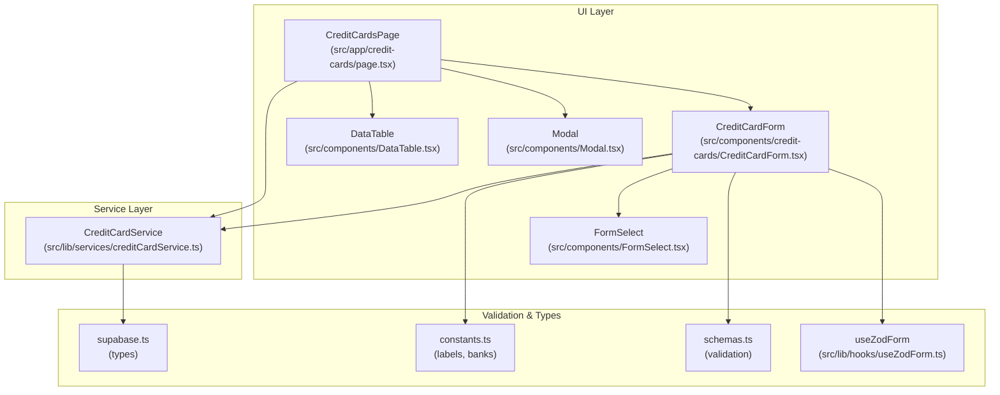
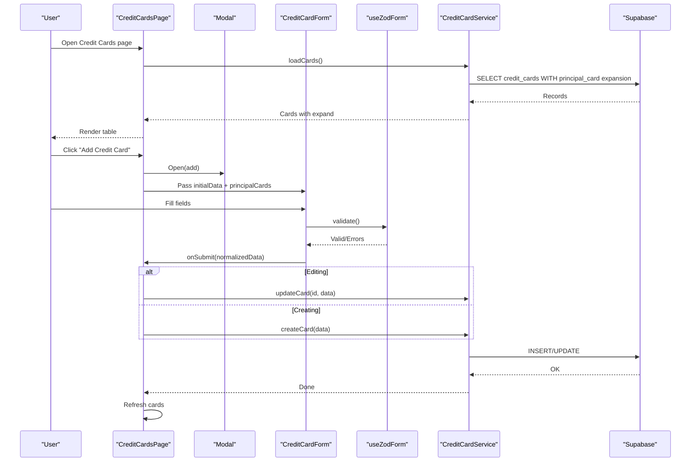
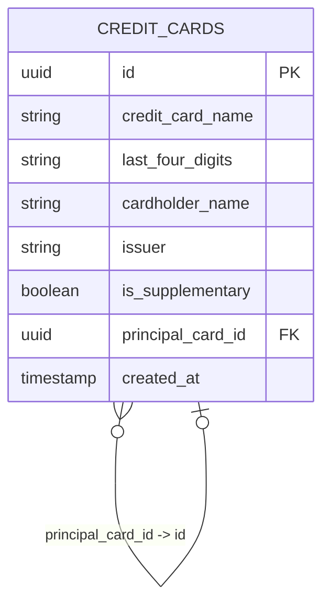
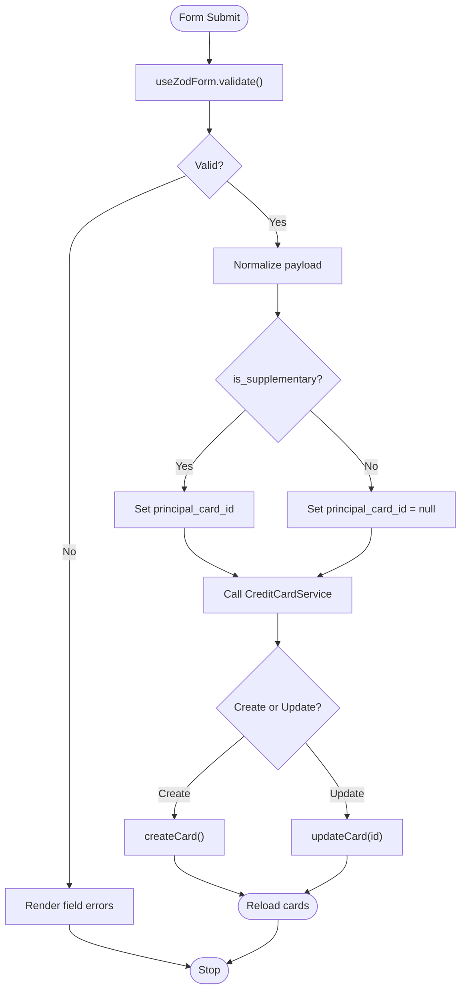
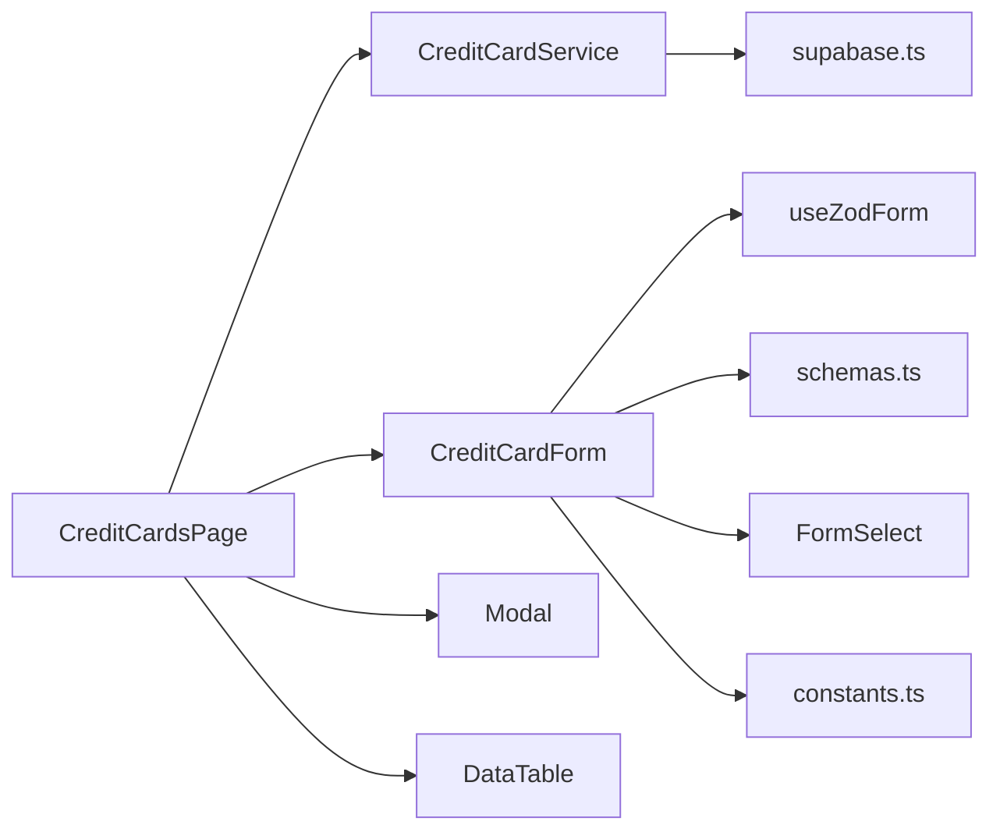

# Credit Card Management

<cite>
**Referenced Files in This Document**
- [page.tsx](file://src/app/credit-cards/page.tsx)
- [CreditCardForm.tsx](file://src/components/credit-cards/CreditCardForm.tsx)
- [creditCardService.ts](file://src/lib/services/creditCardService.ts)
- [schemas.ts](file://src/lib/schemas.ts)
- [supabase.ts](file://src/lib/supabase.ts)
- [useZodForm.ts](file://src/lib/hooks/useZodForm.ts)
- [constants.ts](file://src/lib/constants.ts)
- [DataTable.tsx](file://src/components/DataTable.tsx)
- [FormSelect.tsx](file://src/components/FormSelect.tsx)
- [Modal.tsx](file://src/components/Modal.tsx)
</cite>

## Table of Contents
1. [Introduction](#introduction)
2. [Project Structure](#project-structure)
3. [Core Components](#core-components)
4. [Architecture Overview](#architecture-overview)
5. [Detailed Component Analysis](#detailed-component-analysis)
6. [Dependency Analysis](#dependency-analysis)
7. [Performance Considerations](#performance-considerations)
8. [Troubleshooting Guide](#troubleshooting-guide)
9. [Conclusion](#conclusion)
10. [Appendices](#appendices)

## Introduction
This document explains the Credit Card Management feature, focusing on how principal and supplementary cards are modeled, validated, created, edited, and displayed. It covers the invocation chain from the credit-cards page to the CreditCardForm component and the creditCardService, and documents the domain model and database schema. It also provides configuration options for card creation/editing, validation rules, and practical guidance for handling common issues such as duplicate card entries.

## Project Structure
The Credit Card Management feature spans a small set of cohesive modules:
- Page controller that orchestrates data loading, state, and UI actions
- Form component that validates and submits data
- Service layer that interacts with the Supabase database
- Shared schemas and types for validation and typing
- UI primitives for forms, selects, modals, and data tables

**Diagram sources**
- [page.tsx](file://src/app/credit-cards/page.tsx#L1-L195)
- [CreditCardForm.tsx](file://src/components/credit-cards/CreditCardForm.tsx#L1-L180)
- [Modal.tsx](file://src/components/Modal.tsx#L1-L62)
- [DataTable.tsx](file://src/components/DataTable.tsx#L1-L86)
- [FormSelect.tsx](file://src/components/FormSelect.tsx#L1-L77)
- [useZodForm.ts](file://src/lib/hooks/useZodForm.ts#L1-L83)
- [schemas.ts](file://src/lib/schemas.ts#L1-L62)
- [supabase.ts](file://src/lib/supabase.ts#L1-L81)
- [constants.ts](file://src/lib/constants.ts#L1-L116)
- [creditCardService.ts](file://src/lib/services/creditCardService.ts#L1-L69)

**Section sources**
- [page.tsx](file://src/app/credit-cards/page.tsx#L1-L195)
- [CreditCardForm.tsx](file://src/components/credit-cards/CreditCardForm.tsx#L1-L180)
- [creditCardService.ts](file://src/lib/services/creditCardService.ts#L1-L69)
- [schemas.ts](file://src/lib/schemas.ts#L1-L62)
- [supabase.ts](file://src/lib/supabase.ts#L1-L81)
- [useZodForm.ts](file://src/lib/hooks/useZodForm.ts#L1-L83)
- [constants.ts](file://src/lib/constants.ts#L1-L116)
- [DataTable.tsx](file://src/components/DataTable.tsx#L1-L86)
- [FormSelect.tsx](file://src/components/FormSelect.tsx#L1-L77)
- [Modal.tsx](file://src/components/Modal.tsx#L1-L62)

## Core Components
- CreditCardsPage: Loads cards, manages state, renders the table, and handles add/edit/delete actions. It passes principal cards to the form and filters them for the dropdown.
- CreditCardForm: Renders the form, applies validation, and submits normalized data to the parent handler.
- CreditCardService: Encapsulates CRUD operations against the Supabase table.
- Validation and Types: Zod schemas define required fields, lengths, and conditional logic; typed interfaces describe the domain model.
- UI Primitives: Modal, DataTable, FormSelect support the form and table rendering.

**Section sources**
- [page.tsx](file://src/app/credit-cards/page.tsx#L1-L195)
- [CreditCardForm.tsx](file://src/components/credit-cards/CreditCardForm.tsx#L1-L180)
- [creditCardService.ts](file://src/lib/services/creditCardService.ts#L1-L69)
- [schemas.ts](file://src/lib/schemas.ts#L1-L62)
- [supabase.ts](file://src/lib/supabase.ts#L1-L81)
- [useZodForm.ts](file://src/lib/hooks/useZodForm.ts#L1-L83)
- [constants.ts](file://src/lib/constants.ts#L1-L116)
- [DataTable.tsx](file://src/components/DataTable.tsx#L1-L86)
- [FormSelect.tsx](file://src/components/FormSelect.tsx#L1-L77)
- [Modal.tsx](file://src/components/Modal.tsx#L1-L62)

## Architecture Overview
The feature follows a clean separation of concerns:
- UI state and orchestration live in the page component
- Form validation and normalization are handled in the form component
- Data persistence is delegated to the service layer
- Types and validation schemas are shared across components

**Diagram sources**
- [page.tsx](file://src/app/credit-cards/page.tsx#L1-L195)
- [CreditCardForm.tsx](file://src/components/credit-cards/CreditCardForm.tsx#L1-L180)
- [useZodForm.ts](file://src/lib/hooks/useZodForm.ts#L1-L83)
- [creditCardService.ts](file://src/lib/services/creditCardService.ts#L1-L69)

## Detailed Component Analysis

### CreditCardsPage (Credit Cards List and Actions)
Responsibilities:
- Loads cards via CreditCardService and exposes them to the table
- Filters principal cards for the supplementary card dropdown
- Manages add/edit modal state and form submission
- Handles deletion with confirmation
- Displays loading and error states

Key behaviors:
- Uses CreditCardService.loadCards to fetch records with an expanded principal card relationship
- Builds principalCards list by filtering out supplementary cards
- Normalizes form data before calling create/update
- Reloads data after successful operations

Common data relationships:
- Principal vs Supplementary: is_supplementary toggles whether principal_card_id is required
- Expandable principal_card for display in the table

**Section sources**
- [page.tsx](file://src/app/credit-cards/page.tsx#L1-L195)
- [creditCardService.ts](file://src/lib/services/creditCardService.ts#L1-L69)
- [supabase.ts](file://src/lib/supabase.ts#L1-L81)

### CreditCardForm (Form Validation and Submission)
Responsibilities:
- Renders fields for card name, last four digits, cardholder name, issuer, supplementary toggle, and principal card selection
- Applies Zod validation using refinedCreditCardSchema
- Normalizes submission payload:
  - If supplementary, sets principal_card_id; otherwise sets it to null
- Integrates with FormSelect for issuer and principal card dropdowns
- Uses constants for labels and Philippine banks

Validation highlights:
- Required fields enforced
- Last four digits must be length 4 and numeric
- Conditional requirement: principal_card_id is required when is_supplementary is true

**Section sources**
- [CreditCardForm.tsx](file://src/components/credit-cards/CreditCardForm.tsx#L1-L180)
- [schemas.ts](file://src/lib/schemas.ts#L1-L62)
- [useZodForm.ts](file://src/lib/hooks/useZodForm.ts#L1-L83)
- [constants.ts](file://src/lib/constants.ts#L1-L116)
- [FormSelect.tsx](file://src/components/FormSelect.tsx#L1-L77)

### CreditCardService (CRUD Operations)
Responsibilities:
- loadCards: Fetches all cards and expands principal_card relationship
- createCard: Inserts a new card
- updateCard: Updates an existing card by id
- deleteCard: Deletes a card by id

Error handling:
- Logs errors and throws user-friendly messages
- Caller should surface errors to the user

**Section sources**
- [creditCardService.ts](file://src/lib/services/creditCardService.ts#L1-L69)
- [supabase.ts](file://src/lib/supabase.ts#L1-L81)

### Domain Model and Database Schema
Domain model:
- CreditCard: Core entity with id, name, last_four_digits, cardholder_name, issuer, is_supplementary, optional principal_card_id, timestamps, and optional expand/principal_card
- CreditCardInsert: Shape for inserts/updates, with principal_card_id nullable

Relationships:
- Principal card: Root card without a principal_card_id
- Supplementary card: Linked to a principal card via principal_card_id

Database schema (as inferred from types):
- Table: credit_cards
- Columns: id, credit_card_name, last_four_digits, cardholder_name, issuer, is_supplementary, principal_card_id, created_at
- Relationship: Self-referencing via principal_card_id -> credit_cards.id

**Diagram sources**
- [supabase.ts](file://src/lib/supabase.ts#L16-L40)

**Section sources**
- [supabase.ts](file://src/lib/supabase.ts#L1-L81)

### Validation Flow (Form to Service)

**Diagram sources**
- [CreditCardForm.tsx](file://src/components/credit-cards/CreditCardForm.tsx#L1-L180)
- [useZodForm.ts](file://src/lib/hooks/useZodForm.ts#L1-L83)
- [creditCardService.ts](file://src/lib/services/creditCardService.ts#L1-L69)

## Dependency Analysis
- CreditCardsPage depends on:
  - CreditCardService for data operations
  - DataTable for rendering
  - Modal for add/edit
  - CreditCardForm for user input
- CreditCardForm depends on:
  - useZodForm for validation
  - schemas for validation rules
  - constants for labels and issuer options
  - FormSelect for dropdowns
- CreditCardService depends on:
  - supabase client and types
- UI components depend on:
  - shared constants and types

**Diagram sources**
- [page.tsx](file://src/app/credit-cards/page.tsx#L1-L195)
- [CreditCardForm.tsx](file://src/components/credit-cards/CreditCardForm.tsx#L1-L180)
- [useZodForm.ts](file://src/lib/hooks/useZodForm.ts#L1-L83)
- [schemas.ts](file://src/lib/schemas.ts#L1-L62)
- [constants.ts](file://src/lib/constants.ts#L1-L116)
- [DataTable.tsx](file://src/components/DataTable.tsx#L1-L86)
- [FormSelect.tsx](file://src/components/FormSelect.tsx#L1-L77)
- [Modal.tsx](file://src/components/Modal.tsx#L1-L62)
- [creditCardService.ts](file://src/lib/services/creditCardService.ts#L1-L69)
- [supabase.ts](file://src/lib/supabase.ts#L1-L81)

**Section sources**
- [page.tsx](file://src/app/credit-cards/page.tsx#L1-L195)
- [CreditCardForm.tsx](file://src/components/credit-cards/CreditCardForm.tsx#L1-L180)
- [creditCardService.ts](file://src/lib/services/creditCardService.ts#L1-L69)
- [schemas.ts](file://src/lib/schemas.ts#L1-L62)
- [supabase.ts](file://src/lib/supabase.ts#L1-L81)
- [useZodForm.ts](file://src/lib/hooks/useZodForm.ts#L1-L83)
- [constants.ts](file://src/lib/constants.ts#L1-L116)
- [DataTable.tsx](file://src/components/DataTable.tsx#L1-L86)
- [FormSelect.tsx](file://src/components/FormSelect.tsx#L1-L77)
- [Modal.tsx](file://src/components/Modal.tsx#L1-L62)

## Performance Considerations
- Minimize re-renders: The page uses local state for cards and filtered principal cards; ensure updates are batched and only re-render when necessary.
- Efficient filtering: Filtering principal cards is O(n); keep the list small or memoize where appropriate.
- Network calls: Debounce reloads after edits; currently, the page reloads after any save or delete, which is simple and reliable.
- Rendering lists: DataTable is generic and efficient; ensure keyField is stable.

[No sources needed since this section provides general guidance]

## Troubleshooting Guide

Common issues and resolutions:
- Duplicate card entries
  - Symptom: Multiple cards with identical last_four_digits under the same issuer and cardholder name.
  - Cause: No uniqueness constraint in the UI or service.
  - Resolution: Add a unique constraint on (issuer, last_four_digits, cardholder_name) in the database. Alternatively, enforce uniqueness in the UI by checking existing cards before insert. Consider adding a toast or modal warning when duplicates are detected.
  - Reference: The service does not prevent duplicates; validation focuses on required fields and conditional logic.
  - Section sources
    - [creditCardService.ts](file://src/lib/services/creditCardService.ts#L1-L69)
    - [schemas.ts](file://src/lib/schemas.ts#L1-L62)

- Supplementary card without principal selected
  - Symptom: Validation error for principal card.
  - Cause: is_supplementary is true but principal_card_id is missing.
  - Resolution: Enable the supplementary checkbox only when principal cards exist; ensure the select is required when supplementary is checked.
  - Section sources
    - [CreditCardForm.tsx](file://src/components/credit-cards/CreditCardForm.tsx#L1-L180)
    - [schemas.ts](file://src/lib/schemas.ts#L1-L62)

- Form validation not clearing errors
  - Symptom: Errors persist after fixing input.
  - Cause: Errors are cleared only when the user changes a field.
  - Resolution: Ensure handleChange clears errors for the changed field; this is already implemented.
  - Section sources
    - [useZodForm.ts](file://src/lib/hooks/useZodForm.ts#L1-L83)

- Principal card dropdown empty
  - Symptom: No options for principal card selection.
  - Cause: Principal cards not loaded or filtered incorrectly.
  - Resolution: Verify loadCards completes successfully and principalCards filtering excludes supplementary cards.
  - Section sources
    - [page.tsx](file://src/app/credit-cards/page.tsx#L1-L195)

- Service errors not surfaced
  - Symptom: Silent failures on create/update/delete.
  - Cause: Try/catch blocks log and rethrow; callers should display user-friendly messages.
  - Resolution: Wrap service calls in UI notifications or error boundaries.
  - Section sources
    - [creditCardService.ts](file://src/lib/services/creditCardService.ts#L1-L69)

## Conclusion
The Credit Card Management feature cleanly separates UI, validation, and persistence concerns. The domain model supports both principal and supplementary cards with a self-referential relationship. Validation ensures required fields and conditional requirements, while the service layer encapsulates database operations. To improve robustness, consider adding database-level uniqueness constraints and enhancing duplicate detection UX.

[No sources needed since this section summarizes without analyzing specific files]

## Appendices

### Configuration Options and Parameters for Card Creation and Editing
- Fields and types:
  - credit_card_name: string (required)
  - last_four_digits: string (required, length 4, digits only)
  - cardholder_name: string (required)
  - issuer: string (required; from predefined list)
  - is_supplementary: boolean (controls conditional logic)
  - principal_card_id: string|null (required for supplementary cards)
- Issuer options:
  - Predefined Philippine banks list is used in the form.
- Principal card dropdown:
  - Populated from cards where is_supplementary is false.

**Section sources**
- [schemas.ts](file://src/lib/schemas.ts#L1-L62)
- [constants.ts](file://src/lib/constants.ts#L88-L112)
- [CreditCardForm.tsx](file://src/components/credit-cards/CreditCardForm.tsx#L1-L180)
- [page.tsx](file://src/app/credit-cards/page.tsx#L1-L195)

### Example References from the Codebase
- Form validation and submission:
  - CreditCardForm uses refinedCreditCardSchema and useZodForm to validate and normalize data.
  - Section sources
    - [CreditCardForm.tsx](file://src/components/credit-cards/CreditCardForm.tsx#L1-L180)
    - [schemas.ts](file://src/lib/schemas.ts#L1-L62)
    - [useZodForm.ts](file://src/lib/hooks/useZodForm.ts#L1-L83)
- Service calls:
  - CreditCardsPage calls CreditCardService.createCard or updateCard depending on editing state.
  - Section sources
    - [page.tsx](file://src/app/credit-cards/page.tsx#L1-L195)
    - [creditCardService.ts](file://src/lib/services/creditCardService.ts#L1-L69)
- Data display:
  - DataTable renders cards with a "Type" column and "Principal Card" column using expand data.
  - Section sources
    - [page.tsx](file://src/app/credit-cards/page.tsx#L1-L195)
    - [DataTable.tsx](file://src/components/DataTable.tsx#L1-L86)
    - [supabase.ts](file://src/lib/supabase.ts#L1-L81)