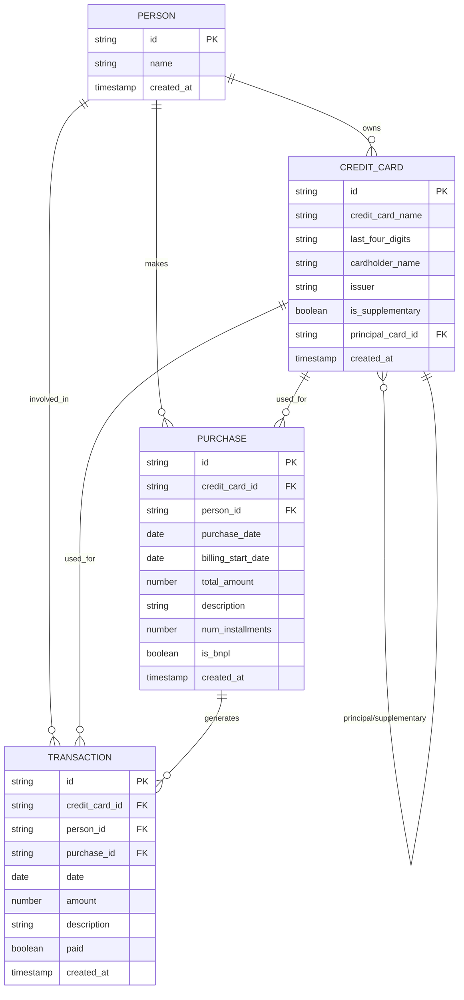
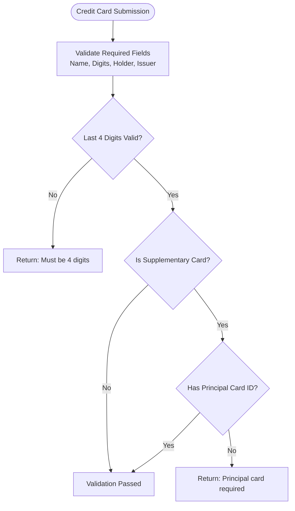
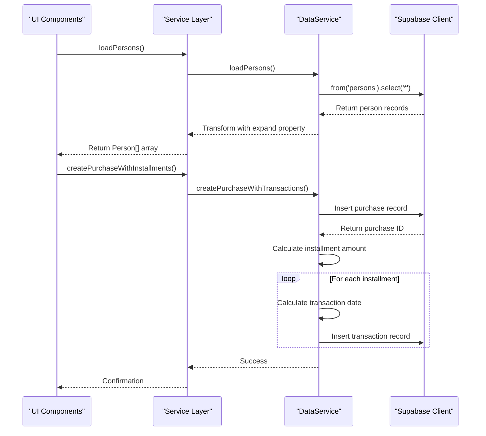
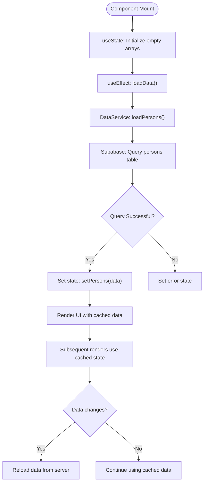
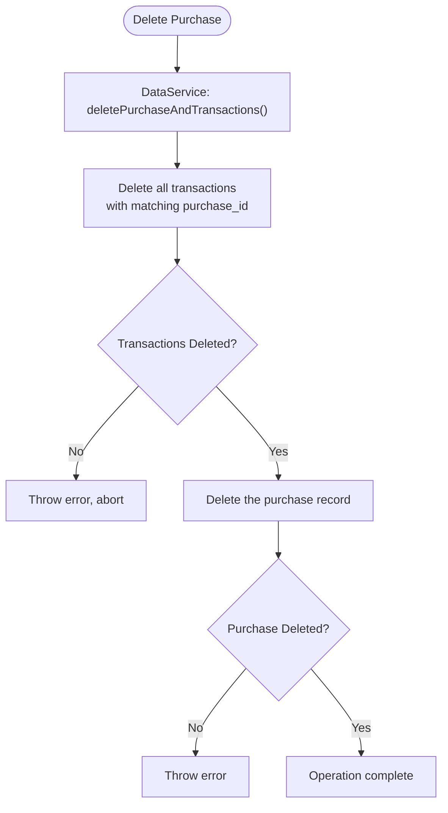
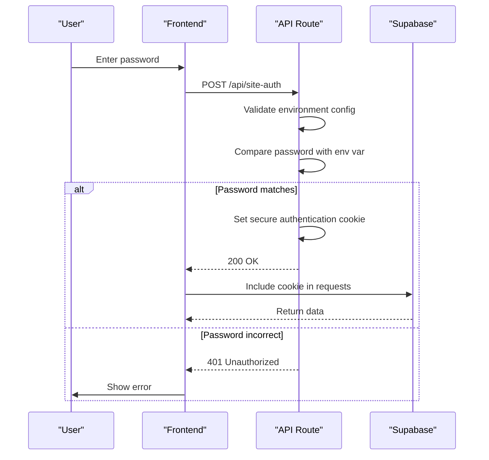

# Data Models

<cite>
**Referenced Files in This Document**   
- [schemas.ts](file://src/lib/schemas.ts)
- [supabase.ts](file://src/lib/supabase.ts)
- [dataService.ts](file://src/lib/services/dataService.ts)
- [creditCardService.ts](file://src/lib/services/creditCardService.ts)
- [purchaseService.ts](file://src/lib/services/purchaseService.ts)
- [personService.ts](file://src/lib/services/personService.ts)
- [CreditCardForm.tsx](file://src/components/credit-cards/CreditCardForm.tsx)
- [PurchaseForm.tsx](file://src/components/PurchaseForm.tsx)
</cite>

## Table of Contents
1. [Introduction](#introduction)
2. [Entity-Relationship Model](#entity-relationship-model)
3. [Core Entity Definitions](#core-entity-definitions)
4. [Data Validation and Business Rules](#data-validation-and-business-rules)
5. [Data Access Patterns](#data-access-patterns)
6. [Caching Strategy](#caching-strategy)
7. [Performance Considerations](#performance-considerations)
8. [Data Lifecycle and Retention](#data-lifecycle-and-retention)
9. [Data Security and Access Control](#data-security-and-access-control)
10. [Sample Data](#sample-data)

## Introduction

This document provides comprehensive documentation of the data models used in the credit card tracking application. The system manages financial data related to persons, credit cards, purchases, and transactions, with a focus on installment tracking and financial planning. The database schema is implemented using Supabase as the backend service, with TypeScript interfaces defining the data structure and Zod for runtime validation.

The application tracks both regular purchases and Buy Now Pay Later (BNPL) arrangements, automatically generating transaction records for each installment period. It supports supplementary credit cards linked to principal cards, enabling users to manage multiple card relationships within a single household or organization.

**Section sources**
- [supabase.ts](file://src/lib/supabase.ts#L9-L80)
- [schemas.ts](file://src/lib/schemas.ts#L1-L62)

## Entity-Relationship Model

The data model consists of four core entities: Person, CreditCard, Purchase, and Transaction. These entities are related hierarchically, with Persons owning CreditCards, CreditCards being used for Purchases, and Purchases generating multiple Transactions for installment tracking.



**Diagram sources**
- [supabase.ts](file://src/lib/supabase.ts#L10-L30)
- [supabase.ts](file://src/lib/supabase.ts#L41-L59)
- [supabase.ts](file://src/lib/supabase.ts#L61-L80)

**Section sources**
- [supabase.ts](file://src/lib/supabase.ts#L10-L80)

## Core Entity Definitions

### Person Entity

The Person entity represents individuals who make purchases using credit cards. Each person can own multiple credit cards and be associated with various purchases and transactions.

| Field | Type | Constraints | Description |
|-------|------|-----------|-------------|
| id | string | Primary Key | Unique identifier for the person |
| name | string | Required, Min length 1 | Full name of the person |
| created_at | string | Timestamp | Record creation timestamp |

**Section sources**
- [supabase.ts](file://src/lib/supabase.ts#L10-L14)
- [schemas.ts](file://src/lib/schemas.ts#L27-L30)

### CreditCard Entity

The CreditCard entity represents credit cards, including both principal and supplementary cards. The model supports card hierarchies through the principal/supplementary relationship.

| Field | Type | Constraints | Description |
|-------|------|-----------|-------------|
| id | string | Primary Key | Unique identifier for the credit card |
| credit_card_name | string | Required, Min length 1 | Name given to identify the card |
| last_four_digits | string | Required, Length 4, Digits only | Last four digits of the card number |
| cardholder_name | string | Required, Min length 1 | Name of the cardholder |
| issuer | string | Required, Min length 1 | Bank or financial institution issuing the card |
| is_supplementary | boolean | Required | Flag indicating if this is a supplementary card |
| principal_card_id | string | Foreign Key, Nullable | Reference to the principal card for supplementary cards |
| created_at | string | Timestamp | Record creation timestamp |

**Section sources**
- [supabase.ts](file://src/lib/supabase.ts#L16-L30)
- [schemas.ts](file://src/lib/schemas.ts#L4-L14)

### Purchase Entity

The Purchase entity represents a purchase transaction that may be paid in installments. Each purchase generates multiple transaction records based on the number of installments.

| Field | Type | Constraints | Description |
|-------|------|-----------|-------------|
| id | string | Primary Key | Unique identifier for the purchase |
| credit_card_id | string | Foreign Key, Required | Reference to the credit card used |
| person_id | string | Foreign Key, Required | Reference to the person making the purchase |
| purchase_date | string | Required | Date when the purchase was made |
| billing_start_date | string | Optional | Date when installment billing begins |
| total_amount | number | Required, Positive | Total amount of the purchase |
| description | string | Required, Min length 1 | Description of the purchase |
| num_installments | number | Required, Integer, Min 1 | Number of installments for payment |
| is_bnpl | boolean | Required | Flag indicating if this is a Buy Now Pay Later arrangement |
| created_at | string | Timestamp | Record creation timestamp |

**Section sources**
- [supabase.ts](file://src/lib/supabase.ts#L41-L59)
- [schemas.ts](file://src/lib/schemas.ts#L33-L44)

### Transaction Entity

The Transaction entity represents individual payment transactions, typically generated automatically from purchases with multiple installments. Each transaction corresponds to one installment payment.

| Field | Type | Constraints | Description |
|-------|------|-----------|-------------|
| id | string | Primary Key | Unique identifier for the transaction |
| credit_card_id | string | Foreign Key, Required | Reference to the credit card used |
| person_id | string | Foreign Key, Required | Reference to the person responsible |
| purchase_id | string | Foreign Key, Nullable | Reference to the parent purchase |
| date | string | Required | Due date for this transaction |
| amount | number | Required | Amount due for this installment |
| description | string | Required, Min length 1 | Description of the transaction |
| paid | boolean | Required | Payment status (paid/unpaid) |
| created_at | string | Timestamp | Record creation timestamp |

**Section sources**
- [supabase.ts](file://src/lib/supabase.ts#L61-L80)
- [schemas.ts](file://src/lib/schemas.ts#L46-L54)

## Data Validation and Business Rules

### Zod Schema Validation

The application uses Zod schemas to validate data both on the client side and server side, ensuring data integrity before it reaches the database.

#### Credit Card Validation Rules
- Credit card name: Required, minimum 1 character
- Last four digits: Exactly 4 digits, numeric only
- Cardholder name: Required, minimum 1 character
- Issuer: Required, minimum 1 character
- Supplementary card rule: If `is_supplementary` is true, `principal_card_id` must be provided and non-empty



**Diagram sources**
- [schemas.ts](file://src/lib/schemas.ts#L4-L25)

#### Purchase Validation Rules
- Credit card: Required
- Person: Required
- Purchase date: Required
- Total amount: Required, must be positive
- Description: Required, minimum 1 character
- Number of installments: Required, integer, minimum 1
- BNPL flag: Boolean value

#### Transaction Validation Rules
- Credit card: Required
- Person: Required
- Date: Required
- Amount: Required
- Description: Required, minimum 1 character

**Section sources**
- [schemas.ts](file://src/lib/schemas.ts#L4-L61)

## Data Access Patterns

### Service Layer Architecture

The application implements a service layer pattern with dedicated service classes for each entity type, providing a clean API for data access operations.



**Diagram sources**
- [dataService.ts](file://src/lib/services/dataService.ts#L107-L164)
- [purchaseService.ts](file://src/lib/services/purchaseService.ts#L3-L87)

### Key Data Access Operations

#### Loading Related Data with Joins
The service layer uses Supabase's relational queries to load entities with their related data in a single request:

- Purchases are loaded with their associated credit card and person data
- Credit cards are loaded with their principal card data (for supplementary cards)
- Transactions are loaded with their associated purchase, credit card, and person data

#### Transaction Generation Logic
When a purchase is created with multiple installments, the system automatically generates the corresponding transaction records:

1. Insert the purchase record and retrieve its ID
2. Calculate the installment amount (total amount divided by number of installments)
3. For each installment period:
   - Calculate the transaction date based on the billing start date
   - Create a transaction record with the calculated amount and date
   - Link the transaction to the purchase via purchase_id

**Section sources**
- [dataService.ts](file://src/lib/services/dataService.ts#L39-L164)
- [creditCardService.ts](file://src/lib/services/creditCardService.ts#L4-L25)
- [personService.ts](file://src/lib/services/personService.ts#L4-L75)

## Caching Strategy

The application implements a client-side caching strategy through React's useState and useEffect hooks, which store loaded data in component state.

### Data Loading and Caching Flow



The caching strategy provides the following benefits:
- Reduces redundant database queries
- Improves UI responsiveness
- Maintains data consistency across related components
- Automatically refreshes when components remount

The cache is currently implemented at the component level and does not persist across page navigation. For improved performance, future enhancements could include:
- Global state management with React Context or Redux
- Local storage persistence for offline access
- Stale-while-revalidate caching strategy

**Section sources**
- [dataService.ts](file://src/lib/services/dataService.ts#L39-L105)
- [purchases/page.tsx](file://src/app/purchases/page.tsx#L16-L38)

## Performance Considerations

### Query Optimization

The data access patterns are designed with performance in mind:

1. **Relational Queries**: The application uses Supabase's relational query capabilities to fetch related data in a single request, reducing the number of round trips to the database.

2. **Indexing Strategy**: Based on query patterns, the following database indexes should be created:
   - Index on `purchases.purchase_date` for date-based filtering
   - Index on `purchases.credit_card_id` for card-based queries
   - Index on `purchases.person_id` for person-based queries
   - Index on `transactions.date` for due date sorting
   - Index on `transactions.paid` for payment status filtering

3. **Data Transformation**: The service layer transforms raw database results to include an `expand` property with related entities, providing a consistent data structure for the UI components.

### Transaction Generation Performance

The transaction generation process for installment purchases is optimized to minimize database round trips:

- The purchase record is inserted first to obtain the purchase ID
- All transaction records are inserted in a single loop without additional queries
- Error handling ensures atomicity - if any transaction fails, the entire operation is rolled back

For large numbers of installments, consider implementing batch inserts or database-level stored procedures to further improve performance.

**Section sources**
- [dataService.ts](file://src/lib/services/dataService.ts#L40-L50)
- [dataService.ts](file://src/lib/services/dataService.ts#L130-L158)

## Data Lifecycle and Retention

### Data Creation

Data is created through user interactions in the application's forms:
- Persons are created through the persons management interface
- Credit cards are created through the credit card management interface
- Purchases are created through the purchase entry form
- Transactions are created automatically when purchases with installments are recorded

### Data Updates

Data updates follow a consistent pattern across entities:
- Records are updated by ID using the Supabase update() method
- The update operation is atomic and includes error handling
- Related data is not automatically updated (e.g., updating a person's name does not update the name in associated transactions)

### Data Deletion

The application implements cascading deletion for related records:



When a purchase is deleted, all associated transactions are deleted first, followed by the purchase record itself. This ensures referential integrity is maintained.

Deletion of other entities follows a simpler pattern:
- Credit cards can be deleted only if no purchases are associated with them
- Persons can be deleted only if no purchases are associated with them

**Section sources**
- [dataService.ts](file://src/lib/services/dataService.ts#L8-L37)
- [personService.ts](file://src/lib/services/personService.ts#L46-L57)
- [creditCardService.ts](file://src/lib/services/creditCardService.ts#L56-L67)

## Data Security and Access Control

### Authentication and Authorization

The application implements site-level access control through a password authentication system:



The authentication cookie is configured with security best practices:
- HttpOnly: Prevents client-side script access
- Secure: Only sent over HTTPS connections
- SameSite: Lax policy to prevent CSRF attacks
- Max-Age: Configurable session duration

### Data Privacy

The application handles sensitive financial data with the following considerations:
- Full credit card numbers are not stored - only the last four digits are kept
- Cardholder names are stored but not considered highly sensitive
- Purchase descriptions may contain sensitive information and are stored as provided
- All data is transmitted over encrypted connections (HTTPS)

### Access Control Rules

The current implementation provides site-wide access control rather than granular permissions:
- Users who can authenticate have full access to all data
- There is no role-based access control or data ownership model
- All authenticated users can view, create, update, and delete all records

For enhanced security in production environments, consider implementing:
- User accounts with individual credentials
- Role-based access control (RBAC)
- Data ownership and sharing models
- Audit logging for sensitive operations

**Section sources**
- [api/route.ts](file://src/app/api/site-auth/route.ts#L1-L65)
- [supabase.ts](file://src/lib/supabase.ts#L4-L7)

## Sample Data

### Person Record
```json
{
  "id": "a1b2c3d4-e5f6-7890-g1h2-i3j4k5l6m7n8",
  "name": "Maria Santos",
  "created_at": "2025-01-15T08:30:00.000Z"
}
```

### Credit Card Record (Principal)
```json
{
  "id": "p1q2r3s4-t5u6-7890-v1w2-x3y4z5a6b7c8",
  "credit_card_name": "Primary Visa",
  "last_four_digits": "1234",
  "cardholder_name": "Maria Santos",
  "issuer": "BDO",
  "is_supplementary": false,
  "created_at": "2025-01-15T08:35:00.000Z"
}
```

### Credit Card Record (Supplementary)
```json
{
  "id": "d1e2f3g4-h5i6-7890-j1k2-l3m4n5o6p7q8",
  "credit_card_name": "Daughter's Card",
  "last_four_digits": "5678",
  "cardholder_name": "Ana Santos",
  "issuer": "Metrobank",
  "is_supplementary": true,
  "principal_card_id": "p1q2r3s4-t5u6-7890-v1w2-x3y4z5a6b7c8",
  "created_at": "2025-01-16T10:15:00.000Z"
}
```

### Purchase Record
```json
{
  "id": "r1s2t3u4-v5w6-7890-x1y2-z3a4b5c6d7e8",
  "credit_card_id": "p1q2r3s4-t5u6-7890-v1w2-x3y4z5a6b7c8",
  "person_id": "a1b2c3d4-e5f6-7890-g1h2-i3j4k5l6m7n8",
  "purchase_date": "2025-01-20",
  "billing_start_date": "2025-02-01",
  "total_amount": 15000.00,
  "description": "Living room furniture set",
  "num_installments": 6,
  "is_bnpl": true,
  "created_at": "2025-01-20T14:20:00.000Z"
}
```

### Transaction Records (Generated from Purchase)
```json
[
  {
    "id": "e1f2g3h4-i5j6-7890-k1l2-m3n4o5p6q7r8",
    "credit_card_id": "p1q2r3s4-t5u6-7890-v1w2-x3y4z5a6b7c8",
    "person_id": "a1b2c3d4-e5f6-7890-g1h2-i3j4k5l6m7n8",
    "purchase_id": "r1s2t3u4-v5w6-7890-x1y2-z3a4b5c6d7e8",
    "date": "2025-02-01",
    "amount": 2500.00,
    "description": "Living room furniture set (Installment 1/6)",
    "paid": false,
    "created_at": "2025-01-20T14:20:00.000Z"
  },
  {
    "id": "s1t2u3v4-w5x6-7890-y1z2-a3b4c5d6e7f8",
    "credit_card_id": "p1q2r3s4-t5u6-7890-v1w2-x3y4z5a6b7c8",
    "person_id": "a1b2c3d4-e5f6-7890-g1h2-i3j4k5l6m7n8",
    "purchase_id": "r1s2t3u4-v5w6-7890-x1y2-z3a4b5c6d7e8",
    "date": "2025-03-01",
    "amount": 2500.00,
    "description": "Living room furniture set (Installment 2/6)",
    "paid": false,
    "created_at": "2025-01-20T14:20:00.000Z"
  }
]
```

**Section sources**
- [supabase.ts](file://src/lib/supabase.ts#L10-L80)
- [dataService.ts](file://src/lib/services/dataService.ts#L107-L164)