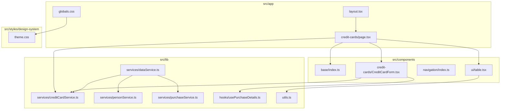
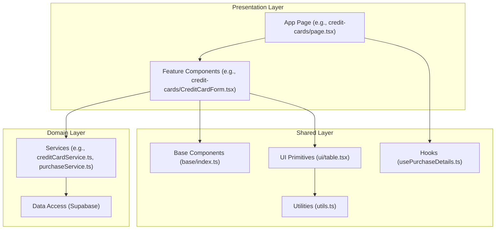
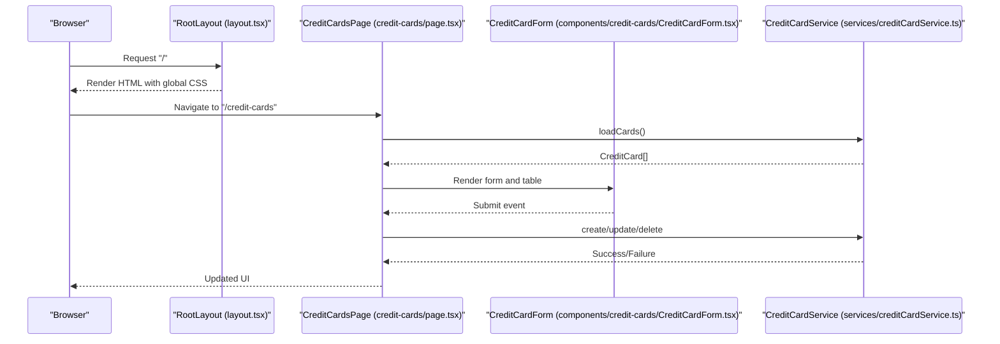
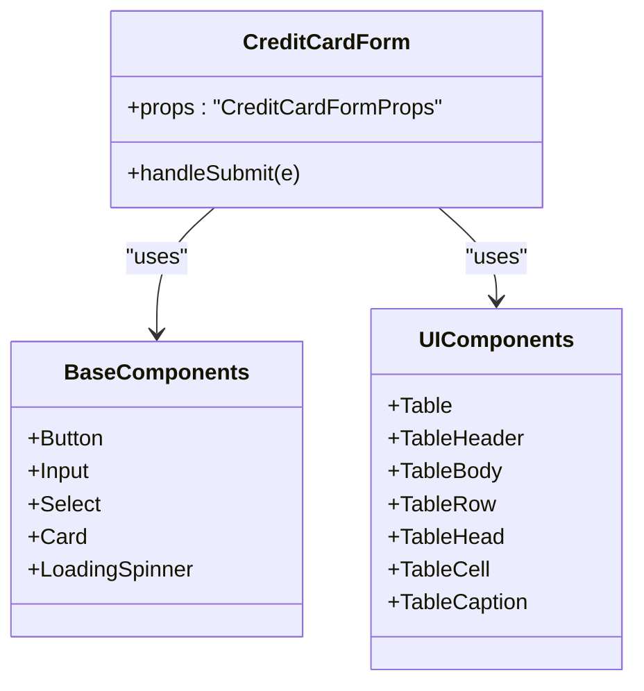
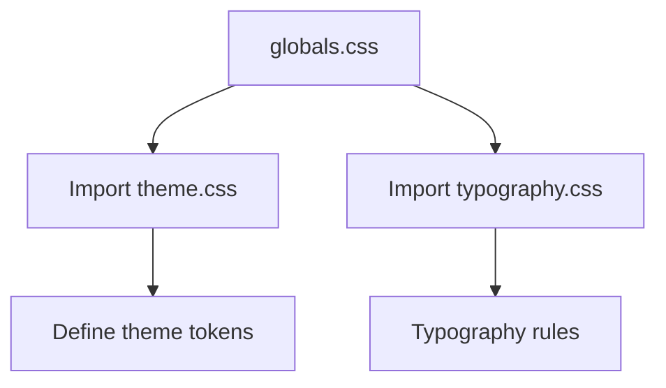
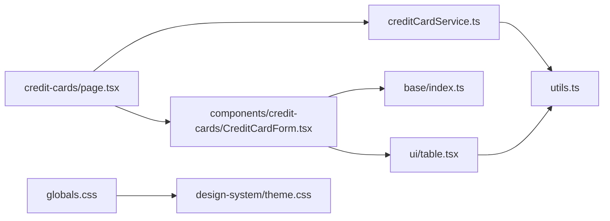

# Directory Structure Breakdown

<cite>
**Referenced Files in This Document**
- [src/app/layout.tsx](file://src/app/layout.tsx)
- [src/app/credit-cards/page.tsx](file://src/app/credit-cards/page.tsx)
- [src/app/globals.css](file://src/app/globals.css)
- [src/components/base/index.ts](file://src/components/base/index.ts)
- [src/components/credit-cards/CreditCardForm.tsx](file://src/components/credit-cards/CreditCardForm.tsx)
- [src/components/navigation/index.ts](file://src/components/navigation/index.ts)
- [src/components/ui/table.tsx](file://src/components/ui/table.tsx)
- [src/lib/services/creditCardService.ts](file://src/lib/services/creditCardService.ts)
- [src/lib/services/dataService.ts](file://src/lib/services/dataService.ts)
- [src/lib/services/personService.ts](file://src/lib/services/personService.ts)
- [src/lib/services/purchaseService.ts](file://src/lib/services/purchaseService.ts)
- [src/lib/hooks/usePurchaseDetails.ts](file://src/lib/hooks/usePurchaseDetails.ts)
- [src/lib/utils.ts](file://src/lib/utils.ts)
- [src/styles/design-system/theme.css](file://src/styles/design-system/theme.css)
</cite>

## Table of Contents
1. [Introduction](#introduction)
2. [Project Structure](#project-structure)
3. [Core Components](#core-components)
4. [Architecture Overview](#architecture-overview)
5. [Detailed Component Analysis](#detailed-component-analysis)
6. [Dependency Analysis](#dependency-analysis)
7. [Performance Considerations](#performance-considerations)
8. [Troubleshooting Guide](#troubleshooting-guide)
9. [Conclusion](#conclusion)

## Introduction
This document explains the project’s directory structure and how it organizes code for maintainability and scalability. It focuses on four top-level areas:
- src/app: Next.js App Router pages and API routes
- src/components: Reusable UI components grouped by feature domain
- src/lib: Business logic and services
- src/styles/design-system: Design system configuration

It also outlines organization patterns (feature-based grouping and service pattern), practical examples from the codebase, and best practices for growth.

## Project Structure
The repository follows a layered, feature-centric structure:
- src/app: App Router pages and global assets
- src/components: Feature-specific UI components and shared base/UI primitives
- src/lib: Services, hooks, utilities, and typed Supabase models
- src/styles/design-system: Theme and typography CSS



**Diagram sources**
- [src/app/layout.tsx](file://src/app/layout.tsx#L1-L51)
- [src/app/credit-cards/page.tsx](file://src/app/credit-cards/page.tsx#L1-L195)
- [src/app/globals.css](file://src/app/globals.css#L1-L40)
- [src/components/base/index.ts](file://src/components/base/index.ts#L1-L16)
- [src/components/credit-cards/CreditCardForm.tsx](file://src/components/credit-cards/CreditCardForm.tsx#L1-L180)
- [src/components/navigation/index.ts](file://src/components/navigation/index.ts#L1-L2)
- [src/components/ui/table.tsx](file://src/components/ui/table.tsx#L1-L117)
- [src/lib/services/creditCardService.ts](file://src/lib/services/creditCardService.ts#L1-L69)
- [src/lib/services/dataService.ts](file://src/lib/services/dataService.ts#L1-L165)
- [src/lib/services/personService.ts](file://src/lib/services/personService.ts#L1-L76)
- [src/lib/services/purchaseService.ts](file://src/lib/services/purchaseService.ts#L1-L88)
- [src/lib/hooks/usePurchaseDetails.ts](file://src/lib/hooks/usePurchaseDetails.ts#L1-L63)
- [src/lib/utils.ts](file://src/lib/utils.ts#L1-L47)
- [src/styles/design-system/theme.css](file://src/styles/design-system/theme.css#L1-L35)

**Section sources**
- [src/app/layout.tsx](file://src/app/layout.tsx#L1-L51)
- [src/app/credit-cards/page.tsx](file://src/app/credit-cards/page.tsx#L1-L195)
- [src/app/globals.css](file://src/app/globals.css#L1-L40)
- [src/components/base/index.ts](file://src/components/base/index.ts#L1-L16)
- [src/components/credit-cards/CreditCardForm.tsx](file://src/components/credit-cards/CreditCardForm.tsx#L1-L180)
- [src/components/navigation/index.ts](file://src/components/navigation/index.ts#L1-L2)
- [src/components/ui/table.tsx](file://src/components/ui/table.tsx#L1-L117)
- [src/lib/services/creditCardService.ts](file://src/lib/services/creditCardService.ts#L1-L69)
- [src/lib/services/dataService.ts](file://src/lib/services/dataService.ts#L1-L165)
- [src/lib/services/personService.ts](file://src/lib/services/personService.ts#L1-L76)
- [src/lib/services/purchaseService.ts](file://src/lib/services/purchaseService.ts#L1-L88)
- [src/lib/hooks/usePurchaseDetails.ts](file://src/lib/hooks/usePurchaseDetails.ts#L1-L63)
- [src/lib/utils.ts](file://src/lib/utils.ts#L1-L47)
- [src/styles/design-system/theme.css](file://src/styles/design-system/theme.css#L1-L35)

## Core Components
- src/app: Contains Next.js App Router pages and the root layout. The root layout composes the global CSS and the application shell, while feature pages (e.g., credit cards) orchestrate data fetching and rendering.
- src/components: Feature-based grouping with shared base/UI primitives. Components are grouped under feature folders (e.g., credit-cards) and exported via barrel files for easy imports.
- src/lib: Service pattern implementation for data access and business logic, plus reusable hooks and utilities. Services encapsulate Supabase operations and expose typed methods.
- src/styles/design-system: Centralized theme and typography CSS consumed by global styles.

Practical examples:
- Feature page: [src/app/credit-cards/page.tsx](file://src/app/credit-cards/page.tsx#L1-L195) orchestrates loading credit cards, rendering a data table, and opening modals for add/edit.
- Feature component: [src/components/credit-cards/CreditCardForm.tsx](file://src/components/credit-cards/CreditCardForm.tsx#L1-L180) renders a form bound to a schema and uses shared base components.
- Service pattern: [src/lib/services/creditCardService.ts](file://src/lib/services/creditCardService.ts#L1-L69) exposes CRUD methods for credit cards via Supabase.
- Shared base components: [src/components/base/index.ts](file://src/components/base/index.ts#L1-L16) exports foundational UI primitives.
- Global design system: [src/app/globals.css](file://src/app/globals.css#L1-L40) imports theme and typography from [src/styles/design-system/theme.css](file://src/styles/design-system/theme.css#L1-L35).

**Section sources**
- [src/app/credit-cards/page.tsx](file://src/app/credit-cards/page.tsx#L1-L195)
- [src/components/credit-cards/CreditCardForm.tsx](file://src/components/credit-cards/CreditCardForm.tsx#L1-L180)
- [src/lib/services/creditCardService.ts](file://src/lib/services/creditCardService.ts#L1-L69)
- [src/components/base/index.ts](file://src/components/base/index.ts#L1-L16)
- [src/app/globals.css](file://src/app/globals.css#L1-L40)
- [src/styles/design-system/theme.css](file://src/styles/design-system/theme.css#L1-L35)

## Architecture Overview
The system follows a clean architecture:
- Pages in src/app coordinate UI and data
- Components render UI and delegate data operations to services
- Services encapsulate data access and transformations
- Utilities and hooks support cross-cutting concerns



**Diagram sources**
- [src/app/credit-cards/page.tsx](file://src/app/credit-cards/page.tsx#L1-L195)
- [src/components/credit-cards/CreditCardForm.tsx](file://src/components/credit-cards/CreditCardForm.tsx#L1-L180)
- [src/lib/services/creditCardService.ts](file://src/lib/services/creditCardService.ts#L1-L69)
- [src/lib/services/purchaseService.ts](file://src/lib/services/purchaseService.ts#L1-L88)
- [src/components/base/index.ts](file://src/components/base/index.ts#L1-L16)
- [src/components/ui/table.tsx](file://src/components/ui/table.tsx#L1-L117)
- [src/lib/hooks/usePurchaseDetails.ts](file://src/lib/hooks/usePurchaseDetails.ts#L1-L63)
- [src/lib/utils.ts](file://src/lib/utils.ts#L1-L47)

## Detailed Component Analysis

### src/app: Next.js App Router Pages and API Routes
- Root layout composes global CSS and the application shell, including sidebar and bottom navigation.
- Feature pages (e.g., credit-cards) manage state, call services, and render feature components.
- Global CSS imports design system theme and typography.



**Diagram sources**
- [src/app/layout.tsx](file://src/app/layout.tsx#L1-L51)
- [src/app/credit-cards/page.tsx](file://src/app/credit-cards/page.tsx#L1-L195)
- [src/components/credit-cards/CreditCardForm.tsx](file://src/components/credit-cards/CreditCardForm.tsx#L1-L180)
- [src/lib/services/creditCardService.ts](file://src/lib/services/creditCardService.ts#L1-L69)

**Section sources**
- [src/app/layout.tsx](file://src/app/layout.tsx#L1-L51)
- [src/app/credit-cards/page.tsx](file://src/app/credit-cards/page.tsx#L1-L195)
- [src/app/globals.css](file://src/app/globals.css#L1-L40)

### src/components: Feature-Based UI Components
- Feature-based grouping: components are grouped under feature folders (e.g., credit-cards, persons, purchases, transactions).
- Shared base/UI primitives: exported via barrel files (e.g., base/index.ts, navigation/index.ts).
- Example: CreditCardForm integrates with shared base components and services.



**Diagram sources**
- [src/components/credit-cards/CreditCardForm.tsx](file://src/components/credit-cards/CreditCardForm.tsx#L1-L180)
- [src/components/base/index.ts](file://src/components/base/index.ts#L1-L16)
- [src/components/ui/table.tsx](file://src/components/ui/table.tsx#L1-L117)

**Section sources**
- [src/components/credit-cards/CreditCardForm.tsx](file://src/components/credit-cards/CreditCardForm.tsx#L1-L180)
- [src/components/base/index.ts](file://src/components/base/index.ts#L1-L16)
- [src/components/ui/table.tsx](file://src/components/ui/table.tsx#L1-L117)

### src/lib: Service Pattern and Business Logic
- Service pattern: Each domain (credit cards, persons, purchases, data) has a dedicated service class exposing typed methods.
- Example services:
  - CreditCardService: load, create, update, delete
  - PurchaseService: load purchase details and related transactions, update paid status
  - DataService: bulk operations (e.g., delete purchase and transactions, load related entities)
- Hooks: usePurchaseDetails encapsulates loading and updating transaction paid status.
- Utilities: cn for Tailwind merging and date formatting helpers.

```mermaid
classDiagram
class CreditCardService {
+loadCards() Promise~CreditCard[]~
+createCard(data) Promise~void~
+updateCard(id,data) Promise~void~
+deleteCard(id) Promise~void~
}
class PurchaseService {
+loadPurchaseDetails(id) Promise~{purchase,transactions}~
+updateTransactionPaidStatus(id,paid) Promise~void~
}
class DataService {
+deletePurchaseAndTransactions(id) Promise~void~
+loadPurchases() Promise~Purchase[]~
+loadCreditCards() Promise~CreditCard[]~
+loadPersons() Promise~Person[]~
+createPurchaseWithTransactions(data) Promise~void~
}
class usePurchaseDetails {
+purchase
+transactions
+loading
+error
+updateTransactionPaidStatus()
}
class Utils {
+cn(...)
+formatDate(date)
+handleTransactionPaidChange(...)
}
usePurchaseDetails --> PurchaseService : "calls"
CreditCardService --> DataService : "may reuse"
PurchaseService --> DataService : "may reuse"
Utils <.. CreditCardService : "shared"
Utils <.. PurchaseService : "shared"
```

**Diagram sources**
- [src/lib/services/creditCardService.ts](file://src/lib/services/creditCardService.ts#L1-L69)
- [src/lib/services/purchaseService.ts](file://src/lib/services/purchaseService.ts#L1-L88)
- [src/lib/services/dataService.ts](file://src/lib/services/dataService.ts#L1-L165)
- [src/lib/hooks/usePurchaseDetails.ts](file://src/lib/hooks/usePurchaseDetails.ts#L1-L63)
- [src/lib/utils.ts](file://src/lib/utils.ts#L1-L47)

**Section sources**
- [src/lib/services/creditCardService.ts](file://src/lib/services/creditCardService.ts#L1-L69)
- [src/lib/services/purchaseService.ts](file://src/lib/services/purchaseService.ts#L1-L88)
- [src/lib/services/dataService.ts](file://src/lib/services/dataService.ts#L1-L165)
- [src/lib/hooks/usePurchaseDetails.ts](file://src/lib/hooks/usePurchaseDetails.ts#L1-L63)
- [src/lib/utils.ts](file://src/lib/utils.ts#L1-L47)

### src/styles/design-system: Design System Configuration
- Global CSS imports daisyUI and Tailwind plugins, and applies theme and typography from the design system.
- Theme CSS defines dark-mode tokens and color scales used across the app.



**Diagram sources**
- [src/app/globals.css](file://src/app/globals.css#L1-L40)
- [src/styles/design-system/theme.css](file://src/styles/design-system/theme.css#L1-L35)

**Section sources**
- [src/app/globals.css](file://src/app/globals.css#L1-L40)
- [src/styles/design-system/theme.css](file://src/styles/design-system/theme.css#L1-L35)

## Dependency Analysis
- Pages depend on services and feature components.
- Feature components depend on base/UI components and services.
- Services depend on Supabase and shared utilities.
- Global styles depend on design system theme and typography.



**Diagram sources**
- [src/app/credit-cards/page.tsx](file://src/app/credit-cards/page.tsx#L1-L195)
- [src/components/credit-cards/CreditCardForm.tsx](file://src/components/credit-cards/CreditCardForm.tsx#L1-L180)
- [src/components/base/index.ts](file://src/components/base/index.ts#L1-L16)
- [src/components/ui/table.tsx](file://src/components/ui/table.tsx#L1-L117)
- [src/lib/services/creditCardService.ts](file://src/lib/services/creditCardService.ts#L1-L69)
- [src/lib/utils.ts](file://src/lib/utils.ts#L1-L47)
- [src/app/globals.css](file://src/app/globals.css#L1-L40)
- [src/styles/design-system/theme.css](file://src/styles/design-system/theme.css#L1-L35)

**Section sources**
- [src/app/credit-cards/page.tsx](file://src/app/credit-cards/page.tsx#L1-L195)
- [src/components/credit-cards/CreditCardForm.tsx](file://src/components/credit-cards/CreditCardForm.tsx#L1-L180)
- [src/components/base/index.ts](file://src/components/base/index.ts#L1-L16)
- [src/components/ui/table.tsx](file://src/components/ui/table.tsx#L1-L117)
- [src/lib/services/creditCardService.ts](file://src/lib/services/creditCardService.ts#L1-L69)
- [src/lib/utils.ts](file://src/lib/utils.ts#L1-L47)
- [src/app/globals.css](file://src/app/globals.css#L1-L40)
- [src/styles/design-system/theme.css](file://src/styles/design-system/theme.css#L1-L35)

## Performance Considerations
- Prefer feature-based grouping to reduce import overhead and improve discoverability.
- Use service classes to centralize data access and enable caching strategies at the service level.
- Keep shared base/UI components small and pure to minimize re-renders.
- Leverage global CSS imports for theme consistency and reduced duplication.

[No sources needed since this section provides general guidance]

## Troubleshooting Guide
Common navigation and structure issues:
- Incorrect imports across boundaries:
  - Ensure feature components import base/UI components via barrel files (e.g., base/index.ts).
  - Verify service paths resolve correctly from components and pages.
- Global styles not applying:
  - Confirm globals.css imports design-system theme and typography.
  - Check that theme.css defines tokens expected by components.
- Service method signatures mismatch:
  - Align service method parameters with component expectations (e.g., CreditCardService CRUD methods).
- Hook usage:
  - Ensure hooks are used inside client components and receive correct props.

**Section sources**
- [src/components/base/index.ts](file://src/components/base/index.ts#L1-L16)
- [src/app/globals.css](file://src/app/globals.css#L1-L40)
- [src/styles/design-system/theme.css](file://src/styles/design-system/theme.css#L1-L35)
- [src/lib/services/creditCardService.ts](file://src/lib/services/creditCardService.ts#L1-L69)
- [src/lib/hooks/usePurchaseDetails.ts](file://src/lib/hooks/usePurchaseDetails.ts#L1-L63)

## Conclusion
The directory structure promotes maintainability and scalability by:
- Separating concerns across app, components, lib, and styles
- Grouping components by feature domains
- Encapsulating business logic in service classes
- Centralizing design system configuration

Adhering to these patterns ensures predictable growth and easier navigation as the application evolves.

[No sources needed since this section summarizes without analyzing specific files]