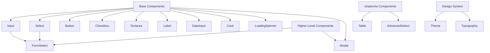
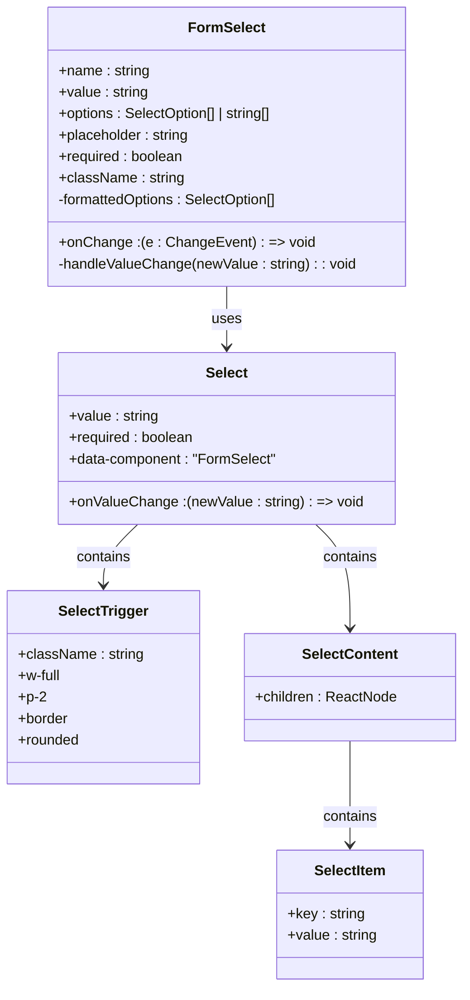
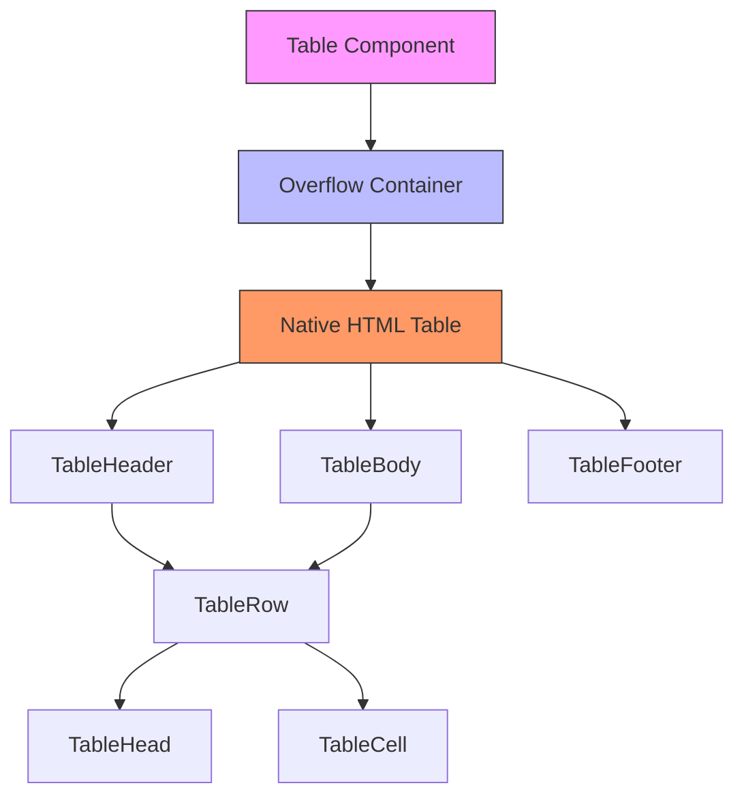
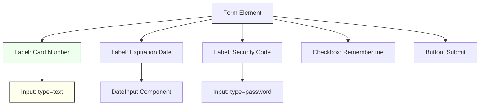
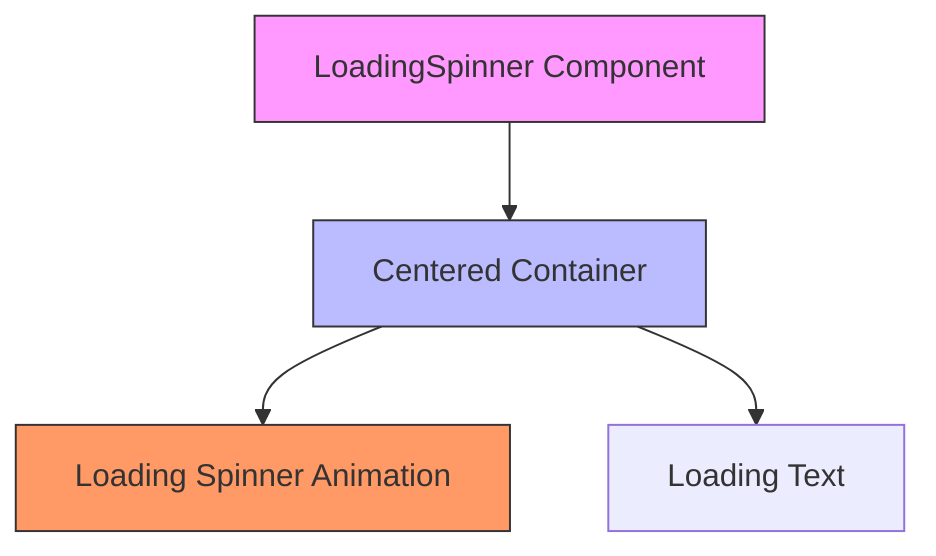

# Base UI Components

<cite>
**Referenced Files in This Document**   
- [Button.tsx](file://src/components/base/Button.tsx)
- [Input.tsx](file://src/components/base/Input.tsx)
- [Select.tsx](file://src/components/base/Select.tsx)
- [Label.tsx](file://src/components/base/Label.tsx)
- [Checkbox.tsx](file://src/components/base/Checkbox.tsx)
- [Textarea.tsx](file://src/components/base/Textarea.tsx)
- [DateInput.tsx](file://src/components/base/DateInput.tsx)
- [Card.tsx](file://src/components/base/Card.tsx)
- [LoadingSpinner.tsx](file://src/components/base/LoadingSpinner.tsx)
- [FormSelect.tsx](file://src/components/FormSelect.tsx)
- [Modal.tsx](file://src/components/Modal.tsx)
- [select.tsx](file://src/components/ui/select.tsx)
- [table.tsx](file://src/components/ui/table.tsx)
- [theme.css](file://src/styles/design-system/theme.css)
- [typography.css](file://src/styles/design-system/typography.css)
- [index.ts](file://src/components/base/index.ts)
</cite>

## Table of Contents
1. [Introduction](#introduction)
2. [Base Components Library](#base-components-library)
3. [Component Props and Styling](#component-props-and-styling)
4. [Accessibility Features](#accessibility-features)
5. [Higher-Level Component Abstractions](#higher-level-component-abstractions)
6. [Integration with shadcn/ui Components](#integration-with-shadcnui-components)
7. [Design System Customization](#design-system-customization)
8. [Form Composition Examples](#form-composition-examples)
9. [Responsive Behaviors](#responsive-behaviors)
10. [Loading States](#loading-states)
11. [Keyboard Navigation Support](#keyboard-navigation-support)
12. [Usage Guidelines](#usage-guidelines)

## Introduction
The credit-card-tracker application utilizes a comprehensive base UI components library that provides consistent, accessible, and reusable interface elements across the entire application. This documentation details the implementation, usage, and extension patterns for the base components, focusing on their integration with Tailwind CSS, accessibility features, and composition into higher-level abstractions. The component system follows a layered architecture where primitive components are extended into more complex UI patterns while maintaining design system integrity.

## Base Components Library

The base components library is organized in the `src/components/base` directory and provides foundational UI elements that are used throughout the application. These components are designed with consistent styling through Tailwind CSS, accessibility in mind, and extensibility for creating higher-level abstractions.



**Diagram sources**
- [index.ts](file://src/components/base/index.ts)

**Section sources**
- [index.ts](file://src/components/base/index.ts)

## Component Props and Styling

### Input Component
The Input component provides a styled text input with support for labels, error states, and various visual variants. It uses Tailwind CSS classes to implement styling through props.

**Props:**
- `label`: Optional label text
- `error`: Error message to display
- `helpText`: Additional help text
- `variant`: Visual style (bordered, ghost, primary, secondary, accent, info, success, warning, error)
- `inputSize`: Size modifier (xs, sm, md, lg)
- All standard HTML input attributes

The component automatically applies appropriate styling based on the variant and size props, using Tailwind's utility classes to generate the final appearance.

### Button Component
The Button component offers extensive customization options for visual appearance and behavior.

**Props:**
- `color`: Color theme (neutral, primary, secondary, accent, info, success, warning, error)
- `variant`: Style variant (outline, dash, soft, ghost, link)
- `size`: Button size (xs, sm, md, lg, xl)
- `modifier`: Shape modifier (wide, block, square, circle)
- `active`: Active state indicator
- `loading`: Loading state indicator
- `as`: Render as different HTML element (button, a, input)
- `href`: For anchor rendering

The Button component handles accessibility by automatically setting appropriate ARIA attributes when disabled or loading.

### Select Component
The Select component implements a styled dropdown selection element.

**Props:**
- `name`: Form field name
- `value`: Current selected value
- `onChange`: Value change handler
- `options`: Array of option objects with value and label
- `placeholder`: Placeholder text
- `required`: Required field indicator
- `disabled`: Disabled state
- `size`: Size variant (xs, sm, md, lg, xl)
- `variant`: Visual style (bordered, ghost)

The component manages option rendering and provides proper accessibility attributes.

**Section sources**
- [Input.tsx](file://src/components/base/Input.tsx)
- [Button.tsx](file://src/components/base/Button.tsx)
- [Select.tsx](file://src/components/base/Select.tsx)
- [Label.tsx](file://src/components/base/Label.tsx)
- [Checkbox.tsx](file://src/components/base/Checkbox.tsx)
- [Textarea.tsx](file://src/components/base/Textarea.tsx)
- [DateInput.tsx](file://src/components/base/DateInput.tsx)

## Accessibility Features

The base components library prioritizes accessibility through proper semantic HTML, ARIA attributes, and keyboard navigation support.

### Keyboard Navigation
All interactive components support standard keyboard navigation:
- Tab/Shift+Tab for focus management
- Arrow keys for selection in dropdowns and lists
- Enter/Space for activation
- Escape to close modals and dropdowns

### ARIA Attributes
Components automatically apply appropriate ARIA roles and states:
- Form controls have proper labels and error messaging
- Buttons have role="button" when disabled
- Modals use role="dialog" with aria-modal="true"
- Interactive elements have appropriate focus states

### Focus Management
The component system ensures proper focus handling:
- Focus is trapped within modals
- Focus returns to the triggering element when closing modals
- Loading states maintain focus on the relevant component

**Section sources**
- [Button.tsx](file://src/components/base/Button.tsx#L70-L75)
- [Modal.tsx](file://src/components/Modal.tsx#L37-L39)
- [FormSelect.tsx](file://src/components/FormSelect.tsx#L58-L62)

## Higher-Level Component Abstractions

### FormSelect Component
The FormSelect component extends the base Select functionality by integrating with the shadcn/ui select component, providing a more sophisticated dropdown experience.



**Diagram sources**
- [FormSelect.tsx](file://src/components/FormSelect.tsx)

**Section sources**
- [FormSelect.tsx](file://src/components/FormSelect.tsx)

### Modal Component
The Modal component provides a reusable modal dialog with proper accessibility and responsive behavior.

**Props:**
- `isOpen`: Controls visibility
- `onClose`: Close handler
- `title`: Modal title
- `children`: Content to display
- `maxWidth`: Maximum width (sm, md, lg, xl)
- `className`: Additional CSS classes

The modal implements proper accessibility patterns including focus trapping, proper ARIA roles, and backdrop click handling.

**Section sources**
- [Modal.tsx](file://src/components/Modal.tsx)

## Integration with shadcn/ui Components

The application integrates shadcn/ui components for advanced UI patterns, particularly for tables and select elements.

### Table Component Integration
The table component from shadcn/ui is customized to fit the application's design system:



The table implementation includes:
- Responsive overflow container
- Zebra striping
- Pinning for first columns
- Hover states
- Proper accessibility attributes

### Select Component Integration
The shadcn/ui select component is used as the foundation for FormSelect, providing enhanced functionality:

- Scrollable content with up/down buttons
- Proper keyboard navigation
- Animation transitions
- Portal rendering for proper stacking

**Diagram sources**
- [table.tsx](file://src/components/ui/table.tsx)
- [select.tsx](file://src/components/ui/select.tsx)

**Section sources**
- [table.tsx](file://src/components/ui/table.tsx)
- [select.tsx](file://src/components/ui/select.tsx)

## Design System Customization

The application's design system is defined in `src/styles/design-system` and customizes both visual appearance and typography.

### Theme Customization
The theme.css file defines a dark-themed design system using DaisyUI:

```css
@plugin "daisyui/theme" {
    name: "black";
    default: true;
    prefersdark: true;
    color-scheme: "dark";
    --color-base-100: oklch(0% 0 0);
    --color-base-200: oklch(19% 0 0);
    --color-base-300: oklch(22% 0 0);
    --color-base-content: oklch(87.609% 0 0);
    /* Additional color definitions */
}
```

Key design tokens:
- Dark color scheme with high contrast
- Consistent border radius values
- Standardized spacing and sizing
- Accessible color palette

### Typography System
The typography.css file establishes consistent text styling across the application, ensuring readability and visual hierarchy.

**Section sources**
- [theme.css](file://src/styles/design-system/theme.css)
- [typography.css](file://src/styles/design-system/typography.css)

## Form Composition Examples

### Basic Form Structure
Forms are composed using base components in a consistent pattern:



### Error State Handling
The component system provides consistent error state visualization:

- Error messages appear below the input
- Input borders change color to indicate error
- Labels may include visual indicators
- Help text is suppressed when error is present

**Section sources**
- [Input.tsx](file://src/components/base/Input.tsx#L56-L77)
- [Textarea.tsx](file://src/components/base/Textarea.tsx#L57-L77)
- [Checkbox.tsx](file://src/components/base/Checkbox.tsx#L61-L84)

## Responsive Behaviors

The component library implements responsive design principles:

- Fluid widths using Tailwind's w-full classes
- Mobile-first approach with appropriate breakpoints
- Touch-friendly sizing for interactive elements
- Proper viewport handling for modals

All components adapt to different screen sizes while maintaining usability and accessibility.

**Section sources**
- [Modal.tsx](file://src/components/Modal.tsx#L39)
- [Card.tsx](file://src/components/base/Card.tsx#L37)

## Loading States

### LoadingSpinner Component
The LoadingSpinner component provides visual feedback during asynchronous operations.

**Props:**
- `text`: Optional loading message
- `className`: Additional CSS classes
- `size`: Size variant (sm, md, lg)

The component displays a spinner animation with optional text, using consistent styling with the design system.



**Diagram sources**
- [LoadingSpinner.tsx](file://src/components/base/LoadingSpinner.tsx)

**Section sources**
- [LoadingSpinner.tsx](file://src/components/base/LoadingSpinner.tsx)

## Keyboard Navigation Support

The component library ensures full keyboard accessibility:

### Form Elements
- Tab navigation between form controls
- Arrow keys for select components
- Enter to submit forms
- Escape to cancel actions

### Modal Dialogs
- Focus trapped within modal
- Escape closes modal
- Tab cycles through interactive elements
- Close button accessible via keyboard

### Interactive Components
- Buttons and links navigable via keyboard
- Proper focus indicators
- Accessible labels for screen readers

**Section sources**
- [Modal.tsx](file://src/components/Modal.tsx#L29-L33)
- [Button.tsx](file://src/components/base/Button.tsx#L70-L75)

## Usage Guidelines

### Consistent Component Usage
Follow these guidelines for consistent UI implementation:

1. Use base components for all form elements
2. Apply consistent labeling patterns
3. Use appropriate error handling
4. Maintain visual hierarchy
5. Ensure accessibility compliance

### Extension Patterns
When extending components:

1. Preserve existing props and behaviors
2. Add new functionality without breaking existing usage
3. Maintain design system consistency
4. Document new props and behaviors
5. Test accessibility of extended components

### Design System Integrity
To maintain design system integrity:

- Use predefined variants and sizes
- Follow color usage guidelines
- Respect spacing and typography scales
- Implement responsive behaviors consistently
- Test across different devices and screen sizes

**Section sources**
- [theme.css](file://src/styles/design-system/theme.css)
- [typography.css](file://src/styles/design-system/typography.css)
- [index.ts](file://src/components/base/index.ts)