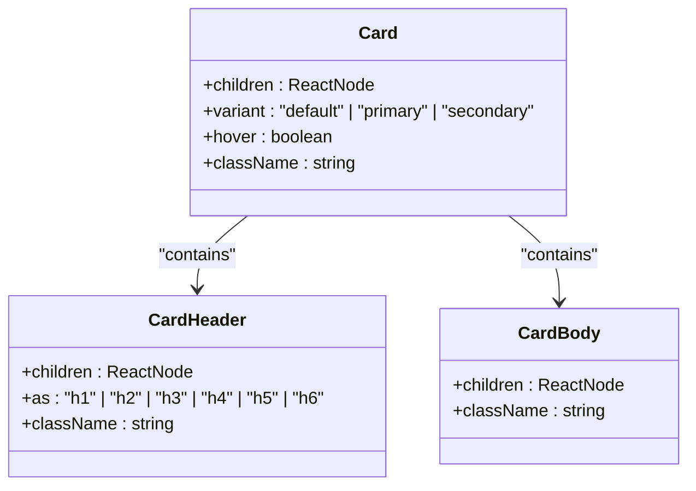
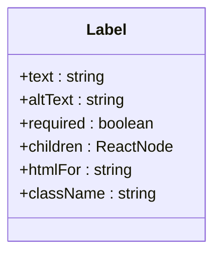
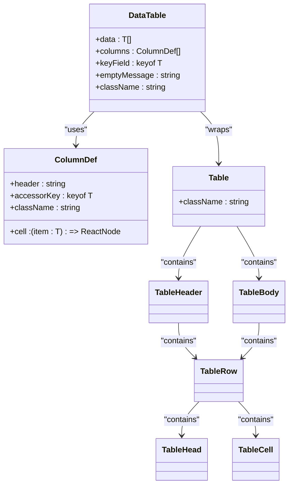
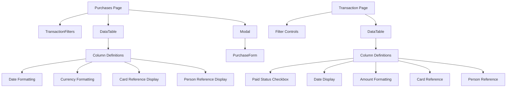

# Data Display Components

<cite>
**Referenced Files in This Document**   
- [Card.tsx](file://src/components/base/Card.tsx)
- [Label.tsx](file://src/components/base/Label.tsx)
- [DataTable.tsx](file://src/components/DataTable.tsx)
- [table.tsx](file://src/components/ui/table.tsx)
- [PurchaseDetailsCard.tsx](file://src/components/purchases/PurchaseDetailsCard.tsx)
- [theme.css](file://src/styles/design-system/theme.css)
- [globals.css](file://src/app/globals.css)
- [purchases/page.tsx](file://src/app/purchases/page.tsx)
- [transactions/page.tsx](file://src/app/transactions/page.tsx)
- [constants.ts](file://src/lib/constants.ts)
</cite>

## Table of Contents
1. [Introduction](#introduction)
2. [Card Component Architecture](#card-component-architecture)
3. [Label Component for Form Accessibility](#label-component-for-form-accessibility)
4. [Table Implementation with shadcn/ui](#table-implementation-with-shadcnui)
5. [Data Display Integration Patterns](#data-display-integration-patterns)
6. [Responsive Design and Accessibility](#responsive-design-and-accessibility)
7. [Conclusion](#conclusion)

## Introduction
This document details the structured data presentation components in the credit card tracking application. The system leverages a combination of Card, Label, and Table components to create a consistent, accessible, and visually coherent user interface for displaying financial data including transactions, purchases, and credit card information.

**Section sources**
- [Card.tsx](file://src/components/base/Card.tsx)
- [Label.tsx](file://src/components/base/Label.tsx)
- [DataTable.tsx](file://src/components/DataTable.tsx)

## Card Component Architecture

The Card component implements a composition pattern with Header and Body subcomponents, providing a flexible container for structured content display. The component supports multiple variants and interactive hover effects while maintaining design system consistency.

**Diagram sources**
- [Card.tsx](file://src/components/base/Card.tsx#L3-85)

The Card component offers three variants:
- **default**: Standard card with shadow and rounded corners
- **primary**: Features a primary background color from the design system
- **secondary**: Features a secondary background color from the design system

Hover effects are implemented through the `hover` prop, which adds a subtle shadow transition when enabled. The component integrates with the design system through consistent spacing (p-6) and shadow application, ensuring visual harmony across the application.

**Section sources**
- [Card.tsx](file://src/components/base/Card.tsx#L3-85)
- [theme.css](file://src/styles/design-system/theme.css#L1-35)

## Label Component for Form Accessibility

The Label component serves a critical role in form contexts, providing accessible labeling for input elements. It supports both primary text and alternative text display, with visual indicators for required fields.

**Diagram sources**
- [Label.tsx](file://src/components/base/Label.tsx#L3-43)

The component enhances accessibility by:
- Properly associating labels with form controls via the `htmlFor` attribute
- Displaying a visual asterisk (*) for required fields
- Supporting alternative text presentation for additional context
- Maintaining proper semantic HTML structure

When a field is marked as required, the component automatically appends a red asterisk, providing immediate visual feedback to users while maintaining accessibility standards.

**Section sources**
- [Label.tsx](file://src/components/base/Label.tsx#L3-43)
- [constants.ts](file://src/lib/constants.ts#L104-112)

## Table Implementation with shadcn/ui

The application implements a robust table system built on shadcn/ui components, providing comprehensive data display capabilities for transaction, purchase, and credit card data. The DataTable component wraps the underlying shadcn/ui Table implementation with additional functionality.

**Diagram sources**
- [DataTable.tsx](file://src/components/DataTable.tsx#L13-26)
- [table.tsx](file://src/components/ui/table.tsx#L7-91)

The table implementation includes:
- Sorting capabilities through column headers
- Pagination support via external state management
- Responsive design with horizontal scrolling on smaller screens
- Empty state handling with customizable messages
- Flexible cell rendering through the `cell` property in column definitions

The underlying shadcn/ui Table components provide additional features including zebra striping, pinned columns, and hover effects on table rows.

**Section sources**
- [DataTable.tsx](file://src/components/DataTable.tsx#L1-85)
- [table.tsx](file://src/components/ui/table.tsx#L1-116)

## Data Display Integration Patterns

The application demonstrates effective integration patterns between Cards and DataTables for feature pages. The PurchaseDetailsCard component shows how Cards can present detailed information in a structured format, while the purchases and transactions pages illustrate the use of DataTables for list views.

**Diagram sources**
- [purchases/page.tsx](file://src/app/purchases/page.tsx#L1-260)
- [transactions/page.tsx](file://src/app/transactions/page.tsx#L1-339)

Key integration patterns include:
- Using Cards with DataTables on the same page for different data presentation needs
- Implementing consistent formatting functions (date, currency) across components
- Leveraging the expand property pattern to access related data in table cells
- Maintaining visual consistency through shared design system variables

The PurchaseDetailsCard component specifically demonstrates how Cards can present complex purchase information with multiple data points in a clean, organized layout.

**Section sources**
- [PurchaseDetailsCard.tsx](file://src/components/purchases/PurchaseDetailsCard.tsx#L1-77)
- [purchases/page.tsx](file://src/app/purchases/page.tsx#L1-260)
- [transactions/page.tsx](file://src/app/transactions/page.tsx#L1-339)

## Responsive Design and Accessibility

The data display components implement responsive design principles and accessibility features to ensure usability across devices and for all users.

### Responsive Behavior
- Tables use `overflow-x-auto` to enable horizontal scrolling on mobile devices
- Grid layouts in cards adapt from single column to multi-column on larger screens
- Button text adapts between icon-only and text labels based on screen size
- Container spacing adjusts based on viewport width

### Accessibility Features
- Semantic HTML elements are used throughout (proper heading levels, table markup)
- ARIA labels are implemented for interactive elements
- Keyboard navigation is supported for all interactive components
- Color contrast meets WCAG standards through the design system
- Screen reader announcements are provided for dynamic content updates

The components work together to create a cohesive experience that maintains data hierarchy and readability across different contexts and device sizes.

**Section sources**
- [DataTable.tsx](file://src/components/DataTable.tsx#L36-38)
- [PurchaseDetailsCard.tsx](file://src/components/purchases/PurchaseDetailsCard.tsx#L21-22)
- [purchases/page.tsx](file://src/app/purchases/page.tsx#L215-237)
- [transactions/page.tsx](file://src/app/transactions/page.tsx#L257-268)

## Conclusion
The data display components in this application provide a robust foundation for presenting financial information in a clear, consistent, and accessible manner. The Card component offers flexible content organization with theming and hover effects, while the Label component ensures form accessibility. The DataTable implementation, built on shadcn/ui, delivers comprehensive data presentation capabilities with sorting, formatting, and responsive behavior. Together, these components create a cohesive design system that supports the application's core functionality of tracking credit cards, purchases, and transactions.