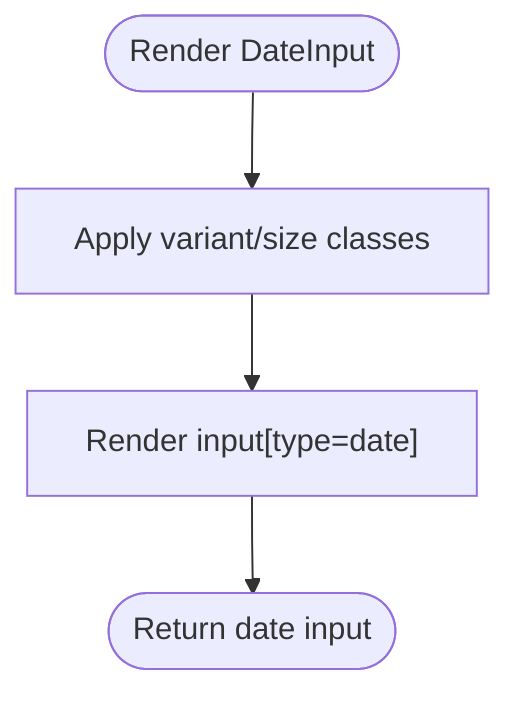

# Form Controls

<cite>
**Referenced Files in This Document**
- [Input.tsx](file://src/components/base/Input.tsx)
- [Select.tsx](file://src/components/base/Select.tsx)
- [Textarea.tsx](file://src/components/base/Textarea.tsx)
- [Checkbox.tsx](file://src/components/base/Checkbox.tsx)
- [DateInput.tsx](file://src/components/base/DateInput.tsx)
- [FormSelect.tsx](file://src/components/FormSelect.tsx)
- [select.tsx](file://src/components/ui/select.tsx)
- [useZodForm.ts](file://src/lib/hooks/useZodForm.ts)
- [schemas.ts](file://src/lib/schemas.ts)
- [CreditCardForm.tsx](file://src/components/credit-cards/CreditCardForm.tsx)
- [PersonForm.tsx](file://src/components/persons/PersonForm.tsx)
- [constants.ts](file://src/lib/constants.ts)
- [supabase.ts](file://src/lib/supabase.ts)
</cite>

## Table of Contents
1. [Introduction](#introduction)
2. [Project Structure](#project-structure)
3. [Core Components](#core-components)
4. [Architecture Overview](#architecture-overview)
5. [Detailed Component Analysis](#detailed-component-analysis)
6. [Dependency Analysis](#dependency-analysis)
7. [Performance Considerations](#performance-considerations)
8. [Troubleshooting Guide](#troubleshooting-guide)
9. [Conclusion](#conclusion)
10. [Appendices](#appendices)

## Introduction
This document explains the form control components used across the credit-card-tracker application. It focuses on:
- Input with label, error, and help text integration using daisyUI’s form-control classes
- Select component variants and sizes with proper option formatting
- Textarea extensibility and accessibility features
- Checkbox boolean state handling
- DateInput date formatting behavior
- FormSelect as a higher-level abstraction wrapping shadcn/ui’s Select with form-friendly event handling
- Examples of form composition using these controls with Zod validation through useZodForm hook
- Guidance on error state management, required field handling, and responsive form layouts

## Project Structure
The form controls are organized under base components and higher-level wrappers:
- Base components: Input, Select, Textarea, Checkbox, DateInput
- Higher-level wrapper: FormSelect (wraps shadcn/ui Select)
- Validation and forms: useZodForm hook and Zod schemas
- Example forms: CreditCardForm and PersonForm demonstrate composition and validation

**Diagram sources**
- [Input.tsx](file://src/components/base/Input.tsx#L1-L84)
- [Select.tsx](file://src/components/base/Select.tsx#L1-L78)
- [Textarea.tsx](file://src/components/base/Textarea.tsx#L1-L85)
- [Checkbox.tsx](file://src/components/base/Checkbox.tsx#L1-L92)
- [DateInput.tsx](file://src/components/base/DateInput.tsx#L1-L79)
- [FormSelect.tsx](file://src/components/FormSelect.tsx#L1-L77)
- [select.tsx](file://src/components/ui/select.tsx#L1-L189)
- [useZodForm.ts](file://src/lib/hooks/useZodForm.ts#L1-L83)
- [schemas.ts](file://src/lib/schemas.ts#L1-L62)
- [CreditCardForm.tsx](file://src/components/credit-cards/CreditCardForm.tsx#L1-L180)
- [PersonForm.tsx](file://src/components/persons/PersonForm.tsx#L1-L109)

**Section sources**
- [Input.tsx](file://src/components/base/Input.tsx#L1-L84)
- [Select.tsx](file://src/components/base/Select.tsx#L1-L78)
- [Textarea.tsx](file://src/components/base/Textarea.tsx#L1-L85)
- [Checkbox.tsx](file://src/components/base/Checkbox.tsx#L1-L92)
- [DateInput.tsx](file://src/components/base/DateInput.tsx#L1-L79)
- [FormSelect.tsx](file://src/components/FormSelect.tsx#L1-L77)
- [select.tsx](file://src/components/ui/select.tsx#L1-L189)
- [useZodForm.ts](file://src/lib/hooks/useZodForm.ts#L1-L83)
- [schemas.ts](file://src/lib/schemas.ts#L1-L62)
- [CreditCardForm.tsx](file://src/components/credit-cards/CreditCardForm.tsx#L1-L180)
- [PersonForm.tsx](file://src/components/persons/PersonForm.tsx#L1-L109)

## Core Components
- Input: Adds label, error, and help text support via daisyUI form-control wrapper and applies variant, size, and error classes.
- Select: Provides variant and size options with option formatting and integrates with daisyUI classes.
- Textarea: Mirrors Input’s label/error/help integration and supports variant and size classes.
- Checkbox: Supports label placement, variant, size, and error classes; handles boolean state via native checkbox.
- DateInput: Wraps native date input with variant and size classes; accepts min/max and placeholder.
- FormSelect: Higher-level wrapper around shadcn/ui Select that emits standard ChangeEvents for form handlers.

**Section sources**
- [Input.tsx](file://src/components/base/Input.tsx#L1-L84)
- [Select.tsx](file://src/components/base/Select.tsx#L1-L78)
- [Textarea.tsx](file://src/components/base/Textarea.tsx#L1-L85)
- [Checkbox.tsx](file://src/components/base/Checkbox.tsx#L1-L92)
- [DateInput.tsx](file://src/components/base/DateInput.tsx#L1-L79)
- [FormSelect.tsx](file://src/components/FormSelect.tsx#L1-L77)

## Architecture Overview
The form controls integrate with daisyUI for consistent styling and with shadcn/ui for accessible, modern Select behavior. Validation is centralized in useZodForm, which uses Zod schemas to manage values, errors, and validation lifecycle.

**Diagram sources**
- [CreditCardForm.tsx](file://src/components/credit-cards/CreditCardForm.tsx#L1-L180)
- [useZodForm.ts](file://src/lib/hooks/useZodForm.ts#L1-L83)
- [schemas.ts](file://src/lib/schemas.ts#L1-L62)
- [FormSelect.tsx](file://src/components/FormSelect.tsx#L1-L77)
- [select.tsx](file://src/components/ui/select.tsx#L1-L189)

## Detailed Component Analysis

### Input
- Purpose: Styled input with optional label, error, and help text integrated via daisyUI form-control wrapper.
- Key behaviors:
  - Variant classes: input-{variant}
  - Size classes: input-{size}
  - Error class: input-error toggled by error prop
  - Wraps label/error/help text in a form-control container when any are present
- Accessibility: Uses standard input attributes; label is associated via daisyUI label classes.

**Diagram sources**
- [Input.tsx](file://src/components/base/Input.tsx#L1-L84)

**Section sources**
- [Input.tsx](file://src/components/base/Input.tsx#L1-L84)

### Select
- Purpose: DaisyUI-styled select with variant and size options and option formatting.
- Options formatting:
  - Accepts SelectOption[] with value/label
  - Accepts string[] and auto-formats to SelectOption[]
- Variant and size:
  - Variants: bordered, ghost
  - Sizes: xs, sm, md, lg, xl
- Placeholder:
  - Renders disabled option when required is true

**Diagram sources**
- [Select.tsx](file://src/components/base/Select.tsx#L1-L78)

**Section sources**
- [Select.tsx](file://src/components/base/Select.tsx#L1-L78)

### Textarea
- Purpose: DaisyUI-styled textarea with label, error, and help text integration.
- Extensibility:
  - Inherits textarea attributes
  - Supports variant and size classes
- Accessibility:
  - Integrates with daisyUI form-control for consistent labeling and error display

**Diagram sources**
- [Textarea.tsx](file://src/components/base/Textarea.tsx#L1-L85)

**Section sources**
- [Textarea.tsx](file://src/components/base/Textarea.tsx#L1-L85)

### Checkbox
- Purpose: Boolean input with label positioning and variant, size, and error classes.
- Boolean state handling:
  - Uses native checkbox; handleChange updates boolean value for name
- Label placement:
  - labelPosition left or right

**Diagram sources**
- [Checkbox.tsx](file://src/components/base/Checkbox.tsx#L1-L92)

**Section sources**
- [Checkbox.tsx](file://src/components/base/Checkbox.tsx#L1-L92)

### DateInput
- Purpose: Native date input styled with DaisyUI classes.
- Date formatting behavior:
  - Uses type="date"; value and onChange are string-based
  - Accepts min, max, placeholder
  - Variant and size classes applied

**Diagram sources**
- [DateInput.tsx](file://src/components/base/DateInput.tsx#L1-L79)

**Section sources**
- [DateInput.tsx](file://src/components/base/DateInput.tsx#L1-L79)

### FormSelect (Higher-level abstraction)
- Purpose: Wraps shadcn/ui Select to emit standard ChangeEvents for form handlers.
- Event handling:
  - Converts onValueChange to onChange by constructing a synthetic ChangeEvent
  - Ensures consistent event shape for useZodForm
- Option formatting:
  - Accepts SelectOption[] or string[]
  - Auto-formats strings to SelectOption
- Integration:
  - Uses SelectTrigger, SelectContent, SelectItem, SelectValue from ui/select.tsx

**Diagram sources**
- [FormSelect.tsx](file://src/components/FormSelect.tsx#L1-L77)
- [select.tsx](file://src/components/ui/select.tsx#L1-L189)
- [useZodForm.ts](file://src/lib/hooks/useZodForm.ts#L1-L83)

**Section sources**
- [FormSelect.tsx](file://src/components/FormSelect.tsx#L1-L77)
- [select.tsx](file://src/components/ui/select.tsx#L1-L189)

## Dependency Analysis
- FormSelect depends on shadcn/ui Select primitives and emits events compatible with useZodForm.
- useZodForm depends on Zod schemas to validate and manage errors.
- CreditCardForm and PersonForm demonstrate composition with these controls and validation.

**Diagram sources**
- [schemas.ts](file://src/lib/schemas.ts#L1-L62)
- [useZodForm.ts](file://src/lib/hooks/useZodForm.ts#L1-L83)
- [CreditCardForm.tsx](file://src/components/credit-cards/CreditCardForm.tsx#L1-L180)
- [PersonForm.tsx](file://src/components/persons/PersonForm.tsx#L1-L109)
- [FormSelect.tsx](file://src/components/FormSelect.tsx#L1-L77)
- [select.tsx](file://src/components/ui/select.tsx#L1-L189)
- [Input.tsx](file://src/components/base/Input.tsx#L1-L84)
- [Select.tsx](file://src/components/base/Select.tsx#L1-L78)
- [Textarea.tsx](file://src/components/base/Textarea.tsx#L1-L85)
- [Checkbox.tsx](file://src/components/base/Checkbox.tsx#L1-L92)
- [DateInput.tsx](file://src/components/base/DateInput.tsx#L1-L79)

**Section sources**
- [schemas.ts](file://src/lib/schemas.ts#L1-L62)
- [useZodForm.ts](file://src/lib/hooks/useZodForm.ts#L1-L83)
- [CreditCardForm.tsx](file://src/components/credit-cards/CreditCardForm.tsx#L1-L180)
- [PersonForm.tsx](file://src/components/persons/PersonForm.tsx#L1-L109)
- [FormSelect.tsx](file://src/components/FormSelect.tsx#L1-L77)
- [select.tsx](file://src/components/ui/select.tsx#L1-L189)
- [Input.tsx](file://src/components/base/Input.tsx#L1-L84)
- [Select.tsx](file://src/components/base/Select.tsx#L1-L78)
- [Textarea.tsx](file://src/components/base/Textarea.tsx#L1-L85)
- [Checkbox.tsx](file://src/components/base/Checkbox.tsx#L1-L92)
- [DateInput.tsx](file://src/components/base/DateInput.tsx#L1-L79)

## Performance Considerations
- Prefer controlled components: All form controls accept value and onChange, enabling predictable updates.
- Memoization: useZodForm returns stable callbacks and memoized state to minimize re-renders.
- Conditional rendering: Components render minimal DOM when label/error/help are absent.
- Option formatting: FormSelect avoids unnecessary re-renders by formatting options once and passing them to Select primitives.

[No sources needed since this section provides general guidance]

## Troubleshooting Guide
- Error state management:
  - useZodForm clears per-field errors on user input to reduce noise.
  - Validate before submission to surface all errors.
- Required fields:
  - Set required on Select and Checkbox to leverage browser validation.
  - For Select, placeholder option is disabled when required is true.
- Responsive layouts:
  - Use w-full classes consistently across controls.
  - Group labels and controls in form-control containers for consistent spacing.
- Date formatting:
  - DateInput expects string dates; ensure backend or downstream consumers normalize to ISO date strings.

**Section sources**
- [useZodForm.ts](file://src/lib/hooks/useZodForm.ts#L1-L83)
- [Select.tsx](file://src/components/base/Select.tsx#L1-L78)
- [Checkbox.tsx](file://src/components/base/Checkbox.tsx#L1-L92)
- [DateInput.tsx](file://src/components/base/DateInput.tsx#L1-L79)

## Conclusion
The form controls are designed for consistency, accessibility, and composability:
- DaisyUI classes unify styling across Input, Select, Textarea, Checkbox, and DateInput.
- FormSelect bridges shadcn/ui Select with form-friendly events for seamless integration with useZodForm.
- Zod schemas provide robust validation and error reporting.
- Example forms demonstrate best practices for composing controls, handling boolean states, and managing required fields.

[No sources needed since this section summarizes without analyzing specific files]

## Appendices

### Example: Credit Card Form Composition
- Demonstrates:
  - useZodForm hook for values, errors, handleChange, and validate
  - FormSelect for issuer and principal card selection
  - Checkbox for supplementary card toggle
  - Conditional rendering based on boolean state
  - Zod refinement for conditional validation

**Diagram sources**
- [CreditCardForm.tsx](file://src/components/credit-cards/CreditCardForm.tsx#L1-L180)
- [useZodForm.ts](file://src/lib/hooks/useZodForm.ts#L1-L83)
- [schemas.ts](file://src/lib/schemas.ts#L1-L62)
- [FormSelect.tsx](file://src/components/FormSelect.tsx#L1-L77)

**Section sources**
- [CreditCardForm.tsx](file://src/components/credit-cards/CreditCardForm.tsx#L1-L180)
- [constants.ts](file://src/lib/constants.ts#L88-L112)
- [supabase.ts](file://src/lib/supabase.ts#L16-L39)

### Example: Person Form Composition
- Demonstrates:
  - useZodForm with personSchema
  - Controlled inputs and error display
  - Modal-based form with submit flow

**Section sources**
- [PersonForm.tsx](file://src/components/persons/PersonForm.tsx#L1-L109)
- [schemas.ts](file://src/lib/schemas.ts#L27-L31)
- [useZodForm.ts](file://src/lib/hooks/useZodForm.ts#L1-L83)