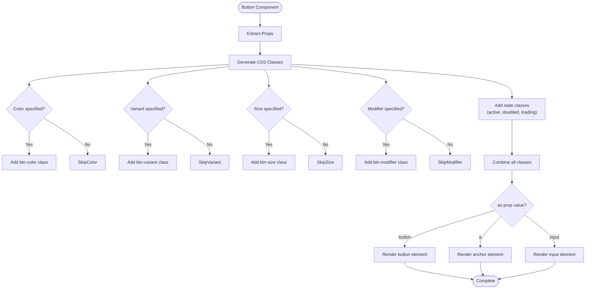
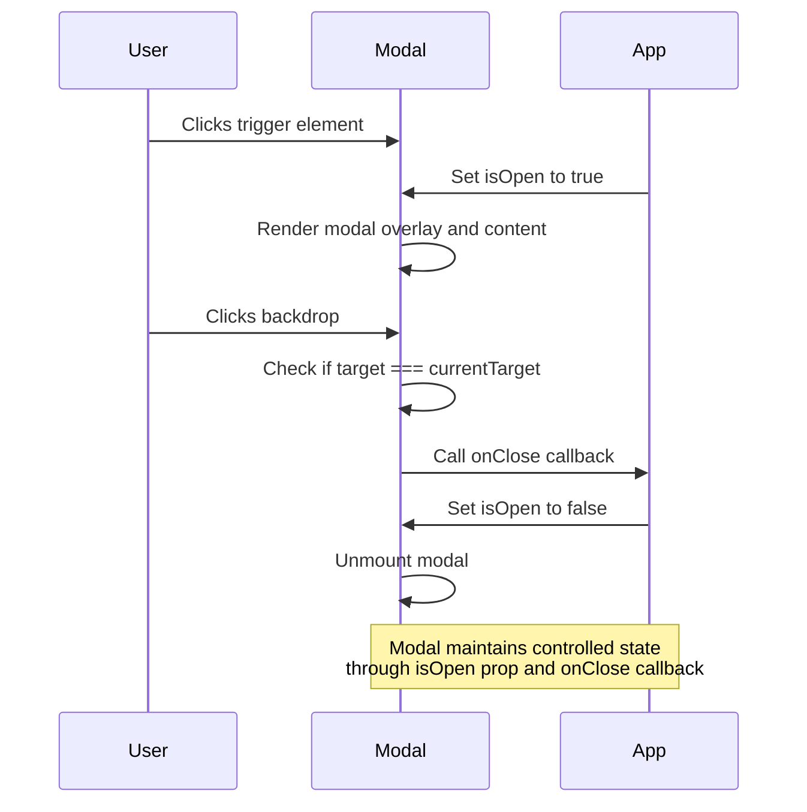
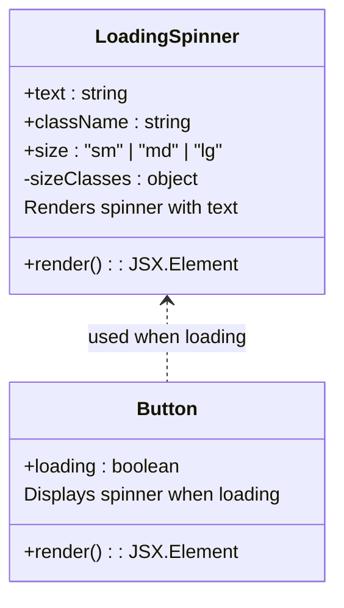
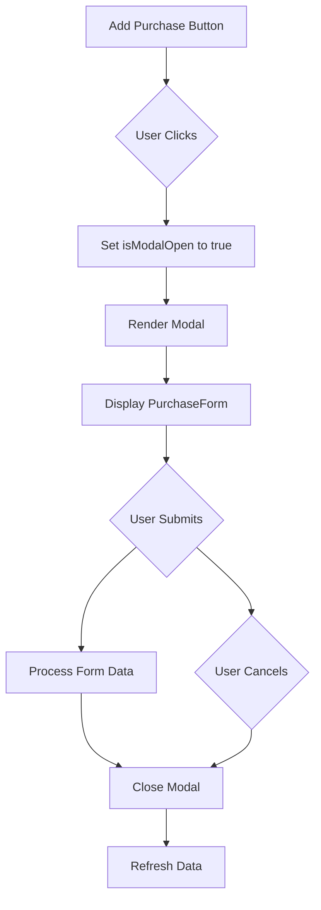
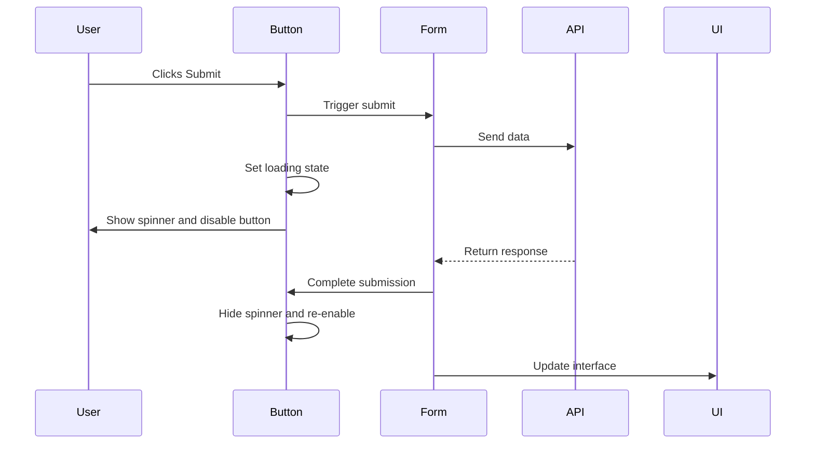

# Interactive Elements

<cite>
**Referenced Files in This Document**   
- [Button.tsx](file://src/components/base/Button.tsx)
- [Modal.tsx](file://src/components/Modal.tsx)
- [LoadingSpinner.tsx](file://src/components/base/LoadingSpinner.tsx)
- [index.ts](file://src/components/base/index.ts)
- [theme.css](file://src/styles/design-system/theme.css)
- [PurchaseForm.tsx](file://src/components/PurchaseForm.tsx)
- [page.tsx](file://src/app/purchases/page.tsx)
- [TransactionFilters.tsx](file://src/components/transactions/TransactionFilters.tsx)
</cite>

## Table of Contents
1. [Introduction](#introduction)
2. [Button Component](#button-component)
3. [Modal Component](#modal-component)
4. [LoadingSpinner Component](#loadingspinner-component)
5. [Component Integration Examples](#component-integration-examples)
6. [Accessibility Considerations](#accessibility-considerations)
7. [Conclusion](#conclusion)

## Introduction
This document provides comprehensive documentation for interactive UI components in the credit card tracker application. The components covered include Button, Modal, and LoadingSpinner, which enable user actions and feedback through various interactive patterns. These components are designed with daisyUI integration for consistent styling and extensive customization options. The documentation details the implementation, usage patterns, accessibility features, and integration examples for these core interactive elements.

## Button Component

The Button component is a versatile interactive element that supports extensive customization options through props. It integrates with daisyUI for consistent styling across the application.

### Customization Options
The Button component offers several props for customization:

- **color**: Controls the button's color scheme with options including "neutral", "primary", "secondary", "accent", "info", "success", "warning", and "error"
- **variant**: Defines the visual style with options like "outline", "dash", "soft", "ghost", and "link"
- **size**: Specifies the button size with values "xs", "sm", "md", "lg", and "xl"
- **modifier**: Applies additional styling with options such as "wide", "block", "square", and "circle"
- **active**: Indicates whether the button is in an active state
- **loading**: Shows a loading spinner when set to true
- **disabled**: Disables the button interaction

### Rendering Options with as Prop
The Button component supports different rendering options through the `as` prop:

- When `as="button"` (default): Renders as a standard button element
- When `as="a"`: Renders as an anchor element with the href prop for navigation
- When `as="input"`: Renders as an input element of type button

The component automatically applies appropriate accessibility attributes based on the rendering type, including proper role, tabIndex, and aria-disabled attributes when the button is disabled.

### Accessibility Implementation
The Button component includes built-in accessibility features:
- Automatically sets `aria-disabled="true"` when disabled
- Assigns `role="button"` for semantic clarity
- Manages tabIndex to ensure proper keyboard navigation
- Includes loading state indicators for screen readers

**Diagram sources**
- [Button.tsx](file://src/components/base/Button.tsx#L41-L62)

**Section sources**
- [Button.tsx](file://src/components/base/Button.tsx#L3-L21)
- [index.ts](file://src/components/base/index.ts#L2-L3)

## Modal Component

The Modal component provides a controlled dialog interface for displaying content that requires user attention.

### Controlled Behavior
The Modal component uses a controlled pattern with the following props:

- **isOpen**: Boolean that controls the visibility of the modal
- **onClose**: Callback function triggered when the modal should be closed
- **title**: String that appears in the modal header
- **children**: Content to be displayed within the modal body
- **maxWidth**: Controls the responsive sizing with options "sm", "md", "lg", and "xl"
- **className**: Additional CSS classes for custom styling

### Backdrop Dismissal
The modal supports backdrop dismissal through click handling on the overlay. When a user clicks on the backdrop (the area outside the modal content), the `onClose` callback is triggered, closing the modal. This is implemented through the `handleBackdropClick` function which checks if the click target is the event current target, ensuring only backdrop clicks trigger closure.

### Responsive Sizing
The maxWidth prop controls the modal's width on different screen sizes using predefined CSS classes:
- "sm": max-w-sm
- "md": max-w-md (default)
- "lg": max-w-lg
- "xl": max-w-xl

These classes are mapped through the MAX_WIDTH_CLASSES constant and applied to the modal container.

**Diagram sources**
- [Modal.tsx](file://src/components/Modal.tsx#L12-L17)
- [Modal.tsx](file://src/components/Modal.tsx#L29-L33)

**Section sources**
- [Modal.tsx](file://src/components/Modal.tsx#L3-L10)
- [Modal.tsx](file://src/components/Modal.tsx#L27-L34)

## LoadingSpinner Component

The LoadingSpinner component provides visual feedback for loading states in the application.

### Usage Options
The component accepts the following props:

- **text**: Custom text to display below the spinner (defaults to "Loading...")
- **className**: Additional CSS classes for custom styling
- **size**: Controls the spinner size with options "sm", "md", and "lg"

The component renders a centered spinner with optional text below it, making it suitable for both inline and full-screen loading states.

### Integration with Button
The LoadingSpinner is integrated directly into the Button component when the loading prop is true. In this case, a small spinner is displayed before the button text with appropriate spacing. The button is automatically disabled during the loading state to prevent multiple submissions.

### Standalone Usage
The LoadingSpinner can be used as a standalone component to indicate loading states in various parts of the application, such as during data fetching or processing operations.

**Diagram sources**
- [LoadingSpinner.tsx](file://src/components/base/LoadingSpinner.tsx#L3-L7)
- [Button.tsx](file://src/components/base/Button.tsx#L17-L18)
- [Button.tsx](file://src/components/base/Button.tsx#L102-L104)

**Section sources**
- [LoadingSpinner.tsx](file://src/components/base/LoadingSpinner.tsx#L1-L33)
- [Button.tsx](file://src/components/base/Button.tsx#L48-L49)

## Component Integration Examples

### Button with Modal for Confirmation Dialogs
The Button and Modal components are commonly used together to create confirmation dialogs. For example, in the purchases page, a button opens a modal for adding a new purchase:

This pattern is implemented in the purchases page where clicking the "Add Purchase" button opens a modal containing the PurchaseForm component.

### Button with LoadingSpinner for Async Operations
The Button component integrates the LoadingSpinner to provide feedback during asynchronous operations. When a form is being submitted, the button displays a loading state:

This pattern is used in the PurchaseForm component where the save button shows "Saving..." with a spinner during submission.

**Section sources**
- [PurchaseForm.tsx](file://src/components/PurchaseForm.tsx#L253-L264)
- [page.tsx](file://src/app/purchases/page.tsx#L243-L256)
- [TransactionFilters.tsx](file://src/components/transactions/TransactionFilters.tsx#L188-L191)

## Accessibility Considerations

### Focus Management
The interactive components implement proper focus management:

- The Button component maintains focusability through tabIndex and role attributes
- The Modal component traps focus within the modal when open
- Close buttons have appropriate focus indicators
- Keyboard navigation is preserved across all interactive elements

### Keyboard Navigation
All components support keyboard navigation:

- Buttons are accessible via tab navigation
- Modals can be closed with the Escape key
- Interactive elements respond to Enter and Space keys
- Focus order follows the visual layout of the interface

### ARIA Attributes
The components use appropriate ARIA attributes for accessibility:

- Modal uses role="dialog" and aria-modal="true" to identify it as a modal dialog
- Disabled buttons have aria-disabled="true"
- Interactive elements have proper roles assigned
- Close buttons include aria-label for screen readers
- Loading states are communicated to assistive technologies

### daisyUI Integration
The components leverage daisyUI for consistent accessibility features:

- Predefined color contrasts meet WCAG requirements
- Interactive elements have sufficient tap targets
- Focus rings are visible for keyboard navigation
- Semantic class names improve code readability
- Theme variables ensure consistent styling across components

The theme configuration in theme.css defines the dark color scheme with appropriate contrast ratios for text and interactive elements, ensuring readability and accessibility in low-light conditions.

**Section sources**
- [Button.tsx](file://src/components/base/Button.tsx#L70-L75)
- [Modal.tsx](file://src/components/Modal.tsx#L37-L38)
- [Modal.tsx](file://src/components/Modal.tsx#L52-L53)
- [theme.css](file://src/styles/design-system/theme.css#L1-L35)

## Conclusion
The interactive components in this application provide a robust foundation for user actions and feedback. The Button component offers extensive customization through daisyUI integration, while supporting multiple rendering options and accessibility features. The Modal component provides a controlled dialog interface with responsive sizing and backdrop dismissal. The LoadingSpinner component delivers clear visual feedback for loading states, both within buttons and as a standalone element. These components work together seamlessly to create intuitive user experiences, with proper accessibility considerations throughout. The integration patterns demonstrated in the application show how these components can be combined to create sophisticated interactive workflows while maintaining code consistency and accessibility standards.