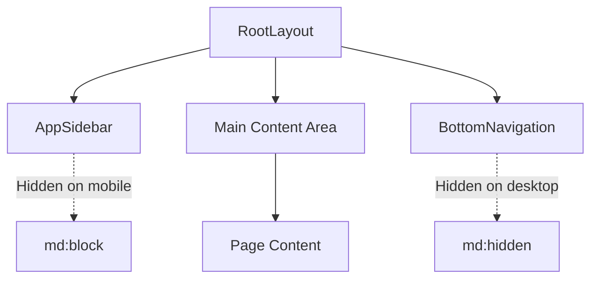
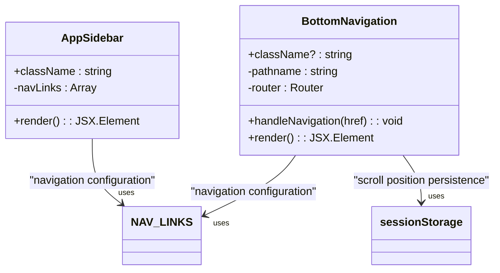
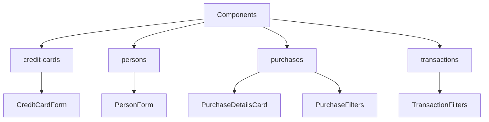
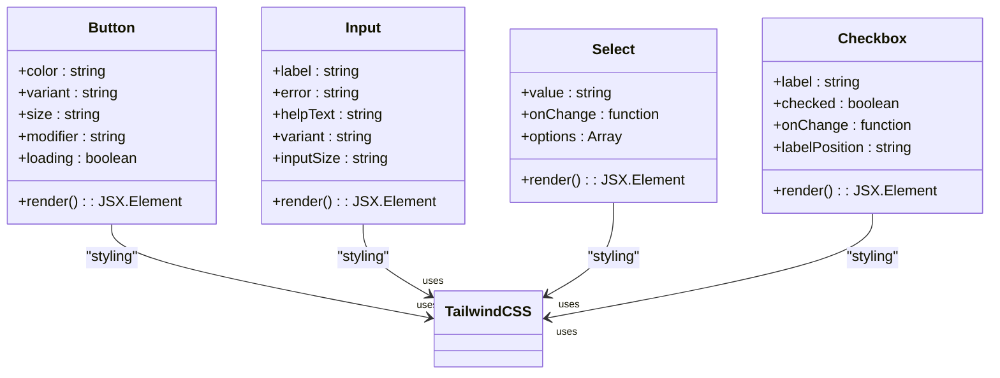
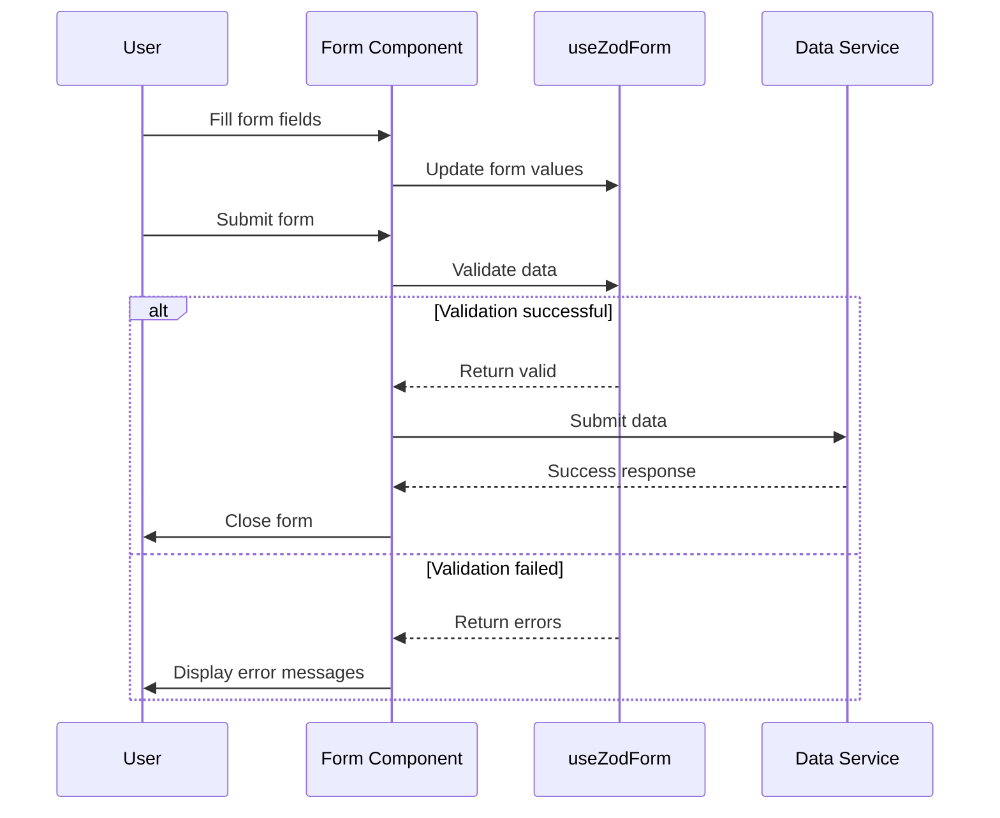
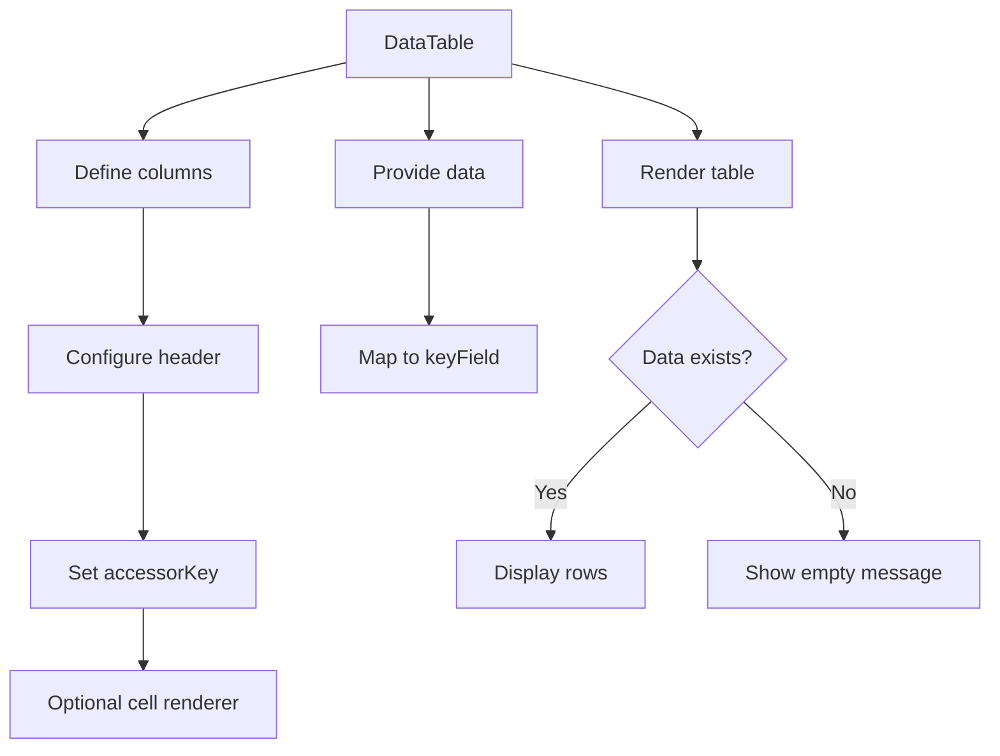
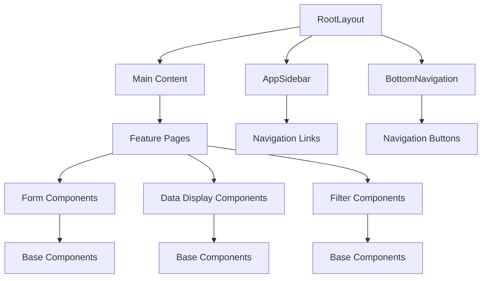
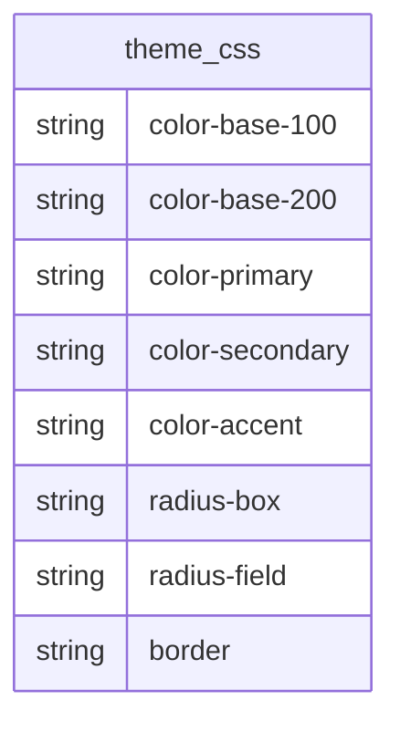

# Component Hierarchy

<cite>
**Referenced Files in This Document**   
- [layout.tsx](file://src/app/layout.tsx)
- [AppSidebar.tsx](file://src/components/AppSidebar.tsx)
- [BottomNavigation.tsx](file://src/components/BottomNavigation.tsx)
- [Button.tsx](file://src/components/base/Button.tsx)
- [Input.tsx](file://src/components/base/Input.tsx)
- [DataTable.tsx](file://src/components/DataTable.tsx)
- [CreditCardForm.tsx](file://src/components/credit-cards/CreditCardForm.tsx)
- [PersonForm.tsx](file://src/components/persons/PersonForm.tsx)
- [PurchaseForm.tsx](file://src/components/PurchaseForm.tsx)
- [PurchaseDetailsCard.tsx](file://src/components/purchases/PurchaseDetailsCard.tsx)
- [PurchaseFilters.tsx](file://src/components/purchases/PurchaseFilters.tsx)
- [TransactionFilters.tsx](file://src/components/transactions/TransactionFilters.tsx)
- [theme.css](file://src/styles/design-system/theme.css)
- [sidebar.tsx](file://src/components/ui/sidebar.tsx)
- [table.tsx](file://src/components/ui/table.tsx)
</cite>

## Table of Contents
1. [Introduction](#introduction)
2. [Root Layout Structure](#root-layout-structure)
3. [Navigation Components](#navigation-components)
4. [Component Organization by Feature Domain](#component-organization-by-feature-domain)
5. [Shared Base Components](#shared-base-components)
6. [Form Components](#form-components)
7. [Data Display Components](#data-display-components)
8. [System Context Diagrams](#system-context-diagrams)
9. [Cross-Cutting Concerns](#cross-cutting-concerns)
10. [Component Composition Patterns](#component-composition-patterns)
11. [Design System and Styling](#design-system-and-styling)
12. [Guidelines for New Component Creation](#guidelines-for-new-component-creation)

## Introduction
The credit-card-tracker application implements a component-based architecture with a clear hierarchy organized around feature domains and shared utilities. The frontend follows a responsive design pattern using Tailwind CSS, with distinct navigation patterns for desktop and mobile devices. This documentation details the component hierarchy, focusing on the root layout structure, navigation components, feature organization, and composition patterns that enable consistent UI development across the application.

## Root Layout Structure

The application's root layout is defined in `layout.tsx` and establishes the foundational structure for all pages. It implements a responsive design that displays the `AppSidebar` for desktop views (screen width ≥768px) and `BottomNavigation` for mobile views (screen width <768px). The layout uses Tailwind CSS classes to control visibility and positioning of navigation elements based on screen size.

**Diagram sources**
- [layout.tsx](file://src/app/layout.tsx#L38-L47)

**Section sources**
- [layout.tsx](file://src/app/layout.tsx#L28-L51)

## Navigation Components

The application implements dual navigation systems optimized for different device types. The `AppSidebar` component provides a persistent side navigation for desktop users, while `BottomNavigation` offers a fixed bottom navigation bar for mobile users.

### AppSidebar
The `AppSidebar` component renders a desktop navigation menu using the `Sidebar` component from the UI library. It maps navigation links from the `NAV_LINKS` constant and displays corresponding icons. The component is conditionally rendered using the Tailwind CSS class `hidden md:block`, ensuring it only appears on medium and larger screens.

### BottomNavigation
The `BottomNavigation` component provides a mobile-optimized navigation experience with touch-friendly buttons. It includes accessibility features such as proper ARIA labels, focus management, and minimum tap target sizes (44px). The component implements scroll position persistence using `sessionStorage` to restore the user's scroll position when navigating between pages.

**Diagram sources**
- [AppSidebar.tsx](file://src/components/AppSidebar.tsx#L17-L32)
- [BottomNavigation.tsx](file://src/components/BottomNavigation.tsx#L14-L105)

**Section sources**
- [AppSidebar.tsx](file://src/components/AppSidebar.tsx#L1-L32)
- [BottomNavigation.tsx](file://src/components/BottomNavigation.tsx#L1-L105)

## Component Organization by Feature Domain

The application organizes components by feature domains, creating a clear separation of concerns and enabling focused development. The primary feature domains are:

- **credit-cards**: Components related to credit card management
- **persons**: Components for person/contact management
- **purchases**: Components for purchase tracking and details
- **transactions**: Components for transaction filtering and display

Each feature domain has its own directory under `src/components`, containing specialized components that encapsulate the functionality for that domain. This organization enables developers to locate and modify feature-specific components efficiently.

**Diagram sources**
- [CreditCardForm.tsx](file://src/components/credit-cards/CreditCardForm.tsx#L17-L180)
- [PersonForm.tsx](file://src/components/persons/PersonForm.tsx#L14-L109)
- [PurchaseDetailsCard.tsx](file://src/components/purchases/PurchaseDetailsCard.tsx#L9-L78)
- [PurchaseFilters.tsx](file://src/components/purchases/PurchaseFilters.tsx#L19-L149)
- [TransactionFilters.tsx](file://src/components/transactions/TransactionFilters.tsx#L38-L196)

**Section sources**
- [CreditCardForm.tsx](file://src/components/credit-cards/CreditCardForm.tsx#L1-L180)
- [PersonForm.tsx](file://src/components/persons/PersonForm.tsx#L1-L109)
- [PurchaseDetailsCard.tsx](file://src/components/purchases/PurchaseDetailsCard.tsx#L1-L78)
- [PurchaseFilters.tsx](file://src/components/purchases/PurchaseFilters.tsx#L1-L149)
- [TransactionFilters.tsx](file://src/components/transactions/TransactionFilters.tsx#L1-L196)

## Shared Base Components

The application includes a collection of reusable base components in the `src/components/base` directory. These components provide consistent styling and behavior across the application:

- **Button**: Configurable button with color, variant, size, and modifier options
- **Input**: Form input with label, error messaging, and validation states
- **Select**: Dropdown select component
- **Checkbox**: Checkbox input with label positioning options
- **DateInput**: Date input field
- **Textarea**: Multi-line text input
- **Label**: Form label component
- **LoadingSpinner**: Loading indicator

These base components implement the application's design system and ensure visual consistency across all feature areas.

**Diagram sources**
- [Button.tsx](file://src/components/base/Button.tsx#L23-L115)
- [Input.tsx](file://src/components/base/Input.tsx#L20-L84)

**Section sources**
- [Button.tsx](file://src/components/base/Button.tsx#L1-L115)
- [Input.tsx](file://src/components/base/Input.tsx#L1-L84)

## Form Components

The application implements specialized form components for each feature domain, following a consistent pattern of composition using base components. These forms handle data entry, validation, and submission for their respective entities.

### CreditCardForm
The `CreditCardForm` component manages credit card data entry with fields for card name, last four digits, cardholder name, issuer, and supplementary card configuration. It conditionally displays the principal card selection field when the supplementary card checkbox is checked.

### PersonForm
The `PersonForm` component provides a modal interface for adding or editing person records. It includes name input with validation and handles form submission with loading states.

### PurchaseForm
The `PurchaseForm` component collects purchase details including credit card, person, date, amount, description, installments, and BNPL status. It initializes default values when credit cards and persons are available.

**Diagram sources**
- [CreditCardForm.tsx](file://src/components/credit-cards/CreditCardForm.tsx#L17-L180)
- [PersonForm.tsx](file://src/components/persons/PersonForm.tsx#L14-L109)
- [PurchaseForm.tsx](file://src/components/PurchaseForm.tsx#L39-L269)

**Section sources**
- [CreditCardForm.tsx](file://src/components/credit-cards/CreditCardForm.tsx#L1-L180)
- [PersonForm.tsx](file://src/components/persons/PersonForm.tsx#L1-L109)
- [PurchaseForm.tsx](file://src/components/PurchaseForm.tsx#L1-L269)

## Data Display Components

The application includes specialized components for displaying data in various formats, ensuring consistent presentation across feature areas.

### DataTable
The `DataTable` component provides a reusable table interface for displaying tabular data. It accepts generic data and column definitions, supporting custom cell rendering and empty state messaging. The component wraps the UI library's table components with application-specific styling.

### PurchaseDetailsCard
The `PurchaseDetailsCard` component displays detailed information about a purchase in a structured format, showing date, amount, credit card, person, installments, and BNPL status.

### Filter Components
The application implements filter components (`PurchaseFilters`, `TransactionFilters`) that provide interactive filtering interfaces for data views. These components use form controls to collect filter criteria and propagate changes to parent components.

**Diagram sources**
- [DataTable.tsx](file://src/components/DataTable.tsx#L28-L86)
- [PurchaseDetailsCard.tsx](file://src/components/purchases/PurchaseDetailsCard.tsx#L9-L78)
- [TransactionFilters.tsx](file://src/components/transactions/TransactionFilters.tsx#L38-L196)

**Section sources**
- [DataTable.tsx](file://src/components/DataTable.tsx#L1-L86)
- [PurchaseDetailsCard.tsx](file://src/components/purchases/PurchaseDetailsCard.tsx#L1-L78)
- [TransactionFilters.tsx](file://src/components/transactions/TransactionFilters.tsx#L1-L196)

## System Context Diagrams

The following diagrams illustrate the parent-child relationships between layout, pages, and components in the application.

**Diagram sources**
- [layout.tsx](file://src/app/layout.tsx#L38-L47)
- [AppSidebar.tsx](file://src/components/AppSidebar.tsx#L17-L32)
- [BottomNavigation.tsx](file://src/components/BottomNavigation.tsx#L14-L105)

## Cross-Cutting Concerns

### Responsive Design
The application implements responsive design using Tailwind CSS breakpoints:
- Mobile: <768px (uses `BottomNavigation`)
- Desktop: ≥768px (uses `AppSidebar`)
- Additional breakpoints for layout adjustments (e.g., grid columns)

### Accessibility
The application includes several accessibility features:
- Proper ARIA labels and roles
- Focus management in navigation components
- Minimum tap target sizes (44px) for mobile navigation
- Semantic HTML structure
- Keyboard navigation support

### State Management
The application uses React hooks for state management:
- `useZodForm` for form state and validation
- `usePathname` and `useRouter` for navigation state
- Local component state for UI interactions

**Section sources**
- [layout.tsx](file://src/app/layout.tsx#L38-L47)
- [BottomNavigation.tsx](file://src/components/BottomNavigation.tsx#L14-L105)
- [CreditCardForm.tsx](file://src/components/credit-cards/CreditCardForm.tsx#L17-L180)

## Component Composition Patterns

The application follows consistent composition patterns that enable reusable and maintainable components:

1. **Container-Component Pattern**: Feature pages act as containers that manage data and pass props to specialized components
2. **Form Composition**: Form components are composed of base input components with consistent validation patterns
3. **Filter-Data Pattern**: Filter components collect criteria and pass them to data display components
4. **Modal Pattern**: Modal dialogs wrap form components with consistent open/close behavior

These patterns ensure that components are focused on specific responsibilities and can be reused across different contexts.

**Section sources**
- [CreditCardForm.tsx](file://src/components/credit-cards/CreditCardForm.tsx#L17-L180)
- [PersonForm.tsx](file://src/components/persons/PersonForm.tsx#L14-L109)
- [PurchaseForm.tsx](file://src/components/PurchaseForm.tsx#L39-L269)
- [DataTable.tsx](file://src/components/DataTable.tsx#L28-L86)

## Design System and Styling

The application implements a design system through the `src/styles/design-system` directory, which includes:

- **theme.css**: Defines the application's color scheme, spacing, and typography using DaisyUI
- **typography.css**: Standardizes text styles across the application

The design system enforces consistency through:
- Predefined color palette (base, primary, secondary, etc.)
- Standardized spacing and border radii
- Consistent typography hierarchy
- Unified component styling via Tailwind CSS classes

The application uses a dark theme with high contrast for improved readability.

**Diagram sources**
- [theme.css](file://src/styles/design-system/theme.css#L1-L35)

**Section sources**
- [theme.css](file://src/styles/design-system/theme.css#L1-L35)

## Guidelines for New Component Creation

When creating new components for the credit-card-tracker application, follow these guidelines:

1. **Organize by Feature Domain**: Place new components in the appropriate feature directory (`credit-cards`, `persons`, `purchases`, `transactions`) or in `base` if they are general-purpose.

2. **Use Base Components**: Leverage existing base components (`Button`, `Input`, `Select`, etc.) rather than creating new ones to maintain consistency.

3. **Implement Responsive Design**: Ensure components work well on both mobile and desktop viewports using Tailwind CSS responsive classes.

4. **Follow Accessibility Standards**: Include proper ARIA attributes, keyboard navigation, and sufficient color contrast.

5. **Adhere to Design System**: Use the defined color palette, spacing, and typography from the design system.

6. **Document Props**: Type all component props using TypeScript interfaces and provide clear documentation.

7. **Handle Loading and Error States**: Implement appropriate UI for loading and error conditions.

8. **Test Responsiveness**: Verify component appearance and behavior across different screen sizes.

9. **Use Semantic HTML**: Structure components with appropriate HTML elements for better accessibility and SEO.

10. **Consider Reusability**: Design components to be reusable across different contexts when possible.

**Section sources**
- [Button.tsx](file://src/components/base/Button.tsx#L3-L21)
- [Input.tsx](file://src/components/base/Input.tsx#L3-L18)
- [DataTable.tsx](file://src/components/DataTable.tsx#L13-L26)
- [theme.css](file://src/styles/design-system/theme.css#L1-L35)