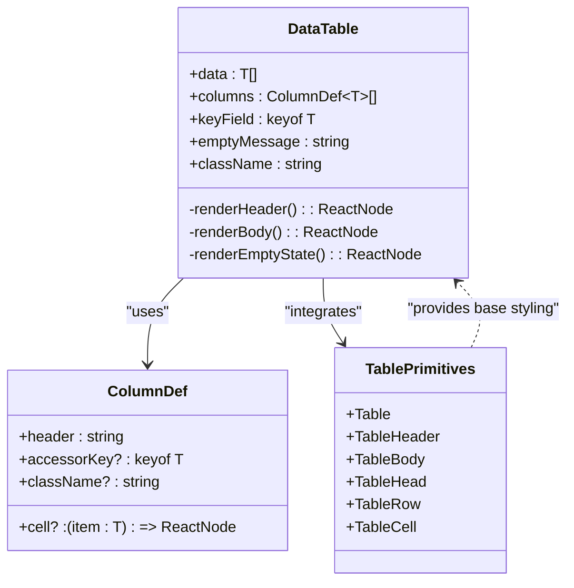
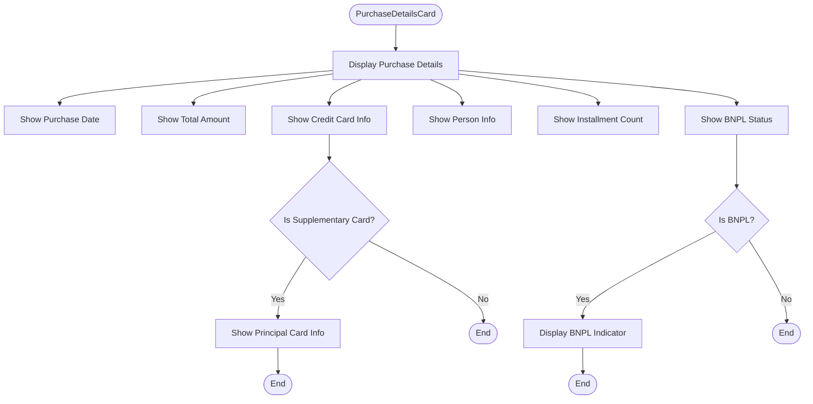
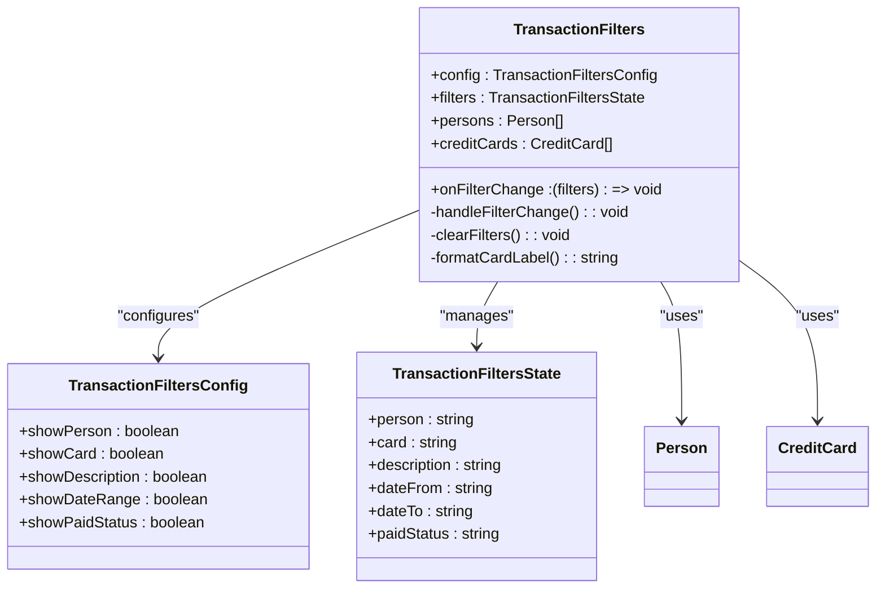
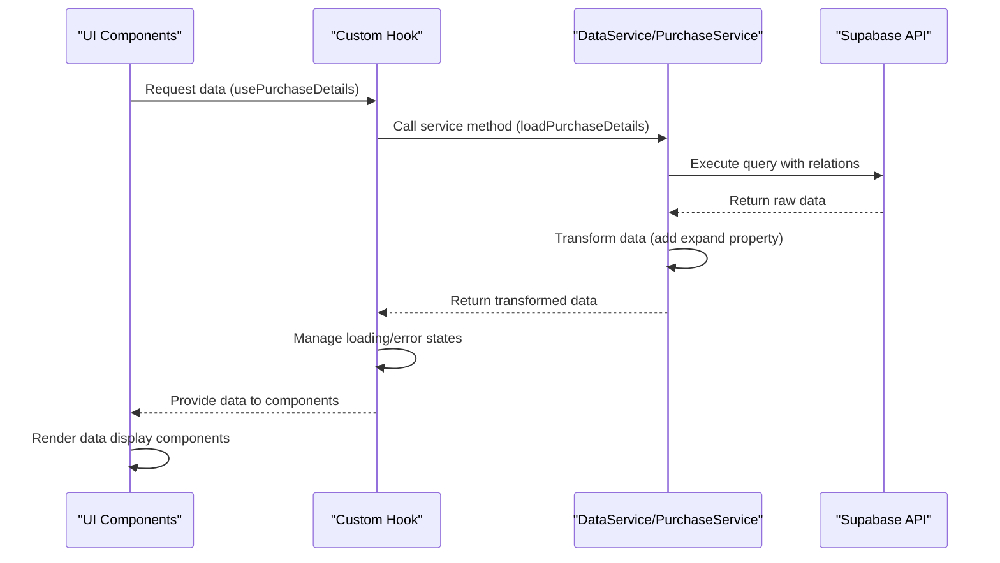

# Data Display Components

<cite>
**Referenced Files in This Document**   
- [DataTable.tsx](file://src/components/DataTable.tsx)
- [table.tsx](file://src/components/ui/table.tsx)
- [PurchaseDetailsCard.tsx](file://src/components/purchases/PurchaseDetailsCard.tsx)
- [TransactionFilters.tsx](file://src/components/transactions/TransactionFilters.tsx)
- [PurchaseFilters.tsx](file://src/components/purchases/PurchaseFilters.tsx)
- [usePurchaseDetails.ts](file://src/lib/hooks/usePurchaseDetails.ts)
- [dataService.ts](file://src/lib/services/dataService.ts)
- [purchaseService.ts](file://src/lib/services/purchaseService.ts)
- [supabase.ts](file://src/lib/supabase.ts)
- [constants.ts](file://src/lib/constants.ts)
- [utils.ts](file://src/lib/utils.ts)
- [page.tsx](file://src/app/purchases/page.tsx)
- [page.tsx](file://src/app/transactions/page.tsx)
- [page.tsx](file://src/app/purchases/[id]/page.tsx)
</cite>

## Table of Contents
1. [Introduction](#introduction)
2. [Core Data Display Components](#core-data-display-components)
3. [DataTable Architecture](#datatable-architecture)
4. [PurchaseDetailsCard Component](#purchasedetailscard-component)
5. [Filtering Components](#filtering-components)
6. [Data Integration Patterns](#data-integration-patterns)
7. [Performance Considerations](#performance-considerations)
8. [Accessibility Compliance](#accessibility-compliance)
9. [Component Creation Guidelines](#component-creation-guidelines)

## Introduction
The credit-card-tracker application features a robust set of data display components designed for efficient rendering of financial data. This documentation focuses on the architectural patterns of key components including DataTable, PurchaseDetailsCard, and filtering components. These components follow React best practices for reusability, type safety, and performance optimization while providing a consistent user experience across the application.

## Core Data Display Components

The application's data visualization layer consists of three primary component types:
- **DataTable**: A generic, reusable table component for displaying tabular data
- **PurchaseDetailsCard**: A specialized component for visualizing purchase details and installment schedules
- **Filtering Components**: Interactive controls for filtering transaction and purchase records

These components work together to provide a comprehensive view of financial data while maintaining separation of concerns and reusability.

**Section sources**
- [DataTable.tsx](file://src/components/DataTable.tsx)
- [PurchaseDetailsCard.tsx](file://src/components/purchases/PurchaseDetailsCard.tsx)
- [TransactionFilters.tsx](file://src/components/transactions/TransactionFilters.tsx)

## DataTable Architecture

The DataTable component serves as a generic, reusable table implementation that accepts typed data and column definitions. It leverages shadcn/ui table primitives while adding additional functionality for responsive design and customization.

**Diagram sources**
- [DataTable.tsx](file://src/components/DataTable.tsx#L13-L26)
- [table.tsx](file://src/components/ui/table.tsx#L7-L116)

### Integration with shadcn/ui Primitives
The DataTable component integrates with shadcn/ui table primitives through composition rather than extension. It uses the following shadcn/ui components:
- Table: Base table container with responsive overflow handling
- TableHeader: Header section with proper styling
- TableBody: Body section with row styling
- TableHead: Individual header cells
- TableRow: Table rows with hover states
- TableCell: Data cells with proper spacing

The integration maintains the styling and accessibility features of shadcn/ui while adding application-specific functionality like empty state handling and flexible cell rendering.

### Responsive Overflow Handling
The DataTable implements responsive overflow handling through CSS overflow properties and container styling. The component wraps the table in a div with `overflow-x-auto` class, enabling horizontal scrolling on smaller screens. This approach ensures that tables with many columns remain accessible on mobile devices without compromising the desktop experience.

The responsive design follows these principles:
- Horizontal scrolling for overflow content
- Fixed column pinning for key identifiers
- Mobile-optimized touch targets
- Consistent spacing across breakpoints

**Section sources**
- [DataTable.tsx](file://src/components/DataTable.tsx#L36-L85)
- [table.tsx](file://src/components/ui/table.tsx#L9-L15)

## PurchaseDetailsCard Component

The PurchaseDetailsCard component provides a detailed visualization of purchase information, including installment schedules and associated metadata. It serves as a dedicated view for individual purchase records.

**Diagram sources**
- [PurchaseDetailsCard.tsx](file://src/components/purchases/PurchaseDetailsCard.tsx#L5-L77)

### Installment Schedule Visualization
The PurchaseDetailsCard component displays key information about purchases, including:
- Purchase description and date
- Total amount with currency formatting
- Associated credit card with issuer and last four digits
- Person responsible for the purchase
- Number of installments
- BNPL (Buy Now, Pay Later) status

While the component doesn't display the full installment schedule, it provides the essential context needed to understand the purchase's financial impact. The full transaction details are available in the DataTable component on the purchase detail page.

### Data Transformation and Display
The component receives a Purchase object with expanded relations, allowing it to access related data without additional API calls. It transforms the raw data into a user-friendly format:
- Dates are formatted using the formatDate utility
- Currency amounts are displayed with proper formatting and decimal places
- Credit card information is presented with masked digits
- Supplementary card status is clearly indicated

The component handles edge cases gracefully, displaying "Unknown Card" or "Unknown Person" when related data is missing.

**Section sources**
- [PurchaseDetailsCard.tsx](file://src/components/purchases/PurchaseDetailsCard.tsx#L1-L77)
- [supabase.ts](file://src/lib/supabase.ts#L41-L58)
- [utils.ts](file://src/lib/utils.ts#L15-L16)

## Filtering Components

The application includes two filtering components that provide interactive controls for narrowing down transaction and purchase records.

### TransactionFilters Component
The TransactionFilters component provides a comprehensive set of filtering options for transaction records. It supports filtering by:
- Person
- Credit card
- Description (text search)
- Date range
- Payment status

**Diagram sources**
- [TransactionFilters.tsx](file://src/components/transactions/TransactionFilters.tsx#L4-L196)

### PurchaseFilters Component
The PurchaseFilters component provides a simplified filtering interface specifically for purchase records. It supports filtering by:
- Person
- Credit card
- Description (text search)
- Payment status

Both filtering components follow the same design pattern:
- Controlled component pattern with props for current filter state
- Callback function for filter changes
- Configurable visibility of filter fields
- Clear filters functionality
- Responsive layout with grid system

**Section sources**
- [TransactionFilters.tsx](file://src/components/transactions/TransactionFilters.tsx#L1-L196)
- [PurchaseFilters.tsx](file://src/components/purchases/PurchaseFilters.tsx#L1-L149)

## Data Integration Patterns

The data display components integrate with backend services through a well-defined pattern of hooks, services, and data transformation.

### Service Layer Architecture
The application uses a service layer pattern with DataService and PurchaseService classes that handle data retrieval and manipulation. These services:
- Abstract the Supabase API calls
- Transform raw data into application-specific formats
- Handle error cases gracefully
- Provide type-safe interfaces

**Diagram sources**
- [usePurchaseDetails.ts](file://src/lib/hooks/usePurchaseDetails.ts#L5-L62)
- [purchaseService.ts](file://src/lib/services/purchaseService.ts#L3-L87)
- [dataService.ts](file://src/lib/services/dataService.ts#L3-L164)

### Data Transformation Strategy
The application implements a consistent data transformation strategy where raw API responses are transformed to include an expand property. This pattern:
- Flattens nested relations for easier access
- Maintains type safety through TypeScript interfaces
- Reduces the need for null checks in components
- Provides a consistent data structure across components

The transformation occurs in service methods, ensuring that components receive data in a ready-to-use format.

### Hook-based Data Management
Custom hooks like usePurchaseDetails encapsulate data fetching logic and state management. These hooks:
- Handle loading and error states
- Manage side effects with useEffect
- Provide stable callback functions
- Enable easy testing and reuse

The hook pattern separates data concerns from presentation, allowing components to focus on rendering.

**Section sources**
- [usePurchaseDetails.ts](file://src/lib/hooks/usePurchaseDetails.ts#L1-L62)
- [purchaseService.ts](file://src/lib/services/purchaseService.ts#L3-L87)
- [dataService.ts](file://src/lib/services/dataService.ts#L3-L164)

## Performance Considerations

The data display components implement several performance optimizations to ensure smooth rendering, especially with larger datasets.

### Efficient Rendering Patterns
The components follow React best practices for performance:
- Keys are used appropriately (keyField prop in DataTable)
- useMemo is used for expensive computations (filteredTransactions)
- Callback functions are memoized with useCallback where needed
- State updates are batched and optimized

### Virtualization Needs
While the current implementation does not include virtualization, it would be beneficial for:
- Large transaction lists (hundreds or thousands of records)
- Long purchase histories
- Complex filtering operations

Potential virtualization solutions include:
- react-window for list virtualization
- TanStack Virtual for table virtualization
- Custom intersection observer implementation

### Optimization Recommendations
For optimal performance with large datasets:
- Implement pagination for large result sets
- Add virtualization for long lists
- Optimize filtering algorithms
- Implement memoization for expensive cell renders
- Consider server-side filtering and sorting

The current filtering implementation performs client-side filtering, which works well for moderate datasets but could be optimized for larger collections.

**Section sources**
- [DataTable.tsx](file://src/components/DataTable.tsx#L28-L85)
- [page.tsx](file://src/app/purchases/page.tsx#L102-L115)
- [page.tsx](file://src/app/transactions/page.tsx#L128-L153)
- [page.tsx](file://src/app/purchases/[id]/page.tsx#L36-L51)

## Accessibility Compliance

The data display components implement several accessibility features to ensure usability for all users, including those using screen readers.

### Semantic HTML Structure
The components use proper semantic HTML elements:
- Tables use proper table structure (table, thead, tbody, tr, th, td)
- Form controls are properly labeled
- Interactive elements have appropriate roles
- ARIA attributes are used where needed

### Screen Reader Support
Key accessibility features include:
- Proper heading hierarchy
- Descriptive labels for form controls
- ARIA labels for interactive elements
- Keyboard navigation support
- Focus management

The DataTable component includes aria-label attributes for interactive elements like checkboxes, ensuring screen reader users understand their purpose.

### Keyboard Navigation
The components support keyboard navigation through:
- Tab navigation between interactive elements
- Space/Enter to activate buttons and checkboxes
- Proper focus indicators
- Logical tab order

The filtering components are fully keyboard accessible, allowing users to navigate and modify filters without a mouse.

**Section sources**
- [DataTable.tsx](file://src/components/DataTable.tsx#L214-L240)
- [TransactionFilters.tsx](file://src/components/transactions/TransactionFilters.tsx#L78-L195)
- [PurchaseDetailsCard.tsx](file://src/components/purchases/PurchaseDetailsCard.tsx#L13-L76)

## Component Creation Guidelines

When creating new data display components for the credit-card-tracker application, follow these guidelines to maintain consistency with existing patterns.

### Design Principles
- **Reusability**: Design components to be generic and reusable across multiple contexts
- **Type Safety**: Use TypeScript generics and interfaces for type safety
- **Separation of Concerns**: Separate data fetching from presentation
- **Responsive Design**: Ensure components work well on all screen sizes
- **Accessibility**: Follow WCAG guidelines and test with screen readers

### Implementation Patterns
Follow the established patterns for:
- **Props**: Use clear, descriptive prop names with TypeScript interfaces
- **Styling**: Use Tailwind CSS with consistent class naming
- **Error Handling**: Gracefully handle loading and error states
- **Performance**: Optimize rendering and avoid unnecessary re-renders
- **Testing**: Write unit and integration tests for new components

### Integration with Existing Architecture
New components should:
- Integrate with the existing service layer
- Use consistent data transformation patterns
- Follow the same accessibility standards
- Maintain visual consistency with the design system
- Work with the existing routing and state management

By following these guidelines, new data display components will integrate seamlessly with the existing application architecture while maintaining high quality and consistency.

**Section sources**
- [DataTable.tsx](file://src/components/DataTable.tsx)
- [PurchaseDetailsCard.tsx](file://src/components/purchases/PurchaseDetailsCard.tsx)
- [TransactionFilters.tsx](file://src/components/transactions/TransactionFilters.tsx)
- [usePurchaseDetails.ts](file://src/lib/hooks/usePurchaseDetails.ts)
- [dataService.ts](file://src/lib/services/dataService.ts)