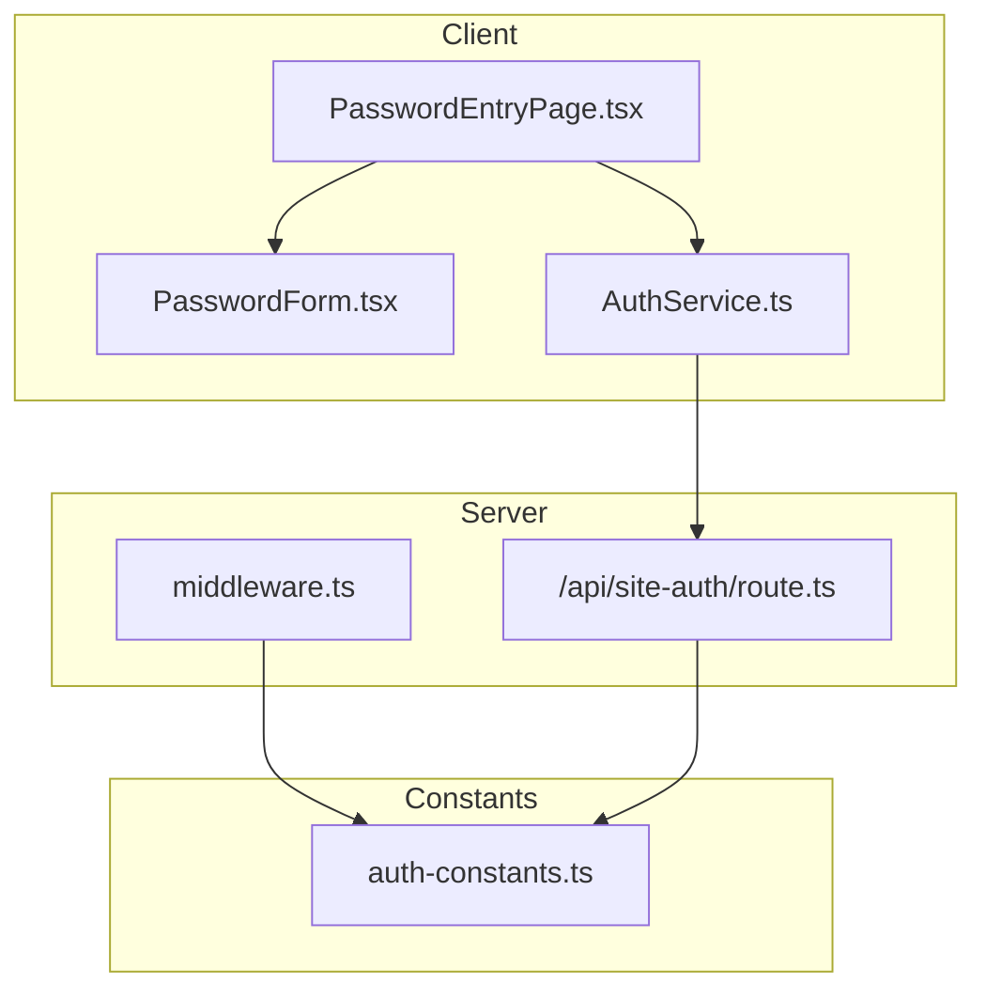
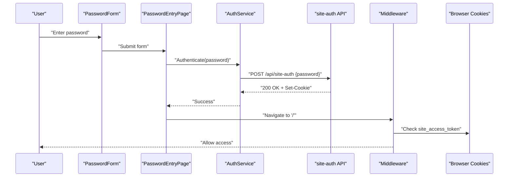
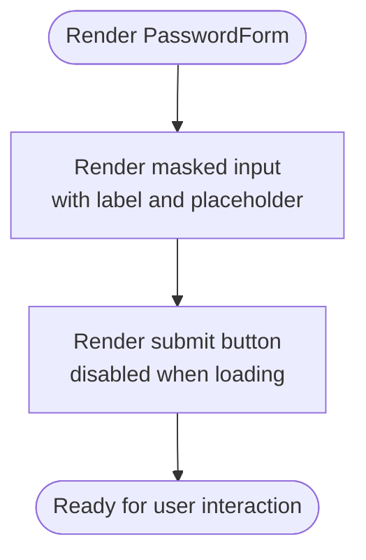
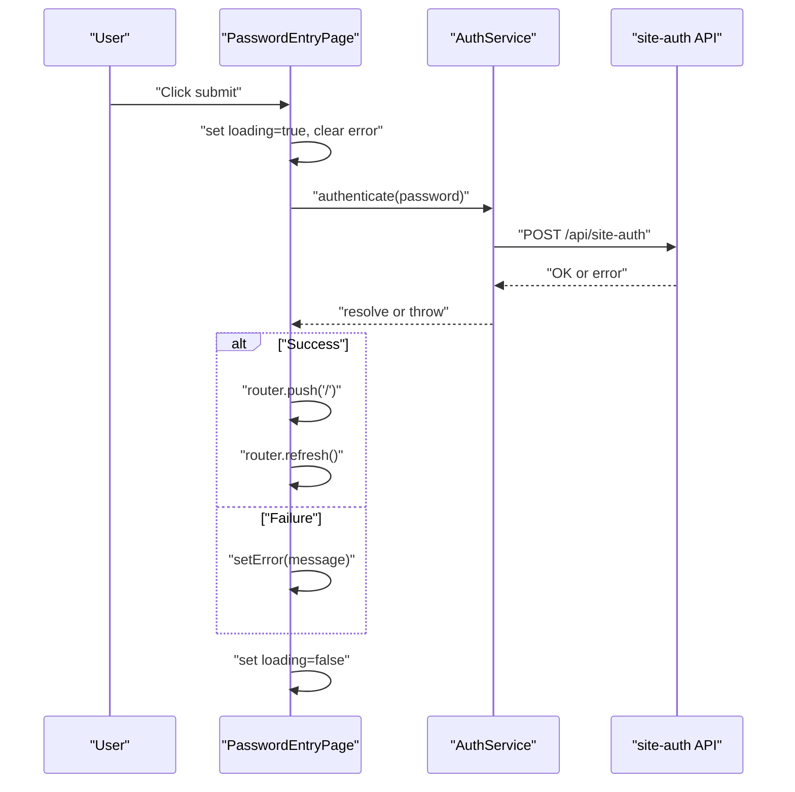
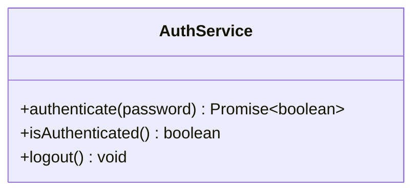
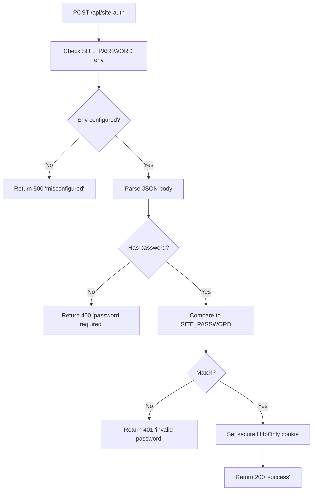
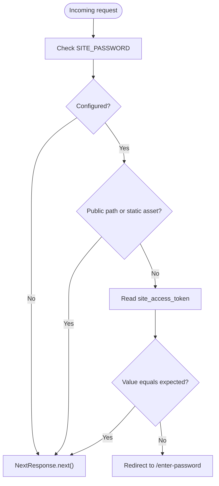
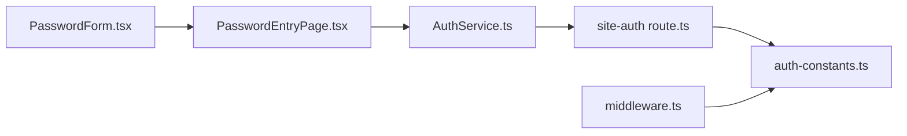

# Authentication Components

<cite>
**Referenced Files in This Document**
- [PasswordForm.tsx](file://src/components/auth/PasswordForm.tsx)
- [PasswordEntryPage.tsx](file://src/app/enter-password/page.tsx)
- [authService.ts](file://src/lib/services/authService.ts)
- [site-auth route.ts](file://src/app/api/site-auth/route.ts)
- [middleware.ts](file://src/middleware.ts)
- [auth-constants.ts](file://src/lib/constants/auth-constants.ts)
- [constants.ts](file://src/lib/constants/constants.ts)
</cite>

## Table of Contents
1. [Introduction](#introduction)
2. [Project Structure](#project-structure)
3. [Core Components](#core-components)
4. [Architecture Overview](#architecture-overview)
5. [Detailed Component Analysis](#detailed-component-analysis)
6. [Dependency Analysis](#dependency-analysis)
7. [Performance Considerations](#performance-considerations)
8. [Security Considerations](#security-considerations)
9. [Troubleshooting Guide](#troubleshooting-guide)
10. [Conclusion](#conclusion)

## Introduction
This document explains the PasswordForm component and the surrounding authentication flow used to protect the site. It covers how the form submits credentials, integrates with the backend authentication service, manages authentication state, and enforces route protection via middleware. It also documents error handling, loading states, and security considerations such as input masking, preventing credential leakage, and mitigating brute force attempts.

## Project Structure
The authentication flow spans a small set of focused files:
- Frontend form and page: PasswordForm and the /enter-password page
- Client-side service: AuthService for initiating authentication
- Backend API: site-auth endpoint for validating the password and issuing cookies
- Middleware: route protection that checks for the presence of an authentication cookie
- Constants: cookie names, values, and public paths

**Diagram sources**
- [PasswordForm.tsx](file://src/components/auth/PasswordForm.tsx#L1-L48)
- [PasswordEntryPage.tsx](file://src/app/enter-password/page.tsx#L1-L75)
- [authService.ts](file://src/lib/services/authService.ts#L1-L47)
- [site-auth route.ts](file://src/app/api/site-auth/route.ts#L1-L65)
- [middleware.ts](file://src/middleware.ts#L1-L54)
- [auth-constants.ts](file://src/lib/constants/auth-constants.ts#L1-L11)

**Section sources**
- [PasswordForm.tsx](file://src/components/auth/PasswordForm.tsx#L1-L48)
- [PasswordEntryPage.tsx](file://src/app/enter-password/page.tsx#L1-L75)
- [authService.ts](file://src/lib/services/authService.ts#L1-L47)
- [site-auth route.ts](file://src/app/api/site-auth/route.ts#L1-L65)
- [middleware.ts](file://src/middleware.ts#L1-L54)
- [auth-constants.ts](file://src/lib/constants/auth-constants.ts#L1-L11)

## Core Components
- PasswordForm: A minimal form component that renders a masked password input and a submit button. It exposes props for controlled password state, loading state, and submit handler.
- PasswordEntryPage: The page that hosts the form, manages local state (password, error, loading), and orchestrates authentication via AuthService.
- AuthService: A client-side service that posts the password to the backend API and records a local flag indicating successful authentication.
- site-auth API: Validates the password against the environment variable, returns errors for missing or invalid credentials, and sets a secure authentication cookie on success.
- middleware: Enforces route protection by checking for the presence and value of the authentication cookie and redirecting unauthenticated users to the password entry page.
- Constants: Defines cookie names/values, public paths, and cookie security flags.

**Section sources**
- [PasswordForm.tsx](file://src/components/auth/PasswordForm.tsx#L1-L48)
- [PasswordEntryPage.tsx](file://src/app/enter-password/page.tsx#L1-L75)
- [authService.ts](file://src/lib/services/authService.ts#L1-L47)
- [site-auth route.ts](file://src/app/api/site-auth/route.ts#L1-L65)
- [middleware.ts](file://src/middleware.ts#L1-L54)
- [auth-constants.ts](file://src/lib/constants/auth-constants.ts#L1-L11)

## Architecture Overview
The authentication flow is a client-server interaction protected by middleware. The client presents a password form, the client service posts to the API, the API validates the password and sets a cookie, and middleware enforces access to protected routes.

**Diagram sources**
- [PasswordForm.tsx](file://src/components/auth/PasswordForm.tsx#L1-L48)
- [PasswordEntryPage.tsx](file://src/app/enter-password/page.tsx#L1-L75)
- [authService.ts](file://src/lib/services/authService.ts#L1-L47)
- [site-auth route.ts](file://src/app/api/site-auth/route.ts#L1-L65)
- [middleware.ts](file://src/middleware.ts#L1-L54)

## Detailed Component Analysis

### PasswordForm Component
- Purpose: Render a masked password input and a submit button. It is controlled by props for password value, change handler, loading state, and submit handler.
- Behavior:
  - Uses a masked input type to prevent plaintext display.
  - Disables the submit button and shows a loading indicator when loading is true.
  - Applies autofocus to improve UX.
- Props:
  - password: string
  - onPasswordChange: (value: string) => void
  - loading: boolean
  - onSubmit: (e: React.FormEvent) => void
- Rendering:
  - Single form with a labeled input and a primary button.
  - Uses Tailwind classes for layout and styling.

**Diagram sources**
- [PasswordForm.tsx](file://src/components/auth/PasswordForm.tsx#L1-L48)

**Section sources**
- [PasswordForm.tsx](file://src/components/auth/PasswordForm.tsx#L1-L48)

### PasswordEntryPage (Client Page)
- Purpose: Host the authentication UI, manage local state, and coordinate authentication.
- State:
  - password: string
  - error: string | null
  - loading: boolean
- Flow:
  - On submit, prevents default, sets loading, clears previous errors, calls AuthService.authenticate, and on success redirects to the home page and refreshes to trigger middleware reevaluation.
  - Displays error messages returned from the service.
- UX:
  - Card layout with centered content and error alert rendering.

**Diagram sources**
- [PasswordEntryPage.tsx](file://src/app/enter-password/page.tsx#L1-L75)
- [authService.ts](file://src/lib/services/authService.ts#L1-L47)
- [site-auth route.ts](file://src/app/api/site-auth/route.ts#L1-L65)

**Section sources**
- [PasswordEntryPage.tsx](file://src/app/enter-password/page.tsx#L1-L75)

### AuthService (Client Service)
- Purpose: Encapsulate the client-side authentication logic.
- Behavior:
  - Posts the password to /api/site-auth.
  - On success, stores a local flag indicating authentication.
  - On failure, throws an error with a message extracted from the response.
- Methods:
  - authenticate(password): Promise<boolean>
  - isAuthenticated(): boolean
  - logout(): void

**Diagram sources**
- [authService.ts](file://src/lib/services/authService.ts#L1-L47)

**Section sources**
- [authService.ts](file://src/lib/services/authService.ts#L1-L47)

### site-auth API Endpoint
- Purpose: Validate the submitted password against the environment variable and issue an authentication cookie on success.
- Validation:
  - Requires SITE_PASSWORD to be configured.
  - Requires a non-empty password in the request body.
  - Compares the provided password to the environment variable.
- Response:
  - On success: 200 OK with a success message and sets a secure HttpOnly cookie.
  - On error: 400/401/500 with an appropriate message.

**Diagram sources**
- [site-auth route.ts](file://src/app/api/site-auth/route.ts#L1-L65)
- [auth-constants.ts](file://src/lib/constants/auth-constants.ts#L1-L11)

**Section sources**
- [site-auth route.ts](file://src/app/api/site-auth/route.ts#L1-L65)
- [auth-constants.ts](file://src/lib/constants/auth-constants.ts#L1-L11)

### Middleware (Route Protection)
- Purpose: Protect routes by requiring an authentication cookie.
- Logic:
  - If SITE_PASSWORD is not configured, bypass middleware.
  - Allow public paths and static assets.
  - Check for the presence and value of the authentication cookie.
  - Redirect to /enter-password if not authenticated.
- Matcher:
  - Excludes internal paths, the site-auth API, the entry page, and static assets.

**Diagram sources**
- [middleware.ts](file://src/middleware.ts#L1-L54)
- [auth-constants.ts](file://src/lib/constants/auth-constants.ts#L1-L11)

**Section sources**
- [middleware.ts](file://src/middleware.ts#L1-L54)
- [auth-constants.ts](file://src/lib/constants/auth-constants.ts#L1-L11)

## Dependency Analysis
- PasswordForm depends on:
  - React for rendering
  - Tailwind classes for styling
- PasswordEntryPage depends on:
  - PasswordForm
  - AuthService
  - Next.js router for navigation
- AuthService depends on:
  - Fetch API to call /api/site-auth
  - Local storage for a client-side flag
- site-auth API depends on:
  - Environment variables for configuration
  - Constants for cookie settings
- Middleware depends on:
  - Constants for cookie names, values, and public paths
  - Next.js request/response APIs

**Diagram sources**
- [PasswordForm.tsx](file://src/components/auth/PasswordForm.tsx#L1-L48)
- [PasswordEntryPage.tsx](file://src/app/enter-password/page.tsx#L1-L75)
- [authService.ts](file://src/lib/services/authService.ts#L1-L47)
- [site-auth route.ts](file://src/app/api/site-auth/route.ts#L1-L65)
- [middleware.ts](file://src/middleware.ts#L1-L54)
- [auth-constants.ts](file://src/lib/constants/auth-constants.ts#L1-L11)

**Section sources**
- [PasswordForm.tsx](file://src/components/auth/PasswordForm.tsx#L1-L48)
- [PasswordEntryPage.tsx](file://src/app/enter-password/page.tsx#L1-L75)
- [authService.ts](file://src/lib/services/authService.ts#L1-L47)
- [site-auth route.ts](file://src/app/api/site-auth/route.ts#L1-L65)
- [middleware.ts](file://src/middleware.ts#L1-L54)
- [auth-constants.ts](file://src/lib/constants/auth-constants.ts#L1-L11)

## Performance Considerations
- Minimize network requests: The authentication flow performs a single POST to the API. Keep the payload minimal (only the password).
- Client-side caching: The client stores a simple flag in local storage to indicate authentication. This avoids repeated network calls for basic state checks.
- Middleware overhead: The middleware runs on every request except public paths and static assets. Keep the cookie check lightweight.
- UI responsiveness: Disable the submit button and show a loading indicator during authentication to prevent duplicate submissions.

[No sources needed since this section provides general guidance]

## Security Considerations
- Input masking:
  - The form uses a masked input type to prevent plaintext display of the password.
- Prevention of credential leakage:
  - The API sets an HttpOnly cookie, reducing exposure to client-side scripts.
  - The client does not persist the password beyond the form state.
- Protection against brute force attempts:
  - The current implementation does not include rate limiting or account lockout mechanisms. Consider adding server-side rate limiting and/or challenge mechanisms (e.g., CAPTCHA) at the API level.
- Cookie security:
  - The cookie is HttpOnly and secure in production environments. Ensure the environment variable controlling cookie security is correctly evaluated.
- Environment configuration:
  - The API requires SITE_PASSWORD to be configured. Misconfiguration leads to a 500 error, which is appropriate to prevent accidental exposure of the system.

**Section sources**
- [PasswordForm.tsx](file://src/components/auth/PasswordForm.tsx#L1-L48)
- [site-auth route.ts](file://src/app/api/site-auth/route.ts#L1-L65)
- [auth-constants.ts](file://src/lib/constants/auth-constants.ts#L1-L11)

## Troubleshooting Guide
- Authentication fails immediately:
  - Verify SITE_PASSWORD is set in the environment.
  - Confirm the password entered matches the environment variable.
- Error messages displayed:
  - The page shows an error alert when authentication fails. Check the message returned by the API for details.
- Redirect loop to /enter-password:
  - Ensure the cookie is being set and readable by the browser.
  - Confirm middleware is not bypassed unintentionally (when SITE_PASSWORD is not configured).
- Loading state not resetting:
  - Ensure the submit handler sets loading to false in both success and error branches.

**Section sources**
- [PasswordEntryPage.tsx](file://src/app/enter-password/page.tsx#L1-L75)
- [site-auth route.ts](file://src/app/api/site-auth/route.ts#L1-L65)
- [middleware.ts](file://src/middleware.ts#L1-L54)

## Conclusion
The authentication flow is intentionally simple and effective: a masked password form, a client service that posts to a server endpoint, and middleware enforcing access via a secure cookie. The design minimizes complexity while providing essential protections. To extend the flow, consider adding server-side rate limiting, stronger session controls, and additional security factors such as MFA or device trust checks.