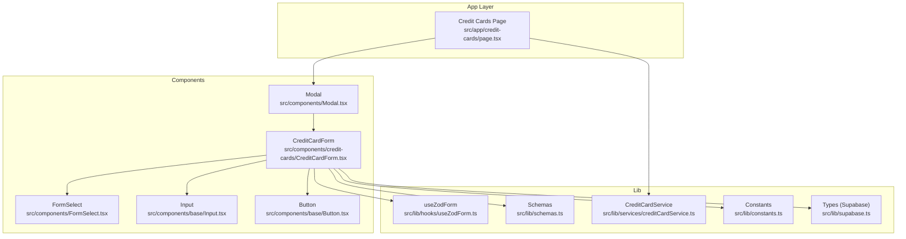
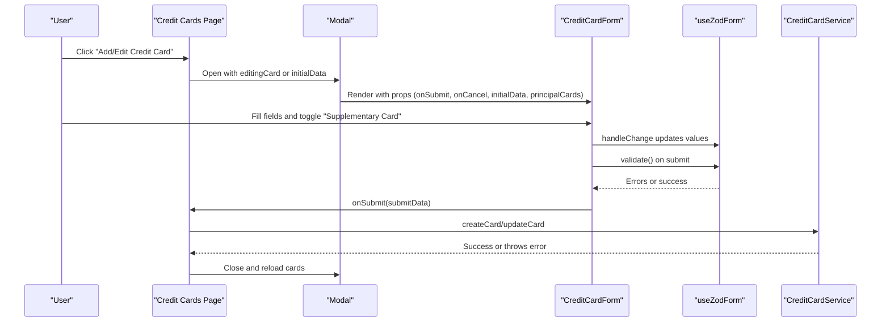
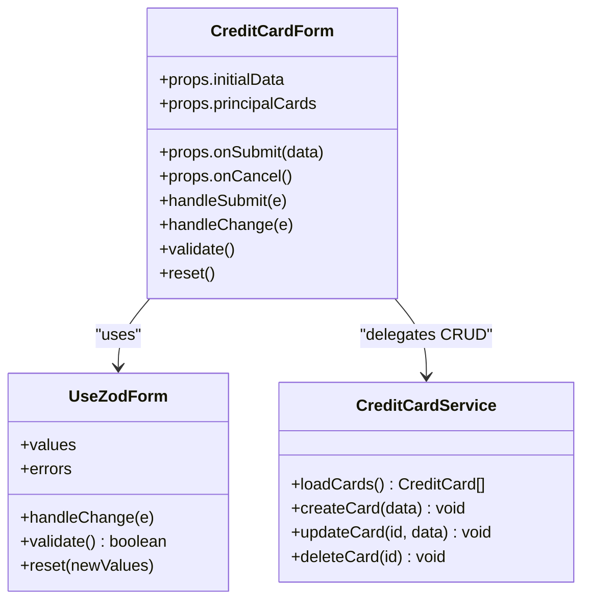
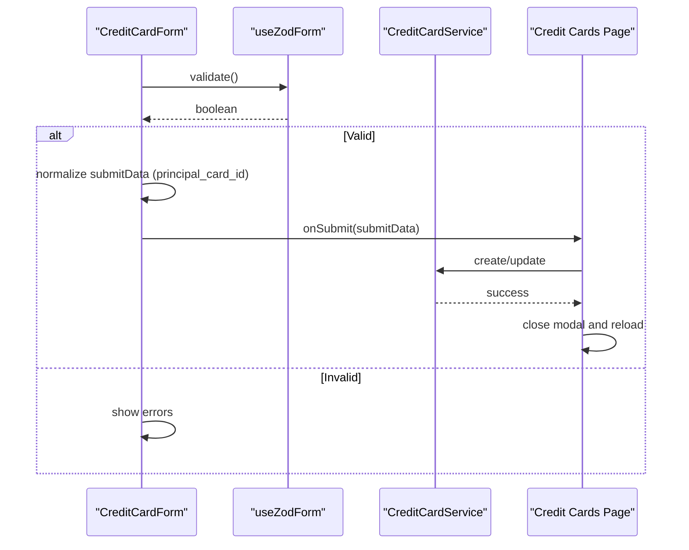
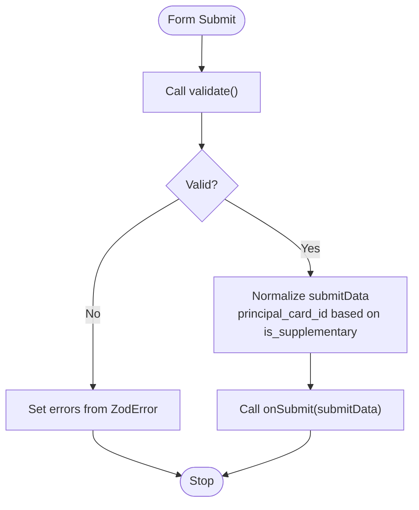
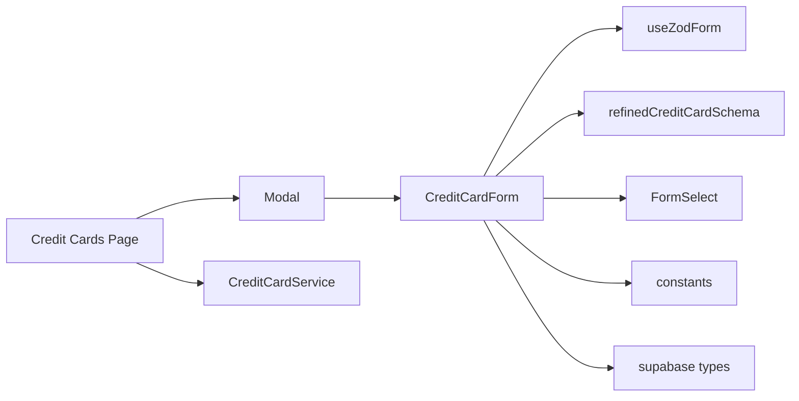

# Credit Card Components

<cite>
**Referenced Files in This Document**
- [CreditCardForm.tsx](file://src/components/credit-cards/CreditCardForm.tsx)
- [useZodForm.ts](file://src/lib/hooks/useZodForm.ts)
- [schemas.ts](file://src/lib/schemas.ts)
- [creditCardService.ts](file://src/lib/services/creditCardService.ts)
- [page.tsx](file://src/app/credit-cards/page.tsx)
- [FormSelect.tsx](file://src/components/FormSelect.tsx)
- [Input.tsx](file://src/components/base/Input.tsx)
- [Button.tsx](file://src/components/base/Button.tsx)
- [Modal.tsx](file://src/components/Modal.tsx)
- [constants.ts](file://src/lib/constants.ts)
- [supabase.ts](file://src/lib/supabase.ts)
</cite>

## Table of Contents
1. [Introduction](#introduction)
2. [Project Structure](#project-structure)
3. [Core Components](#core-components)
4. [Architecture Overview](#architecture-overview)
5. [Detailed Component Analysis](#detailed-component-analysis)
6. [Dependency Analysis](#dependency-analysis)
7. [Performance Considerations](#performance-considerations)
8. [Troubleshooting Guide](#troubleshooting-guide)
9. [Conclusion](#conclusion)
10. [Appendices](#appendices)

## Introduction
This document explains the CreditCardForm component used in the credit card management feature. It covers how the form integrates Zod validation via the useZodForm hook, how it interacts with the creditCardService for CRUD operations, and how it handles supplementary card relationships. It also documents the form fields, UI behavior (real-time validation and error messaging), usage within the /credit-cards page, composition with base components, state management, error handling, accessibility considerations, and guidance for extending the form.

## Project Structure
The CreditCardForm lives under the components layer and is orchestrated by the Credit Cards page. It relies on shared hooks, schemas, services, and base UI components.

**Diagram sources**
- [page.tsx](file://src/app/credit-cards/page.tsx#L1-L195)
- [CreditCardForm.tsx](file://src/components/credit-cards/CreditCardForm.tsx#L1-L180)
- [useZodForm.ts](file://src/lib/hooks/useZodForm.ts#L1-L83)
- [schemas.ts](file://src/lib/schemas.ts#L1-L62)
- [creditCardService.ts](file://src/lib/services/creditCardService.ts#L1-L69)
- [FormSelect.tsx](file://src/components/FormSelect.tsx#L1-L77)
- [Input.tsx](file://src/components/base/Input.tsx#L1-L84)
- [Button.tsx](file://src/components/base/Button.tsx#L1-L115)
- [Modal.tsx](file://src/components/Modal.tsx#L1-L62)
- [constants.ts](file://src/lib/constants.ts#L1-L116)
- [supabase.ts](file://src/lib/supabase.ts#L1-L81)

**Section sources**
- [page.tsx](file://src/app/credit-cards/page.tsx#L1-L195)
- [CreditCardForm.tsx](file://src/components/credit-cards/CreditCardForm.tsx#L1-L180)

## Core Components
- CreditCardForm: The primary form component for adding/editing credit cards, including supplementary card support.
- useZodForm: A reusable hook that manages form state, validation, and error messages using Zod schemas.
- creditCardService: Provides CRUD operations against the Supabase backend for credit cards.
- FormSelect: A wrapper around a UI select component that emits synthetic change events compatible with the form’s handleChange.
- Base components: Input and Button are used for consistent styling and accessibility.

Key responsibilities:
- Validation: Enforced by Zod schemas and refined rules for supplementary cards.
- Submission: Normalizes form data (including principal card linkage) and delegates to the service.
- UI feedback: Real-time validation and error messaging for each field.
- Supplementary card handling: Conditional rendering and validation for principal card selection.

**Section sources**
- [CreditCardForm.tsx](file://src/components/credit-cards/CreditCardForm.tsx#L1-L180)
- [useZodForm.ts](file://src/lib/hooks/useZodForm.ts#L1-L83)
- [schemas.ts](file://src/lib/schemas.ts#L1-L62)
- [creditCardService.ts](file://src/lib/services/creditCardService.ts#L1-L69)
- [FormSelect.tsx](file://src/components/FormSelect.tsx#L1-L77)
- [Input.tsx](file://src/components/base/Input.tsx#L1-L84)
- [Button.tsx](file://src/components/base/Button.tsx#L1-L115)

## Architecture Overview
The Credit Cards page composes the CreditCardForm inside a Modal. On submit, the page invokes the service to create/update. The form uses Zod validation to ensure data integrity and displays errors inline.

**Diagram sources**
- [page.tsx](file://src/app/credit-cards/page.tsx#L1-L195)
- [CreditCardForm.tsx](file://src/components/credit-cards/CreditCardForm.tsx#L1-L180)
- [useZodForm.ts](file://src/lib/hooks/useZodForm.ts#L1-L83)
- [creditCardService.ts](file://src/lib/services/creditCardService.ts#L1-L69)

## Detailed Component Analysis

### CreditCardForm
- Purpose: Manage creation and editing of credit cards, including supplementary card relationships.
- Inputs:
  - onSubmit: Receives normalized data for submission.
  - onCancel: Closes the modal and resets the form.
  - initialData: Pre-filled values for edit mode.
  - principalCards: List of principal cards for the supplementary card dropdown.
- Validation:
  - Uses refinedCreditCardSchema to enforce:
    - Required fields: card name, last four digits, cardholder name, issuer.
    - Last four digits must be exactly 4 digits and numeric.
    - Supplementary card requires a principal card selection.
- Behavior:
  - Real-time validation clears per-field errors when the user edits.
  - Submit button triggers validation; on success, constructs submitData:
    - If is_supplementary is true, sets principal_card_id; otherwise sets null.
  - Conditional rendering:
    - Principal card dropdown appears only when "Supplementary Card" is checked.
    - Dropdown options are derived from principalCards with display text combining card name and last four digits.

UI composition:
- Field labels come from FORM_LABELS.
- Issuer uses a predefined list of Philippine banks.
- Buttons are styled via Button component.

Accessibility:
- The Modal wraps the form with role dialog and aria-modal.
- Close button has aria-label.
- Checkbox label is rendered semantically.

State management:
- Values and errors managed internally by useZodForm.
- Reset is triggered when initialData changes (e.g., switching between edit and add).

Error handling:
- Errors are displayed below each invalid field.
- The page handles service errors and retries.

Extensibility:
- New fields can be added to the Zod schema and reflected in the form.
- Conditional logic can be expanded in refine() for additional cross-field validations.

**Section sources**
- [CreditCardForm.tsx](file://src/components/credit-cards/CreditCardForm.tsx#L1-L180)
- [useZodForm.ts](file://src/lib/hooks/useZodForm.ts#L1-L83)
- [schemas.ts](file://src/lib/schemas.ts#L1-L62)
- [constants.ts](file://src/lib/constants.ts#L88-L116)
- [Modal.tsx](file://src/components/Modal.tsx#L1-L62)

#### Class Diagram: Form State and Validation

**Diagram sources**
- [useZodForm.ts](file://src/lib/hooks/useZodForm.ts#L1-L83)
- [CreditCardForm.tsx](file://src/components/credit-cards/CreditCardForm.tsx#L1-L180)
- [creditCardService.ts](file://src/lib/services/creditCardService.ts#L1-L69)

#### Sequence Diagram: Submission Flow

**Diagram sources**
- [CreditCardForm.tsx](file://src/components/credit-cards/CreditCardForm.tsx#L41-L53)
- [useZodForm.ts](file://src/lib/hooks/useZodForm.ts#L48-L67)
- [creditCardService.ts](file://src/lib/services/creditCardService.ts#L28-L54)
- [page.tsx](file://src/app/credit-cards/page.tsx#L70-L82)

#### Flowchart: Validation Logic

**Diagram sources**
- [CreditCardForm.tsx](file://src/components/credit-cards/CreditCardForm.tsx#L41-L53)
- [useZodForm.ts](file://src/lib/hooks/useZodForm.ts#L48-L67)

### useZodForm Hook
- Manages form values and errors.
- Handles change events for text inputs, checkboxes, and selects by normalizing to a synthetic event.
- Clears per-field errors when the user edits the field.
- Validates using Zod schema.parse and maps ZodError to a flat error map keyed by field name.
- Provides reset to restore initial values and clear errors.

Complexity:
- O(n) to parse schema where n is the number of fields.
- Error mapping is linear in the number of validation failures.

**Section sources**
- [useZodForm.ts](file://src/lib/hooks/useZodForm.ts#L1-L83)

### Zod Validation Schema
- creditCardSchema enforces required fields and constraints:
  - Card name, cardholder name: required.
  - Last four digits: length 4 and only digits.
  - Issuer: required.
  - is_supplementary: boolean.
  - principal_card_id: optional with default empty string.
- refinedCreditCardSchema adds a refinement:
  - If is_supplementary is true, principal_card_id must be present and non-empty; otherwise, an error is reported on principal_card_id.

Extensibility:
- Add new fields to creditCardSchema and update refinedCreditCardSchema if cross-field dependencies exist.
- Keep error messages descriptive for user-friendly feedback.

**Section sources**
- [schemas.ts](file://src/lib/schemas.ts#L1-L26)

### CreditCardService
- loadCards: Fetches cards and expands principal_card relationship for UI display.
- createCard/updateCard/deleteCard: Perform insert/update/delete operations and propagate errors.

Error handling:
- Logs and rethrows errors to surface to the caller.

**Section sources**
- [creditCardService.ts](file://src/lib/services/creditCardService.ts#L1-L69)

### Integration with the /credit-cards Page
- Loads cards and filters principal cards for the supplementary card dropdown.
- Opens a Modal containing CreditCardForm.
- Passes initialData (empty for add, selected card for edit) and principalCards.
- Handles submit by calling createCard or updateCard and then reloads data.

**Section sources**
- [page.tsx](file://src/app/credit-cards/page.tsx#L1-L195)

### Base Components Used
- Input: Provides consistent styling and optional label/error/help text.
- Button: Provides consistent styling, variants, sizes, and accessibility attributes.
- FormSelect: Bridges UI select to the form’s handleChange by emitting a synthetic event.

**Section sources**
- [Input.tsx](file://src/components/base/Input.tsx#L1-L84)
- [Button.tsx](file://src/components/base/Button.tsx#L1-L115)
- [FormSelect.tsx](file://src/components/FormSelect.tsx#L1-L77)

## Dependency Analysis
- CreditCardForm depends on:
  - useZodForm for state and validation.
  - refinedCreditCardSchema for validation rules.
  - FormSelect for issuer and principal card selection.
  - constants for labels and issuer list.
  - supabase types for typing.
- The page composes CreditCardForm and delegates service calls.
- Modal provides container semantics and accessibility attributes.

**Diagram sources**
- [page.tsx](file://src/app/credit-cards/page.tsx#L1-L195)
- [CreditCardForm.tsx](file://src/components/credit-cards/CreditCardForm.tsx#L1-L180)
- [useZodForm.ts](file://src/lib/hooks/useZodForm.ts#L1-L83)
- [schemas.ts](file://src/lib/schemas.ts#L1-L26)
- [FormSelect.tsx](file://src/components/FormSelect.tsx#L1-L77)
- [constants.ts](file://src/lib/constants.ts#L88-L116)
- [supabase.ts](file://src/lib/supabase.ts#L1-L81)
- [creditCardService.ts](file://src/lib/services/creditCardService.ts#L1-L69)

**Section sources**
- [CreditCardForm.tsx](file://src/components/credit-cards/CreditCardForm.tsx#L1-L180)
- [page.tsx](file://src/app/credit-cards/page.tsx#L1-L195)

## Performance Considerations
- Validation occurs on submit and on change; keep the schema minimal and avoid heavy refinements.
- Memoization via useCallback in useZodForm prevents unnecessary re-renders.
- Filtering principal cards in the page is O(n); acceptable for small lists.
- Consider debouncing validation for large forms if needed.

## Troubleshooting Guide
Common issues and resolutions:
- Validation errors not clearing:
  - Ensure handleChange is used for all inputs so per-field errors are cleared on edit.
- Supplementary card validation failing:
  - Confirm is_supplementary is checked and principal_card_id is selected.
- Service errors:
  - The service logs and rethrows; the page catches and displays a retry option.
- Modal accessibility:
  - Verify role="dialog" and aria-modal="true" are present; ensure close button has aria-label.

**Section sources**
- [useZodForm.ts](file://src/lib/hooks/useZodForm.ts#L19-L47)
- [schemas.ts](file://src/lib/schemas.ts#L16-L26)
- [creditCardService.ts](file://src/lib/services/creditCardService.ts#L1-L69)
- [Modal.tsx](file://src/components/Modal.tsx#L35-L59)

## Conclusion
CreditCardForm provides a robust, accessible, and extensible way to manage credit cards with real-time validation and clear error messaging. Its integration with useZodForm and creditCardService ensures consistent validation and reliable persistence. The component’s design allows straightforward extension for new fields and validation rules while maintaining a clean separation of concerns.

## Appendices

### Form Fields and Validation Summary
- Card Name: Required.
- Last Four Digits: Exactly 4 digits, numeric.
- Cardholder Name: Required.
- Issuer: Required; from a curated list of Philippine banks.
- Supplementary Card: Boolean toggle.
- Principal Card: Required when Supplementary Card is checked.

**Section sources**
- [schemas.ts](file://src/lib/schemas.ts#L1-L26)
- [constants.ts](file://src/lib/constants.ts#L88-L116)

### Accessibility Checklist
- All interactive controls have appropriate roles and labels.
- Error messages are visually distinct and associated with their fields.
- Keyboard navigation works within the form and modal.
- Focus management is handled when opening/closing the modal.

**Section sources**
- [Modal.tsx](file://src/components/Modal.tsx#L35-L59)
- [CreditCardForm.tsx](file://src/components/credit-cards/CreditCardForm.tsx#L55-L178)

### Extending the Form
Steps to add a new attribute or validation rule:
1. Extend creditCardSchema with the new field and constraints.
2. If the new field affects other fields, add a refinement in refinedCreditCardSchema.
3. Update CreditCardForm to render the new field and integrate with handleChange.
4. If the field requires external data, pass it as a prop and update the page’s initialData/principalCards accordingly.
5. Test validation and error messaging.

**Section sources**
- [schemas.ts](file://src/lib/schemas.ts#L1-L26)
- [CreditCardForm.tsx](file://src/components/credit-cards/CreditCardForm.tsx#L1-L180)
- [page.tsx](file://src/app/credit-cards/page.tsx#L1-L195)