# Feature-Specific Components

<cite>
**Referenced Files in This Document**
- [CreditCardForm.tsx](file://src/components/credit-cards/CreditCardForm.tsx)
- [PersonForm.tsx](file://src/components/persons/PersonForm.tsx)
- [PurchaseForm.tsx](file://src/components/PurchaseForm.tsx)
- [PurchaseDetailsCard.tsx](file://src/components/purchases/PurchaseDetailsCard.tsx)
- [PurchaseFilters.tsx](file://src/components/purchases/PurchaseFilters.tsx)
- [TransactionFilters.tsx](file://src/components/transactions/TransactionFilters.tsx)
- [PasswordForm.tsx](file://src/components/auth/PasswordForm.tsx)
- [useZodForm.ts](file://src/lib/hooks/useZodForm.ts)
- [schemas.ts](file://src/lib/schemas.ts)
- [supabase.ts](file://src/lib/supabase.ts)
- [purchaseService.ts](file://src/lib/services/purchaseService.ts)
- [authService.ts](file://src/lib/services/authService.ts)
- [route.ts](file://src/app/api/site-auth/route.ts)
- [page.tsx](file://src/app/enter-password/page.tsx)
- [middleware.ts](file://src/middleware.ts)
- [Modal.tsx](file://src/components/Modal.tsx)
</cite>

## Table of Contents
1. [Introduction](#introduction)
2. [Project Structure](#project-structure)
3. [Core Components](#core-components)
4. [Architecture Overview](#architecture-overview)
5. [Detailed Component Analysis](#detailed-component-analysis)
6. [Dependency Analysis](#dependency-analysis)
7. [Performance Considerations](#performance-considerations)
8. [Troubleshooting Guide](#troubleshooting-guide)
9. [Conclusion](#conclusion)
10. [Appendices](#appendices)

## Introduction
This document focuses on the feature-specific components that implement domain logic for credit cards, persons, purchases, and transactions. It explains how forms encapsulate validation and submission logic, how display components present structured data, and how filters enable efficient browsing. It also covers the authentication flow, state management strategies, error handling, and integration with service-layer APIs. Best practices for extending these components are included to support future feature additions.

## Project Structure
The feature-specific components are organized by domain:
- Credit cards: CreditCardForm
- Persons: PersonForm
- Purchases: PurchaseForm, PurchaseDetailsCard, PurchaseFilters
- Transactions: TransactionFilters
- Authentication: PasswordForm, AuthService, API route, middleware
- Shared utilities: useZodForm, schemas, Modal

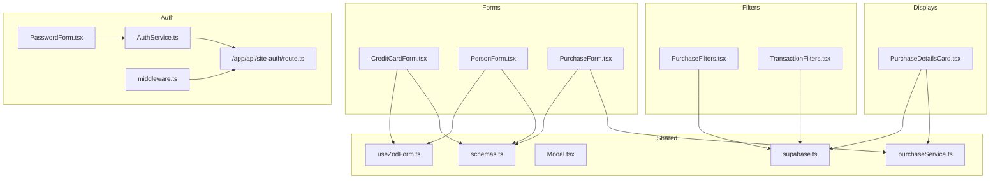

**Diagram sources**
- [CreditCardForm.tsx](file://src/components/credit-cards/CreditCardForm.tsx#L1-L180)
- [PersonForm.tsx](file://src/components/persons/PersonForm.tsx#L1-L109)
- [PurchaseForm.tsx](file://src/components/PurchaseForm.tsx#L1-L269)
- [PurchaseDetailsCard.tsx](file://src/components/purchases/PurchaseDetailsCard.tsx#L1-L78)
- [PurchaseFilters.tsx](file://src/components/purchases/PurchaseFilters.tsx#L1-L149)
- [TransactionFilters.tsx](file://src/components/transactions/TransactionFilters.tsx#L1-L196)
- [PasswordForm.tsx](file://src/components/auth/PasswordForm.tsx#L1-L48)
- [useZodForm.ts](file://src/lib/hooks/useZodForm.ts#L1-L83)
- [schemas.ts](file://src/lib/schemas.ts#L1-L62)
- [Modal.tsx](file://src/components/Modal.tsx#L1-L62)
- [supabase.ts](file://src/lib/supabase.ts#L1-L81)
- [purchaseService.ts](file://src/lib/services/purchaseService.ts#L1-L88)
- [authService.ts](file://src/lib/services/authService.ts#L1-L47)
- [route.ts](file://src/app/api/site-auth/route.ts#L1-L65)
- [middleware.ts](file://src/middleware.ts#L1-L54)

**Section sources**
- [CreditCardForm.tsx](file://src/components/credit-cards/CreditCardForm.tsx#L1-L180)
- [PersonForm.tsx](file://src/components/persons/PersonForm.tsx#L1-L109)
- [PurchaseForm.tsx](file://src/components/PurchaseForm.tsx#L1-L269)
- [PurchaseDetailsCard.tsx](file://src/components/purchases/PurchaseDetailsCard.tsx#L1-L78)
- [PurchaseFilters.tsx](file://src/components/purchases/PurchaseFilters.tsx#L1-L149)
- [TransactionFilters.tsx](file://src/components/transactions/TransactionFilters.tsx#L1-L196)
- [PasswordForm.tsx](file://src/components/auth/PasswordForm.tsx#L1-L48)
- [useZodForm.ts](file://src/lib/hooks/useZodForm.ts#L1-L83)
- [schemas.ts](file://src/lib/schemas.ts#L1-L62)
- [supabase.ts](file://src/lib/supabase.ts#L1-L81)
- [purchaseService.ts](file://src/lib/services/purchaseService.ts#L1-L88)
- [authService.ts](file://src/lib/services/authService.ts#L1-L47)
- [route.ts](file://src/app/api/site-auth/route.ts#L1-L65)
- [middleware.ts](file://src/middleware.ts#L1-L54)
- [Modal.tsx](file://src/components/Modal.tsx#L1-L62)

## Core Components
- CreditCardForm: Encapsulates credit card creation/editing with Zod validation, conditional principal card selection for supplementary cards, and controlled submission.
- PersonForm: Encapsulates person creation/editing with Zod validation, modal presentation, and async submission with loading/error handling.
- PurchaseForm: Manages purchase creation with typed numeric parsing, BNPL flag, and controlled submission.
- PurchaseDetailsCard: Displays purchase metadata and related card/person with safe expansion rendering.
- PurchaseFilters: Provides person/card/paid/status/description filters for purchase lists.
- TransactionFilters: Provides configurable filters for transactions with date range and paid status.
- PasswordForm: Minimal authentication form with controlled state and loading feedback.
- useZodForm: Hook that centralizes form state, change handling, validation, and reset logic using Zod schemas.
- schemas: Domain schemas for credit cards, persons, purchases, and transactions.
- Modal: Reusable overlay container for inline editing modals.

**Section sources**
- [CreditCardForm.tsx](file://src/components/credit-cards/CreditCardForm.tsx#L1-L180)
- [PersonForm.tsx](file://src/components/persons/PersonForm.tsx#L1-L109)
- [PurchaseForm.tsx](file://src/components/PurchaseForm.tsx#L1-L269)
- [PurchaseDetailsCard.tsx](file://src/components/purchases/PurchaseDetailsCard.tsx#L1-L78)
- [PurchaseFilters.tsx](file://src/components/purchases/PurchaseFilters.tsx#L1-L149)
- [TransactionFilters.tsx](file://src/components/transactions/TransactionFilters.tsx#L1-L196)
- [PasswordForm.tsx](file://src/components/auth/PasswordForm.tsx#L1-L48)
- [useZodForm.ts](file://src/lib/hooks/useZodForm.ts#L1-L83)
- [schemas.ts](file://src/lib/schemas.ts#L1-L62)
- [Modal.tsx](file://src/components/Modal.tsx#L1-L62)

## Architecture Overview
The feature components integrate with shared utilities and services:
- Forms use Zod schemas via useZodForm for validation and controlled updates.
- Display components rely on typed domain models from supabase.ts.
- Service layer components encapsulate data access and transformations.
- Authentication flow uses a dedicated API route and middleware protection.

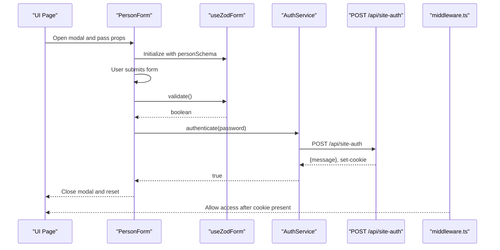

**Diagram sources**
- [PersonForm.tsx](file://src/components/persons/PersonForm.tsx#L1-L109)
- [useZodForm.ts](file://src/lib/hooks/useZodForm.ts#L1-L83)
- [authService.ts](file://src/lib/services/authService.ts#L1-L47)
- [route.ts](file://src/app/api/site-auth/route.ts#L1-L65)
- [middleware.ts](file://src/middleware.ts#L1-L54)

## Detailed Component Analysis

### CreditCardForm
- Purpose: Create or edit credit cards with validation and conditional principal card selection for supplementary cards.
- Validation: Uses refinedCreditCardSchema to enforce required fields and conditional requirement for principal_card_id when is_supplementary is true.
- Controlled behavior: useZodForm manages values, errors, change events, and validation. The form resets when initialData changes.
- Submission: Validates, conditionally sets principal_card_id to null for non-supplementary cards, and invokes onSubmit.

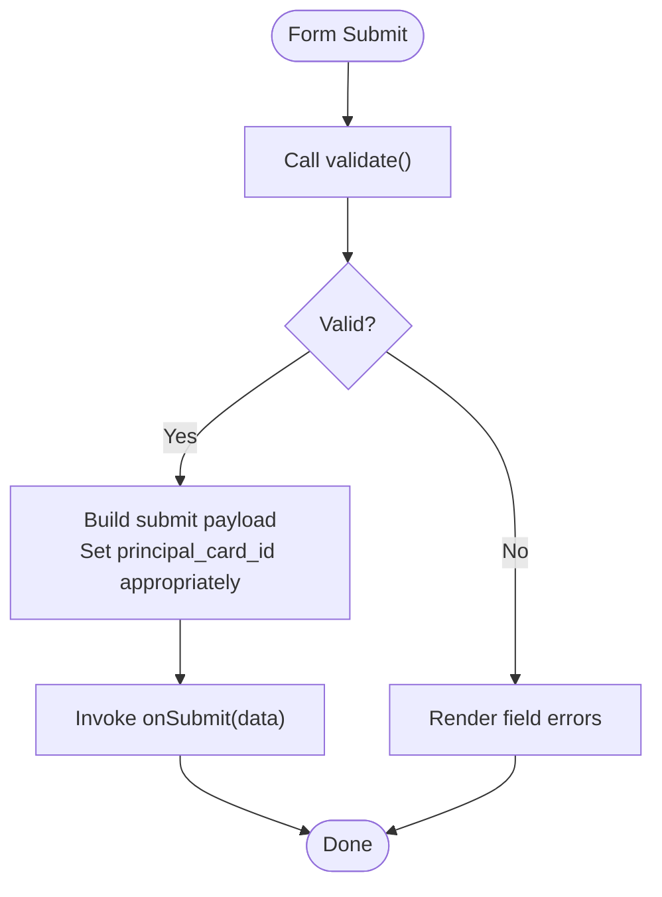

**Diagram sources**
- [CreditCardForm.tsx](file://src/components/credit-cards/CreditCardForm.tsx#L1-L180)
- [useZodForm.ts](file://src/lib/hooks/useZodForm.ts#L1-L83)
- [schemas.ts](file://src/lib/schemas.ts#L1-L62)

**Section sources**
- [CreditCardForm.tsx](file://src/components/credit-cards/CreditCardForm.tsx#L1-L180)
- [useZodForm.ts](file://src/lib/hooks/useZodForm.ts#L1-L83)
- [schemas.ts](file://src/lib/schemas.ts#L1-L62)

### PersonForm
- Purpose: Inline modal-based person creation/editing with Zod validation.
- Composition: Wrapped inside Modal; uses useZodForm with personSchema.
- State management: Tracks isSubmitting; disables inputs during submission; resets on success or close.
- Error handling: Catches submission errors and logs them; caller decides UX.

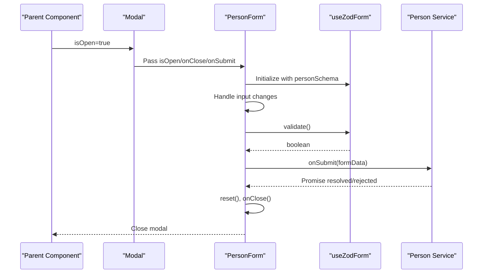

**Diagram sources**
- [PersonForm.tsx](file://src/components/persons/PersonForm.tsx#L1-L109)
- [Modal.tsx](file://src/components/Modal.tsx#L1-L62)
- [useZodForm.ts](file://src/lib/hooks/useZodForm.ts#L1-L83)
- [schemas.ts](file://src/lib/schemas.ts#L1-L62)

**Section sources**
- [PersonForm.tsx](file://src/components/persons/PersonForm.tsx#L1-L109)
- [Modal.tsx](file://src/components/Modal.tsx#L1-L62)
- [useZodForm.ts](file://src/lib/hooks/useZodForm.ts#L1-L83)
- [schemas.ts](file://src/lib/schemas.ts#L1-L62)

### PurchaseForm
- Purpose: Create purchases with typed numeric parsing for amounts and installments, BNPL flag, and controlled submission.
- State management: Uses local state for form data; initializes defaults when creditCards and persons are available.
- Submission: Parses numeric fields safely, ensures minimum installments, and calls onSubmit with normalized data.
- Integration: Integrates with service layer via onSubmit prop; can be wired to purchaseService methods.

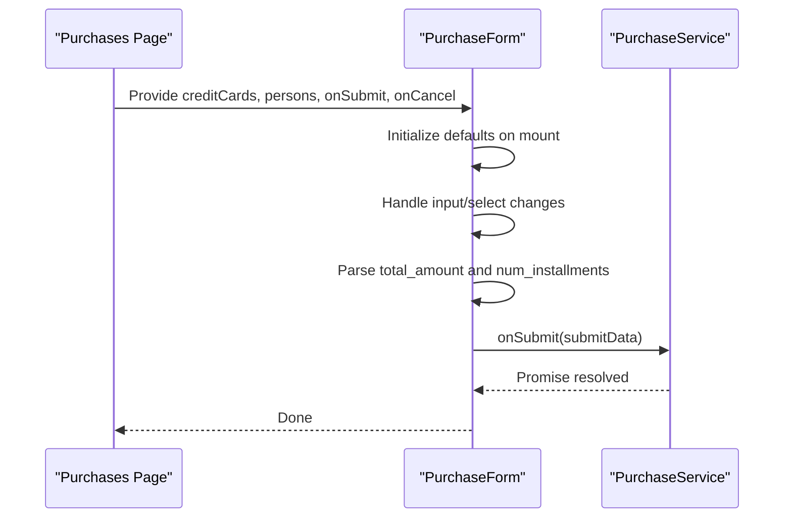

**Diagram sources**
- [PurchaseForm.tsx](file://src/components/PurchaseForm.tsx#L1-L269)
- [purchaseService.ts](file://src/lib/services/purchaseService.ts#L1-L88)

**Section sources**
- [PurchaseForm.tsx](file://src/components/PurchaseForm.tsx#L1-L269)
- [purchaseService.ts](file://src/lib/services/purchaseService.ts#L1-L88)

### PurchaseDetailsCard
- Purpose: Display purchase details including card, person, amount, installments, and BNPL status.
- Rendering: Uses formatted currency and date helpers; safely renders expand properties for related entities.

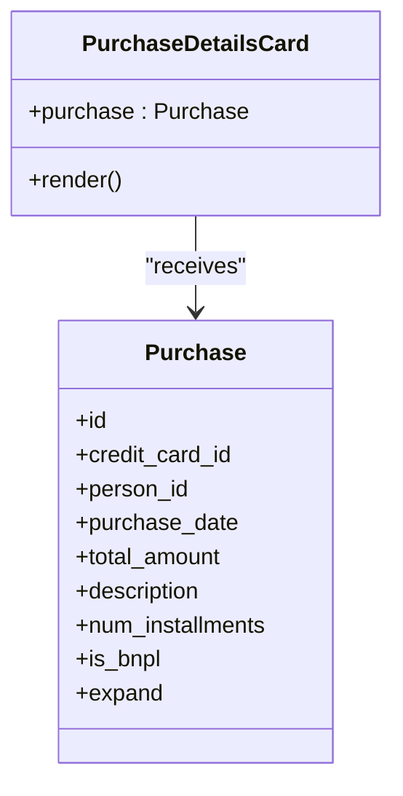

**Diagram sources**
- [PurchaseDetailsCard.tsx](file://src/components/purchases/PurchaseDetailsCard.tsx#L1-L78)
- [supabase.ts](file://src/lib/supabase.ts#L1-L81)

**Section sources**
- [PurchaseDetailsCard.tsx](file://src/components/purchases/PurchaseDetailsCard.tsx#L1-L78)
- [supabase.ts](file://src/lib/supabase.ts#L1-L81)

### PurchaseFilters
- Purpose: Filter purchase lists by person, card, paid/unpaid status, and description.
- Behavior: Updates filters via onFilterChange and provides a clear action.

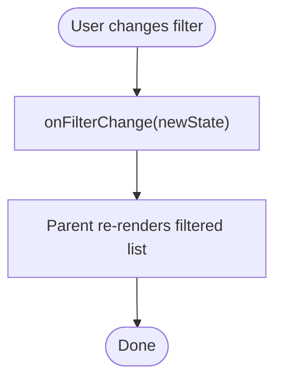

**Diagram sources**
- [PurchaseFilters.tsx](file://src/components/purchases/PurchaseFilters.tsx#L1-L149)
- [supabase.ts](file://src/lib/supabase.ts#L1-L81)

**Section sources**
- [PurchaseFilters.tsx](file://src/components/purchases/PurchaseFilters.tsx#L1-L149)
- [supabase.ts](file://src/lib/supabase.ts#L1-L81)

### TransactionFilters
- Purpose: Configurable transaction filters with optional person, card, description, date range, and paid status.
- Behavior: Uses a config object to toggle visibility and a single handler to update state.

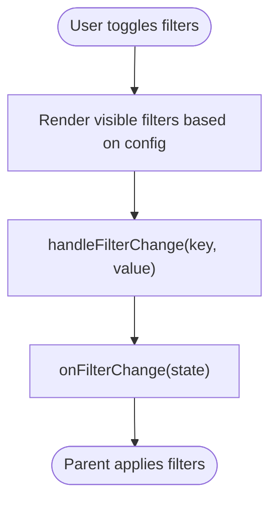

**Diagram sources**
- [TransactionFilters.tsx](file://src/components/transactions/TransactionFilters.tsx#L1-L196)
- [supabase.ts](file://src/lib/supabase.ts#L1-L81)

**Section sources**
- [TransactionFilters.tsx](file://src/components/transactions/TransactionFilters.tsx#L1-L196)
- [supabase.ts](file://src/lib/supabase.ts#L1-L81)

### PasswordForm and Authentication Flow
- PasswordForm: Minimal form with controlled password state, loading state, and submit handler.
- AuthService: Calls /api/site-auth, stores a local marker on success, exposes isAuthenticated/logout.
- API route: Validates environment, request body, and password; sets a secure cookie on success.
- Middleware: Protects routes by checking the presence of the authentication cookie.

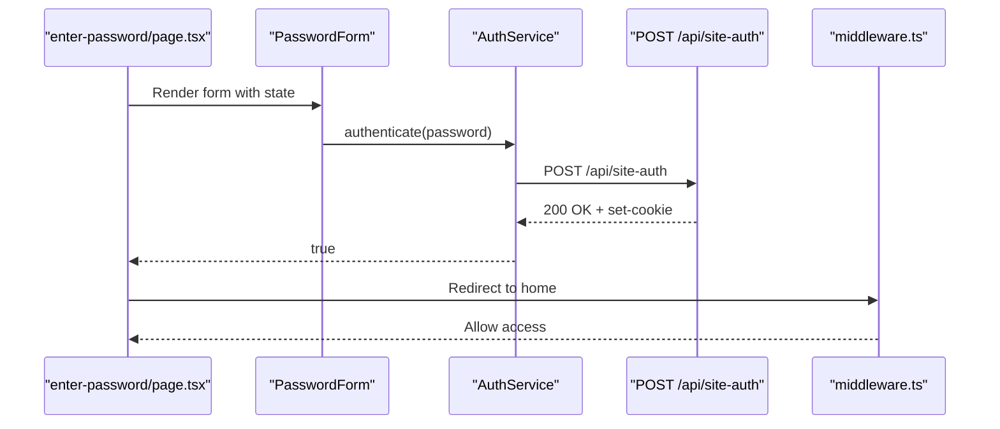

**Diagram sources**
- [PasswordForm.tsx](file://src/components/auth/PasswordForm.tsx#L1-L48)
- [page.tsx](file://src/app/enter-password/page.tsx#L1-L75)
- [authService.ts](file://src/lib/services/authService.ts#L1-L47)
- [route.ts](file://src/app/api/site-auth/route.ts#L1-L65)
- [middleware.ts](file://src/middleware.ts#L1-L54)

**Section sources**
- [PasswordForm.tsx](file://src/components/auth/PasswordForm.tsx#L1-L48)
- [page.tsx](file://src/app/enter-password/page.tsx#L1-L75)
- [authService.ts](file://src/lib/services/authService.ts#L1-L47)
- [route.ts](file://src/app/api/site-auth/route.ts#L1-L65)
- [middleware.ts](file://src/middleware.ts#L1-L54)

### Component Composition Patterns
- PersonForm composes Modal: PersonForm is rendered inside Modal, enabling inline editing without leaving the page.
- PurchaseForm integrates with Modal: When editing purchases inline, wrap PurchaseForm in Modal similarly to PersonForm.
- useZodForm composition: All validated forms (CreditCardForm, PersonForm) reuse useZodForm for consistent validation behavior.

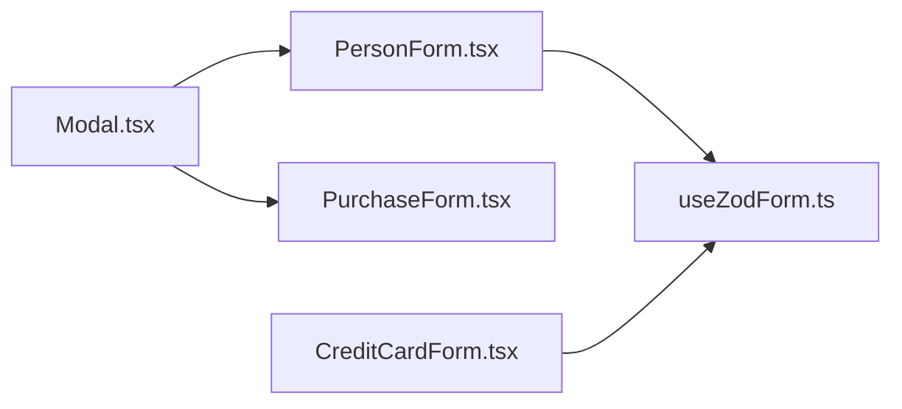

**Diagram sources**
- [Modal.tsx](file://src/components/Modal.tsx#L1-L62)
- [PersonForm.tsx](file://src/components/persons/PersonForm.tsx#L1-L109)
- [PurchaseForm.tsx](file://src/components/PurchaseForm.tsx#L1-L269)
- [CreditCardForm.tsx](file://src/components/credit-cards/CreditCardForm.tsx#L1-L180)
- [useZodForm.ts](file://src/lib/hooks/useZodForm.ts#L1-L83)

**Section sources**
- [Modal.tsx](file://src/components/Modal.tsx#L1-L62)
- [PersonForm.tsx](file://src/components/persons/PersonForm.tsx#L1-L109)
- [PurchaseForm.tsx](file://src/components/PurchaseForm.tsx#L1-L269)
- [CreditCardForm.tsx](file://src/components/credit-cards/CreditCardForm.tsx#L1-L180)
- [useZodForm.ts](file://src/lib/hooks/useZodForm.ts#L1-L83)

## Dependency Analysis
- Forms depend on:
  - useZodForm for validation and controlled state
  - schemas for Zod definitions
  - Modal for inline editing
- Display components depend on:
  - supabase.ts types and expand properties
  - purchaseService for loading details and transactions
- Filters depend on:
  - supabase.ts for entity lists
  - onFilterChange callback to propagate state
- Authentication depends on:
  - AuthService for client-side orchestration
  - API route for server-side validation and cookie setting
  - middleware for route protection

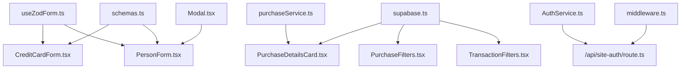

**Diagram sources**
- [useZodForm.ts](file://src/lib/hooks/useZodForm.ts#L1-L83)
- [schemas.ts](file://src/lib/schemas.ts#L1-L62)
- [Modal.tsx](file://src/components/Modal.tsx#L1-L62)
- [CreditCardForm.tsx](file://src/components/credit-cards/CreditCardForm.tsx#L1-L180)
- [PersonForm.tsx](file://src/components/persons/PersonForm.tsx#L1-L109)
- [PurchaseDetailsCard.tsx](file://src/components/purchases/PurchaseDetailsCard.tsx#L1-L78)
- [PurchaseFilters.tsx](file://src/components/purchases/PurchaseFilters.tsx#L1-L149)
- [TransactionFilters.tsx](file://src/components/transactions/TransactionFilters.tsx#L1-L196)
- [supabase.ts](file://src/lib/supabase.ts#L1-L81)
- [purchaseService.ts](file://src/lib/services/purchaseService.ts#L1-L88)
- [authService.ts](file://src/lib/services/authService.ts#L1-L47)
- [route.ts](file://src/app/api/site-auth/route.ts#L1-L65)
- [middleware.ts](file://src/middleware.ts#L1-L54)

**Section sources**
- [useZodForm.ts](file://src/lib/hooks/useZodForm.ts#L1-L83)
- [schemas.ts](file://src/lib/schemas.ts#L1-L62)
- [Modal.tsx](file://src/components/Modal.tsx#L1-L62)
- [CreditCardForm.tsx](file://src/components/credit-cards/CreditCardForm.tsx#L1-L180)
- [PersonForm.tsx](file://src/components/persons/PersonForm.tsx#L1-L109)
- [PurchaseDetailsCard.tsx](file://src/components/purchases/PurchaseDetailsCard.tsx#L1-L78)
- [PurchaseFilters.tsx](file://src/components/purchases/PurchaseFilters.tsx#L1-L149)
- [TransactionFilters.tsx](file://src/components/transactions/TransactionFilters.tsx#L1-L196)
- [supabase.ts](file://src/lib/supabase.ts#L1-L81)
- [purchaseService.ts](file://src/lib/services/purchaseService.ts#L1-L88)
- [authService.ts](file://src/lib/services/authService.ts#L1-L47)
- [route.ts](file://src/app/api/site-auth/route.ts#L1-L65)
- [middleware.ts](file://src/middleware.ts#L1-L54)

## Performance Considerations
- Prefer controlled components with stable callbacks to minimize re-renders.
- Use memoization for derived options (e.g., credit card/person option lists) when lists are large.
- Debounce text-based filters (description) to reduce frequent re-fetches.
- Lazy-load related data (e.g., purchase details) only when needed to avoid unnecessary network calls.

[No sources needed since this section provides general guidance]

## Troubleshooting Guide
- Validation errors:
  - useZodForm returns field-specific messages; ensure error keys match input names.
  - For conditional fields (e.g., principal_card_id), verify is_supplementary state before validating.
- Submission failures:
  - PersonForm logs errors; surface a user-friendly message and allow retry.
  - PurchaseForm numeric parsing: ensure inputs are valid numbers; default to safe fallbacks.
- Authentication:
  - Verify SITE_PASSWORD environment variable is set and correct.
  - Confirm cookie is being set and not blocked by browser privacy settings.
  - Check middleware matcher exclusions for /api/site-auth and /enter-password.
- Data display:
  - PurchaseDetailsCard relies on expand properties; ensure service layer populates them.

**Section sources**
- [useZodForm.ts](file://src/lib/hooks/useZodForm.ts#L1-L83)
- [schemas.ts](file://src/lib/schemas.ts#L1-L62)
- [PersonForm.tsx](file://src/components/persons/PersonForm.tsx#L1-L109)
- [PurchaseForm.tsx](file://src/components/PurchaseForm.tsx#L1-L269)
- [route.ts](file://src/app/api/site-auth/route.ts#L1-L65)
- [middleware.ts](file://src/middleware.ts#L1-L54)
- [purchaseService.ts](file://src/lib/services/purchaseService.ts#L1-L88)

## Conclusion
These feature-specific components demonstrate a consistent pattern: Zod-driven validation via useZodForm, typed domain models, and service-layer integration. Forms encapsulate submission logic, display components render structured data, and filters enable efficient browsing. The authentication flow is secure and cookie-backed. Following the outlined best practices will help maintain consistency and scalability as new features are added.

[No sources needed since this section summarizes without analyzing specific files]

## Appendices

### Best Practices for Extending Components
- Validation-first design:
  - Add or refine Zod schemas in schemas.ts before implementing UI.
  - Use useZodForm to keep validation logic centralized.
- Controlled inputs:
  - Always bind inputs to state and clear per-field errors on change.
- Service integration:
  - Keep service methods focused and throw meaningful errors for consistent handling.
- Composition:
  - Wrap inline editors in Modal for consistent UX.
- Filtering:
  - Normalize filter states and debounce heavy filters.
- Authentication:
  - Centralize auth logic in AuthService and keep API routes minimal and secure.

[No sources needed since this section provides general guidance]