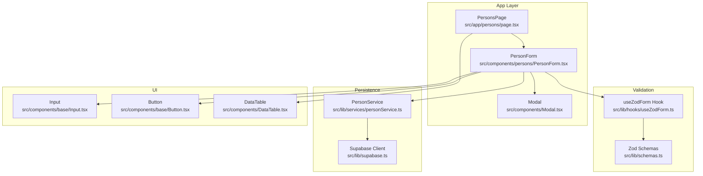
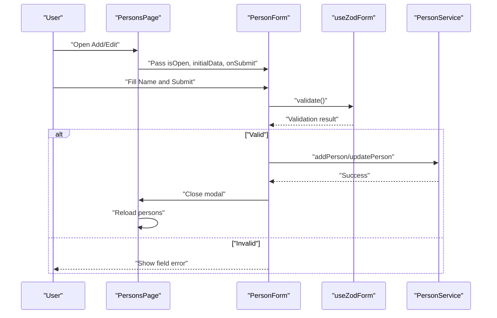
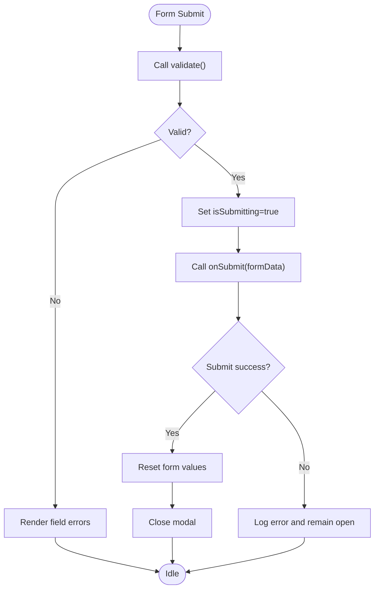
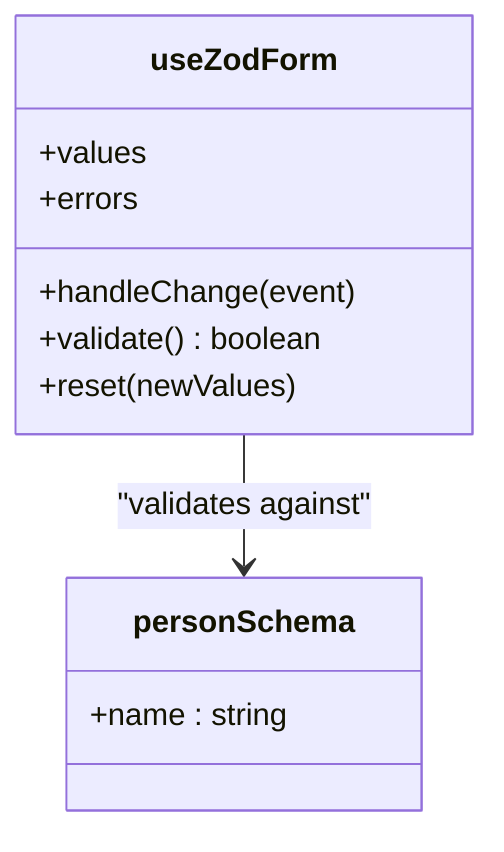
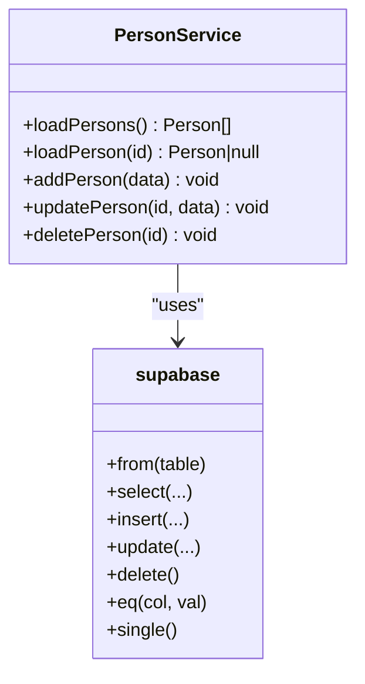
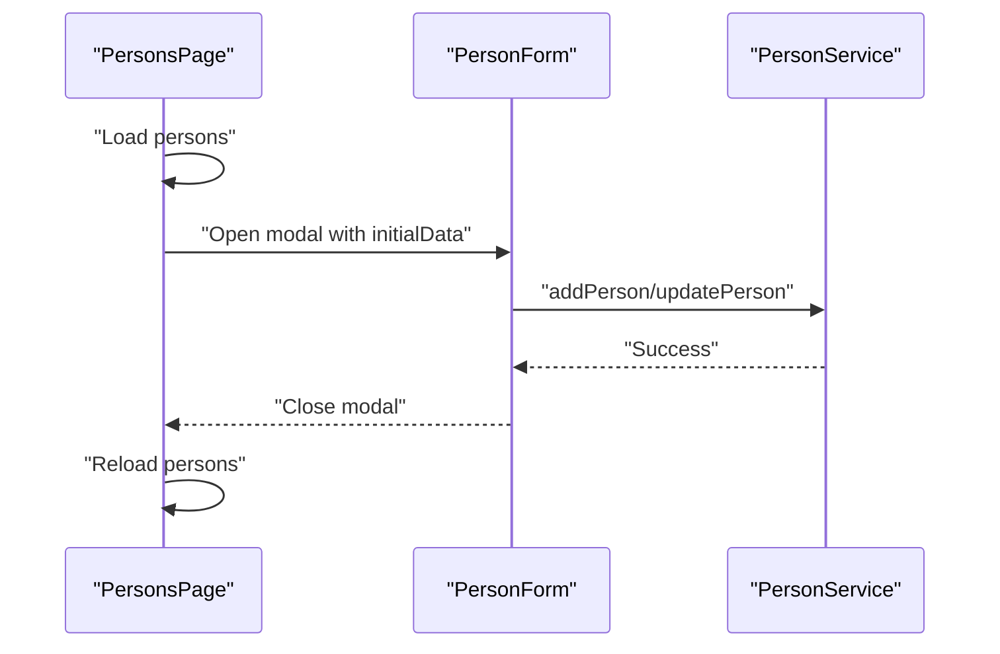
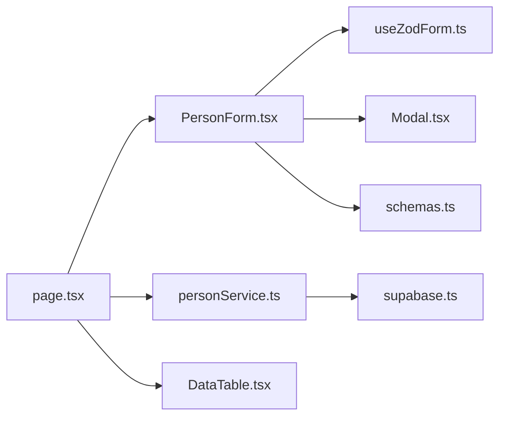
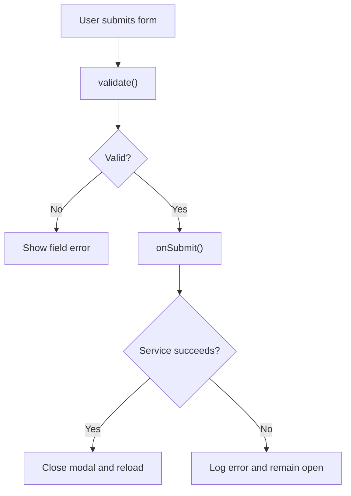

# Person Components

<cite>
**Referenced Files in This Document**
- [PersonForm.tsx](file://src/components/persons/PersonForm.tsx)
- [useZodForm.ts](file://src/lib/hooks/useZodForm.ts)
- [schemas.ts](file://src/lib/schemas.ts)
- [personService.ts](file://src/lib/services/personService.ts)
- [page.tsx](file://src/app/persons/page.tsx)
- [Modal.tsx](file://src/components/Modal.tsx)
- [Input.tsx](file://src/components/base/Input.tsx)
- [Button.tsx](file://src/components/base/Button.tsx)
- [DataTable.tsx](file://src/components/DataTable.tsx)
- [supabase.ts](file://src/lib/supabase.ts)
</cite>

## Table of Contents
1. [Introduction](#introduction)
2. [Project Structure](#project-structure)
3. [Core Components](#core-components)
4. [Architecture Overview](#architecture-overview)
5. [Detailed Component Analysis](#detailed-component-analysis)
6. [Dependency Analysis](#dependency-analysis)
7. [Performance Considerations](#performance-considerations)
8. [Accessibility Features](#accessibility-features)
9. [Responsive Design Considerations](#responsive-design-considerations)
10. [Error Handling and Boundary Patterns](#error-handling-and-boundary-patterns)
11. [Best Practices for Reusing This Pattern](#best-practices-for-reusing-this-pattern)
12. [Conclusion](#conclusion)

## Introduction
This document explains the PersonForm component used in the person management feature. It covers how the component uses Zod validation via the useZodForm hook, integrates with personService for data persistence, and handles creation and editing workflows. It also documents the form structure, validation rules, submission handling (including loading states and error feedback), integration into the /persons page, composition with base UI components, accessibility, responsive design, and error boundary handling. Finally, it provides reusable patterns for adding new entity forms.

## Project Structure
The person management feature is organized around a dedicated page that renders a data table of persons and composes the PersonForm modal for create/edit actions. Validation is centralized in Zod schemas, and persistence is handled by a service layer built on Supabase.

**Diagram sources**
- [page.tsx](file://src/app/persons/page.tsx#L1-L156)
- [PersonForm.tsx](file://src/components/persons/PersonForm.tsx#L1-L109)
- [useZodForm.ts](file://src/lib/hooks/useZodForm.ts#L1-L83)
- [schemas.ts](file://src/lib/schemas.ts#L1-L62)
- [personService.ts](file://src/lib/services/personService.ts#L1-L76)
- [supabase.ts](file://src/lib/supabase.ts#L1-L81)
- [Input.tsx](file://src/components/base/Input.tsx#L1-L84)
- [Button.tsx](file://src/components/base/Button.tsx#L1-L115)
- [DataTable.tsx](file://src/components/DataTable.tsx#L1-L86)
- [Modal.tsx](file://src/components/Modal.tsx#L1-L62)

**Section sources**
- [page.tsx](file://src/app/persons/page.tsx#L1-L156)
- [PersonForm.tsx](file://src/components/persons/PersonForm.tsx#L1-L109)

## Core Components
- PersonForm: Modal-based form for adding or editing a person. It validates input using Zod via useZodForm, disables controls during submission, and delegates persistence to the parent via onSubmit.
- useZodForm: A reusable hook that manages form state, change handlers, validation, and reset logic using a Zod schema.
- personService: Encapsulates CRUD operations against the Supabase persons table.
- PersonsPage: Orchestrates loading, error handling, modal state, and passes submit handlers to PersonForm.
- Modal, Input, Button: Base UI components used to render the form and actions.

**Section sources**
- [PersonForm.tsx](file://src/components/persons/PersonForm.tsx#L1-L109)
- [useZodForm.ts](file://src/lib/hooks/useZodForm.ts#L1-L83)
- [personService.ts](file://src/lib/services/personService.ts#L1-L76)
- [page.tsx](file://src/app/persons/page.tsx#L1-L156)
- [Modal.tsx](file://src/components/Modal.tsx#L1-L62)
- [Input.tsx](file://src/components/base/Input.tsx#L1-L84)
- [Button.tsx](file://src/components/base/Button.tsx#L1-L115)

## Architecture Overview
The PersonForm participates in a unidirectional data flow:
- The parent PersonsPage loads persons, manages modal state, and passes submit handlers.
- PersonForm validates user input with Zod, then calls onSubmit with normalized data.
- onSubmit invokes personService to persist changes and refreshes the list.

**Diagram sources**
- [page.tsx](file://src/app/persons/page.tsx#L38-L76)
- [PersonForm.tsx](file://src/components/persons/PersonForm.tsx#L42-L58)
- [useZodForm.ts](file://src/lib/hooks/useZodForm.ts#L48-L67)
- [personService.ts](file://src/lib/services/personService.ts#L16-L45)

## Detailed Component Analysis

### PersonForm Component
- Purpose: Modal dialog for creating or editing a person with a single text field.
- Inputs:
  - isOpen: Controls visibility.
  - onClose: Callback invoked when closing the modal.
  - onSubmit: Persist handler receiving validated form data.
  - initialData: Optional person record for edit mode.
- Validation:
  - Uses personSchema to enforce non-empty name.
  - Errors are surfaced below the input field.
- Submission:
  - Prevents default form submission.
  - Validates before calling onSubmit.
  - Sets isSubmitting to disable controls and show Save vs Saving.
  - On success, resets form and closes modal.
  - On error, logs to console and remains open for correction.
- Accessibility:
  - Modal uses role="dialog" and aria-modal="true".
  - Close button has aria-label.
  - Disabled states prevent interaction while submitting.
- Composition:
  - Uses Modal for container and layout.
  - Uses native input and buttons styled via Tailwind classes.

**Diagram sources**
- [PersonForm.tsx](file://src/components/persons/PersonForm.tsx#L42-L58)
- [useZodForm.ts](file://src/lib/hooks/useZodForm.ts#L48-L67)

**Section sources**
- [PersonForm.tsx](file://src/components/persons/PersonForm.tsx#L1-L109)
- [Modal.tsx](file://src/components/Modal.tsx#L1-L62)

### useZodForm Hook
- Responsibilities:
  - Manage form values and errors.
  - Provide handleChange that updates values and clears field-specific errors on change.
  - Provide validate that runs Zod schema parsing and returns boolean.
  - Provide reset to restore initial values and clear errors.
- Behavior:
  - Handles text inputs generically and clears errors on user input.
  - Converts ZodError into a flat map of field -> message.
- Complexity:
  - validate() performs O(n) over fields in the schema.
  - handleChange and reset are O(1) updates.

**Diagram sources**
- [useZodForm.ts](file://src/lib/hooks/useZodForm.ts#L1-L83)
- [schemas.ts](file://src/lib/schemas.ts#L27-L31)

**Section sources**
- [useZodForm.ts](file://src/lib/hooks/useZodForm.ts#L1-L83)
- [schemas.ts](file://src/lib/schemas.ts#L27-L31)

### personService
- Responsibilities:
  - Load all persons.
  - Load a single person by id.
  - Add a new person.
  - Update an existing person by id.
  - Delete a person by id.
- Persistence:
  - Uses Supabase client initialized from environment variables.
- Error handling:
  - Throws captured errors to be handled by callers.

**Diagram sources**
- [personService.ts](file://src/lib/services/personService.ts#L1-L76)
- [supabase.ts](file://src/lib/supabase.ts#L1-L81)

**Section sources**
- [personService.ts](file://src/lib/services/personService.ts#L1-L76)
- [supabase.ts](file://src/lib/supabase.ts#L1-L81)

### PersonsPage Integration
- Loads persons on mount and handles loading/error states.
- Opens the PersonForm modal for add/edit actions.
- Passes handleFormSubmit to PersonForm, which persists changes and reloads the list.
- Renders a DataTable with action buttons to view transactions, edit, and delete persons.

**Diagram sources**
- [page.tsx](file://src/app/persons/page.tsx#L1-L156)
- [PersonForm.tsx](file://src/components/persons/PersonForm.tsx#L42-L58)
- [personService.ts](file://src/lib/services/personService.ts#L16-L45)

**Section sources**
- [page.tsx](file://src/app/persons/page.tsx#L1-L156)
- [DataTable.tsx](file://src/components/DataTable.tsx#L1-L86)

## Dependency Analysis
- PersonForm depends on:
  - useZodForm for validation and state.
  - personSchema for validation rules.
  - Modal for presentation.
  - personService indirectly via the parent’s onSubmit handler.
- PersonsPage depends on:
  - PersonForm for modals.
  - PersonService for data operations.
  - DataTable for rendering.
- personService depends on:
  - supabase client for database operations.

**Diagram sources**
- [PersonForm.tsx](file://src/components/persons/PersonForm.tsx#L1-L109)
- [useZodForm.ts](file://src/lib/hooks/useZodForm.ts#L1-L83)
- [schemas.ts](file://src/lib/schemas.ts#L27-L31)
- [page.tsx](file://src/app/persons/page.tsx#L1-L156)
- [personService.ts](file://src/lib/services/personService.ts#L1-L76)
- [supabase.ts](file://src/lib/supabase.ts#L1-L81)
- [DataTable.tsx](file://src/components/DataTable.tsx#L1-L86)
- [Modal.tsx](file://src/components/Modal.tsx#L1-L62)

**Section sources**
- [PersonForm.tsx](file://src/components/persons/PersonForm.tsx#L1-L109)
- [page.tsx](file://src/app/persons/page.tsx#L1-L156)
- [personService.ts](file://src/lib/services/personService.ts#L1-L76)

## Performance Considerations
- Validation cost scales linearly with the number of fields in the schema; keep schemas minimal for forms with few fields.
- Memoization of initial form values avoids unnecessary re-renders.
- Disabling inputs during submission prevents redundant submissions and reduces UI churn.
- Consider debounced validation for long-running checks, though not applicable here given the simple schema.

[No sources needed since this section provides general guidance]

## Accessibility Features
- Modal:
  - role="dialog" and aria-modal="true" indicate a modal context.
  - Backdrop click-to-close provides keyboard-accessible dismissal.
  - Close button has aria-label.
- Buttons:
  - Button component applies btn-disabled and sets tabIndex and aria-disabled when disabled.
  - Loading spinner is visually indicated; consider aria-busy for complex flows.
- Form:
  - Native input and label structure enable screen reader support.
  - Disabled states prevent interaction while submitting.

**Section sources**
- [Modal.tsx](file://src/components/Modal.tsx#L35-L59)
- [Button.tsx](file://src/components/base/Button.tsx#L64-L76)
- [PersonForm.tsx](file://src/components/persons/PersonForm.tsx#L70-L105)

## Responsive Design Considerations
- Modal width is controlled via maxWidth prop; default is medium.
- Action buttons stack vertically on small screens and align horizontally on larger screens using responsive spacing utilities.
- DataTable adapts to narrow widths with horizontal scrolling.
- Input and label layouts remain readable across breakpoints.

**Section sources**
- [Modal.tsx](file://src/components/Modal.tsx#L12-L17)
- [page.tsx](file://src/app/persons/page.tsx#L112-L141)
- [DataTable.tsx](file://src/components/DataTable.tsx#L35-L40)

## Error Handling and Boundary Patterns
- Validation errors:
  - useZodForm converts ZodError into field-specific messages and clears per-field errors on subsequent user input.
- Submission errors:
  - PersonForm logs to console and keeps the modal open for correction.
  - PersonsPage surfaces errors and provides a retry button; it also logs to console.
- Persistence errors:
  - personService throws captured Supabase errors; callers decide whether to surface to UI or log.

**Diagram sources**
- [useZodForm.ts](file://src/lib/hooks/useZodForm.ts#L48-L67)
- [PersonForm.tsx](file://src/components/persons/PersonForm.tsx#L42-L58)
- [page.tsx](file://src/app/persons/page.tsx#L22-L36)

**Section sources**
- [useZodForm.ts](file://src/lib/hooks/useZodForm.ts#L48-L67)
- [PersonForm.tsx](file://src/components/persons/PersonForm.tsx#L42-L58)
- [page.tsx](file://src/app/persons/page.tsx#L22-L36)

## Best Practices for Reusing This Pattern
- Define a Zod schema per entity and export typed form data.
- Create a reusable hook similar to useZodForm for consistent validation and reset behavior.
- Keep forms minimal and focused; split complex forms into smaller components.
- Centralize persistence in a service layer (e.g., personService) to isolate data concerns.
- Compose with Modal for dialogs and Button/Input for actions and inputs.
- Surface validation errors close to fields and clear them on user input.
- Disable controls during submission to prevent duplicate requests.
- Provide explicit loading states and retry mechanisms in parent pages.
- Use aria attributes and roles for modals and disabled buttons.
- Test both creation and editing flows with initialData and empty initialData.
- Keep error handling at the edges (service and page) and log to console for diagnostics.

[No sources needed since this section provides general guidance]

## Conclusion
The PersonForm demonstrates a clean, reusable pattern for entity forms: Zod-driven validation via a custom hook, modal-based UX, and service-layer persistence. Its integration with PersonsPage showcases loading, error, and success flows. By following the outlined best practices, teams can consistently add new entity forms with strong validation, accessible UI, and robust error handling.

[No sources needed since this section summarizes without analyzing specific files]