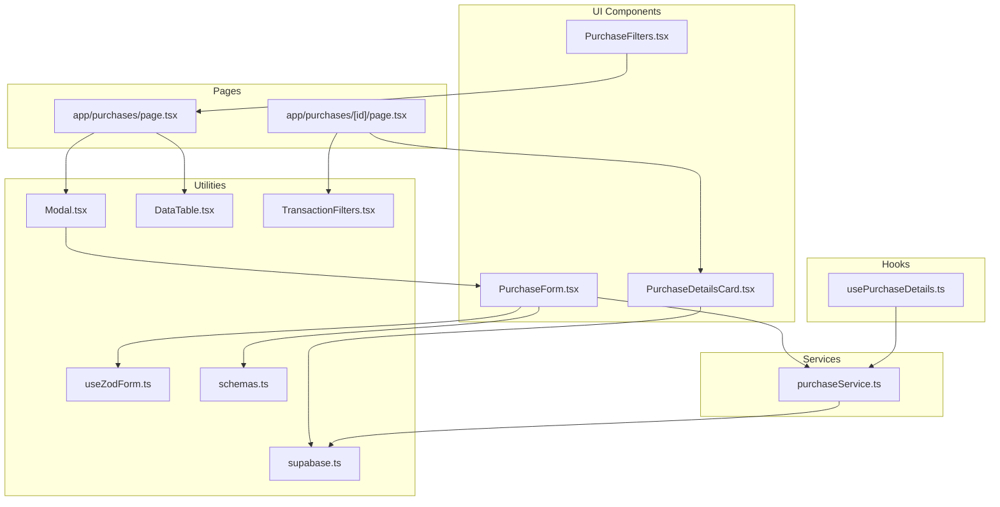
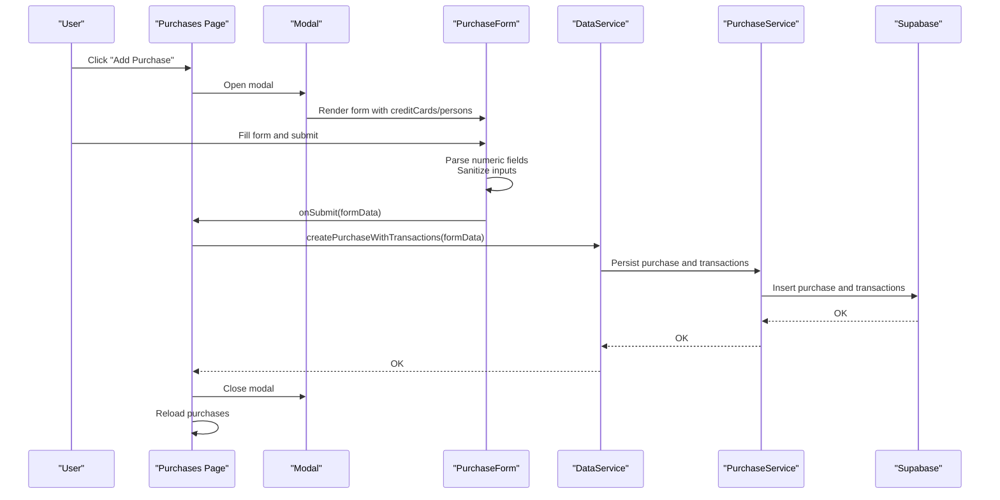
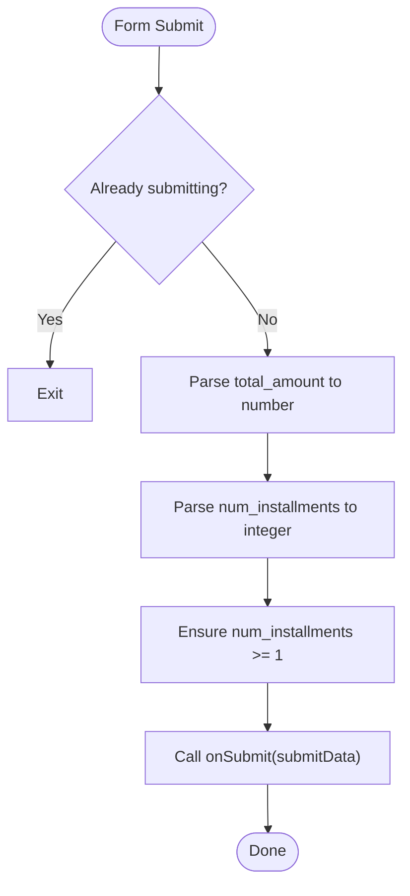
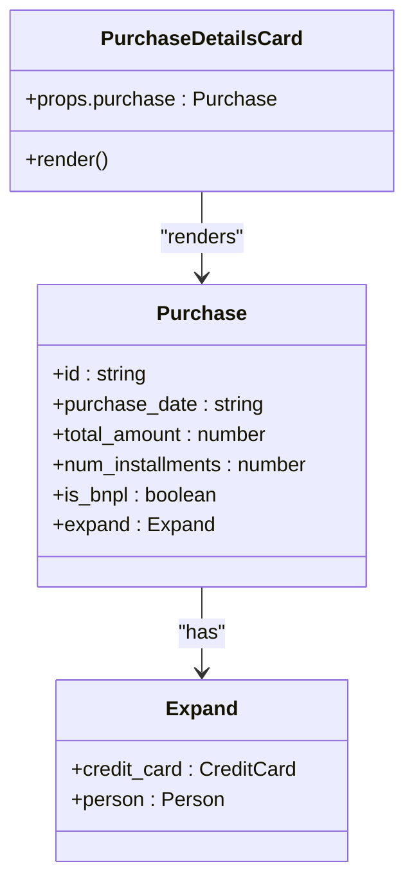
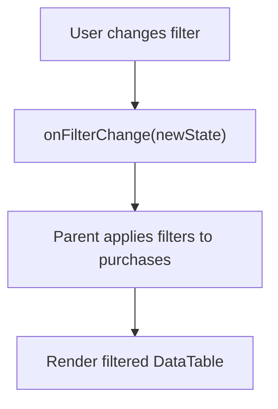
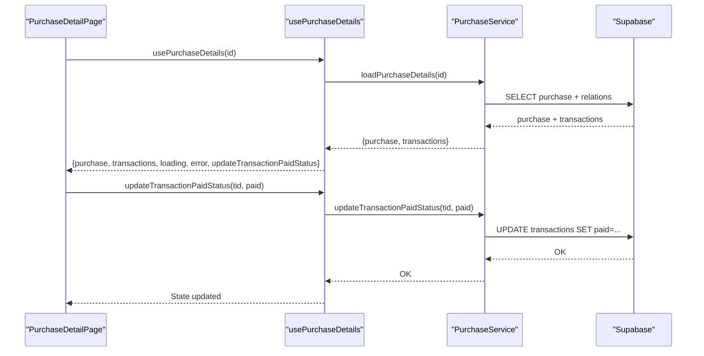
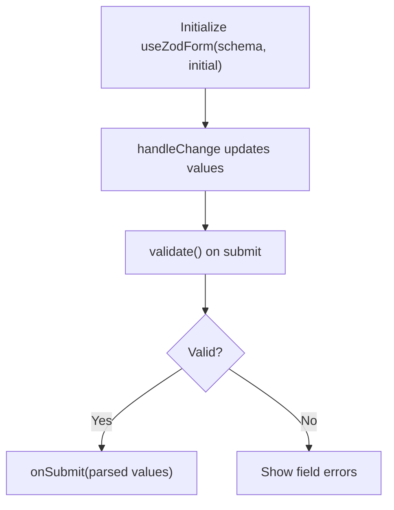
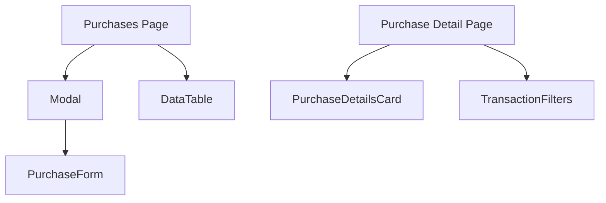
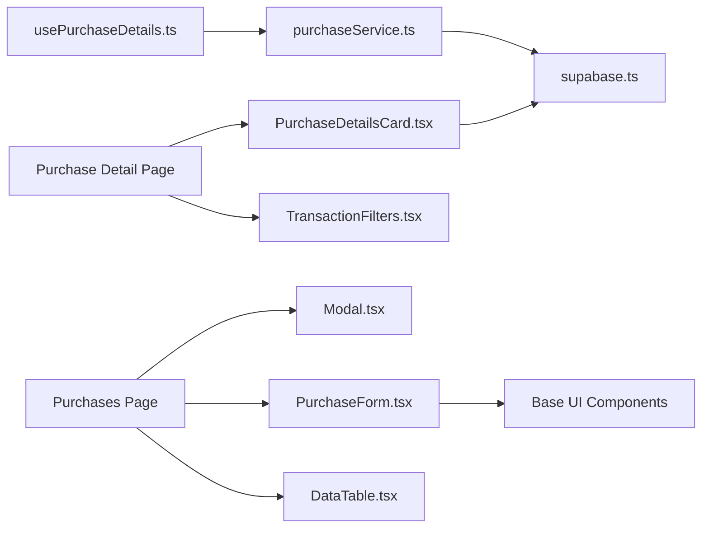

# Purchase Components

<cite>
**Referenced Files in This Document**
- [PurchaseForm.tsx](file://src/components/PurchaseForm.tsx)
- [PurchaseDetailsCard.tsx](file://src/components/purchases/PurchaseDetailsCard.tsx)
- [PurchaseFilters.tsx](file://src/components/purchases/PurchaseFilters.tsx)
- [usePurchaseDetails.ts](file://src/lib/hooks/usePurchaseDetails.ts)
- [purchaseService.ts](file://src/lib/services/purchaseService.ts)
- [schemas.ts](file://src/lib/schemas.ts)
- [useZodForm.ts](file://src/lib/hooks/useZodForm.ts)
- [Modal.tsx](file://src/components/Modal.tsx)
- [page.tsx (Purchases)](file://src/app/purchases/page.tsx)
- [page.tsx (Purchase Detail)](file://src/app/purchases/[id]/page.tsx)
- [DataTable.tsx](file://src/components/DataTable.tsx)
- [TransactionFilters.tsx](file://src/components/transactions/TransactionFilters.tsx)
- [supabase.ts](file://src/lib/supabase.ts)
</cite>

## Table of Contents
1. [Introduction](#introduction)
2. [Project Structure](#project-structure)
3. [Core Components](#core-components)
4. [Architecture Overview](#architecture-overview)
5. [Detailed Component Analysis](#detailed-component-analysis)
6. [Dependency Analysis](#dependency-analysis)
7. [Performance Considerations](#performance-considerations)
8. [Troubleshooting Guide](#troubleshooting-guide)
9. [Conclusion](#conclusion)

## Introduction
This document explains the purchase-related components and their interactions:
- PurchaseForm: Handles complex purchase data entry with installment/BNPL options and integrates with purchaseService for persistence.
- PurchaseDetailsCard: Displays purchase details and related metadata such as installments and BNPL status.
- PurchaseFilters: Provides filtering capabilities for purchase lists by person, card, description, and paid/unpaid status.

It also covers how these components compose together, including inline editing via Modal, state management, validation strategies, and responsive layout considerations.

## Project Structure
The purchase domain spans UI components, hooks, services, and pages:
- UI components: PurchaseForm, PurchaseDetailsCard, PurchaseFilters
- Hooks: usePurchaseDetails
- Services: purchaseService
- Pages: Purchases list and Purchase detail
- Supporting utilities: Modal, DataTable, TransactionFilters, Zod schemas, Supabase types

**Diagram sources**
- [PurchaseForm.tsx](file://src/components/PurchaseForm.tsx#L1-L269)
- [PurchaseDetailsCard.tsx](file://src/components/purchases/PurchaseDetailsCard.tsx#L1-L78)
- [PurchaseFilters.tsx](file://src/components/purchases/PurchaseFilters.tsx#L1-L149)
- [usePurchaseDetails.ts](file://src/lib/hooks/usePurchaseDetails.ts#L1-L63)
- [purchaseService.ts](file://src/lib/services/purchaseService.ts#L1-L88)
- [page.tsx (Purchases)](file://src/app/purchases/page.tsx#L1-L260)
- [page.tsx (Purchase Detail)](file://src/app/purchases/[id]/page.tsx#L1-L188)
- [Modal.tsx](file://src/components/Modal.tsx#L1-L62)
- [DataTable.tsx](file://src/components/DataTable.tsx#L1-L86)
- [TransactionFilters.tsx](file://src/components/transactions/TransactionFilters.tsx#L1-L196)
- [useZodForm.ts](file://src/lib/hooks/useZodForm.ts#L1-L83)
- [schemas.ts](file://src/lib/schemas.ts#L1-L62)
- [supabase.ts](file://src/lib/supabase.ts#L1-L81)

**Section sources**
- [page.tsx (Purchases)](file://src/app/purchases/page.tsx#L1-L260)
- [page.tsx (Purchase Detail)](file://src/app/purchases/[id]/page.tsx#L1-L188)

## Core Components
- PurchaseForm: Collects purchase inputs, performs basic numeric sanitization, and delegates submission to a parent handler. It does not currently use Zod validation internally but aligns with the Zod schemas for type safety.
- PurchaseDetailsCard: Renders purchase metadata and related entities (credit card, person) with formatting.
- PurchaseFilters: Provides a compact filter bar for purchases by person, card, description, and paid status.

**Section sources**
- [PurchaseForm.tsx](file://src/components/PurchaseForm.tsx#L1-L269)
- [PurchaseDetailsCard.tsx](file://src/components/purchases/PurchaseDetailsCard.tsx#L1-L78)
- [PurchaseFilters.tsx](file://src/components/purchases/PurchaseFilters.tsx#L1-L149)

## Architecture Overview
The purchase workflow connects UI, services, and data:
- Purchases page composes Modal and PurchaseForm to enable inline creation.
- PurchaseForm submits to a parent handler that persists data via purchaseService.
- Purchase detail page uses usePurchaseDetails to load purchase and transactions, and renders them with PurchaseDetailsCard and TransactionFilters.

**Diagram sources**
- [page.tsx (Purchases)](file://src/app/purchases/page.tsx#L60-L100)
- [Modal.tsx](file://src/components/Modal.tsx#L1-L62)
- [PurchaseForm.tsx](file://src/components/PurchaseForm.tsx#L104-L130)
- [purchaseService.ts](file://src/lib/services/purchaseService.ts#L1-L88)

## Detailed Component Analysis

### PurchaseForm
- Purpose: Capture purchase inputs including credit card, person, dates, total amount, description, number of installments, BNPL flag, and billing start date.
- Validation and sanitization:
  - Converts total_amount and num_installments to numbers.
  - Ensures num_installments is at least 1.
  - Uses controlled inputs for all fields.
- Integration:
  - Receives creditCards and persons to populate selects.
  - Delegates submission to a parent handler (onSubmit) and cancellation to onCancel.
  - Persists via DataService.createPurchaseWithTransactions in the parent page.
- UX:
  - Disabled during submission to prevent duplicate submissions.
  - Initializes with sensible defaults (today’s date, first card/person).

**Diagram sources**
- [PurchaseForm.tsx](file://src/components/PurchaseForm.tsx#L104-L130)

**Section sources**
- [PurchaseForm.tsx](file://src/components/PurchaseForm.tsx#L1-L269)
- [page.tsx (Purchases)](file://src/app/purchases/page.tsx#L68-L86)

### PurchaseDetailsCard
- Purpose: Display purchase details including date, total amount, credit card, person, number of installments, and BNPL status.
- Data expansion:
  - Uses expand properties to render related entities (credit card and person).
- Formatting:
  - Uses formatDate and currency decimal constants for consistent display.

**Diagram sources**
- [PurchaseDetailsCard.tsx](file://src/components/purchases/PurchaseDetailsCard.tsx#L1-L78)
- [supabase.ts](file://src/lib/supabase.ts#L41-L81)

**Section sources**
- [PurchaseDetailsCard.tsx](file://src/components/purchases/PurchaseDetailsCard.tsx#L1-L78)
- [supabase.ts](file://src/lib/supabase.ts#L41-L81)

### PurchaseFilters
- Purpose: Filter purchase lists by person, card, description, and paid/unpaid status.
- Behavior:
  - Updates filters via onFilterChange callback.
  - Provides a clear filters action.
- Composition:
  - Used on the purchases list page to filter the DataTable.

**Diagram sources**
- [PurchaseFilters.tsx](file://src/components/purchases/PurchaseFilters.tsx#L1-L149)
- [page.tsx (Purchases)](file://src/app/purchases/page.tsx#L102-L116)

**Section sources**
- [PurchaseFilters.tsx](file://src/components/purchases/PurchaseFilters.tsx#L1-L149)
- [page.tsx (Purchases)](file://src/app/purchases/page.tsx#L102-L116)

### usePurchaseDetails Hook and purchaseService
- usePurchaseDetails:
  - Loads a purchase and its transactions by ID.
  - Exposes updateTransactionPaidStatus to toggle paid flags.
- purchaseService:
  - Loads purchase with related entities via Supabase.
  - Updates transaction paid status.

**Diagram sources**
- [usePurchaseDetails.ts](file://src/lib/hooks/usePurchaseDetails.ts#L1-L63)
- [purchaseService.ts](file://src/lib/services/purchaseService.ts#L1-L88)
- [page.tsx (Purchase Detail)](file://src/app/purchases/[id]/page.tsx#L1-L188)

**Section sources**
- [usePurchaseDetails.ts](file://src/lib/hooks/usePurchaseDetails.ts#L1-L63)
- [purchaseService.ts](file://src/lib/services/purchaseService.ts#L1-L88)
- [page.tsx (Purchase Detail)](file://src/app/purchases/[id]/page.tsx#L1-L188)

### Zod Validation Strategy
- Current state:
  - PurchaseForm does not use Zod validation internally.
  - The repository defines Zod schemas for purchase and related entities.
- Recommended integration:
  - Wrap PurchaseForm with useZodForm to leverage schema-driven validation, real-time feedback, and consistent parsing.
  - Align form values with purchaseSchema types to ensure downstream service calls receive validated data.

**Diagram sources**
- [useZodForm.ts](file://src/lib/hooks/useZodForm.ts#L1-L83)
- [schemas.ts](file://src/lib/schemas.ts#L32-L44)

**Section sources**
- [useZodForm.ts](file://src/lib/hooks/useZodForm.ts#L1-L83)
- [schemas.ts](file://src/lib/schemas.ts#L1-L62)

### Component Composition and Inline Editing
- Inline editing:
  - Purchases page opens a Modal containing PurchaseForm.
  - On submit, the parent handler persists data and refreshes the list.
- Detail page:
  - PurchaseDetailsCard displays purchase metadata.
  - TransactionFilters allows filtering transactions by description and paid status.

**Diagram sources**
- [page.tsx (Purchases)](file://src/app/purchases/page.tsx#L244-L256)
- [Modal.tsx](file://src/components/Modal.tsx#L1-L62)
- [page.tsx (Purchase Detail)](file://src/app/purchases/[id]/page.tsx#L93-L185)

**Section sources**
- [page.tsx (Purchases)](file://src/app/purchases/page.tsx#L1-L260)
- [page.tsx (Purchase Detail)](file://src/app/purchases/[id]/page.tsx#L1-L188)
- [Modal.tsx](file://src/components/Modal.tsx#L1-L62)

## Dependency Analysis
- Internal dependencies:
  - PurchaseForm depends on base UI components (Select, DateInput, Input, Textarea, Checkbox, Button).
  - PurchaseDetailsCard depends on supabase types and formatting utilities.
  - usePurchaseDetails depends on purchaseService.
  - purchaseService depends on Supabase client.
- External integrations:
  - Modal provides a reusable overlay container for inline editing.
  - DataTable renders tabular purchase data with responsive columns.

**Diagram sources**
- [PurchaseForm.tsx](file://src/components/PurchaseForm.tsx#L1-L269)
- [PurchaseDetailsCard.tsx](file://src/components/purchases/PurchaseDetailsCard.tsx#L1-L78)
- [usePurchaseDetails.ts](file://src/lib/hooks/usePurchaseDetails.ts#L1-L63)
- [purchaseService.ts](file://src/lib/services/purchaseService.ts#L1-L88)
- [page.tsx (Purchases)](file://src/app/purchases/page.tsx#L1-L260)
- [page.tsx (Purchase Detail)](file://src/app/purchases/[id]/page.tsx#L1-L188)
- [Modal.tsx](file://src/components/Modal.tsx#L1-L62)
- [DataTable.tsx](file://src/components/DataTable.tsx#L1-L86)
- [TransactionFilters.tsx](file://src/components/transactions/TransactionFilters.tsx#L1-L196)
- [supabase.ts](file://src/lib/supabase.ts#L1-L81)

**Section sources**
- [PurchaseForm.tsx](file://src/components/PurchaseForm.tsx#L1-L269)
- [PurchaseDetailsCard.tsx](file://src/components/purchases/PurchaseDetailsCard.tsx#L1-L78)
- [usePurchaseDetails.ts](file://src/lib/hooks/usePurchaseDetails.ts#L1-L63)
- [purchaseService.ts](file://src/lib/services/purchaseService.ts#L1-L88)
- [page.tsx (Purchases)](file://src/app/purchases/page.tsx#L1-L260)
- [page.tsx (Purchase Detail)](file://src/app/purchases/[id]/page.tsx#L1-L188)
- [Modal.tsx](file://src/components/Modal.tsx#L1-L62)
- [DataTable.tsx](file://src/components/DataTable.tsx#L1-L86)
- [TransactionFilters.tsx](file://src/components/transactions/TransactionFilters.tsx#L1-L196)
- [supabase.ts](file://src/lib/supabase.ts#L1-L81)

## Performance Considerations
- Rendering:
  - DataTable uses memoized column rendering and minimal DOM updates.
  - PurchaseDetailsCard avoids heavy computations; relies on pre-expanded data.
- Data fetching:
  - usePurchaseDetails loads purchase and transactions in a single effect.
  - purchaseService performs targeted queries with ordering for transactions.
- Input handling:
  - Controlled inputs in PurchaseForm minimize re-renders.
  - Debouncing filters in higher-order components (e.g., TransactionFilters) can reduce re-filtering churn.

[No sources needed since this section provides general guidance]

## Troubleshooting Guide
- Form submission fails silently:
  - Ensure the parent handler catches and surfaces errors from DataService.
  - Verify that PurchaseForm disables submission while submitting to avoid duplicates.
- Purchase not found or detail page shows loading:
  - Confirm the ID parameter is present and valid.
  - Check usePurchaseDetails error handling and fallback UI.
- Transactions not updating paid status:
  - Verify updateTransactionPaidStatus is called and purchaseService update succeeds.
  - Inspect network requests to Supabase for errors.

**Section sources**
- [page.tsx (Purchases)](file://src/app/purchases/page.tsx#L68-L86)
- [usePurchaseDetails.ts](file://src/lib/hooks/usePurchaseDetails.ts#L37-L61)
- [purchaseService.ts](file://src/lib/services/purchaseService.ts#L71-L88)

## Conclusion
The purchase components form a cohesive workflow:
- PurchaseForm captures structured purchase data with numeric sanitization and integrates with persistence.
- PurchaseDetailsCard presents purchase metadata clearly.
- PurchaseFilters enables efficient browsing of purchase lists.
- usePurchaseDetails and purchaseService provide robust data loading and mutation.
- Modal and DataTable enhance inline editing and responsive presentation.

For enhanced validation and type safety, integrating Zod via useZodForm into PurchaseForm would align the UI with the existing schemas and improve developer experience.