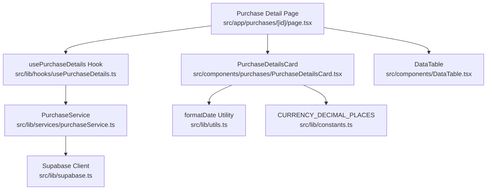
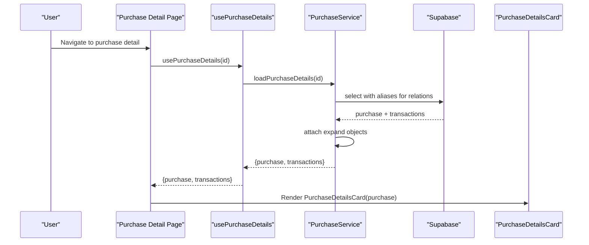
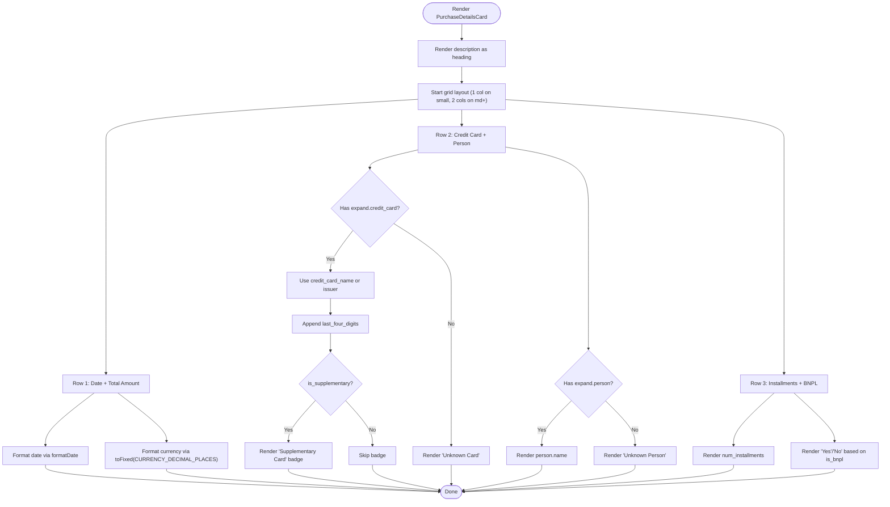
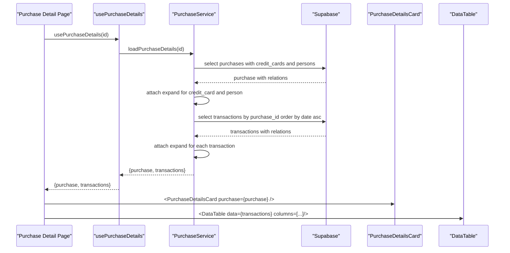
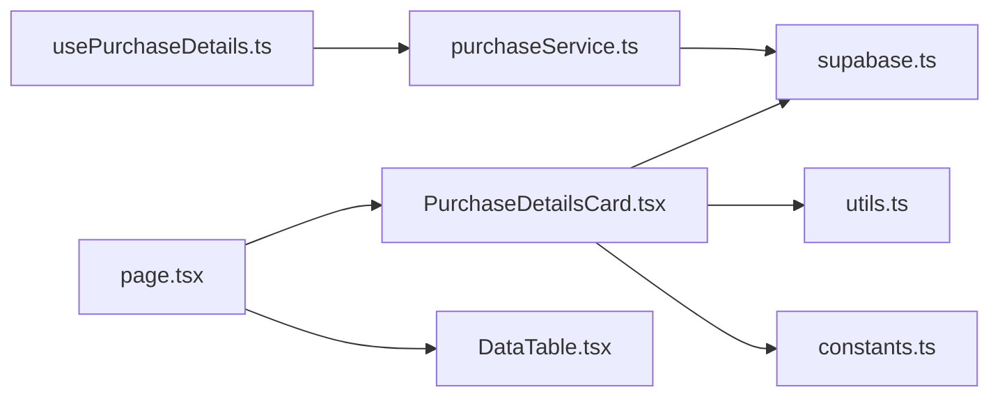

# Purchase Details Card

<cite>
**Referenced Files in This Document**
- [PurchaseDetailsCard.tsx](file://src/components/purchases/PurchaseDetailsCard.tsx)
- [page.tsx](file://src/app/purchases/[id]/page.tsx)
- [constants.ts](file://src/lib/constants.ts)
- [utils.ts](file://src/lib/utils.ts)
- [supabase.ts](file://src/lib/supabase.ts)
- [purchaseService.ts](file://src/lib/services/purchaseService.ts)
- [usePurchaseDetails.ts](file://src/lib/hooks/usePurchaseDetails.ts)
- [DataTable.tsx](file://src/components/DataTable.tsx)
</cite>

## Table of Contents
1. [Introduction](#introduction)
2. [Project Structure](#project-structure)
3. [Core Components](#core-components)
4. [Architecture Overview](#architecture-overview)
5. [Detailed Component Analysis](#detailed-component-analysis)
6. [Dependency Analysis](#dependency-analysis)
7. [Performance Considerations](#performance-considerations)
8. [Troubleshooting Guide](#troubleshooting-guide)
9. [Conclusion](#conclusion)

## Introduction
This document explains the PurchaseDetailsCard component, which presents a selected purchase’s information in a structured, responsive layout. It covers how the component renders key fields (description, date, total amount, credit card, person, installments, BNPL status), how it uses Supabase expand objects to access related data, and how it gracefully handles missing or null values. It also documents currency formatting, date formatting, responsive grid layout, and integration patterns with parent components and data-fetching strategies.

## Project Structure
The PurchaseDetailsCard resides in the components layer and is consumed by the purchase detail page. The page orchestrates data fetching and passes the purchase object to the card. Related services and utilities support data retrieval, formatting, and constants.

**Diagram sources**
- [page.tsx](file://src/app/purchases/[id]/page.tsx#L1-L188)
- [usePurchaseDetails.ts](file://src/lib/hooks/usePurchaseDetails.ts#L1-L63)
- [purchaseService.ts](file://src/lib/services/purchaseService.ts#L1-L88)
- [supabase.ts](file://src/lib/supabase.ts#L1-L81)
- [PurchaseDetailsCard.tsx](file://src/components/purchases/PurchaseDetailsCard.tsx#L1-L78)
- [DataTable.tsx](file://src/components/DataTable.tsx#L1-L86)
- [utils.ts](file://src/lib/utils.ts#L1-L47)
- [constants.ts](file://src/lib/constants.ts#L1-L116)

**Section sources**
- [page.tsx](file://src/app/purchases/[id]/page.tsx#L1-L188)
- [PurchaseDetailsCard.tsx](file://src/components/purchases/PurchaseDetailsCard.tsx#L1-L78)

## Core Components
- PurchaseDetailsCard: Renders a purchase’s summary with a responsive grid layout and robust null-handling for related data.
- Purchase Detail Page: Loads purchase and transactions, renders the card, and displays a transaction table below.
- Data Fetching Layer: usePurchaseDetails hook and PurchaseService encapsulate Supabase queries and transform data to include expand objects.
- Utilities and Constants: formatDate utility and CURRENCY_DECIMAL_PLACES define consistent formatting.

**Section sources**
- [PurchaseDetailsCard.tsx](file://src/components/purchases/PurchaseDetailsCard.tsx#L1-L78)
- [page.tsx](file://src/app/purchases/[id]/page.tsx#L1-L188)
- [usePurchaseDetails.ts](file://src/lib/hooks/usePurchaseDetails.ts#L1-L63)
- [purchaseService.ts](file://src/lib/services/purchaseService.ts#L1-L88)
- [utils.ts](file://src/lib/utils.ts#L1-L47)
- [constants.ts](file://src/lib/constants.ts#L1-L116)

## Architecture Overview
The Purchase Detail Page composes the PurchaseDetailsCard and a transaction table. Data is fetched via a custom hook that delegates to a service class. The service performs Supabase queries with column selection and aliasing to populate expand objects for related entities. The card consumes the purchase object with its expand property to render associated credit card and person information.

**Diagram sources**
- [page.tsx](file://src/app/purchases/[id]/page.tsx#L1-L188)
- [usePurchaseDetails.ts](file://src/lib/hooks/usePurchaseDetails.ts#L1-L63)
- [purchaseService.ts](file://src/lib/services/purchaseService.ts#L1-L88)
- [supabase.ts](file://src/lib/supabase.ts#L1-L81)
- [PurchaseDetailsCard.tsx](file://src/components/purchases/PurchaseDetailsCard.tsx#L1-L78)

## Detailed Component Analysis

### PurchaseDetailsCard Rendering Logic
- Layout: Single-column grid on small screens, two-column grid on medium and larger screens.
- Fields rendered:
  - Description: shown as the card heading.
  - Date: formatted via formatDate utility.
  - Total Amount: currency symbol plus amount formatted to CURRENCY_DECIMAL_PLACES.
  - Credit Card: name or issuer, last four digits, optional “Supplementary Card” badge when applicable; falls back to “Unknown Card” if expand is missing.
  - Person: name from expand; falls back to “Unknown Person” if missing.
  - Installments: raw numeric value.
  - BNPL: Yes/No based on boolean flag.

**Diagram sources**
- [PurchaseDetailsCard.tsx](file://src/components/purchases/PurchaseDetailsCard.tsx#L1-L78)
- [utils.ts](file://src/lib/utils.ts#L1-L47)
- [constants.ts](file://src/lib/constants.ts#L1-L116)

**Section sources**
- [PurchaseDetailsCard.tsx](file://src/components/purchases/PurchaseDetailsCard.tsx#L1-L78)
- [utils.ts](file://src/lib/utils.ts#L1-L47)
- [constants.ts](file://src/lib/constants.ts#L1-L116)

### Expand Objects and Null Handling
- The purchase object includes an expand property populated by the service with related credit card and person data.
- The card checks for presence of expand.credit_card and expand.person before rendering. If absent, it renders fallbacks (“Unknown Card”, “Unknown Person”).
- Credit card display logic:
  - Uses credit_card_name if present; otherwise falls back to issuer.
  - Always shows last_four_digits.
  - Adds a supplementary badge when is_supplementary is true.

**Section sources**
- [purchaseService.ts](file://src/lib/services/purchaseService.ts#L1-L88)
- [supabase.ts](file://src/lib/supabase.ts#L1-L81)
- [PurchaseDetailsCard.tsx](file://src/components/purchases/PurchaseDetailsCard.tsx#L1-L78)

### Formatting and Constants
- Currency formatting:
  - Uses CURRENCY_DECIMAL_PLACES constant to format amounts.
  - Amounts are suffixed with the local currency symbol in the card.
- Date formatting:
  - Uses formatDate utility to convert date strings to a locale-aware readable format.

**Section sources**
- [constants.ts](file://src/lib/constants.ts#L1-L116)
- [utils.ts](file://src/lib/utils.ts#L1-L47)
- [PurchaseDetailsCard.tsx](file://src/components/purchases/PurchaseDetailsCard.tsx#L1-L78)

### Responsive Grid Layout
- The card uses a grid with one column on small screens and two columns on medium screens and above.
- This ensures optimal readability on mobile while maximizing information density on desktop.

**Section sources**
- [PurchaseDetailsCard.tsx](file://src/components/purchases/PurchaseDetailsCard.tsx#L1-L78)

### Integration Patterns and Usage
- Parent component usage:
  - The purchase detail page loads the purchase via usePurchaseDetails and passes the purchase object to PurchaseDetailsCard.
  - Below the card, the page renders a transaction table using the same expand-based rendering patterns for card and person.
- Data fetching strategy:
  - The hook calls the service to load purchase and transactions.
  - The service performs Supabase queries with column selection and aliases to populate expand objects for related entities.
  - The service orders transactions by date ascending.

**Diagram sources**
- [page.tsx](file://src/app/purchases/[id]/page.tsx#L1-L188)
- [usePurchaseDetails.ts](file://src/lib/hooks/usePurchaseDetails.ts#L1-L63)
- [purchaseService.ts](file://src/lib/services/purchaseService.ts#L1-L88)
- [supabase.ts](file://src/lib/supabase.ts#L1-L81)
- [PurchaseDetailsCard.tsx](file://src/components/purchases/PurchaseDetailsCard.tsx#L1-L78)
- [DataTable.tsx](file://src/components/DataTable.tsx#L1-L86)

**Section sources**
- [page.tsx](file://src/app/purchases/[id]/page.tsx#L1-L188)
- [usePurchaseDetails.ts](file://src/lib/hooks/usePurchaseDetails.ts#L1-L63)
- [purchaseService.ts](file://src/lib/services/purchaseService.ts#L1-L88)

## Dependency Analysis
- Internal dependencies:
  - PurchaseDetailsCard depends on:
    - supabase.ts for the Purchase type and expand shape.
    - utils.ts for formatDate.
    - constants.ts for CURRENCY_DECIMAL_PLACES.
- External dependencies:
  - Tailwind classes for responsive grid and styling.
- Coupling and cohesion:
  - The card is cohesive around rendering a single purchase’s summary and has low coupling to formatting utilities and constants.
  - The page composes the card and table, maintaining separation of concerns.

**Diagram sources**
- [PurchaseDetailsCard.tsx](file://src/components/purchases/PurchaseDetailsCard.tsx#L1-L78)
- [page.tsx](file://src/app/purchases/[id]/page.tsx#L1-L188)
- [DataTable.tsx](file://src/components/DataTable.tsx#L1-L86)
- [usePurchaseDetails.ts](file://src/lib/hooks/usePurchaseDetails.ts#L1-L63)
- [purchaseService.ts](file://src/lib/services/purchaseService.ts#L1-L88)
- [supabase.ts](file://src/lib/supabase.ts#L1-L81)
- [utils.ts](file://src/lib/utils.ts#L1-L47)
- [constants.ts](file://src/lib/constants.ts#L1-L116)

**Section sources**
- [PurchaseDetailsCard.tsx](file://src/components/purchases/PurchaseDetailsCard.tsx#L1-L78)
- [page.tsx](file://src/app/purchases/[id]/page.tsx#L1-L188)
- [DataTable.tsx](file://src/components/DataTable.tsx#L1-L86)
- [usePurchaseDetails.ts](file://src/lib/hooks/usePurchaseDetails.ts#L1-L63)
- [purchaseService.ts](file://src/lib/services/purchaseService.ts#L1-L88)
- [supabase.ts](file://src/lib/supabase.ts#L1-L81)
- [utils.ts](file://src/lib/utils.ts#L1-L47)
- [constants.ts](file://src/lib/constants.ts#L1-L116)

## Performance Considerations
- Rendering cost: The card performs simple conditional checks and formatting; negligible overhead.
- Data fetching: The service consolidates related data in two queries and attaches expand objects, reducing downstream branching.
- Memoization: The page uses useMemo for filtering transactions, which is appropriate for large lists.
- Recommendations:
  - Keep formatting logic centralized in utilities to avoid duplication.
  - Consider lazy-loading related data if purchases become very large.
  - Ensure currency formatting remains consistent across components.

[No sources needed since this section provides general guidance]

## Troubleshooting Guide
- Missing related data:
  - If expand.credit_card or expand.person is undefined, the card renders fallbacks. Verify that the service populates these via Supabase column selection and aliasing.
- Incorrect currency display:
  - Confirm CURRENCY_DECIMAL_PLACES is set to the intended number of decimals.
- Date formatting inconsistencies:
  - formatDate relies on the runtime locale; ensure dates are passed as valid date strings.
- Layout issues:
  - The grid uses Tailwind’s responsive classes; verify container widths and breakpoints align with the design system.

**Section sources**
- [PurchaseDetailsCard.tsx](file://src/components/purchases/PurchaseDetailsCard.tsx#L1-L78)
- [purchaseService.ts](file://src/lib/services/purchaseService.ts#L1-L88)
- [utils.ts](file://src/lib/utils.ts#L1-L47)
- [constants.ts](file://src/lib/constants.ts#L1-L116)

## Conclusion
PurchaseDetailsCard provides a clean, responsive summary of a purchase with robust handling for missing related data. It integrates seamlessly with the data-fetching layer that uses Supabase expand objects to enrich the purchase and transaction entities. Consistent formatting via constants and utilities ensures readability and maintainability across the application.

[No sources needed since this section summarizes without analyzing specific files]