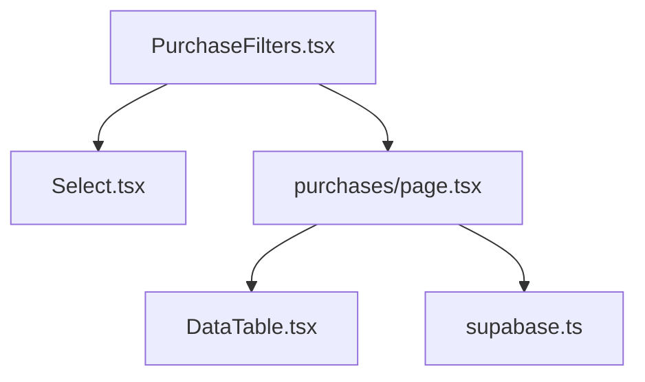
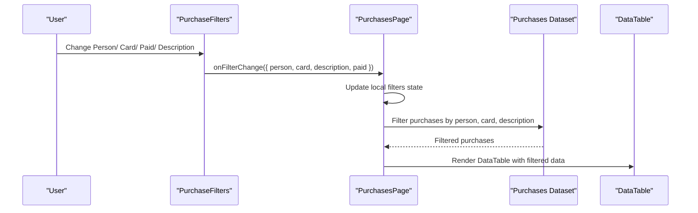
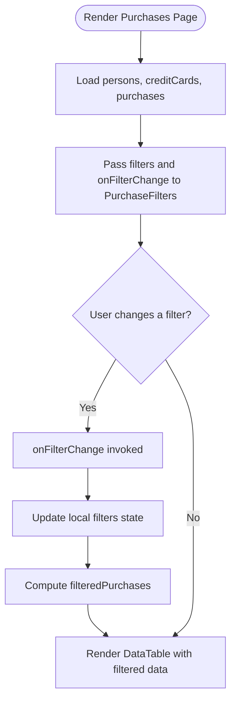
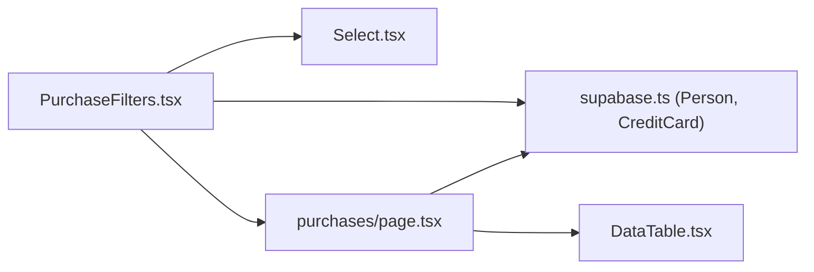

# Purchase Filters

<cite>
**Referenced Files in This Document**
- [PurchaseFilters.tsx](file://src/components/purchases/PurchaseFilters.tsx)
- [Select.tsx](file://src/components/base/Select.tsx)
- [page.tsx](file://src/app/purchases/page.tsx)
- [DataTable.tsx](file://src/components/DataTable.tsx)
- [supabase.ts](file://src/lib/supabase.ts)
</cite>

## Table of Contents
1. [Introduction](#introduction)
2. [Project Structure](#project-structure)
3. [Core Components](#core-components)
4. [Architecture Overview](#architecture-overview)
5. [Detailed Component Analysis](#detailed-component-analysis)
6. [Dependency Analysis](#dependency-analysis)
7. [Performance Considerations](#performance-considerations)
8. [Troubleshooting Guide](#troubleshooting-guide)
9. [Conclusion](#conclusion)

## Introduction
This document explains the PurchaseFilters component, which provides interactive controls to filter a list of purchases by person, credit card, payment status, and description. It describes how the component receives filter values and a callback function to propagate changes to the parent, how Select components are configured with mapped options, how the description input handles real-time updates, how the paid status selector offers “All”, “Paid”, and “Unpaid” choices, and how the Clear Filters button resets all filters. It also covers the responsive flex layout and form control styling using daisyUI classes, and demonstrates how PurchaseFilters integrates with the purchases page to control DataTable filtering. Finally, it outlines performance considerations for re-renders when filter state changes.

## Project Structure
PurchaseFilters resides under the purchases feature folder and is used by the purchases page. The page composes the filters and applies them to a DataTable to render filtered results.

**Diagram sources**
- [PurchaseFilters.tsx](file://src/components/purchases/PurchaseFilters.tsx#L1-L149)
- [Select.tsx](file://src/components/base/Select.tsx#L1-L78)
- [page.tsx](file://src/app/purchases/page.tsx#L1-L260)
- [DataTable.tsx](file://src/components/DataTable.tsx#L1-L86)
- [supabase.ts](file://src/lib/supabase.ts#L1-L81)

**Section sources**
- [PurchaseFilters.tsx](file://src/components/purchases/PurchaseFilters.tsx#L1-L149)
- [page.tsx](file://src/app/purchases/page.tsx#L1-L260)

## Core Components
- PurchaseFilters: A form-like filter bar with:
  - Person dropdown (Select) populated from the persons prop
  - Credit card dropdown (Select) populated from the creditCards prop
  - Paid status selector with options “All”, “Paid”, “Unpaid”
  - Description text input with real-time change handling
  - Clear Filters button to reset all filters
- Parent container (purchases page): Holds filter state, passes it down to PurchaseFilters, and applies filters to the purchase dataset before rendering in DataTable.

Key responsibilities:
- Accept filter values and onFilterChange callback from the parent
- Build Select options from arrays of Person and CreditCard entities
- Propagate filter changes immediately to the parent
- Reset filters to empty strings when Clear Filters is clicked

**Section sources**
- [PurchaseFilters.tsx](file://src/components/purchases/PurchaseFilters.tsx#L1-L149)
- [page.tsx](file://src/app/purchases/page.tsx#L1-L260)

## Architecture Overview
The PurchaseFilters component is a controlled UI element that delegates state changes to its parent. The parent maintains the filter state and computes a filtered dataset for the DataTable.

**Diagram sources**
- [PurchaseFilters.tsx](file://src/components/purchases/PurchaseFilters.tsx#L1-L149)
- [page.tsx](file://src/app/purchases/page.tsx#L1-L260)
- [DataTable.tsx](file://src/components/DataTable.tsx#L1-L86)

## Detailed Component Analysis

### Props and Behavior
- Props accepted:
  - persons: array of Person entities
  - creditCards: array of CreditCard entities
  - filterPerson: current person filter value
  - filterCard: current card filter value
  - filterDescription: current description filter value
  - filterPaid: current paid status filter value
  - onFilterChange: callback receiving an object with updated filters
- Behavior:
  - Each control triggers onFilterChange with the updated field while preserving others
  - Clear Filters sets all fields to empty strings

Implementation highlights:
- Person dropdown options include an “All” option followed by persons mapped to { value: id, label: name }
- Credit card dropdown options include an “All” option followed by cards mapped to a combined label using name or issuer and last four digits
- Paid status selector options include “All”, “Paid”, “Unpaid”
- Description input is a standard HTML input with real-time change handling
- Clear Filters button invokes onFilterChange with empty values

**Section sources**
- [PurchaseFilters.tsx](file://src/components/purchases/PurchaseFilters.tsx#L1-L149)

### Select Components for Person and Card
- Person Select:
  - Options array starts with an empty value and label “All”
  - Remaining options are derived from persons by mapping each person to { value: id, label: name }
- Card Select:
  - Options array starts with an empty value and label “All”
  - Remaining options are derived from creditCards by mapping each card to a label combining credit_card_name or issuer and last_four_digits

These mappings ensure intuitive labels for users while passing stable IDs to the parent.

**Section sources**
- [PurchaseFilters.tsx](file://src/components/purchases/PurchaseFilters.tsx#L80-L113)
- [supabase.ts](file://src/lib/supabase.ts#L10-L30)

### Description Text Input
- Controlled input bound to filterDescription
- onChange handler calls onFilterChange with the new description value
- Placeholder text guides the user to search descriptions

**Section sources**
- [PurchaseFilters.tsx](file://src/components/purchases/PurchaseFilters.tsx#L128-L139)

### Paid Status Selector
- Options include “All”, “Paid”, “Unpaid”
- The component passes the selected value to onFilterChange
- The parent’s filtering logic interprets the paid value to decide whether to include paid or unpaid purchases

Note: The PurchaseFilters component does not enforce paid/unpaid semantics; it simply propagates the selection. The parent decides how to interpret the paid value.

**Section sources**
- [PurchaseFilters.tsx](file://src/components/purchases/PurchaseFilters.tsx#L114-L127)

### Clear Filters Button
- Resets all filters to empty strings
- Ensures a clean slate for subsequent selections

**Section sources**
- [PurchaseFilters.tsx](file://src/components/purchases/PurchaseFilters.tsx#L140-L146)

### Responsive Flex Layout and Styling
- Outer container uses a flex layout with gap spacing and a max width
- Each control is wrapped in a form-control with label and input/select
- Uses daisyUI classes for consistent styling:
  - Select variants and sizes via Select component
  - Input borders via input input-bordered
  - Buttons via btn classes

**Section sources**
- [PurchaseFilters.tsx](file://src/components/purchases/PurchaseFilters.tsx#L75-L146)
- [Select.tsx](file://src/components/base/Select.tsx#L1-L78)

### Integration with Purchases Page and DataTable
- The purchases page holds filter state and loads persons and creditCards
- It passes filter values and onFilterChange to PurchaseFilters
- It computes filteredPurchases by applying person, card, and description filters
- It renders DataTable with filteredPurchases

**Diagram sources**
- [page.tsx](file://src/app/purchases/page.tsx#L1-L260)
- [PurchaseFilters.tsx](file://src/components/purchases/PurchaseFilters.tsx#L1-L149)
- [DataTable.tsx](file://src/components/DataTable.tsx#L1-L86)

**Section sources**
- [page.tsx](file://src/app/purchases/page.tsx#L1-L260)

## Dependency Analysis
- PurchaseFilters depends on:
  - Select component for dropdowns
  - Person and CreditCard types for option mapping
- PurchaseFilters communicates with:
  - Its parent via onFilterChange
- Parent (purchases page) depends on:
  - Purchase type and expand structure for filtering
  - DataTable for rendering

**Diagram sources**
- [PurchaseFilters.tsx](file://src/components/purchases/PurchaseFilters.tsx#L1-L149)
- [Select.tsx](file://src/components/base/Select.tsx#L1-L78)
- [page.tsx](file://src/app/purchases/page.tsx#L1-L260)
- [DataTable.tsx](file://src/components/DataTable.tsx#L1-L86)
- [supabase.ts](file://src/lib/supabase.ts#L1-L81)

**Section sources**
- [PurchaseFilters.tsx](file://src/components/purchases/PurchaseFilters.tsx#L1-L149)
- [page.tsx](file://src/app/purchases/page.tsx#L1-L260)

## Performance Considerations
- Re-render frequency:
  - PurchaseFilters is a small, controlled component; each change triggers onFilterChange and causes the parent to recompute filteredPurchases
  - If the purchase list is large, consider debouncing description input changes to reduce frequent recomputations
- Filtering cost:
  - Current filtering is linear in the number of purchases; ensure the dataset remains reasonably sized or add server-side filtering
- Memoization:
  - Consider memoizing the filteredPurchases computation in the parent if the dataset is large and filters change frequently
- Rendering:
  - DataTable renders rows based on filtered data; keep column rendering lightweight
- Network:
  - If loading data is expensive, cache results and invalidate on demand rather than refetching on every filter change

[No sources needed since this section provides general guidance]

## Troubleshooting Guide
- Filters not applying:
  - Verify that the parent’s filter state is updated and used to compute filteredPurchases
  - Confirm that the filter keys match the expected values (“person”, “card”, “description”, “paid”)
- Unexpected empty results:
  - Check that the filter values are non-empty when intended
  - Ensure the description filter comparison is case-insensitive and substring-based
- Dropdown labels incorrect:
  - Confirm that persons and creditCards props are passed and not empty
  - Verify that card labels combine name or issuer with last four digits
- Paid status not working:
  - Ensure the parent interprets the paid value correctly (e.g., empty for “All”, specific values for “Paid”/“Unpaid”)

**Section sources**
- [page.tsx](file://src/app/purchases/page.tsx#L102-L115)
- [PurchaseFilters.tsx](file://src/components/purchases/PurchaseFilters.tsx#L1-L149)

## Conclusion
PurchaseFilters provides a concise, reusable filter bar for purchases with clear separation of concerns. It relies on the parent to manage state and apply filters, while offering immediate feedback through controlled inputs and Select components. By leveraging daisyUI classes and a responsive layout, it integrates cleanly into the application. For larger datasets, consider debouncing and memoization to optimize performance.