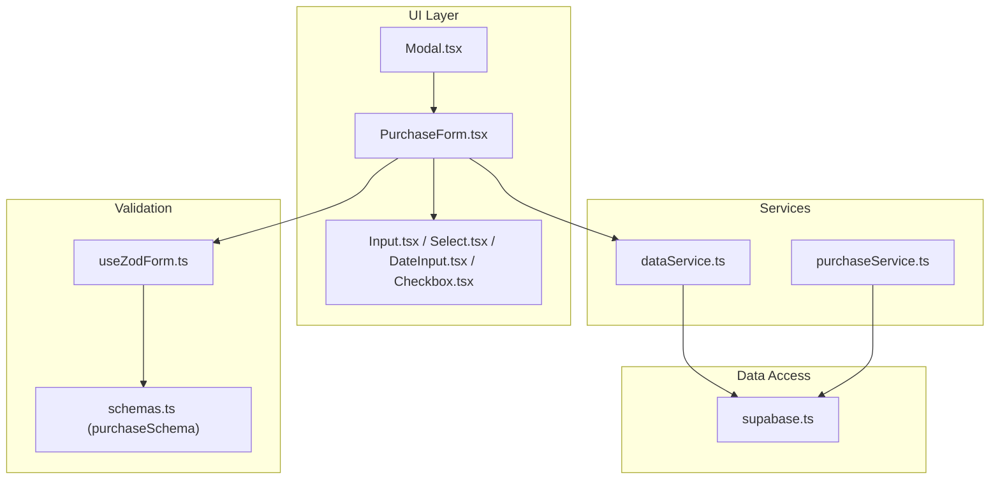
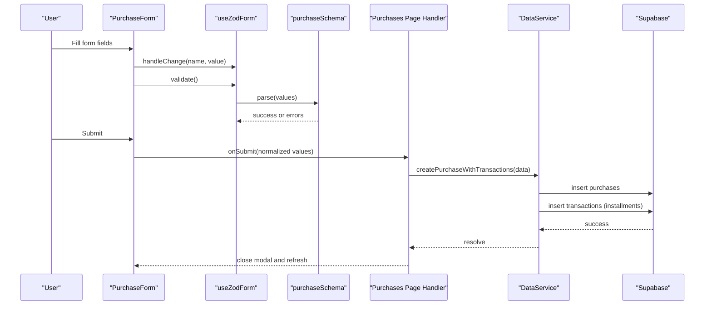
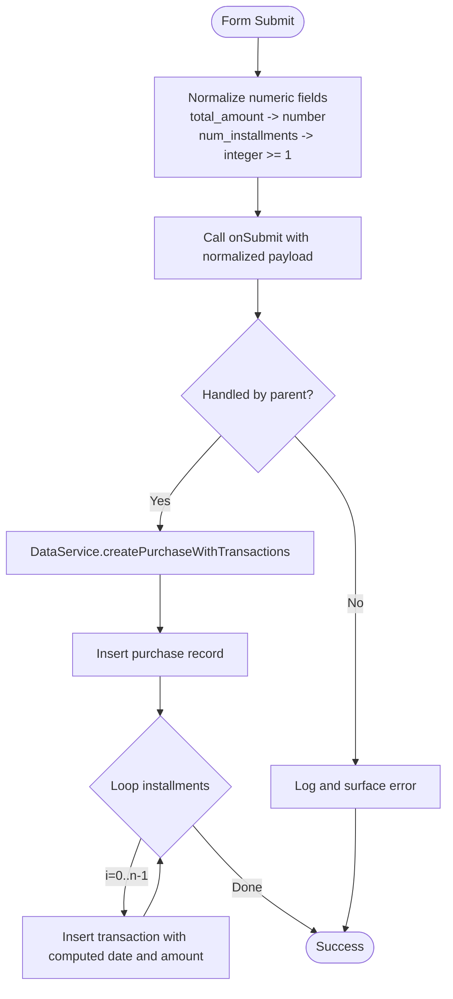
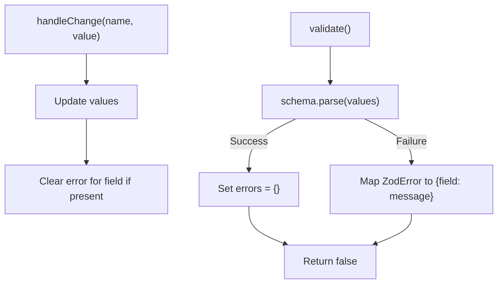
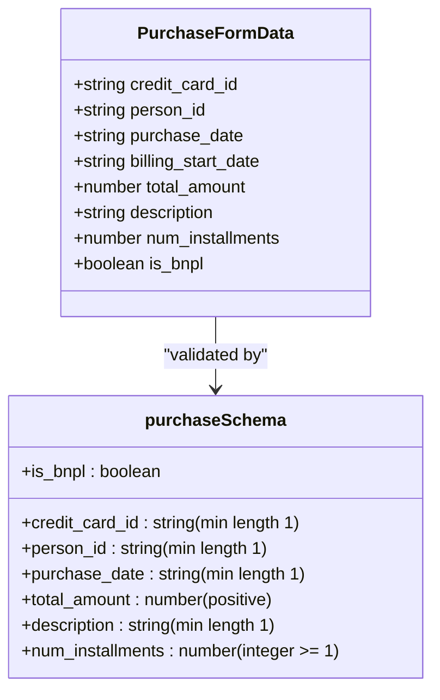
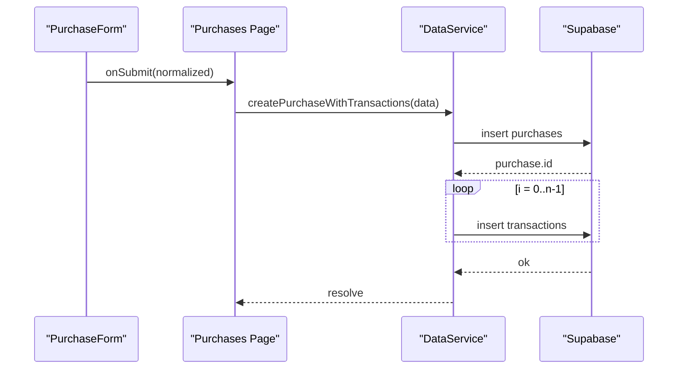
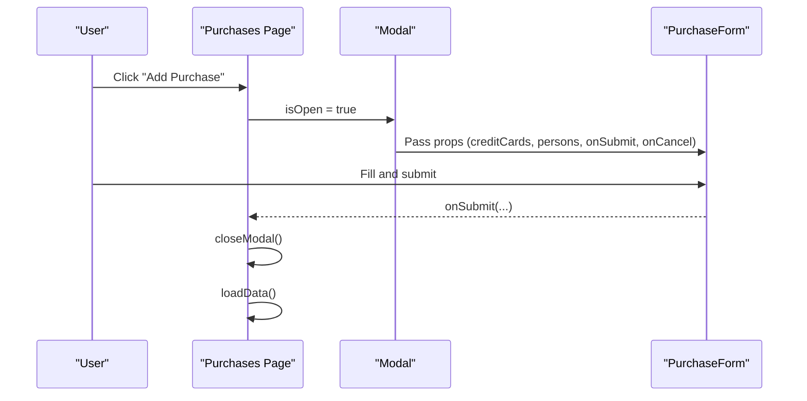
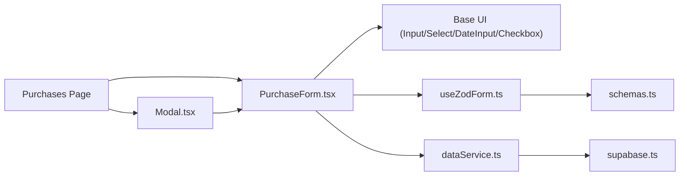

# Purchase Form

<cite>
**Referenced Files in This Document**
- [PurchaseForm.tsx](file://src/components/PurchaseForm.tsx)
- [useZodForm.ts](file://src/lib/hooks/useZodForm.ts)
- [schemas.ts](file://src/lib/schemas.ts)
- [purchaseService.ts](file://src/lib/services/purchaseService.ts)
- [dataService.ts](file://src/lib/services/dataService.ts)
- [supabase.ts](file://src/lib/supabase.ts)
- [page.tsx](file://src/app/purchases/page.tsx)
- [Modal.tsx](file://src/components/Modal.tsx)
- [Input.tsx](file://src/components/base/Input.tsx)
- [Select.tsx](file://src/components/base/Select.tsx)
- [DateInput.tsx](file://src/components/base/DateInput.tsx)
- [Checkbox.tsx](file://src/components/base/Checkbox.tsx)
- [DataTable.tsx](file://src/components/DataTable.tsx)
</cite>

## Table of Contents
1. [Introduction](#introduction)
2. [Project Structure](#project-structure)
3. [Core Components](#core-components)
4. [Architecture Overview](#architecture-overview)
5. [Detailed Component Analysis](#detailed-component-analysis)
6. [Dependency Analysis](#dependency-analysis)
7. [Performance Considerations](#performance-considerations)
8. [Troubleshooting Guide](#troubleshooting-guide)
9. [Conclusion](#conclusion)

## Introduction
This document explains the PurchaseForm component, which captures complex purchase data including credit card selection, person assignment, purchase date, description, total amount, number of installments, and BNPL (Buy Now, Pay Later) status. It covers:
- How the form integrates with Zod for schema validation via the useZodForm hook to ensure data integrity before submission
- Interaction with service layer to create purchases and automatically generate installments as transactions
- Inline editing within a Modal on the purchases page
- Form state management, error handling, responsive layout using Tailwind CSS, and accessibility considerations

## Project Structure
The PurchaseForm lives under components and integrates with shared base UI components, a reusable Zod form hook, typed Supabase models, and service layers for persistence and transaction scheduling.

**Diagram sources**
- [PurchaseForm.tsx](file://src/components/PurchaseForm.tsx#L1-L269)
- [Modal.tsx](file://src/components/Modal.tsx#L1-L62)
- [Input.tsx](file://src/components/base/Input.tsx#L1-L84)
- [Select.tsx](file://src/components/base/Select.tsx#L1-L78)
- [DateInput.tsx](file://src/components/base/DateInput.tsx#L1-L79)
- [Checkbox.tsx](file://src/components/base/Checkbox.tsx#L1-L92)
- [useZodForm.ts](file://src/lib/hooks/useZodForm.ts#L1-L83)
- [schemas.ts](file://src/lib/schemas.ts#L1-L62)
- [dataService.ts](file://src/lib/services/dataService.ts#L1-L165)
- [purchaseService.ts](file://src/lib/services/purchaseService.ts#L1-L88)
- [supabase.ts](file://src/lib/supabase.ts#L1-L81)

**Section sources**
- [PurchaseForm.tsx](file://src/components/PurchaseForm.tsx#L1-L269)
- [page.tsx](file://src/app/purchases/page.tsx#L1-L260)

## Core Components
- PurchaseForm: Central form component managing state, rendering fields, and orchestrating submission.
- useZodForm: Reusable Zod-based form hook providing typed values, change handlers, validation, and reset utilities.
- schemas: Zod schemas defining purchase validation rules.
- dataService: Service that persists a purchase and schedules installments as transactions.
- purchaseService: Service focused on loading purchase details and transaction updates.
- supabase: Typed Supabase client and model definitions for purchases, transactions, persons, and credit cards.
- Modal: Container for inline editing on the purchases page.

**Section sources**
- [PurchaseForm.tsx](file://src/components/PurchaseForm.tsx#L1-L269)
- [useZodForm.ts](file://src/lib/hooks/useZodForm.ts#L1-L83)
- [schemas.ts](file://src/lib/schemas.ts#L1-L62)
- [dataService.ts](file://src/lib/services/dataService.ts#L1-L165)
- [purchaseService.ts](file://src/lib/services/purchaseService.ts#L1-L88)
- [supabase.ts](file://src/lib/supabase.ts#L1-L81)
- [Modal.tsx](file://src/components/Modal.tsx#L1-L62)

## Architecture Overview
The PurchaseForm renders a set of base UI controls and delegates validation to useZodForm with purchaseSchema. On submit, it forwards normalized numeric values to the parent handler, which uses dataService to persist the purchase and create installments. The purchases page hosts the form inside a Modal for inline editing.

**Diagram sources**
- [PurchaseForm.tsx](file://src/components/PurchaseForm.tsx#L104-L130)
- [useZodForm.ts](file://src/lib/hooks/useZodForm.ts#L49-L66)
- [schemas.ts](file://src/lib/schemas.ts#L32-L44)
- [page.tsx](file://src/app/purchases/page.tsx#L68-L86)
- [dataService.ts](file://src/lib/services/dataService.ts#L107-L163)
- [supabase.ts](file://src/lib/supabase.ts#L1-L81)

## Detailed Component Analysis

### PurchaseForm: State, Validation, Submission, and Rendering
- State management:
  - Maintains form state with defaults initialized from creditCards and persons.
  - Handles input changes generically and checkbox toggles separately.
  - Disables controls during submission to prevent duplicate submissions.
- Validation and normalization:
  - Converts total_amount and num_installments to numbers, with sensible defaults and lower bounds.
  - Delegates Zod validation to useZodForm via purchaseSchema.
- Rendering:
  - Uses base components: Select, DateInput, Input, Textarea, Checkbox.
  - Responsive layout via Tailwind utility classes on form-control and button rows.
- Accessibility:
  - Uses native HTML labels and aria attributes on modal close button.
  - Required fields marked appropriately on inputs and selects.

**Diagram sources**
- [PurchaseForm.tsx](file://src/components/PurchaseForm.tsx#L104-L130)
- [dataService.ts](file://src/lib/services/dataService.ts#L107-L163)

**Section sources**
- [PurchaseForm.tsx](file://src/components/PurchaseForm.tsx#L1-L269)
- [Input.tsx](file://src/components/base/Input.tsx#L1-L84)
- [Select.tsx](file://src/components/base/Select.tsx#L1-L78)
- [DateInput.tsx](file://src/components/base/DateInput.tsx#L1-L79)
- [Checkbox.tsx](file://src/components/base/Checkbox.tsx#L1-L92)

### useZodForm Hook: Validation and Error Management
- Provides typed values and error map keyed by field name.
- Handles input changes for text, number, and checkbox fields.
- Clears per-field errors on user input to improve UX.
- Exposes validate to run Zod parse and reset to restore initial values.

**Diagram sources**
- [useZodForm.ts](file://src/lib/hooks/useZodForm.ts#L1-L83)
- [schemas.ts](file://src/lib/schemas.ts#L32-L44)

**Section sources**
- [useZodForm.ts](file://src/lib/hooks/useZodForm.ts#L1-L83)
- [schemas.ts](file://src/lib/schemas.ts#L32-L44)

### Purchase Schema: Validation Rules
- Enforces presence and types for credit_card_id, person_id, purchase_date, description.
- Requires total_amount to be a positive number.
- Requires num_installments to be an integer greater than or equal to 1.
- Allows is_bnpl as a boolean flag.

**Diagram sources**
- [schemas.ts](file://src/lib/schemas.ts#L32-L44)

**Section sources**
- [schemas.ts](file://src/lib/schemas.ts#L32-L44)

### Service Integration: Creating Purchases and Transactions
- dataService.createPurchaseWithTransactions inserts a purchase and then iterates num_installments to insert transactions.
- Each transaction’s amount equals total_amount divided by num_installments.
- Transaction dates are computed by adding i months to billing_start_date.
- Transaction descriptions append "(Installment i/n)" when num_installments > 1.

**Diagram sources**
- [page.tsx](file://src/app/purchases/page.tsx#L68-L86)
- [dataService.ts](file://src/lib/services/dataService.ts#L107-L163)
- [supabase.ts](file://src/lib/supabase.ts#L1-L81)

**Section sources**
- [dataService.ts](file://src/lib/services/dataService.ts#L107-L163)
- [supabase.ts](file://src/lib/supabase.ts#L1-L81)

### Modal Integration: Inline Editing on Purchases Page
- The purchases page opens a Modal when adding a purchase.
- Modal passes creditCards and persons down to PurchaseForm and wires onSubmit to dataService.createPurchaseWithTransactions.
- Modal provides a title and close behavior; PurchaseForm receives onCancel to close the dialog.

**Diagram sources**
- [page.tsx](file://src/app/purchases/page.tsx#L244-L257)
- [Modal.tsx](file://src/components/Modal.tsx#L1-L62)
- [PurchaseForm.tsx](file://src/components/PurchaseForm.tsx#L1-L269)

**Section sources**
- [page.tsx](file://src/app/purchases/page.tsx#L244-L257)
- [Modal.tsx](file://src/components/Modal.tsx#L1-L62)

### Accessibility and Responsive Layout
- Accessibility:
  - Modal sets role="dialog" and aria-modal="true".
  - Modal close button has aria-label.
  - Base components render labels and use required attributes.
- Responsive layout:
  - Tailwind classes applied to form-control and buttons ensure spacing and alignment.
  - Base components expose size variants for inputs/selects.

**Section sources**
- [Modal.tsx](file://src/components/Modal.tsx#L35-L59)
- [Input.tsx](file://src/components/base/Input.tsx#L1-L84)
- [Select.tsx](file://src/components/base/Select.tsx#L1-L78)
- [DateInput.tsx](file://src/components/base/DateInput.tsx#L1-L79)
- [Checkbox.tsx](file://src/components/base/Checkbox.tsx#L1-L92)

## Dependency Analysis
- PurchaseForm depends on:
  - Base UI components for rendering inputs and controls
  - useZodForm for validation and typed state
  - dataService for persistence and transaction creation
- dataService depends on:
  - supabase client for CRUD operations
  - purchaseService for related operations (not directly used by PurchaseForm)
- Modal composes PurchaseForm for inline editing.

**Diagram sources**
- [PurchaseForm.tsx](file://src/components/PurchaseForm.tsx#L1-L269)
- [useZodForm.ts](file://src/lib/hooks/useZodForm.ts#L1-L83)
- [schemas.ts](file://src/lib/schemas.ts#L1-L62)
- [dataService.ts](file://src/lib/services/dataService.ts#L1-L165)
- [supabase.ts](file://src/lib/supabase.ts#L1-L81)
- [page.tsx](file://src/app/purchases/page.tsx#L1-L260)
- [Modal.tsx](file://src/components/Modal.tsx#L1-L62)

**Section sources**
- [PurchaseForm.tsx](file://src/components/PurchaseForm.tsx#L1-L269)
- [dataService.ts](file://src/lib/services/dataService.ts#L1-L165)
- [supabase.ts](file://src/lib/supabase.ts#L1-L81)
- [page.tsx](file://src/app/purchases/page.tsx#L1-L260)
- [Modal.tsx](file://src/components/Modal.tsx#L1-L62)

## Performance Considerations
- Numeric parsing occurs only on submit to minimize re-renders.
- useZodForm clears per-field errors on change to reduce unnecessary validation churn.
- dataService batches transaction inserts in a loop; consider batching inserts if performance becomes a concern.
- Modal rendering is conditional; keep it mounted only while open to avoid unnecessary DOM overhead.

## Troubleshooting Guide
- Validation failures:
  - Ensure total_amount is a positive number and num_installments is an integer >= 1.
  - Confirm required fields are filled; base components mark required fields.
- Submission errors:
  - Check console logs for thrown errors from dataService or supabase.
  - Verify environment variables for Supabase URL and key are configured.
- Transaction scheduling:
  - Confirm billing_start_date is set; installments are scheduled by month offset from this date.
  - Verify num_installments > 0; otherwise, default normalization ensures at least 1.

**Section sources**
- [useZodForm.ts](file://src/lib/hooks/useZodForm.ts#L49-L66)
- [schemas.ts](file://src/lib/schemas.ts#L32-L44)
- [dataService.ts](file://src/lib/services/dataService.ts#L107-L163)
- [supabase.ts](file://src/lib/supabase.ts#L1-L81)

## Conclusion
PurchaseForm provides a robust, accessible, and responsive form for capturing purchase details and scheduling installments. Its integration with useZodForm and purchaseSchema ensures strong validation, while dataService coordinates persistence and transaction generation. The Modal-based inline editing on the purchases page offers a seamless user experience for adding purchases.