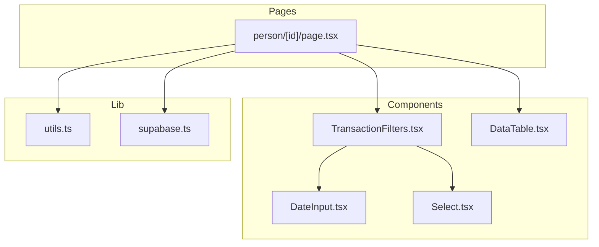
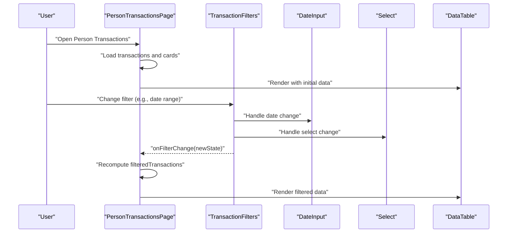
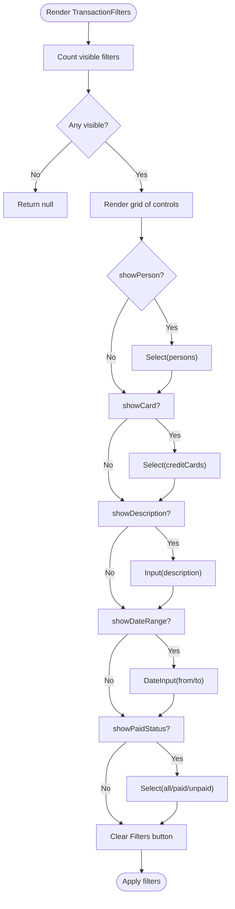
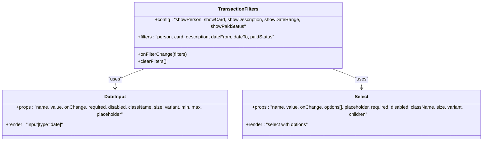
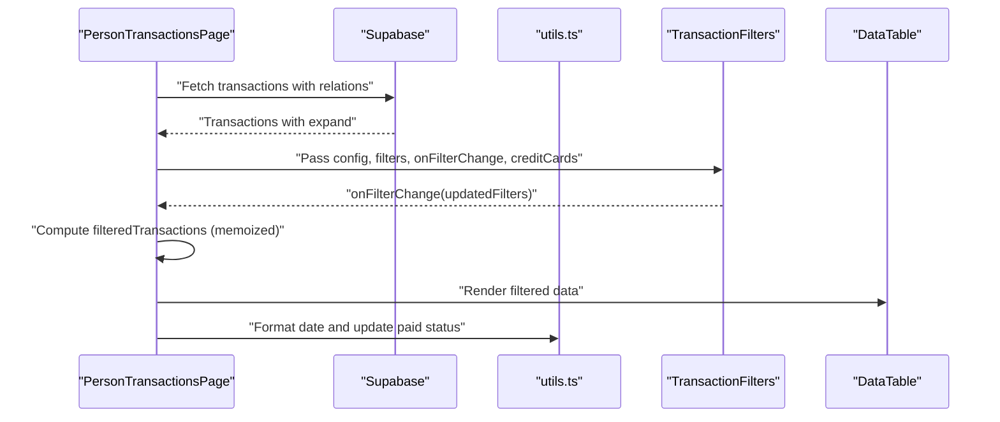
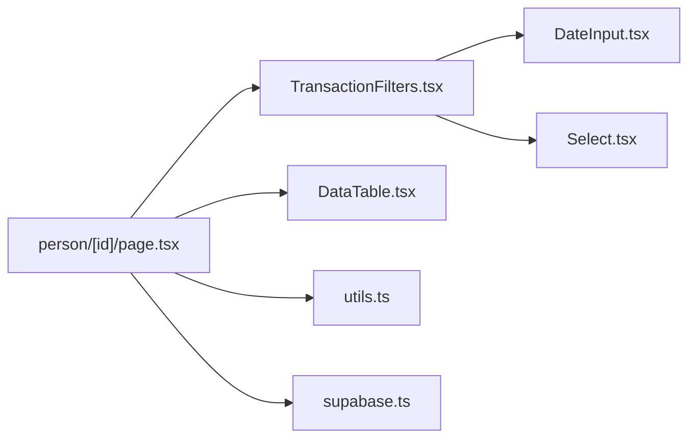

# Transaction Components

<cite>
**Referenced Files in This Document**
- [TransactionFilters.tsx](file://src/components/transactions/TransactionFilters.tsx)
- [DateInput.tsx](file://src/components/base/DateInput.tsx)
- [Select.tsx](file://src/components/base/Select.tsx)
- [DataTable.tsx](file://src/components/DataTable.tsx)
- [page.tsx](file://src/app/transactions/person/[id]/page.tsx)
- [utils.ts](file://src/lib/utils.ts)
- [supabase.ts](file://src/lib/supabase.ts)
</cite>

## Table of Contents
1. [Introduction](#introduction)
2. [Project Structure](#project-structure)
3. [Core Components](#core-components)
4. [Architecture Overview](#architecture-overview)
5. [Detailed Component Analysis](#detailed-component-analysis)
6. [Dependency Analysis](#dependency-analysis)
7. [Performance Considerations](#performance-considerations)
8. [Accessibility and Mobile Responsiveness](#accessibility-and-mobile-responsiveness)
9. [Troubleshooting Guide](#troubleshooting-guide)
10. [Extensibility Guide](#extensibility-guide)
11. [Conclusion](#conclusion)

## Introduction
This document explains the TransactionFilters component used in transaction management. It covers how the component filters transaction lists by date range and payment status, how it composes with base UI components (DateInput and Select), and how it integrates with the data layer and pages. It also documents state management patterns, accessibility and mobile responsiveness, and provides guidance for extending filtering capabilities.

## Project Structure
The TransactionFilters component lives under the transactions folder and composes base components for form controls. It is consumed by the Person Transactions page, which manages client-side state and applies filters locally to the loaded dataset.

**Diagram sources**
- [TransactionFilters.tsx](file://src/components/transactions/TransactionFilters.tsx#L1-L196)
- [DateInput.tsx](file://src/components/base/DateInput.tsx#L1-L79)
- [Select.tsx](file://src/components/base/Select.tsx#L1-L78)
- [DataTable.tsx](file://src/components/DataTable.tsx#L1-L86)
- [page.tsx](file://src/app/transactions/person/[id]/page.tsx#L1-L264)
- [utils.ts](file://src/lib/utils.ts#L1-L46)
- [supabase.ts](file://src/lib/supabase.ts#L1-L81)

**Section sources**
- [TransactionFilters.tsx](file://src/components/transactions/TransactionFilters.tsx#L1-L196)
- [page.tsx](file://src/app/transactions/person/[id]/page.tsx#L1-L264)

## Core Components
- TransactionFilters: A configurable filter panel that renders a grid of filter controls based on a config flag set. It exposes a callback to propagate filter changes and clears filters to defaults.
- DateInput: A reusable date input wrapper with size and variant classes and min/max constraints.
- Select: A reusable select dropdown with size and variant classes and option rendering.
- DataTable: A generic table renderer that accepts typed columns and keyed rows.

Key responsibilities:
- TransactionFilters builds filter controls for person, card, description, date range, and paid status.
- It delegates user input to the parent page via a callback and clears filters to defaults.
- The consuming page loads data from Supabase, maintains local state, and applies client-side filtering.

**Section sources**
- [TransactionFilters.tsx](file://src/components/transactions/TransactionFilters.tsx#L1-L196)
- [DateInput.tsx](file://src/components/base/DateInput.tsx#L1-L79)
- [Select.tsx](file://src/components/base/Select.tsx#L1-L78)
- [DataTable.tsx](file://src/components/DataTable.tsx#L1-L86)

## Architecture Overview
The Person Transactions page orchestrates data loading, filter state, and filtered rendering. TransactionFilters emits filter changes upward; the page recomputes filtered results and passes them to DataTable.

**Diagram sources**
- [page.tsx](file://src/app/transactions/person/[id]/page.tsx#L1-L264)
- [TransactionFilters.tsx](file://src/components/transactions/TransactionFilters.tsx#L1-L196)
- [DateInput.tsx](file://src/components/base/DateInput.tsx#L1-L79)
- [Select.tsx](file://src/components/base/Select.tsx#L1-L78)
- [DataTable.tsx](file://src/components/DataTable.tsx#L1-L86)

## Detailed Component Analysis

### TransactionFilters Component
- Purpose: Provide a configurable filter panel for transactions with controls for person, card, description, date range, and paid status.
- Props:
  - config: Flags controlling which filters to render.
  - filters: Current filter state.
  - onFilterChange: Callback to notify parent of filter updates.
  - persons, creditCards: Options for Select controls.
- Behavior:
  - Renders a responsive grid based on visible filters.
  - Uses DateInput for From/To dates and Select for person/card/paid status.
  - Provides a Clear Filters button that resets to defaults.
- State management:
  - Maintains minimal internal state for composing updates and clearing filters.
  - Delegates persistent state to the parent via onFilterChange.

**Diagram sources**
- [TransactionFilters.tsx](file://src/components/transactions/TransactionFilters.tsx#L1-L196)

**Section sources**
- [TransactionFilters.tsx](file://src/components/transactions/TransactionFilters.tsx#L1-L196)

### Base Components Used by TransactionFilters
- DateInput: Provides a native date input with size and variant classes and supports min/max attributes.
- Select: Provides a dropdown with options and supports size and variant classes.

**Diagram sources**
- [DateInput.tsx](file://src/components/base/DateInput.tsx#L1-L79)
- [Select.tsx](file://src/components/base/Select.tsx#L1-L78)
- [TransactionFilters.tsx](file://src/components/transactions/TransactionFilters.tsx#L1-L196)

**Section sources**
- [DateInput.tsx](file://src/components/base/DateInput.tsx#L1-L79)
- [Select.tsx](file://src/components/base/Select.tsx#L1-L78)

### Integration with Page and Data Layer
- PersonTransactionsPage:
  - Loads transactions and credit cards from Supabase.
  - Manages filter state locally and recomputes filtered results using memoization.
  - Passes TransactionFilters props and renders DataTable with filtered data.
- Data access:
  - Uses Supabase client to fetch transaction data with related entities.
  - Uses utility functions for formatting and paid-status updates.

**Diagram sources**
- [page.tsx](file://src/app/transactions/person/[id]/page.tsx#L1-L264)
- [utils.ts](file://src/lib/utils.ts#L1-L46)
- [supabase.ts](file://src/lib/supabase.ts#L1-L81)

**Section sources**
- [page.tsx](file://src/app/transactions/person/[id]/page.tsx#L1-L264)
- [utils.ts](file://src/lib/utils.ts#L1-L46)
- [supabase.ts](file://src/lib/supabase.ts#L1-L81)

## Dependency Analysis
- TransactionFilters depends on:
  - DateInput and Select for UI controls.
  - Parent page for data and callbacks.
- PersonTransactionsPage depends on:
  - TransactionFilters for UI and state propagation.
  - DataTable for rendering.
  - Supabase for data access.
  - utils for formatting and paid-status updates.

**Diagram sources**
- [TransactionFilters.tsx](file://src/components/transactions/TransactionFilters.tsx#L1-L196)
- [DateInput.tsx](file://src/components/base/DateInput.tsx#L1-L79)
- [Select.tsx](file://src/components/base/Select.tsx#L1-L78)
- [page.tsx](file://src/app/transactions/person/[id]/page.tsx#L1-L264)
- [DataTable.tsx](file://src/components/DataTable.tsx#L1-L86)
- [utils.ts](file://src/lib/utils.ts#L1-L46)
- [supabase.ts](file://src/lib/supabase.ts#L1-L81)

**Section sources**
- [TransactionFilters.tsx](file://src/components/transactions/TransactionFilters.tsx#L1-L196)
- [page.tsx](file://src/app/transactions/person/[id]/page.tsx#L1-L264)

## Performance Considerations
- Client-side filtering:
  - Filtering runs on the client after data load. For large datasets, consider server-side pagination and filtering to reduce memory and CPU usage.
- Memoization:
  - The Person Transactions page uses memoization to avoid re-filtering on every render when data has not changed.
- Rendering:
  - DataTable renders only visible rows; keep filter sets small to minimize DOM size.

[No sources needed since this section provides general guidance]

## Accessibility and Mobile Responsiveness
- Keyboard navigation:
  - Select and input controls are native HTML elements, enabling standard keyboard navigation and screen reader support.
  - Ensure labels are present for each control (already included in the component).
- Focus management:
  - On clear filters, focus should return to the first control for improved keyboard workflows. Consider adding explicit focus management in the future.
- Mobile responsiveness:
  - The filter grid uses responsive CSS classes to adapt from single-column on small screens to multiple columns on larger screens.
  - Date inputs and selects are sized appropriately; ensure touch targets meet minimum size guidelines.

[No sources needed since this section provides general guidance]

## Troubleshooting Guide
- Filters not applying:
  - Verify the parent page passes the updated filters to the filter computation and re-renders DataTable.
  - Confirm that onFilterChange updates the state used by the filter function.
- Date range issues:
  - Ensure date values are valid ISO date strings; invalid dates can cause comparison failures.
- Paid status mismatch:
  - The filter treats "all" as no constraint; confirm the paid field values align with the expected options.
- Data not loading:
  - Check for errors thrown during Supabase fetch and display appropriate messages.

**Section sources**
- [page.tsx](file://src/app/transactions/person/[id]/page.tsx#L1-L264)
- [TransactionFilters.tsx](file://src/components/transactions/TransactionFilters.tsx#L1-L196)

## Extensibility Guide
- Adding new filter criteria:
  - Extend the filter state type and config interface with new keys.
  - Add a new control in the render block guarded by a config flag.
  - Update the filter computation in the parent page to include the new criterion.
- Example additions:
  - Person filter: Already supported via the person Select.
  - Credit card filter: Already supported via the card Select.
  - Description filter: Already supported via the description input.
  - Date range filters: Already supported via From/To DateInput.
  - Payment status filter: Already supported via the paid status Select.

Implementation tips:
- Keep filter state flat and consistent with the parent’s state shape.
- Use consistent option labels and values across Select controls.
- For server-side filtering, pass filter props to a service that constructs a Supabase query with conditions and ordering.

**Section sources**
- [TransactionFilters.tsx](file://src/components/transactions/TransactionFilters.tsx#L1-L196)
- [page.tsx](file://src/app/transactions/person/[id]/page.tsx#L1-L264)

## Conclusion
TransactionFilters provides a flexible, reusable filter panel that composes with base UI components and integrates cleanly with the Person Transactions page. It supports essential transaction filtering criteria and can be extended with additional filters while maintaining a clean separation of concerns between UI, state, and data access.

[No sources needed since this section summarizes without analyzing specific files]