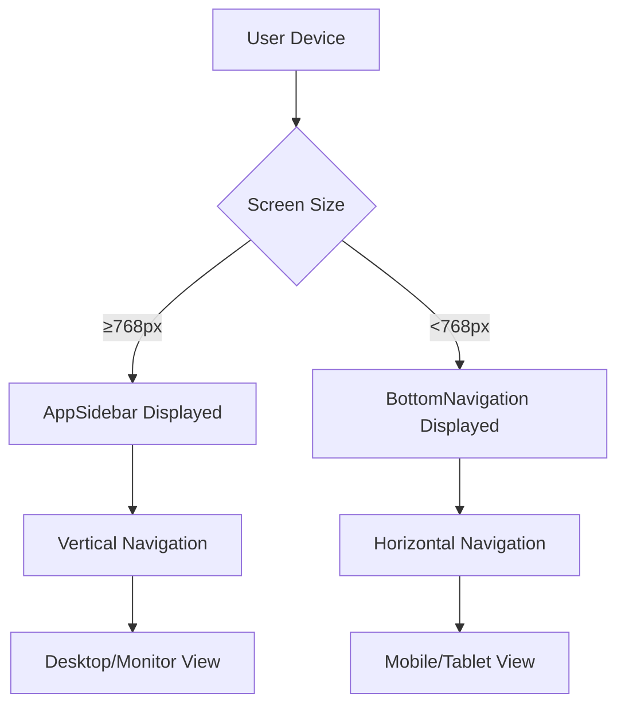
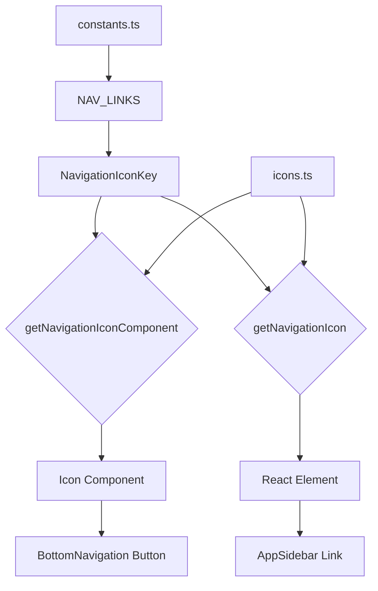
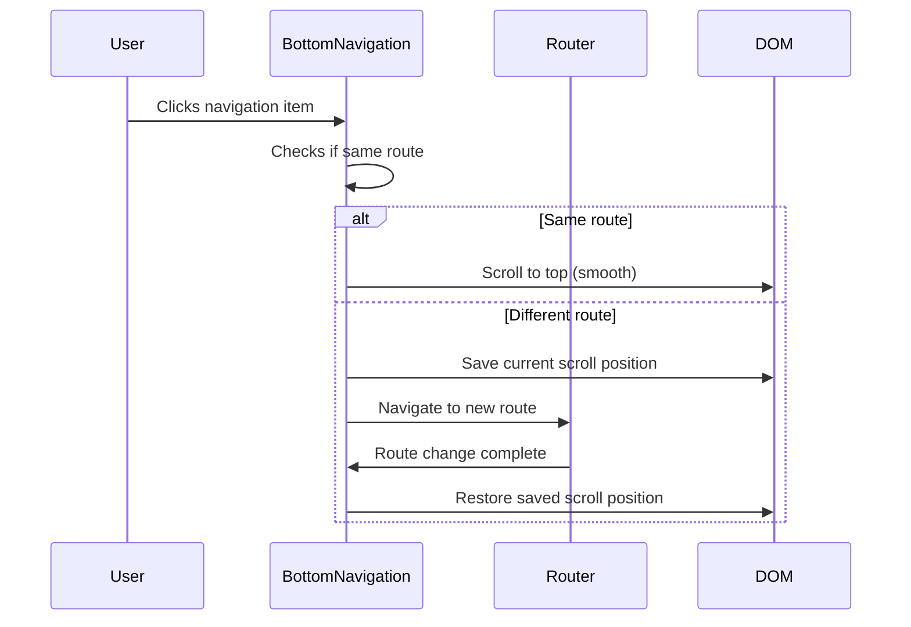
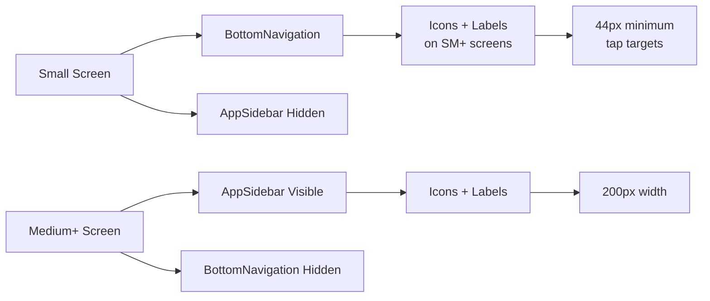
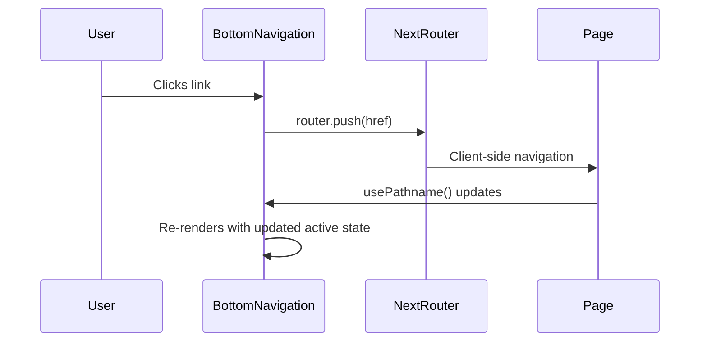

# Navigation Components

<cite>
**Referenced Files in This Document**   
- [AppSidebar.tsx](file://src/components/AppSidebar.tsx)
- [BottomNavigation.tsx](file://src/components/BottomNavigation.tsx)
- [NavigationBar.tsx](file://src/components/navigation/NavigationBar.tsx)
- [NavLink.tsx](file://src/components/navigation/NavLink.tsx)
- [constants.ts](file://src/lib/constants.ts)
- [icons.ts](file://src/lib/icons.ts)
- [sidebar.tsx](file://src/components/ui/sidebar.tsx)
- [layout.tsx](file://src/app/layout.tsx)
</cite>

## Table of Contents
1. [Introduction](#introduction)
2. [Dual Navigation System](#dual-navigation-system)
3. [Navigation Architecture](#navigation-architecture)
4. [Icon System Implementation](#icon-system-implementation)
5. [Component Composition](#component-composition)
6. [Responsive Design Strategy](#responsive-design-strategy)
7. [Usage Examples](#usage-examples)
8. [Integration with Next.js App Router](#integration-with-nextjs-app-router)
9. [Accessibility Features](#accessibility-features)
10. [Testing Considerations](#testing-considerations)
11. [Troubleshooting Guide](#troubleshooting-guide)

## Introduction
The credit-card-tracker application implements a comprehensive navigation system designed for optimal user experience across different device types. The system features a dual navigation approach that adapts to screen size, providing desktop users with a sidebar navigation and mobile users with a bottom navigation bar. This documentation details the implementation, integration, and usage patterns of these navigation components.

**Section sources**
- [AppSidebar.tsx](file://src/components/AppSidebar.tsx#L1-L31)
- [BottomNavigation.tsx](file://src/components/BottomNavigation.tsx#L1-L105)
- [layout.tsx](file://src/app/layout.tsx#L1-L51)

## Dual Navigation System
The application employs a responsive dual navigation system that automatically switches between two distinct navigation patterns based on screen size:

1. **AppSidebar**: Displayed on medium and larger screens (≥768px), positioned on the left side of the viewport
2. **BottomNavigation**: Displayed on small screens (<768px), fixed at the bottom of the viewport

The layout component conditionally renders these navigation elements using Tailwind CSS's responsive classes (`hidden md:block` and `md:hidden`), ensuring only one navigation interface is visible at any given time.



**Diagram sources**
- [AppSidebar.tsx](file://src/components/AppSidebar.tsx#L1-L31)
- [BottomNavigation.tsx](file://src/components/BottomNavigation.tsx#L1-L105)
- [layout.tsx](file://src/app/layout.tsx#L39-L46)

**Section sources**
- [AppSidebar.tsx](file://src/components/AppSidebar.tsx#L1-L31)
- [BottomNavigation.tsx](file://src/components/BottomNavigation.tsx#L1-L105)
- [layout.tsx](file://src/app/layout.tsx#L39-L46)

## Navigation Architecture
The navigation system is built on a centralized data structure that ensures consistency across all navigation components. The architecture follows a pattern of data-driven UI generation where navigation items are defined once and rendered in multiple contexts.

```mermaid
classDiagram
class NAV_LINKS {
+label : string
+href : string
+icon : NavigationIconKey
}
class AppSidebar {
-navLinks : Array
+render()
}
class BottomNavigation {
-pathname : string
-router : Router
+handleNavigation(href)
+render()
}
class NavigationBar {
+render()
}
NAV_LINKS --> AppSidebar : "maps to"
NAV_LINKS --> BottomNavigation : "maps to"
NAV_LINKS --> NavigationBar : "hardcoded links"
AppSidebar --> "ui/sidebar" : "uses"
BottomNavigation --> "next/navigation" : "uses"
NavigationBar --> "NavLink" : "uses"
```

**Diagram sources**
- [constants.ts](file://src/lib/constants.ts#L9-L35)
- [AppSidebar.tsx](file://src/components/AppSidebar.tsx#L12-L15)
- [BottomNavigation.tsx](file://src/components/BottomNavigation.tsx#L62-L64)
- [NavigationBar.tsx](file://src/components/navigation/NavigationBar.tsx#L11-L25)

**Section sources**
- [constants.ts](file://src/lib/constants.ts#L3-L35)
- [AppSidebar.tsx](file://src/components/AppSidebar.tsx#L12-L15)
- [BottomNavigation.tsx](file://src/components/BottomNavigation.tsx#L62-L64)

## Icon System Implementation
The navigation components utilize a centralized icon system that maps string identifiers to actual icon components. This approach provides a type-safe way to manage navigation icons while maintaining flexibility for future additions.

The icon system is implemented through the `icons.ts` file, which exports two key functions:
- `getNavigationIcon`: Returns a rendered icon element with specified className
- `getNavigationIconComponent`: Returns the icon component constructor for dynamic rendering



**Diagram sources**
- [icons.ts](file://src/lib/icons.ts#L11-L46)
- [constants.ts](file://src/lib/constants.ts#L6)
- [AppSidebar.tsx](file://src/components/AppSidebar.tsx#L14-L15)
- [BottomNavigation.tsx](file://src/components/BottomNavigation.tsx#L64-L65)

**Section sources**
- [icons.ts](file://src/lib/icons.ts#L11-L46)
- [constants.ts](file://src/lib/constants.ts#L6)
- [AppSidebar.tsx](file://src/components/AppSidebar.tsx#L14-L15)
- [BottomNavigation.tsx](file://src/components/BottomNavigation.tsx#L64-L65)

## Component Composition
The navigation system consists of several specialized components that work together to provide a cohesive user experience. Each component has a specific role and responsibility within the overall architecture.

### AppSidebar Component
The AppSidebar component serves as the primary navigation interface for desktop users. It wraps the UI library's Sidebar component and populates it with navigation links from the centralized NAV_LINKS constant.

**Section sources**
- [AppSidebar.tsx](file://src/components/AppSidebar.tsx#L1-L31)
- [ui/sidebar.tsx](file://src/components/ui/sidebar.tsx#L57-L74)

### BottomNavigation Component
The BottomNavigation component provides a touch-friendly navigation interface for mobile users. It implements enhanced user experience features including:
- Scroll position preservation between navigations
- Smooth scrolling to top when re-selecting the current page
- Session storage for maintaining scroll state



**Diagram sources**
- [BottomNavigation.tsx](file://src/components/BottomNavigation.tsx#L18-L36)
- [BottomNavigation.tsx](file://src/components/BottomNavigation.tsx#L38-L49)

**Section sources**
- [BottomNavigation.tsx](file://src/components/BottomNavigation.tsx#L14-L105)

### NavigationBar Component
The NavigationBar component represents an alternative navigation pattern implemented as a horizontal menu bar. It uses the NavLink component to wrap route paths and provides a different visual approach to navigation.

**Section sources**
- [NavigationBar.tsx](file://src/components/navigation/NavigationBar.tsx#L1-L30)
- [NavLink.tsx](file://src/components/navigation/NavLink.tsx#L1-L17)

## Responsive Design Strategy
The navigation system leverages Tailwind CSS's responsive design capabilities to create a seamless experience across device sizes. The strategy involves:

1. **Breakpoint-based visibility**: Using `md:` prefix to control component visibility
2. **Adaptive positioning**: Fixed positioning for both desktop and mobile variants
3. **Touch target optimization**: Ensuring minimum 44px tap targets on mobile
4. **Progressive content disclosure**: Showing labels only on larger screens to conserve space



**Diagram sources**
- [BottomNavigation.tsx](file://src/components/BottomNavigation.tsx#L93-L94)
- [AppSidebar.tsx](file://src/components/AppSidebar.tsx#L19-L20)
- [layout.tsx](file://src/app/layout.tsx#L39-L46)

**Section sources**
- [BottomNavigation.tsx](file://src/components/BottomNavigation.tsx#L54-L57)
- [AppSidebar.tsx](file://src/components/AppSidebar.tsx#L19-L20)
- [layout.tsx](file://src/app/layout.tsx#L39-L46)

## Usage Examples
The navigation system is designed to be extensible and maintainable. Adding new navigation items follows a consistent pattern across the application.

### Adding a New Navigation Item
To add a new navigation item to the system:

1. Add the item to the NAV_LINKS array in constants.ts:
```typescript
{
    label: "New Feature",
    href: "/new-feature",
    icon: "NewIcon" // Must be added to NavigationIconKey
}
```

2. Ensure the icon is available in the icons.ts mapping:
```typescript
import { NewIcon } from "lucide-react";
// Add to NAVIGATION_ICON_MAP
```

3. The item will automatically appear in both AppSidebar and BottomNavigation.

**Section sources**
- [constants.ts](file://src/lib/constants.ts#L9-L35)
- [icons.ts](file://src/lib/icons.ts#L18-L24)

## Integration with Next.js App Router
The navigation components are fully integrated with Next.js App Router, leveraging its client-side navigation capabilities for seamless page transitions.

### Active Link Styling
Both navigation components implement active link styling to indicate the current page:
- AppSidebar: Uses the UI library's built-in active state handling
- BottomNavigation: Manually checks pathname against link href using usePathname()

### Client-Side Navigation
The BottomNavigation component uses Next.js's useRouter hook for client-side navigation, preventing full page reloads and maintaining application state.



**Diagram sources**
- [BottomNavigation.tsx](file://src/components/BottomNavigation.tsx#L3-L4)
- [BottomNavigation.tsx](file://src/components/BottomNavigation.tsx#L63-L64)

**Section sources**
- [BottomNavigation.tsx](file://src/components/BottomNavigation.tsx#L3-L4)
- [BottomNavigation.tsx](file://src/components/BottomNavigation.tsx#L15-L16)

## Accessibility Features
The navigation components implement several accessibility features to ensure usability for all users:

1. **Semantic HTML**: Proper use of nav, button, and link elements
2. **ARIA attributes**: aria-label, aria-current, and role attributes
3. **Keyboard navigation**: Focus states and keyboard operability
4. **Screen reader support**: Descriptive labels and current page indication
5. **Touch target sizing**: Minimum 44px tap targets on mobile

The BottomNavigation component exemplifies these principles with its comprehensive accessibility implementation, including focus rings, aria-current indicators, and descriptive labels that include selection state.

**Section sources**
- [BottomNavigation.tsx](file://src/components/BottomNavigation.tsx#L58-L81)
- [BottomNavigation.tsx](file://src/components/BottomNavigation.tsx#L76-L78)

## Testing Considerations
The navigation components include data-component attributes to facilitate testing and debugging:

- AppSidebar: data-component="app-sidebar"
- NavigationBar: data-component="NavigationBar"
- Various form components: data-component attributes for testing

These attributes provide stable selectors for end-to-end tests and component testing, allowing reliable identification of navigation elements regardless of class name changes or styling updates.

**Section sources**
- [AppSidebar.tsx](file://src/components/AppSidebar.tsx#L19)
- [NavigationBar.tsx](file://src/components/navigation/NavigationBar.tsx#L7)

## Troubleshooting Guide
This section addresses common issues encountered when working with the navigation components and provides solutions.

### Icon Rendering Issues
**Symptom**: Icons not displaying or showing as broken elements
**Solution**: 
1. Verify the icon key exists in NavigationIconKey type
2. Ensure the icon is imported in icons.ts
3. Check that the icon is included in NAVIGATION_ICON_MAP

**Section sources**
- [icons.ts](file://src/lib/icons.ts#L11-L24)

### Broken Routes
**Symptom**: Navigation links lead to 404 pages
**Solution**:
1. Verify the href in NAV_LINKS matches an existing route in the app directory
2. Check for typos in route paths
3. Ensure the page file exists at the specified path

**Section sources**
- [constants.ts](file://src/lib/constants.ts#L11-L33)
- [layout.tsx](file://src/app/layout.tsx#L39-L46)

### Responsive Behavior Issues
**Symptom**: Incorrect navigation component displayed for screen size
**Solution**:
1. Verify Tailwind CSS is properly configured
2. Check that the md: breakpoint classes are correctly applied
3. Ensure no CSS overrides are interfering with visibility

**Section sources**
- [layout.tsx](file://src/app/layout.tsx#L39-L46)
- [AppSidebar.tsx](file://src/components/AppSidebar.tsx#L19)
- [BottomNavigation.tsx](file://src/components/BottomNavigation.tsx#L56)