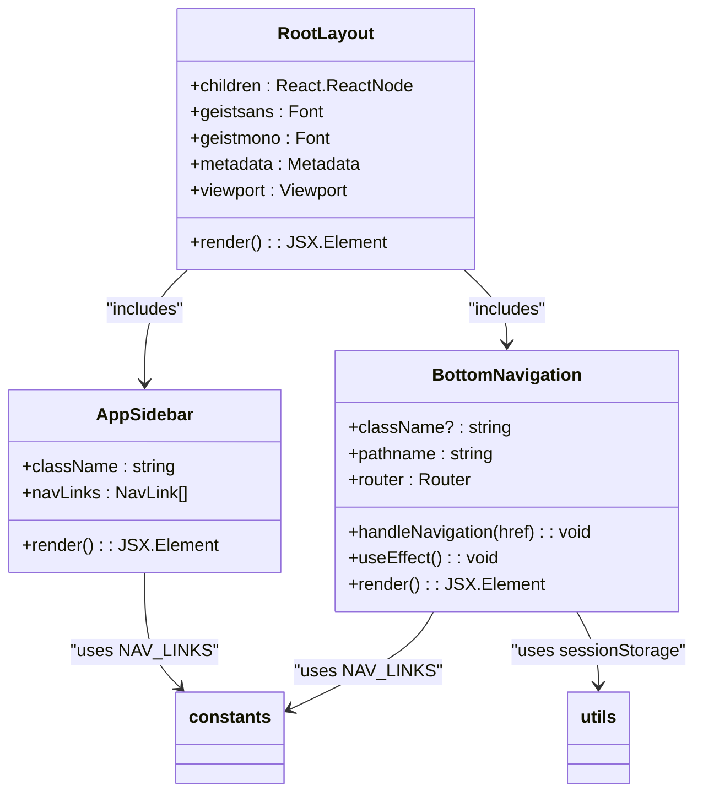
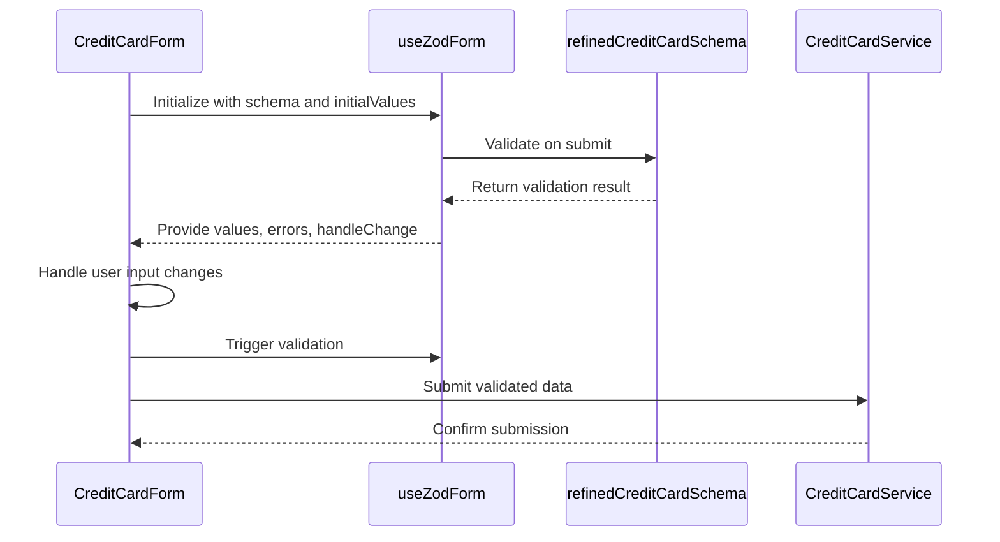
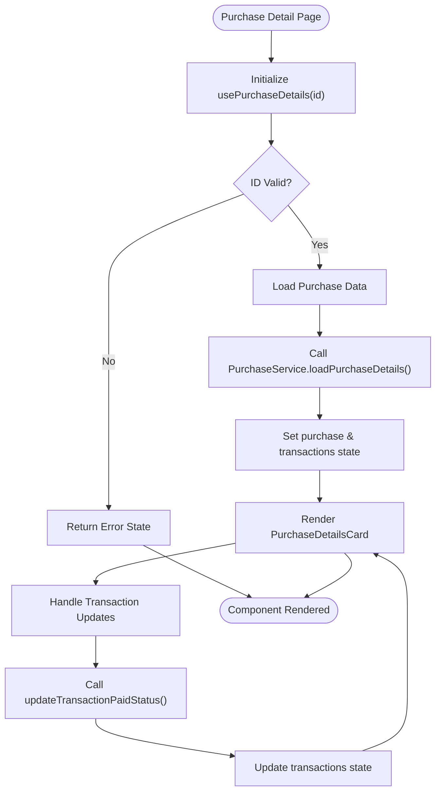

# Frontend Architecture

<cite>
**Referenced Files in This Document**   
- [layout.tsx](file://src/app/layout.tsx)
- [page.tsx](file://src/app/page.tsx)
- [AppSidebar.tsx](file://src/components/AppSidebar.tsx)
- [BottomNavigation.tsx](file://src/components/BottomNavigation.tsx)
- [usePurchaseDetails.ts](file://src/lib/hooks/usePurchaseDetails.ts)
- [useZodForm.ts](file://src/lib/hooks/useZodForm.ts)
- [credit-cards/page.tsx](file://src/app/credit-cards/page.tsx)
- [purchases/[id]/page.tsx](file://src/app/purchases/[id]/page.tsx)
- [CreditCardForm.tsx](file://src/components/credit-cards/CreditCardForm.tsx)
- [PurchaseDetailsCard.tsx](file://src/components/purchases/PurchaseDetailsCard.tsx)
- [middleware.ts](file://src/middleware.ts)
- [constants.ts](file://src/lib/constants.ts)
- [schemas.ts](file://src/lib/schemas.ts)
</cite>

## Table of Contents
1. [Introduction](#introduction)
2. [Project Structure](#project-structure)
3. [Core Components](#core-components)
4. [Architecture Overview](#architecture-overview)
5. [Detailed Component Analysis](#detailed-component-analysis)
6. [Dependency Analysis](#dependency-analysis)
7. [Performance Considerations](#performance-considerations)
8. [Troubleshooting Guide](#troubleshooting-guide)
9. [Conclusion](#conclusion)

## Introduction
The credit-card-tracker frontend architecture is built on Next.js App Router, leveraging server components for pages and client components for interactive elements. The application follows a modular structure with clear separation of concerns, using React hooks for state management and form handling. The design emphasizes responsive behavior across devices with dedicated navigation components for desktop and mobile. The architecture integrates Tailwind CSS for styling and implements accessibility best practices throughout.

## Project Structure

```mermaid
graph TB
subgraph "App Router"
A[layout.tsx]
B[page.tsx]
C[credit-cards/page.tsx]
D[purchases/[id]/page.tsx]
E[enter-password/page.tsx]
end
subgraph "Components"
F[AppSidebar.tsx]
G[BottomNavigation.tsx]
H[CreditCardForm.tsx]
I[PurchaseDetailsCard.tsx]
J[DataTable.tsx]
K[Modal.tsx]
end
subgraph "Libraries"
L[useZodForm.ts]
M[usePurchaseDetails.ts]
N[schemas.ts]
O[constants.ts]
end
A --> F
A --> G
B --> A
C --> A
D --> A
F --> O
G --> O
H --> L
H --> N
I --> M
J --> K
```

**Diagram sources**
- [layout.tsx](file://src/app/layout.tsx#L1-L51)
- [AppSidebar.tsx](file://src/components/AppSidebar.tsx#L1-L32)
- [BottomNavigation.tsx](file://src/components/BottomNavigation.tsx#L1-L105)

**Section sources**
- [layout.tsx](file://src/app/layout.tsx#L1-L51)
- [page.tsx](file://src/app/page.tsx#L1-L48)
- [AppSidebar.tsx](file://src/components/AppSidebar.tsx#L1-L32)
- [BottomNavigation.tsx](file://src/components/BottomNavigation.tsx#L1-L105)

## Core Components

The frontend architecture centers around several core components that establish the application's structure and behavior. The RootLayout in layout.tsx serves as the foundation, wrapping all pages with consistent navigation and styling. AppSidebar provides desktop navigation with responsive behavior, while BottomNavigation handles mobile navigation with scroll position persistence. The useZodForm hook standardizes form management across the application, and usePurchaseDetails encapsulates purchase-specific data fetching and state management logic.

**Section sources**
- [layout.tsx](file://src/app/layout.tsx#L1-L51)
- [useZodForm.ts](file://src/lib/hooks/useZodForm.ts#L1-L83)
- [usePurchaseDetails.ts](file://src/lib/hooks/usePurchaseDetails.ts#L1-L63)

## Architecture Overview

```mermaid
graph TD
A[RootLayout] --> B[Server Components]
A --> C[Client Components]
B --> D[Feature Pages]
C --> E[Interactive Elements]
D --> F[/credit-cards/page.tsx/]
D --> G[/purchases/[id]/page.tsx/]
E --> H[AppSidebar]
E --> I[BottomNavigation]
E --> J[Modal]
H --> K[Navigation State]
I --> L[Scroll Position]
J --> M[Form State]
K --> N[Tailwind CSS]
L --> N
M --> N
N --> O[Responsive Design]
```

**Diagram sources**
- [layout.tsx](file://src/app/layout.tsx#L1-L51)
- [credit-cards/page.tsx](file://src/app/credit-cards/page.tsx#L1-L195)
- [purchases/[id]/page.tsx](file://src/app/purchases/[id]/page.tsx#L1-L188)
- [AppSidebar.tsx](file://src/components/AppSidebar.tsx#L1-L32)
- [BottomNavigation.tsx](file://src/components/BottomNavigation.tsx#L1-L105)

## Detailed Component Analysis

### Layout and Navigation System



**Diagram sources**
- [layout.tsx](file://src/app/layout.tsx#L1-L51)
- [AppSidebar.tsx](file://src/components/AppSidebar.tsx#L1-L32)
- [BottomNavigation.tsx](file://src/components/BottomNavigation.tsx#L1-L105)
- [constants.ts](file://src/lib/constants.ts#L1-L116)

**Section sources**
- [layout.tsx](file://src/app/layout.tsx#L1-L51)
- [AppSidebar.tsx](file://src/components/AppSidebar.tsx#L1-L32)
- [BottomNavigation.tsx](file://src/components/BottomNavigation.tsx#L1-L105)

### Form Management System



**Diagram sources**
- [CreditCardForm.tsx](file://src/components/credit-cards/CreditCardForm.tsx#L1-L180)
- [useZodForm.ts](file://src/lib/hooks/useZodForm.ts#L1-L83)
- [schemas.ts](file://src/lib/schemas.ts#L1-L62)
- [credit-cards/page.tsx](file://src/app/credit-cards/page.tsx#L1-L195)

**Section sources**
- [CreditCardForm.tsx](file://src/components/credit-cards/CreditCardForm.tsx#L1-L180)
- [useZodForm.ts](file://src/lib/hooks/useZodForm.ts#L1-L83)
- [schemas.ts](file://src/lib/schemas.ts#L1-L62)

### Data Fetching and State Management



**Diagram sources**
- [purchases/[id]/page.tsx](file://src/app/purchases/[id]/page.tsx#L1-L188)
- [usePurchaseDetails.ts](file://src/lib/hooks/usePurchaseDetails.ts#L1-L63)
- [PurchaseDetailsCard.tsx](file://src/components/purchases/PurchaseDetailsCard.tsx#L1-L78)

**Section sources**
- [purchases/[id]/page.tsx](file://src/app/purchases/[id]/page.tsx#L1-L188)
- [usePurchaseDetails.ts](file://src/lib/hooks/usePurchaseDetails.ts#L1-L63)
- [PurchaseDetailsCard.tsx](file://src/components/purchases/PurchaseDetailsCard.tsx#L1-L78)

## Dependency Analysis

```mermaid
graph LR
A[layout.tsx] --> B[AppSidebar]
A --> C[BottomNavigation]
A --> D[globals.css]
B --> E[constants.ts]
B --> F[icons.ts]
C --> E
C --> G[utils.ts]
C --> H[next/navigation]
I[credit-cards/page.tsx] --> J[DataTable]
I --> K[Modal]
I --> L[CreditCardForm]
L --> M[useZodForm]
L --> N[schemas.ts]
M --> N
O[purchases/[id]/page.tsx] --> P[PurchaseDetailsCard]
O --> Q[usePurchaseDetails]
Q --> R[purchaseService.ts]
R --> S[supabase.ts]
```

**Diagram sources**
- [layout.tsx](file://src/app/layout.tsx#L1-L51)
- [AppSidebar.tsx](file://src/components/AppSidebar.tsx#L1-L32)
- [BottomNavigation.tsx](file://src/components/BottomNavigation.tsx#L1-L105)
- [credit-cards/page.tsx](file://src/app/credit-cards/page.tsx#L1-L195)
- [purchases/[id]/page.tsx](file://src/app/purchases/[id]/page.tsx#L1-L188)
- [useZodForm.ts](file://src/lib/hooks/useZodForm.ts#L1-L83)
- [usePurchaseDetails.ts](file://src/lib/hooks/usePurchaseDetails.ts#L1-L63)

**Section sources**
- [layout.tsx](file://src/app/layout.tsx#L1-L51)
- [AppSidebar.tsx](file://src/components/AppSidebar.tsx#L1-L32)
- [BottomNavigation.tsx](file://src/components/BottomNavigation.tsx#L1-L105)
- [credit-cards/page.tsx](file://src/app/credit-cards/page.tsx#L1-L195)
- [purchases/[id]/page.tsx](file://src/app/purchases/[id]/page.tsx#L1-L188)

## Performance Considerations

The application implements several performance optimizations. The RootLayout is a server component that reduces client-side JavaScript payload. Navigation components use React.memo and useCallback to prevent unnecessary re-renders. The BottomNavigation component persists scroll positions using sessionStorage, enhancing user experience during navigation. Data fetching is handled efficiently with React Query patterns in custom hooks like usePurchaseDetails, which manage loading states and error handling. Form validation is optimized with memoized validation functions in useZodForm.

**Section sources**
- [layout.tsx](file://src/app/layout.tsx#L1-L51)
- [BottomNavigation.tsx](file://src/components/BottomNavigation.tsx#L1-L105)
- [useZodForm.ts](file://src/lib/hooks/useZodForm.ts#L1-L83)
- [usePurchaseDetails.ts](file://src/lib/hooks/usePurchaseDetails.ts#L1-L63)

## Troubleshooting Guide

Common issues in the frontend architecture typically relate to state management, form validation, or data fetching. When debugging form issues, verify that the useZodForm hook is properly initialized with the correct schema and initial values. For data fetching problems, check the implementation of custom hooks like usePurchaseDetails to ensure proper error handling and state updates. Navigation issues may stem from incorrect path definitions in NAV_LINKS constant. Accessibility issues can be identified by verifying ARIA attributes in components like BottomNavigation. Style inconsistencies should be traced to Tailwind CSS class usage and theme configuration.

**Section sources**
- [useZodForm.ts](file://src/lib/hooks/useZodForm.ts#L1-L83)
- [usePurchaseDetails.ts](file://src/lib/hooks/usePurchaseDetails.ts#L1-L63)
- [constants.ts](file://src/lib/constants.ts#L1-L116)
- [BottomNavigation.tsx](file://src/components/BottomNavigation.tsx#L1-L105)

## Conclusion

The credit-card-tracker frontend architecture demonstrates a well-structured Next.js application using modern React patterns. The App Router enables efficient server-side rendering while client components handle interactive elements. The component hierarchy with layout.tsx as the root provides consistent structure across pages. Custom hooks in src/lib/hooks abstract complex logic for form management and data fetching. The architecture effectively addresses cross-cutting concerns with responsive navigation components, consistent theming through Tailwind CSS, and accessibility compliance. This design supports maintainability and scalability, providing clear guidelines for adding new features and components.