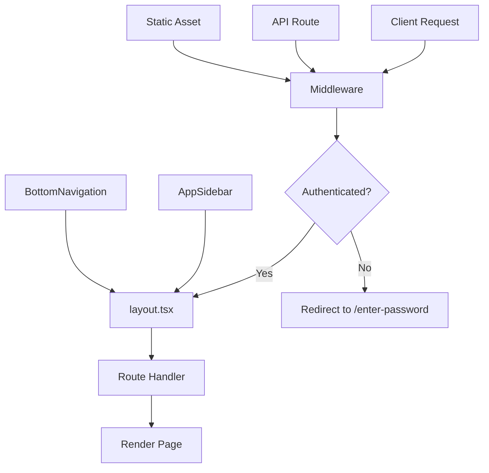
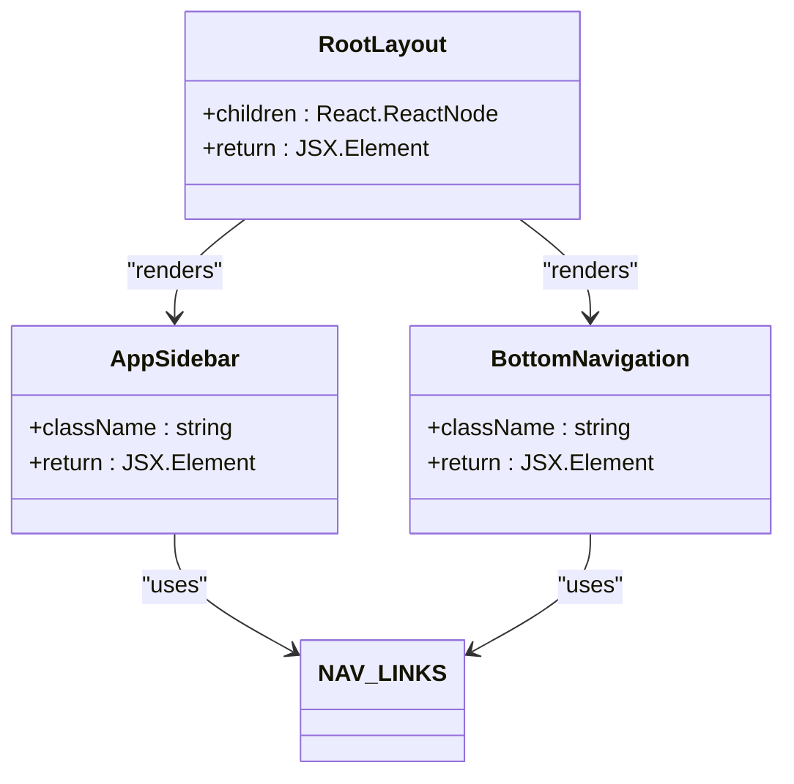
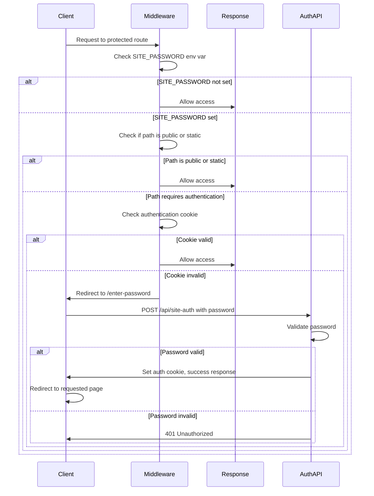

# Routing Structure

<cite>
**Referenced Files in This Document**   
- [layout.tsx](file://src/app/layout.tsx)
- [middleware.ts](file://src/middleware.ts)
- [page.tsx](file://src/app/page.tsx)
- [credit-cards/page.tsx](file://src/app/credit-cards/page.tsx)
- [persons/page.tsx](file://src/app/persons/page.tsx)
- [purchases/page.tsx](file://src/app/purchases/page.tsx)
- [purchases/[id]/page.tsx](file://src/app/purchases/[id]/page.tsx)
- [transactions/page.tsx](file://src/app/transactions/page.tsx)
- [transactions/person/[id]/page.tsx](file://src/app/transactions/person/[id]/page.tsx)
- [enter-password/page.tsx](file://src/app/enter-password/page.tsx)
- [api/site-auth/route.ts](file://src/app/api/site-auth/route.ts)
- [constants/auth-constants.ts](file://src/lib/constants/auth-constants.ts)
- [AppSidebar.tsx](file://src/components/AppSidebar.tsx)
- [BottomNavigation.tsx](file://src/components/BottomNavigation.tsx)
</cite>

## Table of Contents
1. [Introduction](#introduction)
2. [Project Structure](#project-structure)
3. [Core Components](#core-components)
4. [Architecture Overview](#architecture-overview)
5. [Detailed Component Analysis](#detailed-component-analysis)
6. [Dependency Analysis](#dependency-analysis)
7. [Performance Considerations](#performance-considerations)
8. [Troubleshooting Guide](#troubleshooting-guide)
9. [Conclusion](#conclusion)

## Introduction
The credit-card-tracker application utilizes Next.js App Router to implement a file-based routing system that organizes features into logical directories. This documentation details the routing structure, authentication middleware, layout system, and navigation components that form the foundation of the application's user interface and security model. The system employs dynamic routing, nested layouts, and client-side navigation to provide a seamless user experience while protecting sensitive financial data through password-based authentication.

## Project Structure

The application follows a standard Next.js App Router structure with feature-based organization. Key routing components are organized under the `src/app` directory, with each major feature having its own subdirectory. The routing system leverages file-based conventions where directory names correspond to URL paths and `page.tsx` files define route handlers.

```mermaid
graph TD
A[src/app] --> B[layout.tsx]
A --> C[page.tsx]
A --> D[credit-cards]
A --> E[persons]
A --> F[purchases]
A --> G[transactions]
A --> H[enter-password]
A --> I[api/site-auth]
D --> J[page.tsx]
D --> K[[id]/page.tsx]
F --> L[page.tsx]
F --> M[[id]/page.tsx]
G --> N[page.tsx]
G --> O[person/[id]/page.tsx]
H --> P[page.tsx]
I --> Q[route.ts]
```

**Diagram sources**
- [layout.tsx](file://src/app/layout.tsx)
- [page.tsx](file://src/app/page.tsx)

**Section sources**
- [layout.tsx](file://src/app/layout.tsx)
- [page.tsx](file://src/app/page.tsx)

## Core Components

The routing system is built around several core components that work together to provide navigation, authentication, and consistent UI across routes. The `layout.tsx` file provides a shared shell for all pages, while the authentication middleware protects routes by verifying user credentials. Navigation components like `AppSidebar` and `BottomNavigation` provide responsive navigation across different device sizes.

**Section sources**
- [layout.tsx](file://src/app/layout.tsx)
- [middleware.ts](file://src/middleware.ts)
- [AppSidebar.tsx](file://src/components/AppSidebar.tsx)
- [BottomNavigation.tsx](file://src/components/BottomNavigation.tsx)

## Architecture Overview

The application's routing architecture follows a hierarchical pattern with a root layout that wraps all pages. Authentication is handled at the middleware level, intercepting requests before they reach the route handlers. Dynamic routes use bracket notation to capture parameters, while route groups organize related functionality. The system employs both server-side and client-side rendering strategies to optimize performance and user experience.



**Diagram sources**
- [layout.tsx](file://src/app/layout.tsx)
- [middleware.ts](file://src/middleware.ts)
- [AppSidebar.tsx](file://src/components/AppSidebar.tsx)
- [BottomNavigation.tsx](file://src/components/BottomNavigation.tsx)

## Detailed Component Analysis

### Layout System Analysis
The layout system provides a consistent UI shell across all routes while adapting to different screen sizes. The root layout renders both desktop and mobile navigation components, showing the sidebar on larger screens and bottom navigation on mobile devices.



**Diagram sources**
- [layout.tsx](file://src/app/layout.tsx)
- [AppSidebar.tsx](file://src/components/AppSidebar.tsx)
- [BottomNavigation.tsx](file://src/components/BottomNavigation.tsx)

### Authentication Middleware Analysis
The authentication middleware protects routes by verifying a password-based authentication cookie. It allows access to public paths and static assets while redirecting unauthenticated users to the password entry page.



**Diagram sources**
- [middleware.ts](file://src/middleware.ts)
- [api/site-auth/route.ts](file://src/app/api/site-auth/route.ts)
- [enter-password/page.tsx](file://src/app/enter-password/page.tsx)

### Route Handlers Analysis
The application implements route handlers for key pages including home, credit cards, persons, purchases, and transactions. Each route handler fetches data and renders a page component with appropriate UI elements.

```mermaid
flowchart TD
Start([Route Request]) --> Home["/ (Home Page)"]
Home --> DisplayHome["Display navigation cards and how it works"]
Start --> CreditCards["/credit-cards"]
CreditCards --> LoadCards["Load credit cards from service"]
CreditCards --> DisplayTable["Display cards in DataTable"]
CreditCards --> HandleCRUD["Handle add, edit, delete operations"]
Start --> Persons["/persons"]
Persons --> LoadPersons["Load persons from service"]
Persons --> DisplayPersons["Display persons in DataTable"]
Persons --> HandlePersonCRUD["Handle person operations"]
Start --> Purchases["/purchases"]
Purchases --> LoadPurchases["Load purchases, cards, persons"]
Purchases --> DisplayPurchaseTable["Display purchases with filters"]
Purchases --> HandlePurchaseCRUD["Handle purchase operations"]
Start --> Transactions["/transactions"]
Transactions --> LoadTransactions["Load transactions with relationships"]
Transactions --> DisplayTransactionTable["Display transactions with filters"]
Transactions --> HandlePaidStatus["Handle paid status updates"]
Start --> PurchaseDetail["/purchases/[id]"]
PurchaseDetail --> LoadPurchase["Load purchase details"]
PurchaseDetail --> DisplayPurchaseDetails["Display purchase and transactions"]
PurchaseDetail --> HandleTransactionPaid["Handle transaction paid status"]
Start --> PersonTransactions["/transactions/person/[id]"]
PersonTransactions --> LoadPersonTransactions["Load transactions for person"]
PersonTransactions --> DisplayPersonTransactions["Display transactions with filters"]
PersonTransactions --> HandlePersonTransactionPaid["Handle paid status"]
style Start fill:#f9f,stroke:#333
```



**Diagram sources**
- [page.tsx](file://src/app/page.tsx)
- [credit-cards/page.tsx](file://src/app/credit-cards/page.tsx)
- [persons/page.tsx](file://src/app/persons/page.tsx)
- [purchases/page.tsx](file://src/app/purchases/page.tsx)
- [purchases/[id]/page.tsx](file://src/app/purchases/[id]/page.tsx)
- [transactions/page.tsx](file://src/app/transactions/page.tsx)
- [transactions/person/[id]/page.tsx](file://src/app/transactions/person/[id]/page.tsx)

**Section sources**
- [page.tsx](file://src/app/page.tsx)
- [credit-cards/page.tsx](file://src/app/credit-cards/page.tsx)
- [persons/page.tsx](file://src/app/persons/page.tsx)
- [purchases/page.tsx](file://src/app/purchases/page.tsx)
- [purchases/[id]/page.tsx](file://src/app/purchases/[id]/page.tsx)
- [transactions/page.tsx](file://src/app/transactions/page.tsx)
- [transactions/person/[id]/page.tsx](file://src/app/transactions/person/[id]/page.tsx)

## Dependency Analysis

The routing system has a clear dependency hierarchy with the middleware depending on authentication constants, and route handlers depending on data services. The layout components depend on navigation constants and icon utilities.

```mermaid
graph TD
A[middleware.ts] --> B[auth-constants.ts]
C[layout.tsx] --> D[AppSidebar.tsx]
C --> E[BottomNavigation.tsx]
D --> F[constants.ts]
E --> F
D --> G[icons.ts]
E --> G
H[credit-cards/page.tsx] --> I[creditCardService.ts]
J[persons/page.tsx] --> K[personService.ts]
L[purchases/page.tsx] --> M[dataService.ts]
N[transactions/page.tsx] --> M
O[purchases/[id]/page.tsx] --> P[usePurchaseDetails.ts]
Q[enter-password/page.tsx] --> R[authService.ts]
R --> S[site-auth/route.ts]
```

**Diagram sources**
- [middleware.ts](file://src/middleware.ts)
- [layout.tsx](file://src/app/layout.tsx)
- [AppSidebar.tsx](file://src/components/AppSidebar.tsx)
- [BottomNavigation.tsx](file://src/components/BottomNavigation.tsx)
- [auth-constants.ts](file://src/lib/constants/auth-constants.ts)

**Section sources**
- [middleware.ts](file://src/middleware.ts)
- [layout.tsx](file://src/app/layout.tsx)
- [AppSidebar.tsx](file://src/components/AppSidebar.tsx)
- [BottomNavigation.tsx](file://src/components/BottomNavigation.tsx)

## Performance Considerations

The routing system implements several performance optimizations including client-side navigation, data loading states, and efficient re-rendering. The use of React hooks like `useMemo` for filtered data and `useEffect` for data loading helps minimize unnecessary computations. Loading states are displayed during data fetching to provide user feedback, and error boundaries allow for retry functionality when data loading fails.

## Troubleshooting Guide

Common routing issues in the credit-card-tracker application typically involve authentication problems, data loading failures, or navigation issues. The middleware configuration must be correctly set to protect routes while allowing access to public paths and API endpoints. Route parameters must be properly extracted using the `useParams` hook in client components. Data loading errors should be handled gracefully with appropriate error messages and retry options.

**Section sources**
- [middleware.ts](file://src/middleware.ts)
- [layout.tsx](file://src/app/layout.tsx)
- [purchases/[id]/page.tsx](file://src/app/purchases/[id]/page.tsx)

## Conclusion

The credit-card-tracker application implements a robust routing system using Next.js App Router that effectively organizes features, protects sensitive data, and provides a consistent user experience across devices. The file-based routing convention makes the structure intuitive and maintainable, while the middleware-based authentication provides a secure way to protect routes. The combination of desktop sidebar and mobile bottom navigation ensures usability across different screen sizes. By following the established patterns for adding new routes, developers can extend the application while maintaining security and responsive design requirements.