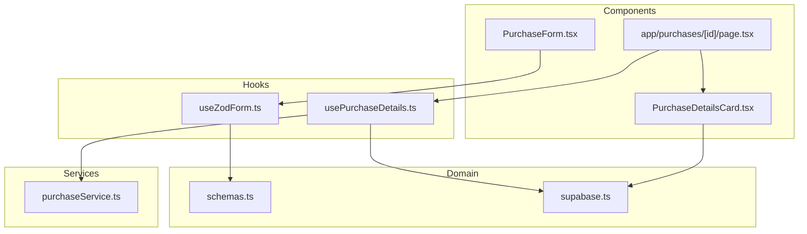
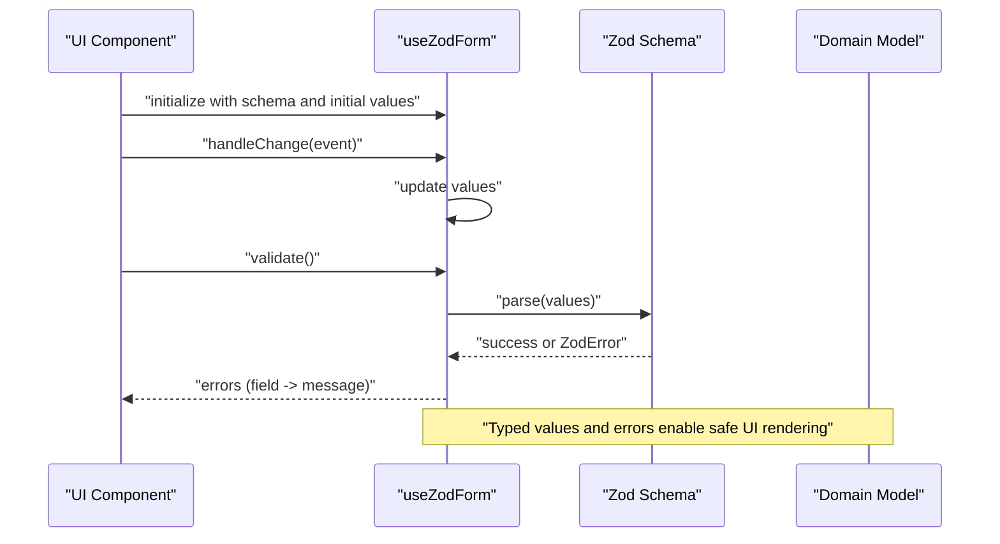
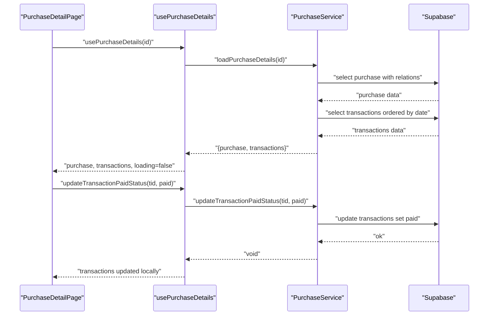
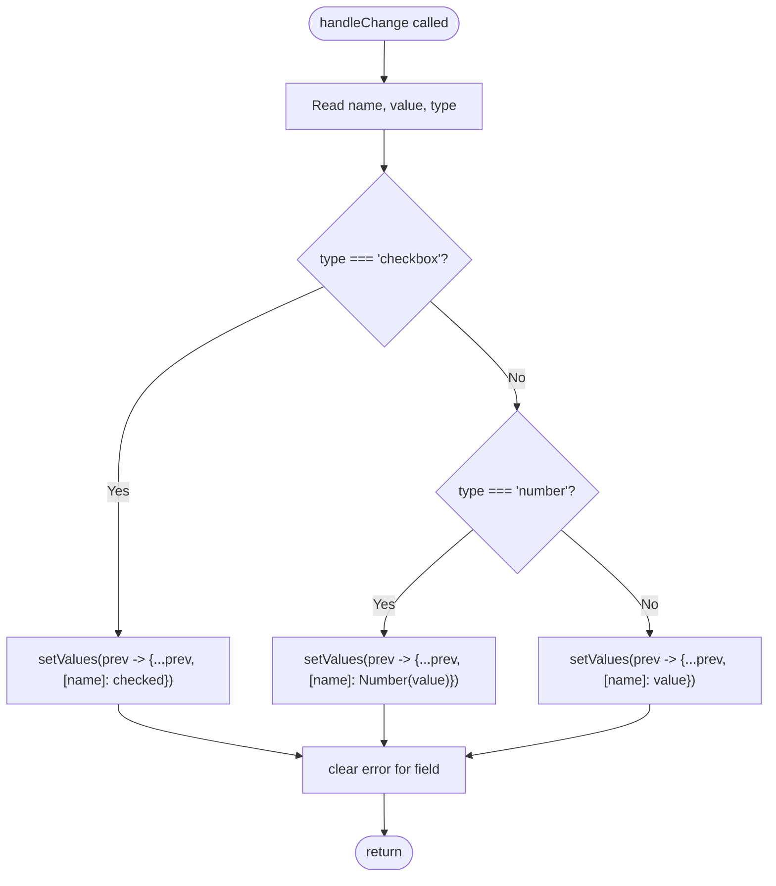
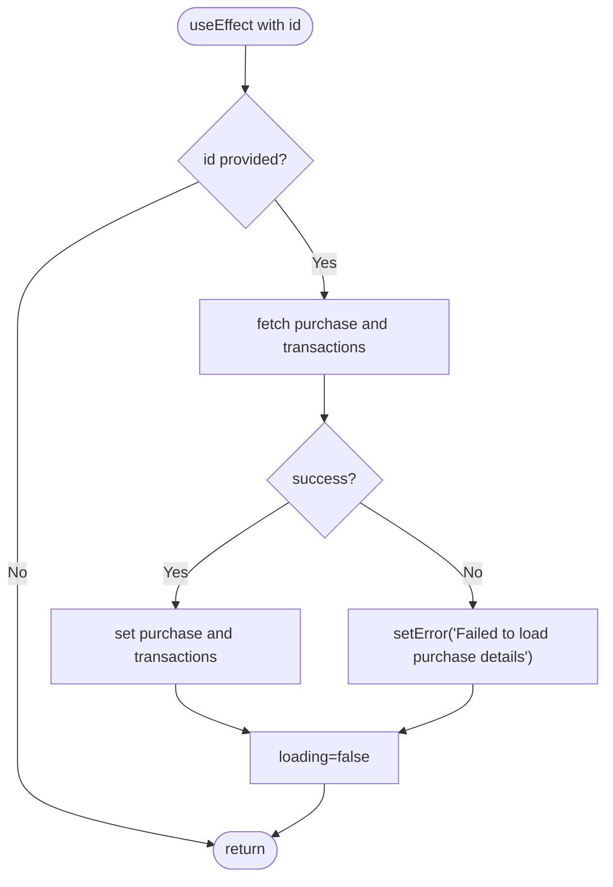
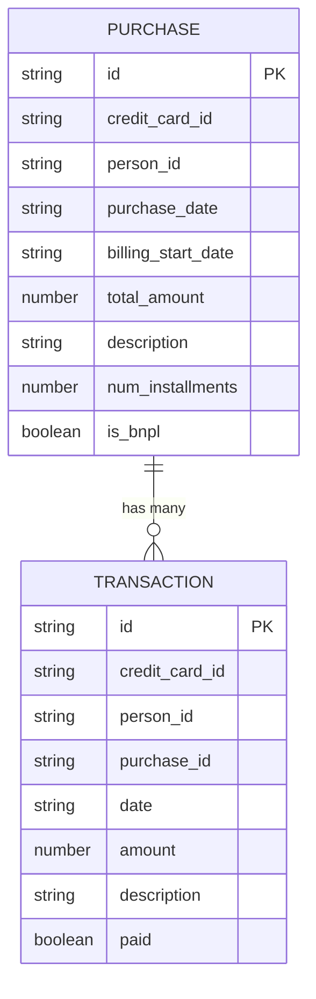
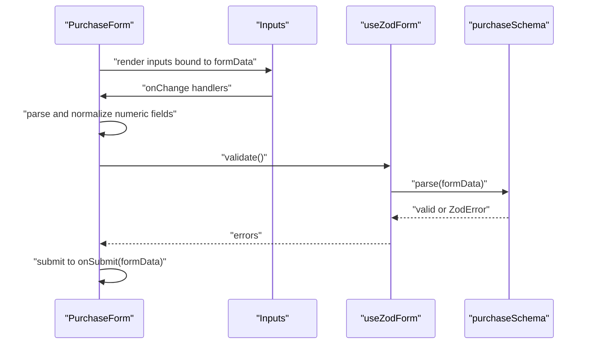
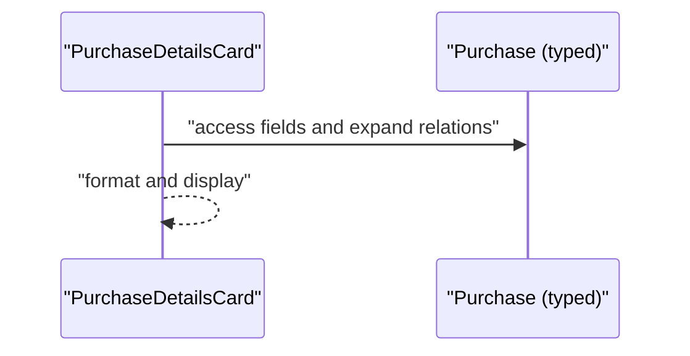
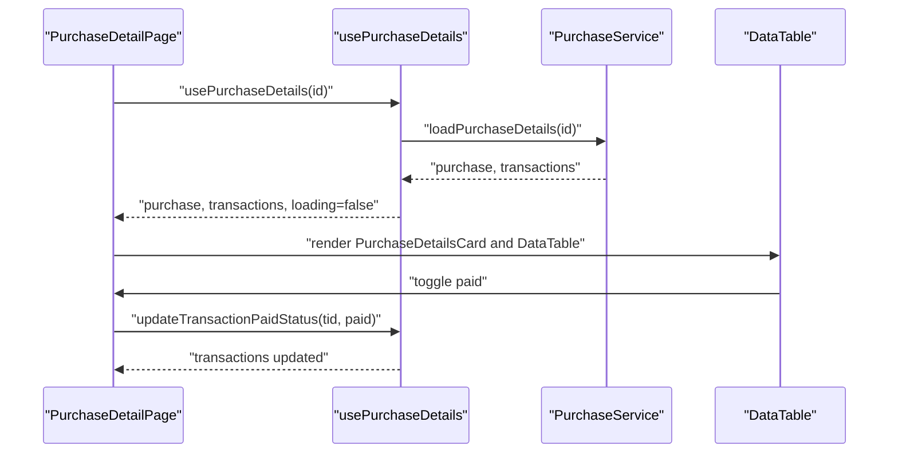
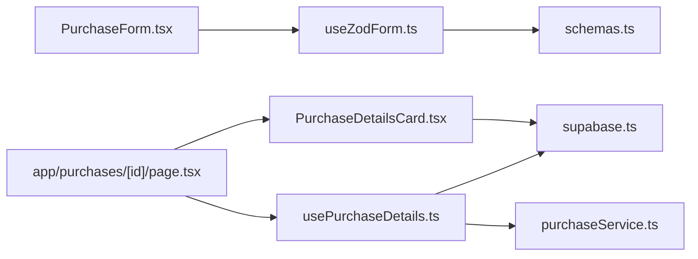

# State Management

<cite>
**Referenced Files in This Document**
- [useZodForm.ts](file://src/lib/hooks/useZodForm.ts)
- [usePurchaseDetails.ts](file://src/lib/hooks/usePurchaseDetails.ts)
- [schemas.ts](file://src/lib/schemas.ts)
- [supabase.ts](file://src/lib/supabase.ts)
- [purchaseService.ts](file://src/lib/services/purchaseService.ts)
- [PurchaseForm.tsx](file://src/components/PurchaseForm.tsx)
- [PurchaseDetailsCard.tsx](file://src/components/purchases/PurchaseDetailsCard.tsx)
- [page.tsx](file://src/app/purchases/[id]/page.tsx)
</cite>

## Table of Contents
1. [Introduction](#introduction)
2. [Project Structure](#project-structure)
3. [Core Components](#core-components)
4. [Architecture Overview](#architecture-overview)
5. [Detailed Component Analysis](#detailed-component-analysis)
6. [Dependency Analysis](#dependency-analysis)
7. [Performance Considerations](#performance-considerations)
8. [Troubleshooting Guide](#troubleshooting-guide)
9. [Conclusion](#conclusion)

## Introduction
This document explains the state management system for the credit-card-tracker application with a focus on two custom React hooks:
- useZodForm: a typed, schema-driven form state manager integrating Zod validation with form inputs.
- usePurchaseDetails: a data-fetching and state manager for purchase details and related transactions, including asynchronous updates.

It covers interfaces, domain models, usage patterns, error handling, and best practices for building robust custom hooks. It also demonstrates how these hooks are used in real components such as PurchaseForm and PurchaseDetailsCard, and how they integrate with the application’s data layer.

## Project Structure
The state management logic lives primarily in:
- Custom hooks under src/lib/hooks
- Domain schemas under src/lib/schemas
- Data models under src/lib/supabase
- Services under src/lib/services
- UI components under src/components and pages under src/app

**Diagram sources**
- [useZodForm.ts](file://src/lib/hooks/useZodForm.ts#L1-L82)
- [usePurchaseDetails.ts](file://src/lib/hooks/usePurchaseDetails.ts#L1-L62)
- [schemas.ts](file://src/lib/schemas.ts#L1-L62)
- [supabase.ts](file://src/lib/supabase.ts#L1-L81)
- [purchaseService.ts](file://src/lib/services/purchaseService.ts#L1-L88)
- [PurchaseForm.tsx](file://src/components/PurchaseForm.tsx#L1-L269)
- [PurchaseDetailsCard.tsx](file://src/components/purchases/PurchaseDetailsCard.tsx#L1-L78)
- [page.tsx](file://src/app/purchases/[id]/page.tsx#L1-L188)

**Section sources**
- [useZodForm.ts](file://src/lib/hooks/useZodForm.ts#L1-L82)
- [usePurchaseDetails.ts](file://src/lib/hooks/usePurchaseDetails.ts#L1-L62)
- [schemas.ts](file://src/lib/schemas.ts#L1-L62)
- [supabase.ts](file://src/lib/supabase.ts#L1-L81)
- [purchaseService.ts](file://src/lib/services/purchaseService.ts#L1-L88)
- [PurchaseForm.tsx](file://src/components/PurchaseForm.tsx#L1-L269)
- [PurchaseDetailsCard.tsx](file://src/components/purchases/PurchaseDetailsCard.tsx#L1-L78)
- [page.tsx](file://src/app/purchases/[id]/page.tsx#L1-L188)

## Core Components
- useZodForm
  - Purpose: Manage form state with Zod schema validation, typed values, and error reporting.
  - Key exports: values, setValues, errors, handleChange, validate, reset.
  - Integrates with Zod schemas to parse and report validation errors keyed by field names.

- usePurchaseDetails
  - Purpose: Fetch and manage purchase details and related transactions, including loading, error, and update helpers.
  - Key exports: purchase, transactions, loading, error, updateTransactionPaidStatus.
  - Uses PurchaseService to load data and update transaction paid status.

**Section sources**
- [useZodForm.ts](file://src/lib/hooks/useZodForm.ts#L1-L82)
- [usePurchaseDetails.ts](file://src/lib/hooks/usePurchaseDetails.ts#L1-L62)

## Architecture Overview
The hooks orchestrate state and side effects, while schemas and models define the domain contracts. Services encapsulate data access and transformations. Components consume the hooks and render UI.

**Diagram sources**
- [useZodForm.ts](file://src/lib/hooks/useZodForm.ts#L1-L82)
- [schemas.ts](file://src/lib/schemas.ts#L1-L62)

**Diagram sources**
- [usePurchaseDetails.ts](file://src/lib/hooks/usePurchaseDetails.ts#L1-L62)
- [purchaseService.ts](file://src/lib/services/purchaseService.ts#L1-L88)
- [supabase.ts](file://src/lib/supabase.ts#L1-L81)

## Detailed Component Analysis

### useZodForm
- Inputs
  - schema: a ZodType used to validate form values.
  - initialValues: typed initial values matching the schema inference.
- Outputs
  - values: current form values.
  - setValues: stable setter for values.
  - errors: record mapping field names to error messages.
  - handleChange: handler for input changes, including text, number, and checkbox.
  - validate: runs schema.parse and returns boolean; populates errors on failure.
  - reset: resets values and clears errors.
- Behavior highlights
  - Handles checkbox and number inputs by casting appropriately.
  - Clears per-field errors when the user edits the field.
  - validate uses a dependency array with schema and values to re-run validation when either changes.
  - setValues is memoized to remain stable across renders, preventing unnecessary re-renders of consumers.

**Diagram sources**
- [useZodForm.ts](file://src/lib/hooks/useZodForm.ts#L1-L82)

**Section sources**
- [useZodForm.ts](file://src/lib/hooks/useZodForm.ts#L1-L82)
- [schemas.ts](file://src/lib/schemas.ts#L1-L62)

### usePurchaseDetails
- Inputs
  - id: purchase identifier string.
- Outputs
  - purchase: the purchase entity with expanded relations or null.
  - transactions: ordered list of related transactions with expanded relations.
  - loading: boolean indicating data fetch in progress.
  - error: string describing any error encountered.
  - updateTransactionPaidStatus: async function to toggle paid status for a transaction.
- Behavior highlights
  - Loads purchase and transactions on mount when id is present.
  - Sets loading and clears error before fetching; sets error on failure; disables loading in finally.
  - updateTransactionPaidStatus updates local state optimistically and throws on service error for caller to handle.

**Diagram sources**
- [usePurchaseDetails.ts](file://src/lib/hooks/usePurchaseDetails.ts#L1-L62)
- [purchaseService.ts](file://src/lib/services/purchaseService.ts#L1-L88)

**Section sources**
- [usePurchaseDetails.ts](file://src/lib/hooks/usePurchaseDetails.ts#L1-L62)
- [purchaseService.ts](file://src/lib/services/purchaseService.ts#L1-L88)
- [supabase.ts](file://src/lib/supabase.ts#L1-L81)

### Domain Models and Schemas
- Purchase model
  - Fields include identifiers, dates, amounts, installments, BNPL flag, and optional relations.
  - expand property holds related entities loaded by the service.
- Transaction model
  - Fields include identifiers, date, amount, description, paid flag, and optional relations.
- Schemas
  - purchaseSchema enforces required fields, numeric constraints, and integer installments.
  - transactionSchema enforces required fields and numeric amounts.
  - These schemas drive validation in useZodForm and ensure typed data across the app.

**Diagram sources**
- [supabase.ts](file://src/lib/supabase.ts#L1-L81)
- [purchaseService.ts](file://src/lib/services/purchaseService.ts#L1-L88)

**Section sources**
- [supabase.ts](file://src/lib/supabase.ts#L1-L81)
- [schemas.ts](file://src/lib/schemas.ts#L1-L62)

### Usage Patterns in Components

#### PurchaseForm
- Manages local form state for purchase creation/editing.
- Uses controlled inputs and manual parsing for numeric fields.
- Demonstrates typed submission payload derived from form state.

**Diagram sources**
- [PurchaseForm.tsx](file://src/components/PurchaseForm.tsx#L1-L269)
- [useZodForm.ts](file://src/lib/hooks/useZodForm.ts#L1-L82)
- [schemas.ts](file://src/lib/schemas.ts#L1-L62)

**Section sources**
- [PurchaseForm.tsx](file://src/components/PurchaseForm.tsx#L1-L269)
- [useZodForm.ts](file://src/lib/hooks/useZodForm.ts#L1-L82)
- [schemas.ts](file://src/lib/schemas.ts#L1-L62)

#### PurchaseDetailsCard
- Renders purchase details using the typed purchase model.
- Uses formatting utilities and constants for currency display.

**Diagram sources**
- [PurchaseDetailsCard.tsx](file://src/components/purchases/PurchaseDetailsCard.tsx#L1-L78)
- [supabase.ts](file://src/lib/supabase.ts#L1-L81)

**Section sources**
- [PurchaseDetailsCard.tsx](file://src/components/purchases/PurchaseDetailsCard.tsx#L1-L78)
- [supabase.ts](file://src/lib/supabase.ts#L1-L81)

#### Purchase Detail Page
- Consumes usePurchaseDetails to load and display purchase details and transactions.
- Implements filtering and toggling paid status via updateTransactionPaidStatus.

**Diagram sources**
- [page.tsx](file://src/app/purchases/[id]/page.tsx#L1-L188)
- [usePurchaseDetails.ts](file://src/lib/hooks/usePurchaseDetails.ts#L1-L62)
- [purchaseService.ts](file://src/lib/services/purchaseService.ts#L1-L88)

**Section sources**
- [page.tsx](file://src/app/purchases/[id]/page.tsx#L1-L188)
- [usePurchaseDetails.ts](file://src/lib/hooks/usePurchaseDetails.ts#L1-L62)
- [purchaseService.ts](file://src/lib/services/purchaseService.ts#L1-L88)

## Dependency Analysis
- useZodForm depends on:
  - React state and callbacks
  - Zod for schema validation
  - Typed initial values inferred from the schema
- usePurchaseDetails depends on:
  - Supabase models (Purchase, Transaction)
  - PurchaseService for data access
  - React lifecycle (useState, useEffect)
- Components depend on:
  - useZodForm for form state and validation
  - usePurchaseDetails for purchase and transaction data
  - Utility functions for formatting and constants for currency display

**Diagram sources**
- [useZodForm.ts](file://src/lib/hooks/useZodForm.ts#L1-L82)
- [usePurchaseDetails.ts](file://src/lib/hooks/usePurchaseDetails.ts#L1-L62)
- [schemas.ts](file://src/lib/schemas.ts#L1-L62)
- [supabase.ts](file://src/lib/supabase.ts#L1-L81)
- [purchaseService.ts](file://src/lib/services/purchaseService.ts#L1-L88)
- [PurchaseForm.tsx](file://src/components/PurchaseForm.tsx#L1-L269)
- [PurchaseDetailsCard.tsx](file://src/components/purchases/PurchaseDetailsCard.tsx#L1-L78)
- [page.tsx](file://src/app/purchases/[id]/page.tsx#L1-L188)

**Section sources**
- [useZodForm.ts](file://src/lib/hooks/useZodForm.ts#L1-L82)
- [usePurchaseDetails.ts](file://src/lib/hooks/usePurchaseDetails.ts#L1-L62)
- [schemas.ts](file://src/lib/schemas.ts#L1-L62)
- [supabase.ts](file://src/lib/supabase.ts#L1-L81)
- [purchaseService.ts](file://src/lib/services/purchaseService.ts#L1-L88)
- [PurchaseForm.tsx](file://src/components/PurchaseForm.tsx#L1-L269)
- [PurchaseDetailsCard.tsx](file://src/components/purchases/PurchaseDetailsCard.tsx#L1-L78)
- [page.tsx](file://src/app/purchases/[id]/page.tsx#L1-L188)

## Performance Considerations
- Memoization
  - useZodForm memoizes setValues and handleChange to prevent unnecessary re-renders of consumers.
  - usePurchaseDetails memoizes updateTransactionPaidStatus via useCallback semantics; keep the function identity stable by avoiding inline arrow functions in callers.
- Dependency arrays
  - useZodForm.validate depends on schema and values; ensure schema is stable across renders (e.g., memoize schema instances).
  - usePurchaseDetails depends on id; ensure id is memoized if computed dynamically.
- Rendering cost
  - Prefer controlled inputs and minimal state updates to reduce re-renders.
  - For large lists (transactions), consider virtualization or pagination.
- Validation timing
  - Trigger validate on submit or onBlur rather than on every keystroke for better UX and performance.
- Local optimistic updates
  - usePurchaseDetails updateTransactionPaidStatus updates state immediately; ensure UI reflects pending state (e.g., spinner or disabled controls) during network requests.

[No sources needed since this section provides general guidance]

## Troubleshooting Guide
Common issues and resolutions:
- Stale closures
  - Symptom: updateTransactionPaidStatus uses outdated props or state inside event handlers.
  - Resolution: Use functional updates and keep the handler stable; avoid capturing mutable refs in closures.
- Dependency array pitfalls
  - Symptom: validate does not re-run when values change or errors persist after fixing a field.
  - Resolution: Ensure handleChange clears the specific field error and that validate depends on values and schema.
- Error handling
  - Symptom: Errors are not surfaced to the UI or are overwritten.
  - Resolution: Use error state and display per-field errors; ensure catch blocks set error messages and that UI checks for loading/error states before rendering data.
- Numeric parsing
  - Symptom: Numbers are not parsed correctly or default to unexpected values.
  - Resolution: Normalize numeric inputs to numbers and integers before submission; guard against NaN and negative values.
- Asynchronous updates
  - Symptom: UI flickers or shows stale data after toggling paid status.
  - Resolution: Disable the checkbox while updating and handle errors gracefully; ensure the update function throws so the caller can revert UI if needed.

**Section sources**
- [useZodForm.ts](file://src/lib/hooks/useZodForm.ts#L1-L82)
- [usePurchaseDetails.ts](file://src/lib/hooks/usePurchaseDetails.ts#L1-L62)
- [page.tsx](file://src/app/purchases/[id]/page.tsx#L1-L188)

## Conclusion
The state management system leverages typed Zod schemas and custom hooks to provide predictable, validated form state and robust asynchronous data loading. useZodForm centralizes form handling and validation, while usePurchaseDetails encapsulates data fetching and transaction updates. Together with typed domain models and services, they enable a maintainable and scalable architecture suitable for both beginners and experienced developers.

[No sources needed since this section summarizes without analyzing specific files]