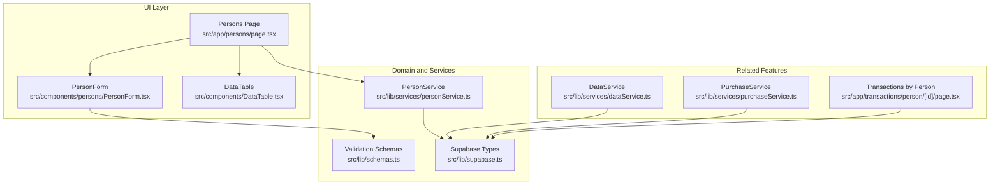
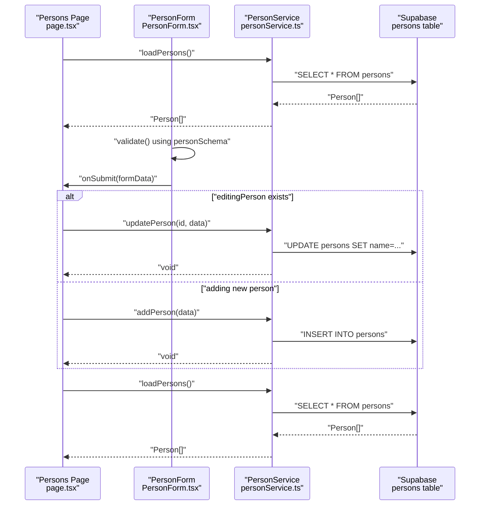
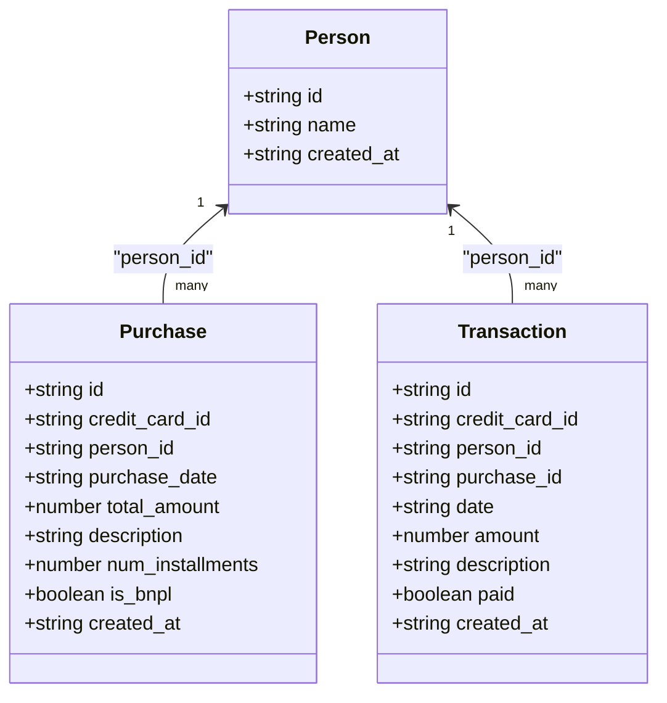
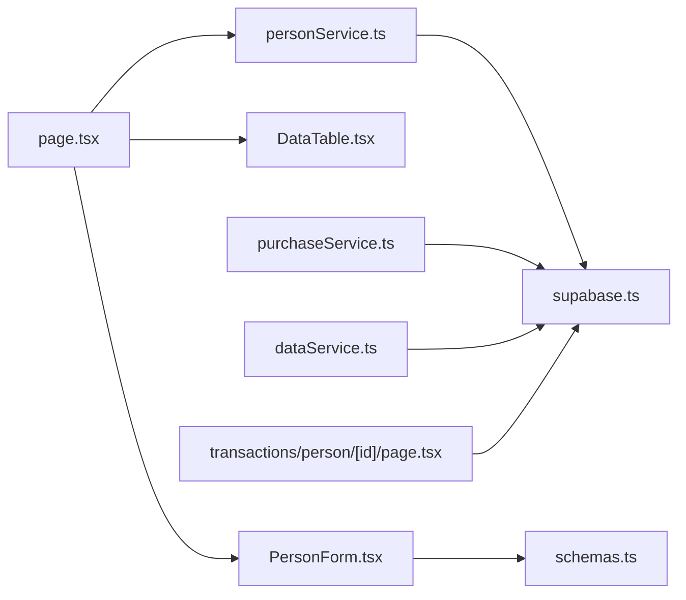

# Person Management

<cite>
**Referenced Files in This Document**
- [page.tsx](file://src/app/persons/page.tsx)
- [PersonForm.tsx](file://src/components/persons/PersonForm.tsx)
- [personService.ts](file://src/lib/services/personService.ts)
- [schemas.ts](file://src/lib/schemas.ts)
- [supabase.ts](file://src/lib/supabase.ts)
- [DataTable.tsx](file://src/components/DataTable.tsx)
- [dataService.ts](file://src/lib/services/dataService.ts)
- [purchaseService.ts](file://src/lib/services/purchaseService.ts)
- [page.tsx](file://src/app/transactions/person/[id]/page.tsx)
</cite>

## Table of Contents
1. [Introduction](#introduction)
2. [Project Structure](#project-structure)
3. [Core Components](#core-components)
4. [Architecture Overview](#architecture-overview)
5. [Detailed Component Analysis](#detailed-component-analysis)
6. [Dependency Analysis](#dependency-analysis)
7. [Performance Considerations](#performance-considerations)
8. [Troubleshooting Guide](#troubleshooting-guide)
9. [Conclusion](#conclusion)

## Introduction
This section documents the Person Management sub-feature responsible for creating, reading, updating, and deleting persons who make purchases. It explains how the Persons page orchestrates data loading and editing, how the PersonForm component validates and submits data, and how the PersonService interacts with the Supabase backend. It also covers the Person domain model, the database schema, configuration options, and operational concerns such as data integrity and orphaned record prevention.

## Project Structure
Person management spans three primary areas:
- UI page: Loads and displays persons, opens modals, and triggers edits/deletes.
- Form component: Validates input and submits to the service.
- Service layer: Encapsulates CRUD operations against the Supabase database.

**Diagram sources**
- [page.tsx](file://src/app/persons/page.tsx#L1-L156)
- [PersonForm.tsx](file://src/components/persons/PersonForm.tsx#L1-L109)
- [DataTable.tsx](file://src/components/DataTable.tsx#L1-L86)
- [personService.ts](file://src/lib/services/personService.ts#L1-L76)
- [schemas.ts](file://src/lib/schemas.ts#L1-L62)
- [supabase.ts](file://src/lib/supabase.ts#L1-L81)
- [dataService.ts](file://src/lib/services/dataService.ts#L1-L165)
- [purchaseService.ts](file://src/lib/services/purchaseService.ts#L1-L87)
- [page.tsx](file://src/app/transactions/person/[id]/page.tsx#L35-L79)

**Section sources**
- [page.tsx](file://src/app/persons/page.tsx#L1-L156)
- [PersonForm.tsx](file://src/components/persons/PersonForm.tsx#L1-L109)
- [personService.ts](file://src/lib/services/personService.ts#L1-L76)
- [schemas.ts](file://src/lib/schemas.ts#L1-L62)
- [supabase.ts](file://src/lib/supabase.ts#L1-L81)
- [DataTable.tsx](file://src/components/DataTable.tsx#L1-L86)
- [dataService.ts](file://src/lib/services/dataService.ts#L1-L165)
- [purchaseService.ts](file://src/lib/services/purchaseService.ts#L1-L87)
- [page.tsx](file://src/app/transactions/person/[id]/page.tsx#L35-L79)

## Core Components
- Persons Page: Manages state for persons, modal visibility, and error handling. It loads persons on mount, handles add/edit actions, and delegates save/delete to the service.
- PersonForm: Provides a validated form for creating or editing a person, integrates with Zod validation, and communicates submission results to the parent.
- PersonService: Implements CRUD operations against the Supabase persons table and exposes a typed Person interface.
- Validation Schemas: Defines the Person schema used by the form.
- Supabase Types: Defines the Person interface and related types used across the application.

Key responsibilities:
- Data loading: Persons page calls PersonService to fetch all persons.
- Editing: Persons page passes selected person to PersonForm; PersonForm validates and calls submit handler.
- Saving: Submit handler calls PersonService.addPerson or PersonService.updatePerson depending on whether editing.
- Deleting: Persons page confirms deletion and calls PersonService.deletePerson.

**Section sources**
- [page.tsx](file://src/app/persons/page.tsx#L1-L156)
- [PersonForm.tsx](file://src/components/persons/PersonForm.tsx#L1-L109)
- [personService.ts](file://src/lib/services/personService.ts#L1-L76)
- [schemas.ts](file://src/lib/schemas.ts#L27-L31)
- [supabase.ts](file://src/lib/supabase.ts#L9-L15)

## Architecture Overview
The Person Management feature follows a layered architecture:
- UI layer: Next.js client component (Persons page) and reusable components (PersonForm, DataTable).
- Domain/service layer: PersonService encapsulates database operations.
- Validation layer: Zod schemas define form validation rules.
- Data types: Supabase types define the Person interface and related entities.

**Diagram sources**
- [page.tsx](file://src/app/persons/page.tsx#L22-L65)
- [PersonForm.tsx](file://src/components/persons/PersonForm.tsx#L24-L58)
- [personService.ts](file://src/lib/services/personService.ts#L3-L75)
- [schemas.ts](file://src/lib/schemas.ts#L27-L31)

## Detailed Component Analysis

### Persons Page (Data Loading, Editing, Deletion)
- State management: Holds persons list, modal state, editing person, loading, and error state.
- Lifecycle: On mount, loads persons via PersonService.
- Actions:
  - Add/Edit: Opens modal with initial data; submit handler calls PersonService.addPerson or PersonService.updatePerson.
  - Delete: Confirms action and calls PersonService.deletePerson; refreshes list afterward.
- Rendering: Uses DataTable to display persons and action buttons (View Transactions, Edit, Delete).

Operational notes:
- Error handling: Displays error messages and retry button when loading fails.
- Loading state: Shows a spinner during data fetch.
- Navigation: Links to per-person transactions page.

**Section sources**
- [page.tsx](file://src/app/persons/page.tsx#L1-L156)
- [DataTable.tsx](file://src/components/DataTable.tsx#L1-L86)

### PersonForm (Validation and Submission)
- Validation: Uses Zod schema to validate form data before submission.
- State: Tracks form values, errors, and submission state.
- Behavior:
  - Initializes with empty values or resets when editing person changes.
  - On submit, validates, disables controls, invokes parent onSubmit, resets form, and closes modal.
- Accessibility: Disabled inputs during submission to prevent duplicate submissions.

**Section sources**
- [PersonForm.tsx](file://src/components/persons/PersonForm.tsx#L1-L109)
- [schemas.ts](file://src/lib/schemas.ts#L27-L31)

### PersonService (CRUD Operations)
- loadPersons: Fetches all persons from the persons table.
- addPerson: Inserts a new person with validated name.
- updatePerson: Updates an existing person’s name by id.
- deletePerson: Removes a person by id.
- loadPerson: Fetches a single person by id.

Error handling:
- Throws underlying Supabase errors to be handled by callers (e.g., Persons page).

**Section sources**
- [personService.ts](file://src/lib/services/personService.ts#L1-L76)

### Person Domain Model and Database Schema
- Person interface (TypeScript):
  - Fields: id, name, created_at (optional).
- Database table (Supabase):
  - Table name: persons
  - Columns: id, name, created_at
- Related entities:
  - Purchases and Transactions reference Person via person_id, establishing referential integrity.

**Diagram sources**
- [supabase.ts](file://src/lib/supabase.ts#L9-L15)
- [supabase.ts](file://src/lib/supabase.ts#L41-L80)

**Section sources**
- [supabase.ts](file://src/lib/supabase.ts#L9-L15)
- [supabase.ts](file://src/lib/supabase.ts#L41-L80)

### Data Loading Examples
- Loading all persons:
  - Called by Persons page on mount and after save/delete.
  - Implementation: PersonService.loadPersons performs a SELECT * from persons.
- Loading a single person:
  - PersonService.loadPerson performs a SELECT ... WHERE id = id with single-row response.
- Loading person-specific transactions:
  - Transactions by person page queries transactions with person_id and expands related entities.

**Section sources**
- [page.tsx](file://src/app/persons/page.tsx#L22-L36)
- [personService.ts](file://src/lib/services/personService.ts#L1-L14)
- [personService.ts](file://src/lib/services/personService.ts#L60-L75)
- [page.tsx](file://src/app/transactions/person/[id]/page.tsx#L35-L79)

### Configuration Options and Parameters
- Validation schema:
  - Name is required for Person.
- Form parameters:
  - PersonForm accepts isOpen, onClose, onSubmit, and initialData props.
  - onSubmit receives { name }.
- Service parameters:
  - addPerson: { name }
  - updatePerson: id (string), { name }
  - deletePerson: id (string)
  - loadPerson: id (string)

**Section sources**
- [schemas.ts](file://src/lib/schemas.ts#L27-L31)
- [PersonForm.tsx](file://src/components/persons/PersonForm.tsx#L7-L12)
- [personService.ts](file://src/lib/services/personService.ts#L16-L75)

### Orphaned Records and Data Integrity
- Current behavior:
  - PersonService.deletePerson executes a DELETE on the persons table by id.
  - There is no explicit cascade to purchases or transactions in the provided code.
- Risk of orphaned records:
  - If purchases or transactions reference a deleted person via person_id, they become orphaned because the person row is removed but related rows remain.
- Solutions:
  - Database-level cascade: Configure ON DELETE CASCADE on person_id in purchases and transactions tables to automatically remove child rows when a person is deleted.
  - Application-level cascade: Before deleting a person, query purchases and transactions by person_id and delete them first (see DataService.deletePurchaseAndTransactions as a pattern for cascading deletes).
  - Defensive checks: Before deletion, count related purchases/transactions and warn the user; or block deletion until children are removed.

Recommended implementation pattern (application-level cascade):
- Extend PersonService.deletePerson to:
  - Count related purchases and transactions by person_id.
  - If counts > 0, prompt user to confirm cascade delete or block deletion.
  - Perform cascade delete using DataService-like logic to remove child records first, then the person.

**Section sources**
- [personService.ts](file://src/lib/services/personService.ts#L46-L58)
- [dataService.ts](file://src/lib/services/dataService.ts#L1-L37)
- [supabase.ts](file://src/lib/supabase.ts#L41-L80)

## Dependency Analysis
- Persons page depends on:
  - PersonService for CRUD operations.
  - DataTable for rendering lists.
  - PersonForm for editing.
- PersonForm depends on:
  - Zod schema for validation.
- PersonService depends on:
  - Supabase client and Person interface.
- Related services depend on:
  - Supabase types for shared entity definitions.

**Diagram sources**
- [page.tsx](file://src/app/persons/page.tsx#L1-L156)
- [PersonForm.tsx](file://src/components/persons/PersonForm.tsx#L1-L109)
- [DataTable.tsx](file://src/components/DataTable.tsx#L1-L86)
- [personService.ts](file://src/lib/services/personService.ts#L1-L76)
- [schemas.ts](file://src/lib/schemas.ts#L1-L62)
- [supabase.ts](file://src/lib/supabase.ts#L1-L81)
- [purchaseService.ts](file://src/lib/services/purchaseService.ts#L1-L87)
- [dataService.ts](file://src/lib/services/dataService.ts#L1-L165)
- [page.tsx](file://src/app/transactions/person/[id]/page.tsx#L35-L79)

**Section sources**
- [page.tsx](file://src/app/persons/page.tsx#L1-L156)
- [PersonForm.tsx](file://src/components/persons/PersonForm.tsx#L1-L109)
- [personService.ts](file://src/lib/services/personService.ts#L1-L76)
- [schemas.ts](file://src/lib/schemas.ts#L1-L62)
- [supabase.ts](file://src/lib/supabase.ts#L1-L81)
- [purchaseService.ts](file://src/lib/services/purchaseService.ts#L1-L87)
- [dataService.ts](file://src/lib/services/dataService.ts#L1-L165)
- [page.tsx](file://src/app/transactions/person/[id]/page.tsx#L35-L79)

## Performance Considerations
- Network efficiency:
  - PersonService.loadPersons performs a single SELECT *; keep it minimal and avoid unnecessary joins unless needed.
- UI responsiveness:
  - Use loading states and disable submit buttons during network requests to prevent duplicate submissions.
- Validation cost:
  - Zod validation runs on the client; keep schemas simple and avoid heavy refinements for large datasets.
- Pagination:
  - If the persons table grows large, consider adding pagination or server-side filtering to reduce payload sizes.

[No sources needed since this section provides general guidance]

## Troubleshooting Guide
Common issues and resolutions:
- Error loading persons:
  - Symptom: Error message displayed and retry button appears.
  - Cause: Network or database error during loadPersons.
  - Resolution: Inspect console logs and verify Supabase connectivity and permissions.
- Error saving person:
  - Symptom: Exception thrown during add/update.
  - Cause: Validation failure or database error.
  - Resolution: Ensure name is provided; check Supabase error details; rethrow to caller for display.
- Error deleting person:
  - Symptom: Exception thrown during deletePerson.
  - Cause: Database error or referential integrity violation.
  - Resolution: Confirm cascade behavior or implement application-level cascade before deletion.
- Orphaned records after deletion:
  - Symptom: Purchases/Transactions still reference a deleted person.
  - Cause: Missing cascade configuration.
  - Resolution: Enable ON DELETE CASCADE on person_id in purchases and transactions, or implement application-level cascade.

**Section sources**
- [page.tsx](file://src/app/persons/page.tsx#L22-L36)
- [page.tsx](file://src/app/persons/page.tsx#L53-L65)
- [page.tsx](file://src/app/persons/page.tsx#L67-L76)
- [personService.ts](file://src/lib/services/personService.ts#L16-L75)
- [dataService.ts](file://src/lib/services/dataService.ts#L1-L37)

## Conclusion
Person Management provides a clean separation of concerns: the Persons page manages UI state and orchestration, PersonForm handles validation and submission, and PersonService encapsulates database operations. The Person domain model aligns with the Supabase schema, and the Person interface enables type-safe interactions across components. To ensure data integrity, consider implementing cascading deletes either at the database level or within the application layer before removing persons.