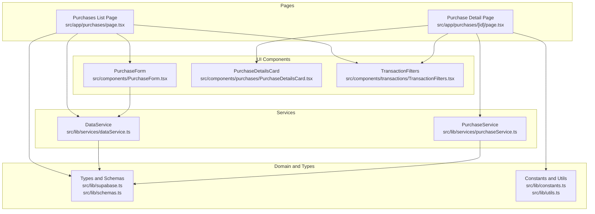
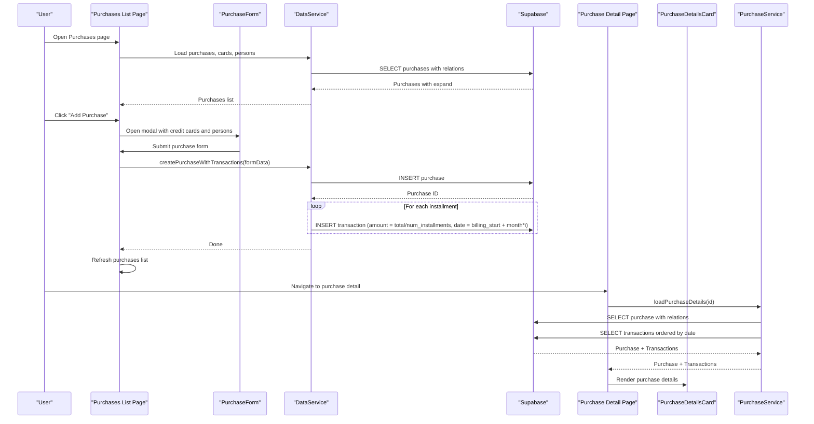
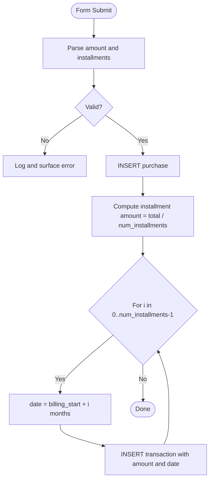
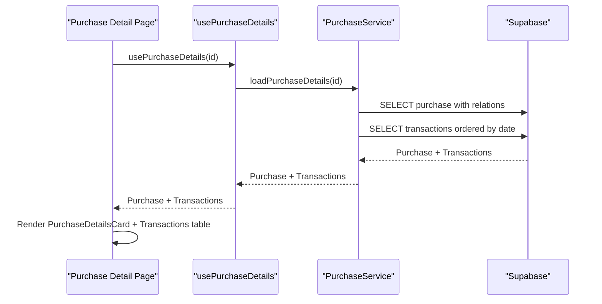
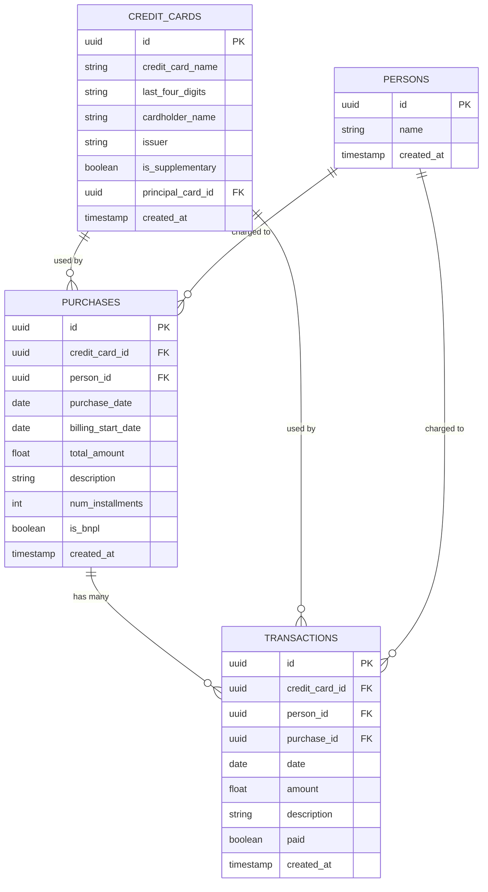
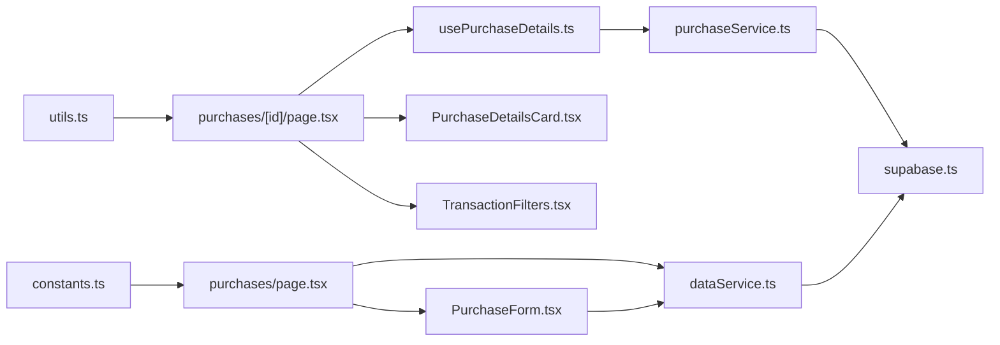

# Purchase Tracking

<cite>
**Referenced Files in This Document**
- [src/app/purchases/page.tsx](file://src/app/purchases/page.tsx)
- [src/app/purchases/[id]/page.tsx](file://src/app/purchases/[id]/page.tsx)
- [src/components/PurchaseForm.tsx](file://src/components/PurchaseForm.tsx)
- [src/components/purchases/PurchaseDetailsCard.tsx](file://src/components/purchases/PurchaseDetailsCard.tsx)
- [src/lib/services/dataService.ts](file://src/lib/services/dataService.ts)
- [src/lib/services/purchaseService.ts](file://src/lib/services/purchaseService.ts)
- [src/lib/hooks/usePurchaseDetails.ts](file://src/lib/hooks/usePurchaseDetails.ts)
- [src/lib/schemas.ts](file://src/lib/schemas.ts)
- [src/lib/supabase.ts](file://src/lib/supabase.ts)
- [src/lib/constants.ts](file://src/lib/constants.ts)
- [src/lib/utils.ts](file://src/lib/utils.ts)
- [src/components/transactions/TransactionFilters.tsx](file://src/components/transactions/TransactionFilters.tsx)
</cite>

## Table of Contents
1. [Introduction](#introduction)
2. [Project Structure](#project-structure)
3. [Core Components](#core-components)
4. [Architecture Overview](#architecture-overview)
5. [Detailed Component Analysis](#detailed-component-analysis)
6. [Dependency Analysis](#dependency-analysis)
7. [Performance Considerations](#performance-considerations)
8. [Troubleshooting Guide](#troubleshooting-guide)
9. [Conclusion](#conclusion)

## Introduction
This document explains the purchase tracking sub-feature with installment and Buy Now Pay Later (BNPL) support. It covers how purchase pages, the PurchaseForm, PurchaseDetailsCard, and purchaseService collaborate to create purchases, compute installments, and generate transactions. It also documents the domain model, database schema, configuration options, and common pitfalls with their solutions.

## Project Structure
The purchase tracking feature spans UI pages, forms, cards, services, and shared utilities. The main entry points are:
- Purchases list page: renders a table of purchases, filters, and an add-purchase modal.
- Purchase detail page: displays a purchase’s details and its related transactions with paid/unpaid toggles.
- PurchaseForm: captures purchase metadata and triggers creation with installments/BNPL.
- PurchaseDetailsCard: renders purchase details in a compact card layout.
- Services: dataService orchestrates purchase creation and transaction generation; purchaseService loads purchase details and updates transaction paid status.
- Schemas and types: define the domain model and validation rules.
- Utilities: formatting helpers and constants.

**Diagram sources**
- [src/app/purchases/page.tsx](file://src/app/purchases/page.tsx#L1-L260)
- [src/app/purchases/[id]/page.tsx](file://src/app/purchases/[id]/page.tsx#L1-L188)
- [src/components/PurchaseForm.tsx](file://src/components/PurchaseForm.tsx#L1-L269)
- [src/components/purchases/PurchaseDetailsCard.tsx](file://src/components/purchases/PurchaseDetailsCard.tsx#L1-L78)
- [src/components/transactions/TransactionFilters.tsx](file://src/components/transactions/TransactionFilters.tsx#L1-L196)
- [src/lib/services/dataService.ts](file://src/lib/services/dataService.ts#L1-L165)
- [src/lib/services/purchaseService.ts](file://src/lib/services/purchaseService.ts#L1-L88)
- [src/lib/supabase.ts](file://src/lib/supabase.ts#L1-L81)
- [src/lib/schemas.ts](file://src/lib/schemas.ts#L1-L62)
- [src/lib/constants.ts](file://src/lib/constants.ts#L1-L116)
- [src/lib/utils.ts](file://src/lib/utils.ts#L1-L47)

**Section sources**
- [src/app/purchases/page.tsx](file://src/app/purchases/page.tsx#L1-L260)
- [src/app/purchases/[id]/page.tsx](file://src/app/purchases/[id]/page.tsx#L1-L188)
- [src/components/PurchaseForm.tsx](file://src/components/PurchaseForm.tsx#L1-L269)
- [src/components/purchases/PurchaseDetailsCard.tsx](file://src/components/purchases/PurchaseDetailsCard.tsx#L1-L78)
- [src/lib/services/dataService.ts](file://src/lib/services/dataService.ts#L1-L165)
- [src/lib/services/purchaseService.ts](file://src/lib/services/purchaseService.ts#L1-L88)
- [src/lib/schemas.ts](file://src/lib/schemas.ts#L1-L62)
- [src/lib/supabase.ts](file://src/lib/supabase.ts#L1-L81)
- [src/lib/constants.ts](file://src/lib/constants.ts#L1-L116)
- [src/lib/utils.ts](file://src/lib/utils.ts#L1-L47)
- [src/components/transactions/TransactionFilters.tsx](file://src/components/transactions/TransactionFilters.tsx#L1-L196)

## Core Components
- Purchases list page: Loads purchases, persons, and credit cards; provides filtering; opens the add-purchase modal; submits new purchases via DataService.
- Purchase detail page: Uses a hook to load a purchase and its transactions; allows toggling paid status; displays transactions in a table.
- PurchaseForm: Captures purchase metadata, validates numeric inputs, and submits to the data layer.
- PurchaseDetailsCard: Renders purchase metadata in a structured card.
- dataService: Creates a purchase and generates installments/transactions; deletes a purchase and its transactions.
- purchaseService: Loads purchase details with related entities and updates transaction paid status.
- Schemas and types: Define the Purchase and Transaction interfaces and Zod validation rules.
- Utilities: Formatting and constants for currency display.

**Section sources**
- [src/app/purchases/page.tsx](file://src/app/purchases/page.tsx#L1-L260)
- [src/app/purchases/[id]/page.tsx](file://src/app/purchases/[id]/page.tsx#L1-L188)
- [src/components/PurchaseForm.tsx](file://src/components/PurchaseForm.tsx#L1-L269)
- [src/components/purchases/PurchaseDetailsCard.tsx](file://src/components/purchases/PurchaseDetailsCard.tsx#L1-L78)
- [src/lib/services/dataService.ts](file://src/lib/services/dataService.ts#L107-L163)
- [src/lib/services/purchaseService.ts](file://src/lib/services/purchaseService.ts#L1-L88)
- [src/lib/schemas.ts](file://src/lib/schemas.ts#L32-L55)
- [src/lib/supabase.ts](file://src/lib/supabase.ts#L41-L81)
- [src/lib/constants.ts](file://src/lib/constants.ts#L114-L116)
- [src/lib/utils.ts](file://src/lib/utils.ts#L9-L17)

## Architecture Overview
The purchase tracking feature follows a layered architecture:
- UI Layer: Pages and components render data and collect user input.
- Service Layer: DataService handles purchase creation and transaction generation; PurchaseService handles retrieval and paid-status updates.
- Domain Layer: Types and schemas define the domain model and validation rules.
- Data Access: Supabase client is used for database operations.

**Diagram sources**
- [src/app/purchases/page.tsx](file://src/app/purchases/page.tsx#L68-L86)
- [src/components/PurchaseForm.tsx](file://src/components/PurchaseForm.tsx#L104-L130)
- [src/lib/services/dataService.ts](file://src/lib/services/dataService.ts#L107-L163)
- [src/app/purchases/[id]/page.tsx](file://src/app/purchases/[id]/page.tsx#L27-L34)
- [src/lib/services/purchaseService.ts](file://src/lib/services/purchaseService.ts#L1-L69)
- [src/components/purchases/PurchaseDetailsCard.tsx](file://src/components/purchases/PurchaseDetailsCard.tsx#L1-L78)

## Detailed Component Analysis

### Purchase Creation Workflow (Installments and BNPL)
- PurchaseForm collects credit card, person, purchase date, billing start date, total amount, description, number of installments, and BNPL flag.
- On submit, numeric fields are normalized (amount and installments), then passed to the data layer.
- DataService creates the purchase and generates transactions:
  - Computes installment amount as total divided by number of installments.
  - Iterates installments, calculates transaction dates by adding months to the billing start date.
  - Inserts one transaction per installment with a descriptive label indicating the installment number.
- The BNPL flag does not alter the transaction generation; it is stored on the purchase record and displayed on the detail page.

**Diagram sources**
- [src/components/PurchaseForm.tsx](file://src/components/PurchaseForm.tsx#L104-L130)
- [src/lib/services/dataService.ts](file://src/lib/services/dataService.ts#L107-L163)

**Section sources**
- [src/components/PurchaseForm.tsx](file://src/components/PurchaseForm.tsx#L1-L269)
- [src/lib/services/dataService.ts](file://src/lib/services/dataService.ts#L107-L163)

### Purchase Details Display
- Purchase detail page uses a hook to load purchase and transactions.
- PurchaseDetailsCard renders purchase metadata (date, total, card, person, installments, BNPL).
- Transactions are displayed in a table with paid toggle; filtering supports description and paid status.

**Diagram sources**
- [src/app/purchases/[id]/page.tsx](file://src/app/purchases/[id]/page.tsx#L27-L34)
- [src/lib/hooks/usePurchaseDetails.ts](file://src/lib/hooks/usePurchaseDetails.ts#L1-L63)
- [src/lib/services/purchaseService.ts](file://src/lib/services/purchaseService.ts#L1-L69)
- [src/components/purchases/PurchaseDetailsCard.tsx](file://src/components/purchases/PurchaseDetailsCard.tsx#L1-L78)

**Section sources**
- [src/app/purchases/[id]/page.tsx](file://src/app/purchases/[id]/page.tsx#L1-L188)
- [src/lib/hooks/usePurchaseDetails.ts](file://src/lib/hooks/usePurchaseDetails.ts#L1-L63)
- [src/lib/services/purchaseService.ts](file://src/lib/services/purchaseService.ts#L1-L69)
- [src/components/purchases/PurchaseDetailsCard.tsx](file://src/components/purchases/PurchaseDetailsCard.tsx#L1-L78)

### Domain Model and Database Schema
The domain model centers around Purchase and Transaction, with relations to CreditCard and Person. The schema enforces referential integrity and includes computed display fields.

**Diagram sources**
- [src/lib/supabase.ts](file://src/lib/supabase.ts#L41-L81)

**Section sources**
- [src/lib/supabase.ts](file://src/lib/supabase.ts#L41-L81)

### Configuration Options
- Number of installments: Controls how many transactions are generated. Must be at least 1.
- Billing start date: Determines the first transaction date; subsequent installments are spaced monthly.
- BNPL flag: Stored on the purchase; displayed on the detail page. Does not change transaction generation logic.
- Currency formatting: Fixed to two decimal places for display.

**Section sources**
- [src/components/PurchaseForm.tsx](file://src/components/PurchaseForm.tsx#L191-L251)
- [src/lib/constants.ts](file://src/lib/constants.ts#L114-L116)
- [src/lib/schemas.ts](file://src/lib/schemas.ts#L32-L44)

### Validation and Data Relationships
- Purchase schema enforces required fields, positive total amount, integer installments ≥ 1, and boolean BNPL.
- Transaction schema enforces required fields and amounts.
- The data layer transforms raw rows into typed objects with an expand property for related entities.

**Section sources**
- [src/lib/schemas.ts](file://src/lib/schemas.ts#L32-L55)
- [src/lib/services/dataService.ts](file://src/lib/services/dataService.ts#L39-L65)
- [src/lib/services/purchaseService.ts](file://src/lib/services/purchaseService.ts#L9-L33)

## Dependency Analysis
- UI pages depend on services for data operations.
- Forms depend on typed props and submit handlers.
- Services depend on Supabase client and typed domain interfaces.
- Hooks encapsulate loading and state updates for detail views.

**Diagram sources**
- [src/components/PurchaseForm.tsx](file://src/components/PurchaseForm.tsx#L1-L269)
- [src/app/purchases/page.tsx](file://src/app/purchases/page.tsx#L1-L260)
- [src/app/purchases/[id]/page.tsx](file://src/app/purchases/[id]/page.tsx#L1-L188)
- [src/lib/hooks/usePurchaseDetails.ts](file://src/lib/hooks/usePurchaseDetails.ts#L1-L63)
- [src/lib/services/purchaseService.ts](file://src/lib/services/purchaseService.ts#L1-L88)
- [src/lib/services/dataService.ts](file://src/lib/services/dataService.ts#L1-L165)
- [src/lib/supabase.ts](file://src/lib/supabase.ts#L1-L81)
- [src/lib/utils.ts](file://src/lib/utils.ts#L1-L47)
- [src/lib/constants.ts](file://src/lib/constants.ts#L1-L116)
- [src/components/purchases/PurchaseDetailsCard.tsx](file://src/components/purchases/PurchaseDetailsCard.tsx#L1-L78)
- [src/components/transactions/TransactionFilters.tsx](file://src/components/transactions/TransactionFilters.tsx#L1-L196)

**Section sources**
- [src/app/purchases/page.tsx](file://src/app/purchases/page.tsx#L1-L260)
- [src/app/purchases/[id]/page.tsx](file://src/app/purchases/[id]/page.tsx#L1-L188)
- [src/lib/services/dataService.ts](file://src/lib/services/dataService.ts#L1-L165)
- [src/lib/services/purchaseService.ts](file://src/lib/services/purchaseService.ts#L1-L88)
- [src/lib/hooks/usePurchaseDetails.ts](file://src/lib/hooks/usePurchaseDetails.ts#L1-L63)
- [src/lib/supabase.ts](file://src/lib/supabase.ts#L1-L81)
- [src/lib/utils.ts](file://src/lib/utils.ts#L1-L47)
- [src/lib/constants.ts](file://src/lib/constants.ts#L1-L116)
- [src/components/PurchaseForm.tsx](file://src/components/PurchaseForm.tsx#L1-L269)
- [src/components/purchases/PurchaseDetailsCard.tsx](file://src/components/purchases/PurchaseDetailsCard.tsx#L1-L78)
- [src/components/transactions/TransactionFilters.tsx](file://src/components/transactions/TransactionFilters.tsx#L1-L196)

## Performance Considerations
- Batch operations: Creating N transactions in a loop is straightforward but can be optimized by batching inserts if needed.
- Filtering: Client-side filtering is efficient for small datasets; for larger datasets, consider server-side filtering or pagination.
- Rendering: Memoization is used in the detail page to prevent unnecessary re-renders during filtering.

**Section sources**
- [src/lib/services/dataService.ts](file://src/lib/services/dataService.ts#L130-L158)
- [src/app/purchases/[id]/page.tsx](file://src/app/purchases/[id]/page.tsx#L35-L51)

## Troubleshooting Guide
Common issues and resolutions:
- Incorrect transaction calculations
  - Symptom: Sum of installments does not equal total amount.
  - Cause: Division rounding errors when splitting total into num_installments.
  - Resolution: Use a rounding strategy (e.g., distribute remainder across first few installments) or adjust the last transaction to balance the total.
  - Reference: [Installment computation](file://src/lib/services/dataService.ts#L130-L158)
- Non-positive amount or invalid installments
  - Symptom: Form submission fails or defaults to 1 installment.
  - Cause: Numeric parsing or validation constraints.
  - Resolution: Ensure amount is positive and installments ≥ 1; the form normalizes these values.
  - References: [Form normalization](file://src/components/PurchaseForm.tsx#L111-L122), [Schema validation](file://src/lib/schemas.ts#L32-L44)
- Missing related data in lists
  - Symptom: Unknown card or person in lists.
  - Cause: Missing expand relations or deleted related records.
  - Resolution: Ensure joins and expand logic are present; verify referential integrity.
  - References: [List expansion](file://src/lib/services/dataService.ts#L39-L65), [Detail expansion](file://src/lib/services/purchaseService.ts#L9-L33)
- Paid status toggle not updating
  - Symptom: Checkbox state does not reflect changes.
  - Cause: Network error or UI state not refreshed.
  - Resolution: Confirm update succeeded and refresh local state; handle errors gracefully.
  - References: [Hook update](file://src/lib/hooks/usePurchaseDetails.ts#L37-L53), [Service update](file://src/lib/services/purchaseService.ts#L71-L86)

**Section sources**
- [src/lib/services/dataService.ts](file://src/lib/services/dataService.ts#L130-L158)
- [src/components/PurchaseForm.tsx](file://src/components/PurchaseForm.tsx#L111-L122)
- [src/lib/schemas.ts](file://src/lib/schemas.ts#L32-L44)
- [src/lib/services/purchaseService.ts](file://src/lib/services/purchaseService.ts#L71-L86)
- [src/lib/hooks/usePurchaseDetails.ts](file://src/lib/hooks/usePurchaseDetails.ts#L37-L53)
- [src/lib/services/dataService.ts](file://src/lib/services/dataService.ts#L39-L65)
- [src/lib/services/purchaseService.ts](file://src/lib/services/purchaseService.ts#L9-L33)

## Conclusion
The purchase tracking feature integrates UI pages, forms, and services to support purchases with installments and BNPL. The domain model and schemas ensure data integrity, while the services encapsulate database operations. By following the normalization and validation patterns shown in the code, teams can reliably implement purchase creation, details display, and transaction generation with predictable outcomes.