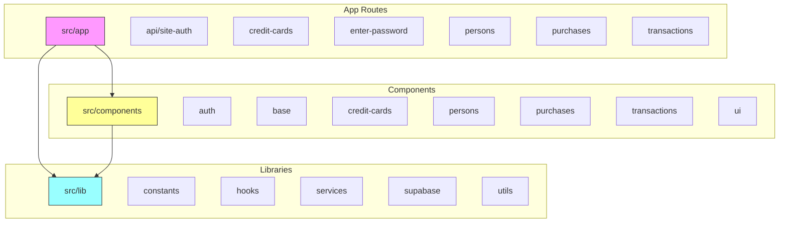
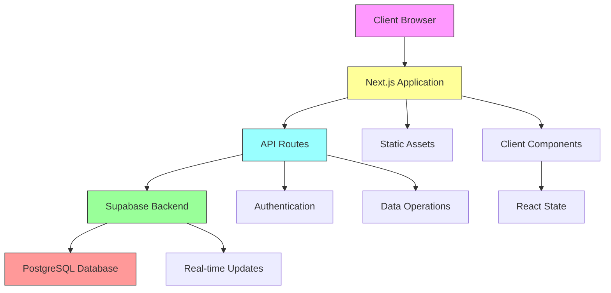
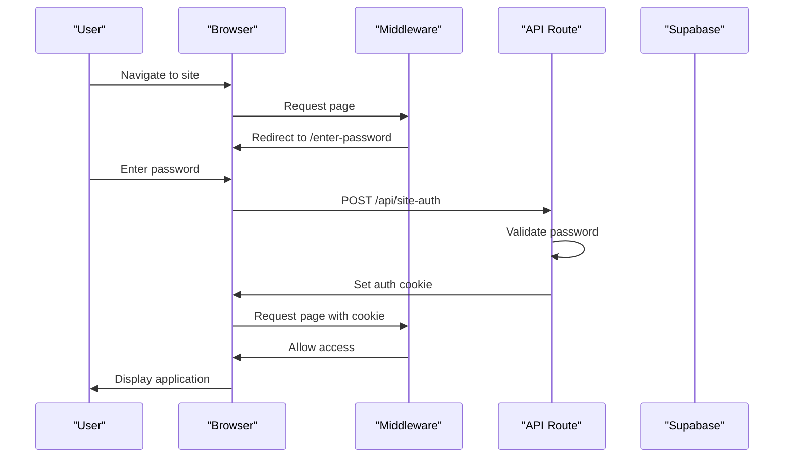
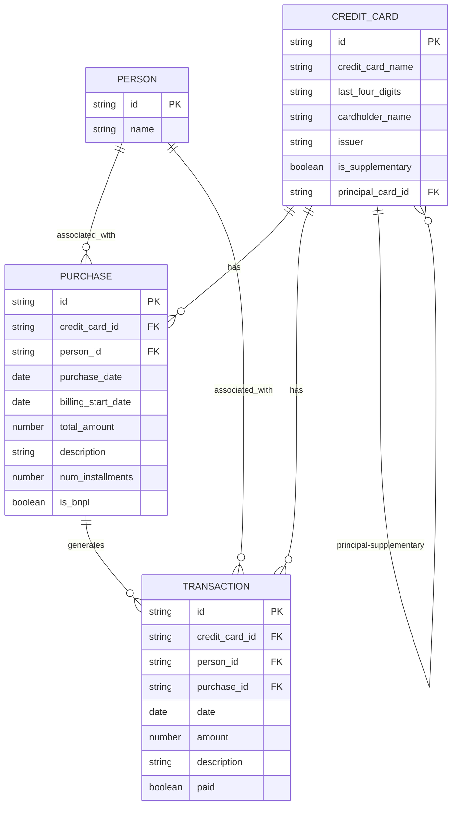
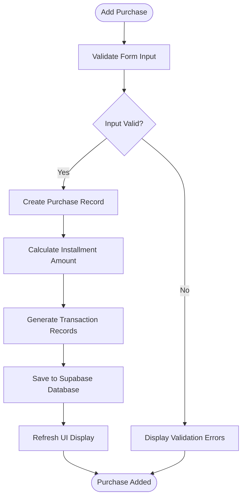
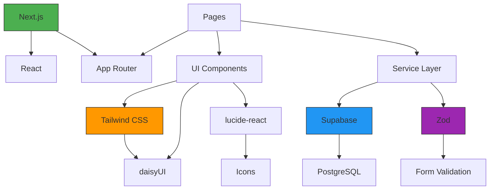

# System Overview

<cite>
**Referenced Files in This Document**   
- [README.md](file://README.md)
- [package.json](file://package.json)
- [layout.tsx](file://src/app/layout.tsx)
- [constants.ts](file://src/lib/constants.ts)
- [schemas.ts](file://src/lib/schemas.ts)
- [authService.ts](file://src/lib/services/authService.ts)
- [dataService.ts](file://src/lib/services/dataService.ts)
- [supabase.ts](file://src/lib/supabase.ts)
- [enter-password/page.tsx](file://src/app/enter-password/page.tsx)
- [api/site-auth/route.ts](file://src/app/api/site-auth/route.ts)
- [middleware.ts](file://src/middleware.ts)
- [purchases/page.tsx](file://src/app/purchases/page.tsx)
- [PurchaseForm.tsx](file://src/components/PurchaseForm.tsx)
</cite>

## Table of Contents
1. [Introduction](#introduction)
2. [Project Structure](#project-structure)
3. [Core Components](#core-components)
4. [Architecture Overview](#architecture-overview)
5. [Detailed Component Analysis](#detailed-component-analysis)
6. [Dependency Analysis](#dependency-analysis)
7. [Performance Considerations](#performance-considerations)
8. [Troubleshooting Guide](#troubleshooting-guide)
9. [Conclusion](#conclusion)

## Introduction
The credit-card-tracker application is a financial tracking tool designed to help users manage credit card spending, installment payments, and Buy Now Pay Later (BNPL) purchases. Built as a full-stack Next.js application using the App Router architecture, it provides a comprehensive solution for tracking financial transactions across multiple credit cards and persons. The system uses Supabase as its backend service for data persistence and authentication, while leveraging daisyUI and Tailwind CSS for a responsive, component-based user interface. The application supports key financial tracking features including regular purchases, installment plans, BNPL transactions, and payment tracking, with automatic transaction generation for installment-based purchases.

**Section sources**
- [README.md](file://README.md)
- [package.json](file://package.json)
- [layout.tsx](file://src/app/layout.tsx)

## Project Structure
The credit-card-tracker application follows a standard Next.js App Router structure with a clear separation of concerns. The `src/app` directory contains all route handlers and page components, organized by feature (credit-cards, persons, purchases, transactions). The `src/components` directory houses reusable UI components organized into subdirectories by feature or type, including base components, forms, and data display elements. The `src/lib` directory contains business logic, services, constants, and utility functions that support the application's core functionality. This structure promotes maintainability and scalability, with clear boundaries between presentation, business logic, and data access layers.

**Diagram sources**
- [layout.tsx](file://src/app/layout.tsx)
- [package.json](file://package.json)

**Section sources**
- [layout.tsx](file://src/app/layout.tsx)
- [package.json](file://package.json)

## Core Components
The application's core components include financial entity management for credit cards, persons, purchases, and transactions. The system implements a sophisticated data model where purchases can be regular transactions, installment plans, or BNPL arrangements, with corresponding transactions automatically generated based on purchase type. The UI is built with reusable component patterns using daisyUI and Tailwind CSS, providing a consistent and accessible interface. Key functionality includes password-based authentication, data validation through Zod schemas, and client-server communication via Supabase. The component architecture follows React best practices with proper state management and separation of concerns between presentation and business logic.

**Section sources**
- [constants.ts](file://src/lib/constants.ts)
- [schemas.ts](file://src/lib/schemas.ts)
- [supabase.ts](file://src/lib/supabase.ts)
- [PurchaseForm.tsx](file://src/components/PurchaseForm.tsx)

## Architecture Overview
The credit-card-tracker application follows a full-stack Next.js architecture with client-server separation and API routes for backend operations. The frontend uses React components with Server Components and Client Components appropriately distributed according to the App Router pattern. Supabase serves as the backend-as-a-service solution, handling data persistence, authentication, and real-time capabilities. The application implements a service layer pattern with dedicated service classes for authentication and data operations, promoting separation of concerns and testability. The UI layer uses a component-based architecture with daisyUI for pre-styled components and Tailwind CSS for custom styling, ensuring responsive design across device sizes.

**Diagram sources**
- [supabase.ts](file://src/lib/supabase.ts)
- [api/site-auth/route.ts](file://src/app/api/site-auth/route.ts)
- [dataService.ts](file://src/lib/services/dataService.ts)

## Detailed Component Analysis

### Authentication System Analysis
The application implements a password-based authentication system that protects access to financial data. Users must enter a password to access the application, with authentication handled through API routes and middleware. The system uses HTTP-only cookies for session management, enhancing security by preventing client-side script access to authentication tokens. The authentication flow involves client-side submission of credentials, server-side validation against an environment variable, and cookie-based session establishment upon successful authentication.

**Diagram sources**
- [authService.ts](file://src/lib/services/authService.ts)
- [api/site-auth/route.ts](file://src/app/api/site-auth/route.ts)
- [middleware.ts](file://src/middleware.ts)

**Section sources**
- [authService.ts](file://src/lib/services/authService.ts)
- [api/site-auth/route.ts](file://src/app/api/site-auth/route.ts)
- [middleware.ts](file://src/middleware.ts)
- [enter-password/page.tsx](file://src/app/enter-password/page.tsx)

### Data Management Analysis
The application's data management system centers around financial entities including credit cards, persons, purchases, and transactions. The data model establishes relationships between these entities, with purchases linked to credit cards and persons, and transactions associated with purchases for installment tracking. The service layer provides methods for loading, creating, and deleting financial records, with proper error handling and data transformation. When a purchase is created, the system automatically generates corresponding transactions based on the number of installments, simplifying financial tracking for users.

**Diagram sources**
- [supabase.ts](file://src/lib/supabase.ts)
- [dataService.ts](file://src/lib/services/dataService.ts)
- [schemas.ts](file://src/lib/schemas.ts)

**Section sources**
- [supabase.ts](file://src/lib/supabase.ts)
- [dataService.ts](file://src/lib/services/dataService.ts)
- [schemas.ts](file://src/lib/schemas.ts)

### Purchase Workflow Analysis
The purchase workflow enables users to record financial transactions with support for installment plans and BNPL arrangements. When adding a purchase, users specify the credit card, person, date, amount, description, number of installments, and whether it's a BNPL transaction. The system then creates a purchase record and automatically generates the corresponding number of transactions, each representing an installment payment. For BNPL purchases, the same installment logic applies but with a flag indicating the BNPL nature of the transaction. This automated approach reduces manual data entry and ensures consistent tracking of installment payments.

**Diagram sources**
- [purchases/page.tsx](file://src/app/purchases/page.tsx)
- [PurchaseForm.tsx](file://src/components/PurchaseForm.tsx)
- [dataService.ts](file://src/lib/services/dataService.ts)

**Section sources**
- [purchases/page.tsx](file://src/app/purchases/page.tsx)
- [PurchaseForm.tsx](file://src/components/PurchaseForm.tsx)
- [dataService.ts](file://src/lib/services/dataService.ts)

## Dependency Analysis
The application's dependency structure reveals a well-organized full-stack architecture with clear separation between frontend and backend concerns. The primary dependencies include Next.js for the framework, Supabase for backend services, daisyUI and Tailwind CSS for styling, and Zod for data validation. The component hierarchy shows a parent-child relationship between layout components and page-specific components, with shared UI elements imported from the components directory. Service dependencies flow from UI components to the service layer, which in turn depends on Supabase for data operations. This dependency structure promotes maintainability and allows for independent development of UI and business logic components.

**Diagram sources**
- [package.json](file://package.json)
- [supabase.ts](file://src/lib/supabase.ts)
- [layout.tsx](file://src/app/layout.tsx)

**Section sources**
- [package.json](file://package.json)
- [supabase.ts](file://src/lib/supabase.ts)

## Performance Considerations
The application implements several performance optimizations to ensure responsive user experience. Data loading operations use Promise.all to parallelize retrieval of credit cards, persons, and purchases, minimizing page load times. The component structure leverages Next.js Server Components where appropriate to reduce client-side JavaScript bundle size. Client-side state management is implemented efficiently using React useState and useEffect hooks, with proper dependency arrays to prevent unnecessary re-renders. The service layer batches related database operations, such as deleting a purchase and its associated transactions in a coordinated manner. These optimizations contribute to a smooth user experience even as the volume of financial data grows over time.

## Troubleshooting Guide
Common issues in the credit-card-tracker application typically relate to authentication, data loading, or form submission. Authentication problems may occur if the SITE_PASSWORD environment variable is not properly configured, preventing successful login. Data loading issues could stem from Supabase configuration errors or network connectivity problems. Form validation errors are handled client-side with descriptive messages, but developers should ensure that Zod schemas remain synchronized with database schema changes. When troubleshooting, check browser developer tools for network errors, verify environment variables are correctly set, and confirm Supabase project configuration matches the application's expectations.

**Section sources**
- [authService.ts](file://src/lib/services/authService.ts)
- [dataService.ts](file://src/lib/services/dataService.ts)
- [PurchaseForm.tsx](file://src/components/PurchaseForm.tsx)

## Conclusion
The credit-card-tracker application provides a comprehensive solution for managing credit card spending, installments, and BNPL purchases through a well-structured Next.js full-stack architecture. By leveraging Supabase for backend services and implementing a component-based UI with daisyUI and Tailwind CSS, the application delivers a responsive and accessible interface for financial tracking. The system's automated transaction generation for installment plans reduces manual data entry while ensuring accurate financial records. With its clear separation of concerns, robust authentication system, and scalable data model, the application serves as an effective tool for individuals and households seeking to maintain control over their credit card expenditures and payment obligations.