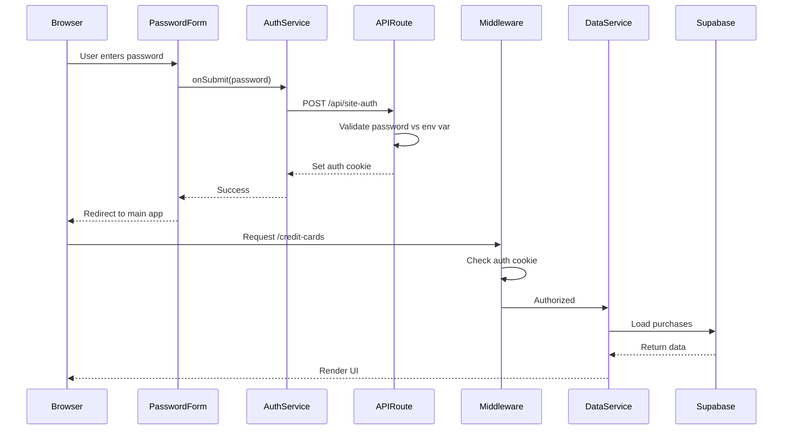

# Technology Stack

<cite>
**Referenced Files in This Document**   
- [next.config.ts](file://next.config.ts)
- [tsconfig.json](file://tsconfig.json)
- [postcss.config.mjs](file://postcss.config.mjs)
- [package.json](file://package.json)
- [supabase.ts](file://src/lib/supabase.ts)
- [schemas.ts](file://src/lib/schemas.ts)
- [Button.tsx](file://src/components/base/Button.tsx)
- [PasswordForm.tsx](file://src/components/auth/PasswordForm.tsx)
- [authService.ts](file://src/lib/services/authService.ts)
- [dataService.ts](file://src/lib/services/dataService.ts)
- [layout.tsx](file://src/app/layout.tsx)
- [route.ts](file://src/app/api/site-auth/route.ts)
- [middleware.ts](file://src/middleware.ts)
- [globals.css](file://src/app/globals.css)
- [components.json](file://components.json)
</cite>

## Table of Contents
1. [Core Framework and Language](#core-framework-and-language)
2. [Database and Authentication](#database-and-authentication)
3. [Styling and UI Components](#styling-and-ui-components)
4. [Form and Data Validation](#form-and-data-validation)
5. [Configuration Files](#configuration-files)
6. [Integration Examples](#integration-examples)
7. [Security Considerations for Financial Data](#security-considerations-for-financial-data)
8. [Common Setup Issues and Solutions](#common-setup-issues-and-solutions)

## Core Framework and Language

The credit-card-tracker application is built on a modern web development stack centered around Next.js 15 with the App Router, React 19, and TypeScript. This combination provides a robust foundation for building a secure and scalable financial tracking application. Next.js 15 serves as the framework backbone, offering server-side rendering, API routes, and file-based routing through its App Router system. The App Router enables clean URL structures and efficient data fetching patterns, as seen in the application's API route at `src/app/api/site-auth/route.ts`. React 19 powers the component architecture, allowing for reusable UI components like `PasswordForm` and `Button` that maintain state and respond to user interactions. TypeScript adds static type checking across the entire codebase, enhancing code quality and developer experience. The `tsconfig.json` configuration enforces strict type checking and enables modern JavaScript features while supporting Next.js-specific plugins. This stack ensures type safety from the database layer through to the UI components, reducing runtime errors and improving maintainability.

**Section sources**
- [next.config.ts](file://next.config.ts)
- [tsconfig.json](file://tsconfig.json)
- [package.json](file://package.json)
- [layout.tsx](file://src/app/layout.tsx)

## Database and Authentication

The application leverages Supabase as its backend-as-a-service solution, providing both database storage and authentication capabilities. Supabase offers a PostgreSQL database with real-time capabilities, which is ideal for a financial tracking application that requires reliable data persistence and synchronization. The Supabase client is initialized in `src/lib/supabase.ts` with environment variables for the public URL and anonymous key, establishing a secure connection to the database. The application defines TypeScript interfaces for key entities such as Person, CreditCard, Purchase, and Transaction, ensuring type-safe interactions with the database. These interfaces include optional `expand` properties to handle related data from queries, enabling efficient retrieval of nested relationships. The `dataService.ts` file demonstrates practical integration of Supabase, with methods like `loadPurchases()` that use Supabase's select functionality with relational queries to fetch purchases along with their associated credit cards and persons. For authentication, the application implements a site-wide password protection system rather than traditional user accounts, using Next.js API routes and middleware to control access. The `site-auth` API route validates passwords against an environment variable and sets a secure HTTP-only cookie upon successful authentication.

**Section sources**
- [supabase.ts](file://src/lib/supabase.ts)
- [dataService.ts](file://src/lib/services/dataService.ts)
- [route.ts](file://src/app/api/site-auth/route.ts)
- [middleware.ts](file://src/middleware.ts)

## Styling and UI Components

The application employs Tailwind CSS with daisyUI for styling, creating a consistent and responsive user interface. Tailwind CSS provides a utility-first approach to styling, allowing developers to apply design tokens directly in the JSX of components. The `postcss.config.mjs` file configures PostCSS to process Tailwind directives, while `globals.css` imports Tailwind, daisyUI, and additional plugins like `tailwindcss-animate` for smooth transitions. DaisyUI extends Tailwind with pre-built component classes and themes, evident in the Button component's support for various colors (primary, secondary, accent), variants (outline, ghost), sizes, and modifiers. The component library in the `src/components` directory demonstrates this integration, with base components like Button, Input, and Card that encapsulate Tailwind utility classes. The `components.json` file reveals the project's use of shadcn-ui patterns with the "new-york" style, establishing design system conventions and path aliases. The layout component uses Tailwind's flexbox utilities to create a responsive sidebar navigation that hides on mobile devices, while the global CSS includes safe area insets for mobile devices with notches. This styling approach ensures a cohesive design language across the application while maintaining the flexibility to customize components as needed.

**Section sources**
- [postcss.config.mjs](file://postcss.config.mjs)
- [globals.css](file://src/app/globals.css)
- [Button.tsx](file://src/components/base/Button.tsx)
- [PasswordForm.tsx](file://src/components/auth/PasswordForm.tsx)
- [layout.tsx](file://src/app/layout.tsx)
- [components.json](file://components.json)

## Form and Data Validation

Zod is used throughout the application for schema validation, ensuring data integrity for financial records. The validation schemas are defined in `src/lib/schemas.ts`, where Zod objects describe the expected structure and constraints for forms related to credit cards, persons, purchases, and transactions. Each schema includes detailed validation rules with custom error messages, such as requiring a credit card name to be non-empty or ensuring the last four digits are exactly four numeric characters. The credit card schema demonstrates advanced validation with conditional logic through `refinedCreditCardSchema`, which enforces that supplementary cards must have a principal card ID. These schemas are used to generate TypeScript types via `z.infer`, providing end-to-end type safety from form validation to database operations. The application likely uses these schemas in conjunction with React hook forms (suggested by the presence of `useZodForm` in the hooks directory) to provide real-time validation feedback to users. This approach prevents invalid data from being submitted to the database, which is critical for a financial application where data accuracy is paramount. The validation occurs both on the client side for immediate user feedback and potentially on the server side for additional security.

**Section sources**
- [schemas.ts](file://src/lib/schemas.ts)

## Configuration Files

The application's behavior is controlled by several key configuration files that define build settings, type checking rules, and styling options. The `next.config.ts` file provides the foundation for Next.js configuration, though it currently contains minimal settings, indicating the use of default conventions. The `tsconfig.json` file is more comprehensive, specifying compiler options that target ES2017 and enable strict type checking, module resolution, and JSX preservation. It also defines path aliases with `"@/*": ["./src/*"]`, allowing for cleaner import statements throughout the codebase. The `postcss.config.mjs` file configures PostCSS to use Tailwind CSS, ensuring that Tailwind's utility classes are processed during the build. The `components.json` file reveals additional configuration for the component library, specifying the use of the "new-york" style from shadcn-ui, enabling React Server Components (RSC), and defining path aliases for common directories. These configuration files work together to create a consistent development environment that enforces best practices and enables the various technologies in the stack to work seamlessly together.

**Section sources**
- [next.config.ts](file://next.config.ts)
- [tsconfig.json](file://tsconfig.json)
- [postcss.config.mjs](file://postcss.config.mjs)
- [components.json](file://components.json)

## Integration Examples

The technologies in this stack integrate seamlessly to create a cohesive application experience. For example, the password authentication flow demonstrates the integration of multiple technologies: the `PasswordForm` component uses React 19's client components and Tailwind CSS classes for styling, while the form submission calls the `authService` which makes a fetch request to the Next.js API route. This API route, in turn, validates the password against an environment variable and sets a secure cookie, with the entire flow protected by middleware that checks for authentication on subsequent requests. Another integration example is the data loading process, where the `dataService` uses the Supabase client to query the database with relational data, transforms the results to match TypeScript interfaces, and returns type-safe data to React components. The component library demonstrates integration at the UI level, with base components like Button accepting props that map directly to daisyUI class names, allowing for consistent styling across the application. These integrations show how the stack components work together to create a secure, type-safe, and visually consistent financial tracking application.

**Diagram sources**
- [PasswordForm.tsx](file://src/components/auth/PasswordForm.tsx)
- [authService.ts](file://src/lib/services/authService.ts)
- [route.ts](file://src/app/api/site-auth/route.ts)
- [middleware.ts](file://src/middleware.ts)
- [dataService.ts](file://src/lib/services/dataService.ts)

**Section sources**
- [PasswordForm.tsx](file://src/components/auth/PasswordForm.tsx)
- [authService.ts](file://src/lib/services/authService.ts)
- [route.ts](file://src/app/api/site-auth/route.ts)
- [middleware.ts](file://src/middleware.ts)
- [dataService.ts](file://src/lib/services/dataService.ts)

## Security Considerations for Financial Data

The technology stack provides multiple layers of security for handling sensitive financial data. The application implements authentication through a site-wide password protected by environment variables, with access controlled via Next.js middleware that intercepts requests and verifies authentication cookies. The use of HTTP-only, secure cookies prevents client-side JavaScript from accessing authentication tokens, mitigating cross-site scripting (XSS) risks. Supabase provides database-level security with row-level security policies (implied by the use of authenticated sessions) and encrypted connections. TypeScript's type system helps prevent data injection vulnerabilities by ensuring that only properly typed data can flow through the application. Zod validation schemas provide an additional layer of input sanitization, preventing malformed or malicious data from being processed. The application's architecture separates concerns between client and server components, with API routes handling sensitive operations on the server side. The use of environment variables for configuration secrets, combined with the fact that these are only accessed server-side in API routes and middleware, prevents exposure of sensitive credentials to the client. These security measures collectively create a robust defense for the financial data managed by the application.

**Section sources**
- [route.ts](file://src/app/api/site-auth/route.ts)
- [middleware.ts](file://src/middleware.ts)
- [supabase.ts](file://src/lib/supabase.ts)
- [schemas.ts](file://src/lib/schemas.ts)

## Common Setup Issues and Solutions

When setting up this application, several common issues may arise related to environment configuration and dependency compatibility. One frequent issue is improper configuration of environment variables, particularly `NEXT_PUBLIC_SUPABASE_URL`, `NEXT_PUBLIC_SUPABASE_ANON_KEY`, and `SITE_PASSWORD`. These must be correctly set in a `.env` file or environment for the application to connect to Supabase and enable site authentication. Another common issue is version compatibility between dependencies, as the package.json shows specific versions of Next.js (15.2.2), React (19.0.0), and Tailwind CSS that must work together. Developers may encounter build errors if these versions are mismatched. The Tailwind CSS configuration can also present challenges, particularly with the integration of daisyUI and the proper import of design system CSS files. Issues with the component library setup may occur if the `components.json` configuration doesn't match the project structure. Additionally, the use of Next.js App Router with client components requires careful attention to the "use client" directive in components that use React hooks or client-side features. Finally, developers may encounter issues with the Supabase client initialization if the environment variables are not properly loaded during both development and production builds.

**Section sources**
- [package.json](file://package.json)
- [next.config.ts](file://next.config.ts)
- [supabase.ts](file://src/lib/supabase.ts)
- [middleware.ts](file://src/middleware.ts)
- [components.json](file://components.json)