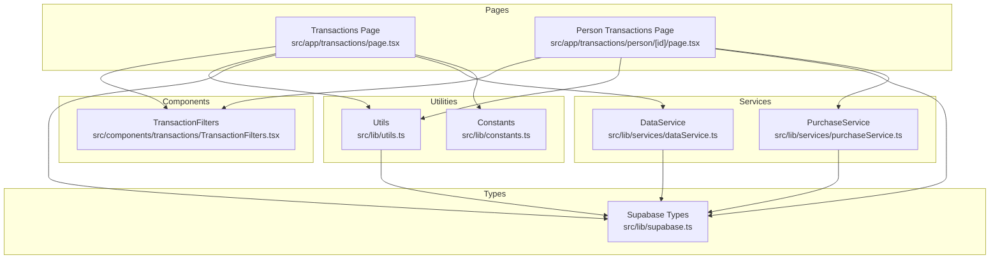
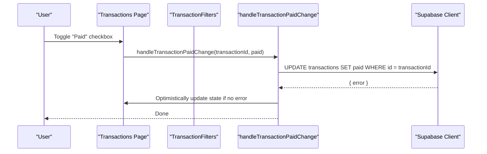
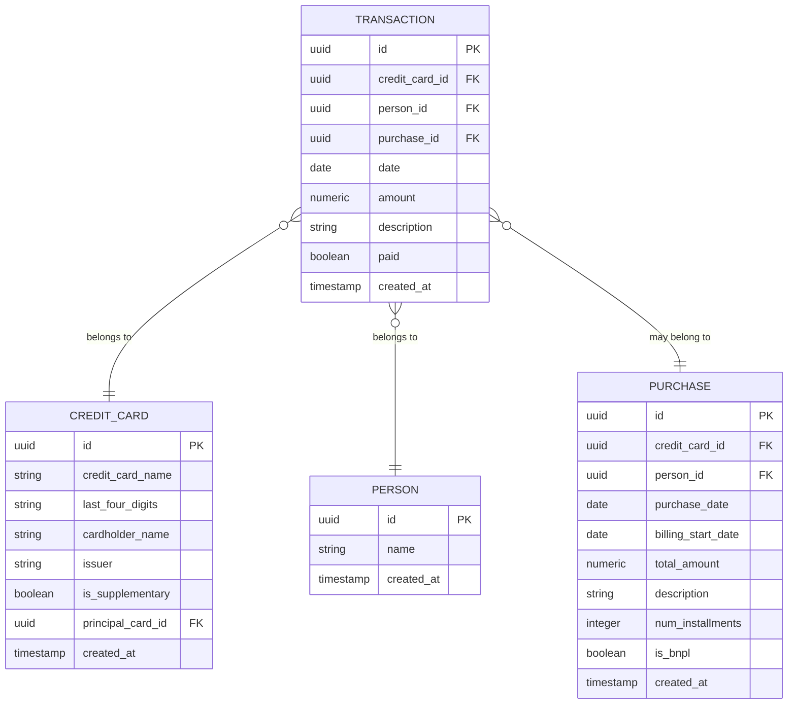
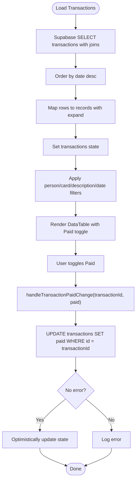
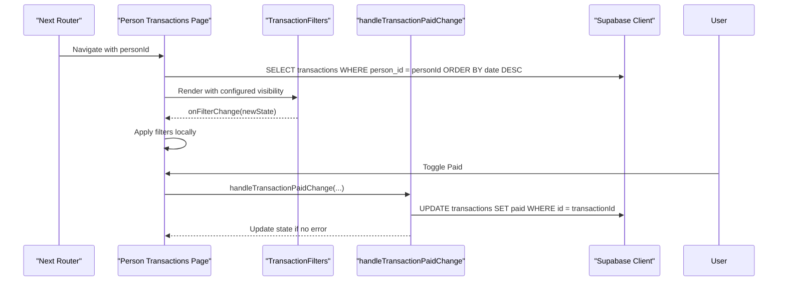
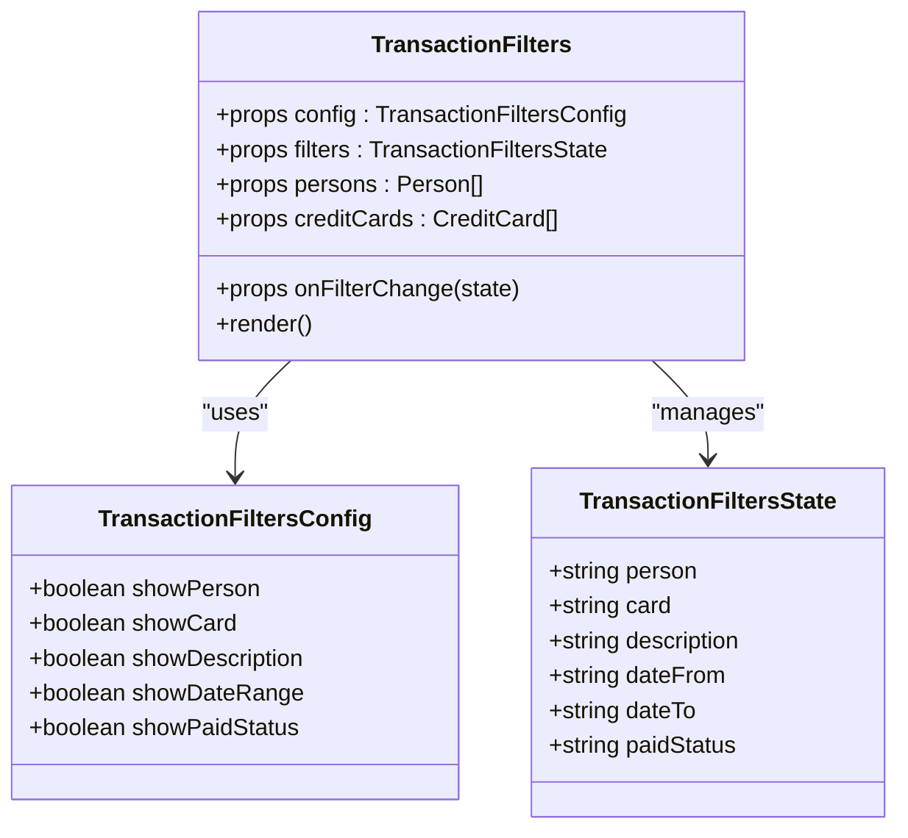
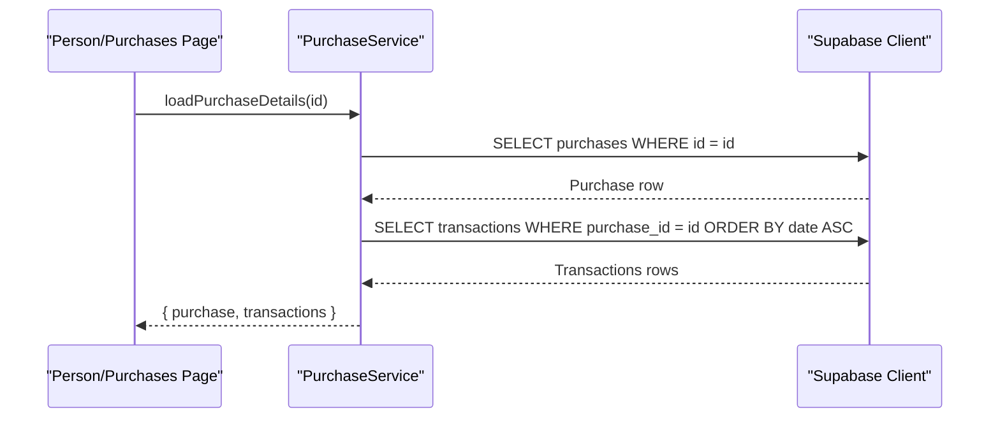
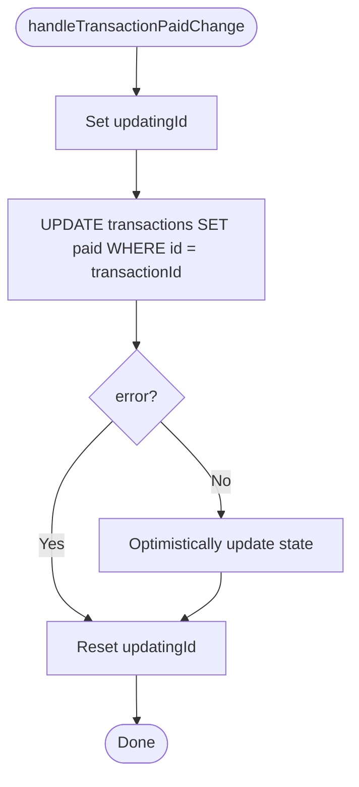
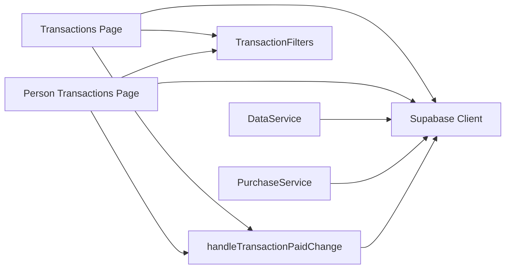

# Transaction Management

<cite>
**Referenced Files in This Document**
- [Transactions Page](file://src/app/transactions/page.tsx)
- [Person Transactions Page](file://src/app/transactions/person/[id]/page.tsx)
- [Transaction Filters Component](file://src/components/transactions/TransactionFilters.tsx)
- [Data Service](file://src/lib/services/dataService.ts)
- [Purchase Service](file://src/lib/services/purchaseService.ts)
- [Utility Functions](file://src/lib/utils.ts)
- [Supabase Types](file://src/lib/supabase.ts)
- [Constants](file://src/lib/constants.ts)
- [Purchase Details Hook](file://src/lib/hooks/usePurchaseDetails.ts)
</cite>

## Table of Contents
1. [Introduction](#introduction)
2. [Project Structure](#project-structure)
3. [Core Components](#core-components)
4. [Architecture Overview](#architecture-overview)
5. [Detailed Component Analysis](#detailed-component-analysis)
6. [Dependency Analysis](#dependency-analysis)
7. [Performance Considerations](#performance-considerations)
8. [Troubleshooting Guide](#troubleshooting-guide)
9. [Conclusion](#conclusion)

## Introduction
This document explains the transaction management sub-feature, focusing on payment status tracking, filtering, and data loading across transaction pages. It covers the invocation relationships between transaction pages, the TransactionFilters component, data services, and utility functions. It also documents the Transaction domain model and database schema, configuration options for transaction queries, and practical examples from the codebase. Finally, it addresses common issues such as race conditions during status updates and their solutions.

## Project Structure
Transaction management spans several layers:
- Pages: Top-level and person-scoped transaction lists
- Filters: Reusable filter UI with configurable visibility
- Services: Data service for bulk operations and purchase service for transaction queries
- Utilities: Shared helpers for formatting and paid-status updates
- Types: Strongly typed Transaction interface and related models
- Constants: Formatting and configuration values

**Diagram sources**
- [Transactions Page](file://src/app/transactions/page.tsx#L1-L338)
- [Person Transactions Page](file://src/app/transactions/person/[id]/page.tsx#L1-L263)
- [Transaction Filters Component](file://src/components/transactions/TransactionFilters.tsx#L1-L196)
- [Data Service](file://src/lib/services/dataService.ts#L1-L165)
- [Purchase Service](file://src/lib/services/purchaseService.ts#L1-L88)
- [Utility Functions](file://src/lib/utils.ts#L1-L46)
- [Supabase Types](file://src/lib/supabase.ts#L1-L81)
- [Constants](file://src/lib/constants.ts#L1-L116)

**Section sources**
- [Transactions Page](file://src/app/transactions/page.tsx#L1-L338)
- [Person Transactions Page](file://src/app/transactions/person/[id]/page.tsx#L1-L263)
- [Transaction Filters Component](file://src/components/transactions/TransactionFilters.tsx#L1-L196)
- [Data Service](file://src/lib/services/dataService.ts#L1-L165)
- [Purchase Service](file://src/lib/services/purchaseService.ts#L1-L88)
- [Utility Functions](file://src/lib/utils.ts#L1-L46)
- [Supabase Types](file://src/lib/supabase.ts#L1-L81)
- [Constants](file://src/lib/constants.ts#L1-L116)

## Core Components
- Transaction domain model: The Transaction interface defines the shape of transaction records, including identifiers, amounts, dates, descriptions, and payment status. Related entities (credit cards, persons, purchases) are embedded via expandable properties.
- Transaction pages: Two pages present transaction lists with filtering and paid-status toggles:
  - Global transactions page loads all transactions and supports person, card, description, and date-range filters.
  - Person-specific transactions page filters by person and supports card, description, date range, and paid status filters.
- TransactionFilters component: A reusable filter UI with configurable visibility for person, card, description, date range, and paid status.
- Services:
  - DataService: Bulk operations including deleting a purchase and its transactions, and creating purchases with associated transactions.
  - PurchaseService: Loads purchase details and related transactions, and updates transaction paid status.
- Utility functions: Centralized helpers for formatting dates and updating transaction paid status with optimistic UI updates and safe error handling.
- Constants: Currency formatting precision and navigation-related constants.

**Section sources**
- [Supabase Types](file://src/lib/supabase.ts#L61-L80)
- [Transactions Page](file://src/app/transactions/page.tsx#L1-L338)
- [Person Transactions Page](file://src/app/transactions/person/[id]/page.tsx#L1-L263)
- [Transaction Filters Component](file://src/components/transactions/TransactionFilters.tsx#L1-L196)
- [Data Service](file://src/lib/services/dataService.ts#L1-L165)
- [Purchase Service](file://src/lib/services/purchaseService.ts#L1-L88)
- [Utility Functions](file://src/lib/utils.ts#L1-L46)
- [Constants](file://src/lib/constants.ts#L114-L116)

## Architecture Overview
The transaction management architecture follows a layered approach:
- UI pages orchestrate data loading and rendering, delegate paid-status updates to utilities, and apply local filters.
- Filter components encapsulate UI state and pass filter changes upward.
- Services abstract Supabase interactions for transaction queries and updates.
- Utilities centralize shared logic for formatting and optimistic updates.
- Types define the domain model and relationships.

**Diagram sources**
- [Transactions Page](file://src/app/transactions/page.tsx#L247-L270)
- [Utility Functions](file://src/lib/utils.ts#L19-L46)

**Section sources**
- [Transactions Page](file://src/app/transactions/page.tsx#L247-L270)
- [Utility Functions](file://src/lib/utils.ts#L19-L46)

## Detailed Component Analysis

### Transaction Domain Model and Database Schema
The Transaction interface defines the core fields and relationships:
- Identifiers: id, credit_card_id, person_id, optional purchase_id
- Amount and date: amount (numeric), date (ISO string)
- Description and metadata: description, paid (boolean), created_at
- Expandable relations: credit_cards, persons, purchases, plus an expand object for joined data

Related entities:
- CreditCard: includes principal_card linkage for supplementary cards
- Person: basic identity
- Purchase: purchase context for installments and BNPL

**Diagram sources**
- [Supabase Types](file://src/lib/supabase.ts#L16-L80)

**Section sources**
- [Supabase Types](file://src/lib/supabase.ts#L16-L80)

### Transactions Page: Data Loading, Filtering, and Paid Status Updates
- Data loading:
  - Loads transactions with joins to credit_cards, persons, and purchases.
  - Orders by date descending.
  - Transforms raw rows into a normalized structure with expand properties.
- Local filtering:
  - Supports person, card, description substring, and date range filters.
  - Clears filters via a dedicated handler.
- Paid status updates:
  - Uses handleTransactionPaidChange to update the backend and optimistically update the UI.
  - Disables the checkbox during updates to prevent concurrent edits.

**Diagram sources**
- [Transactions Page](file://src/app/transactions/page.tsx#L36-L111)
- [Transactions Page](file://src/app/transactions/page.tsx#L118-L153)
- [Transactions Page](file://src/app/transactions/page.tsx#L247-L270)
- [Utility Functions](file://src/lib/utils.ts#L19-L46)

**Section sources**
- [Transactions Page](file://src/app/transactions/page.tsx#L36-L111)
- [Transactions Page](file://src/app/transactions/page.tsx#L118-L153)
- [Transactions Page](file://src/app/transactions/page.tsx#L247-L270)
- [Utility Functions](file://src/lib/utils.ts#L19-L46)

### Person Transactions Page: Scoped Filtering and Paid Status Updates
- Data loading:
  - Loads transactions for a specific person_id and joins related entities.
  - Orders by date descending.
- Filter configuration:
  - Uses TransactionFilters with showCard, showDescription, showDateRange, and showPaidStatus enabled.
- Paid status updates:
  - Uses the same handleTransactionPaidChange utility with optimistic UI updates.

**Diagram sources**
- [Person Transactions Page](file://src/app/transactions/person/[id]/page.tsx#L1-L263)
- [Transaction Filters Component](file://src/components/transactions/TransactionFilters.tsx#L1-L196)
- [Utility Functions](file://src/lib/utils.ts#L19-L46)

**Section sources**
- [Person Transactions Page](file://src/app/transactions/person/[id]/page.tsx#L1-L263)
- [Transaction Filters Component](file://src/components/transactions/TransactionFilters.tsx#L1-L196)
- [Utility Functions](file://src/lib/utils.ts#L19-L46)

### TransactionFilters Component: Configuration and Behavior
- Configurable visibility:
  - showPerson, showCard, showDescription, showDateRange, showPaidStatus
- State management:
  - Maintains person, card, description, dateFrom, dateTo, paidStatus
  - Provides a clearFilters action resetting to defaults
- Rendering:
  - Grid layout adapts to visible filters count
  - Paid status selector offers all/paid/unpaid options

**Diagram sources**
- [Transaction Filters Component](file://src/components/transactions/TransactionFilters.tsx#L1-L196)

**Section sources**
- [Transaction Filters Component](file://src/components/transactions/TransactionFilters.tsx#L1-L196)

### Services: Data Loading and Transaction Updates
- PurchaseService:
  - loadPurchaseDetails: Loads a purchase and its ordered transactions with joins.
  - updateTransactionPaidStatus: Updates a transaction’s paid status.
- DataService:
  - deletePurchaseAndTransactions: Deletes all transactions for a purchase, then deletes the purchase.
  - createPurchaseWithTransactions: Creates a purchase and inserts multiple transactions for installments/BPML.

**Diagram sources**
- [Purchase Service](file://src/lib/services/purchaseService.ts#L1-L88)

**Section sources**
- [Purchase Service](file://src/lib/services/purchaseService.ts#L1-L88)
- [Data Service](file://src/lib/services/dataService.ts#L1-L165)

### Utility Functions: Paid Status Updates and Formatting
- handleTransactionPaidChange:
  - Sets a temporary updatingId to disable UI interactions during the update.
  - Issues a single UPDATE to the transactions table.
  - On success, optimistically updates the in-memory state.
  - Resets updatingId.
- formatDate:
  - Converts date strings to a locale-aware display format.

**Diagram sources**
- [Utility Functions](file://src/lib/utils.ts#L19-L46)

**Section sources**
- [Utility Functions](file://src/lib/utils.ts#L1-L46)

### Hooks: Purchase Details and Transaction Updates
- usePurchaseDetails:
  - Loads purchase and transactions for a given purchase id.
  - Exposes updateTransactionPaidStatus that calls PurchaseService and updates local state.

**Section sources**
- [Purchase Details Hook](file://src/lib/hooks/usePurchaseDetails.ts#L1-L62)
- [Purchase Service](file://src/lib/services/purchaseService.ts#L71-L87)

## Dependency Analysis
- Pages depend on:
  - Supabase client for queries
  - Utility functions for formatting and paid-status updates
  - Components for filters
- Filters depend on:
  - Provided lists of persons and credit cards
  - onFilterChange callback to propagate state
- Services depend on:
  - Supabase client for CRUD operations
- Utilities depend on:
  - Supabase client for updates
  - React state setters for optimistic updates

**Diagram sources**
- [Transactions Page](file://src/app/transactions/page.tsx#L1-L338)
- [Person Transactions Page](file://src/app/transactions/person/[id]/page.tsx#L1-L263)
- [Transaction Filters Component](file://src/components/transactions/TransactionFilters.tsx#L1-L196)
- [Data Service](file://src/lib/services/dataService.ts#L1-L165)
- [Purchase Service](file://src/lib/services/purchaseService.ts#L1-L88)
- [Utility Functions](file://src/lib/utils.ts#L1-L46)

**Section sources**
- [Transactions Page](file://src/app/transactions/page.tsx#L1-L338)
- [Person Transactions Page](file://src/app/transactions/person/[id]/page.tsx#L1-L263)
- [Transaction Filters Component](file://src/components/transactions/TransactionFilters.tsx#L1-L196)
- [Data Service](file://src/lib/services/dataService.ts#L1-L165)
- [Purchase Service](file://src/lib/services/purchaseService.ts#L1-L88)
- [Utility Functions](file://src/lib/utils.ts#L1-L46)

## Performance Considerations
- Query optimization:
  - Use targeted selects with join aliases to limit payload size.
  - Order by date desc to surface recent entries quickly.
- UI responsiveness:
  - Disable the Paid toggle during updates to prevent redundant requests.
  - Use useMemo for derived filtered data in person-scoped pages to avoid re-filtering on every render.
- Data consistency:
  - Prefer optimistic updates with immediate UI feedback, but ensure errors are handled gracefully.
  - For high-frequency updates, consider debouncing or batching to reduce network overhead.

[No sources needed since this section provides general guidance]

## Troubleshooting Guide
- Paid status toggle not reflecting change:
  - Verify handleTransactionPaidChange is invoked and that the backend update succeeds.
  - Confirm updatingId is cleared after completion.
  - Check for error logs from Supabase.
- Filters not applying:
  - Ensure filter state keys match the expected fields (person, card, description, dateFrom, dateTo, paidStatus).
  - For person-scoped pages, confirm the paidStatus filter option is enabled.
- Race conditions during status updates:
  - The current implementation disables the checkbox during updates, preventing concurrent toggles.
  - For scenarios with multiple clients or rapid clicks, consider server-side concurrency controls (e.g., conditional updates with versioning) or client-side queues to serialize updates.
- Data not loading:
  - Verify Supabase credentials and table permissions.
  - Confirm that joins and column names align with the Transaction interface.

**Section sources**
- [Transactions Page](file://src/app/transactions/page.tsx#L247-L270)
- [Person Transactions Page](file://src/app/transactions/person/[id]/page.tsx#L181-L217)
- [Utility Functions](file://src/lib/utils.ts#L19-L46)
- [Transaction Filters Component](file://src/components/transactions/TransactionFilters.tsx#L1-L196)

## Conclusion
Transaction management integrates UI pages, reusable filters, services, and utilities to deliver a responsive and consistent experience. The Transaction domain model and Supabase schema support flexible queries and joins. Paid status updates leverage optimistic UI updates with safeguards against concurrent edits. The provided examples demonstrate filtering, status updates, and data loading across transaction views, along with configuration options for robust query behavior.